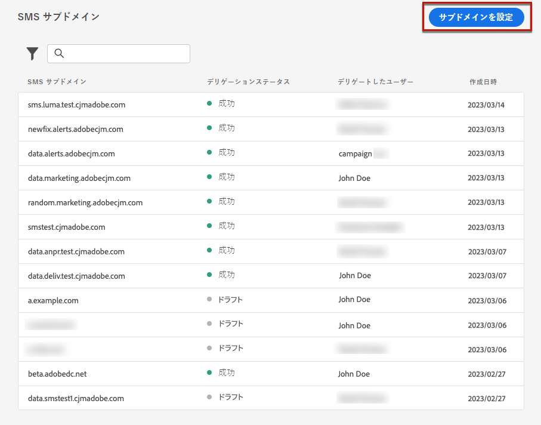
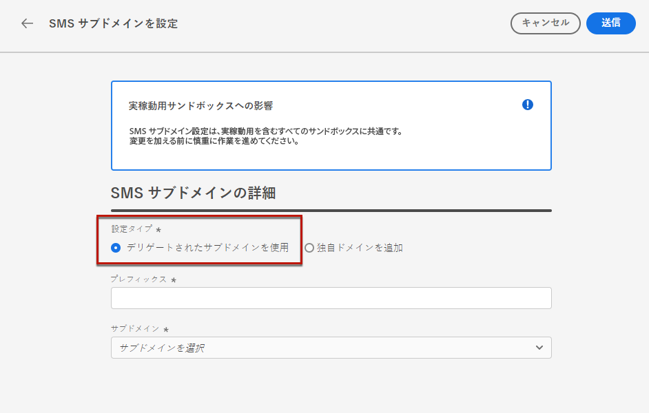
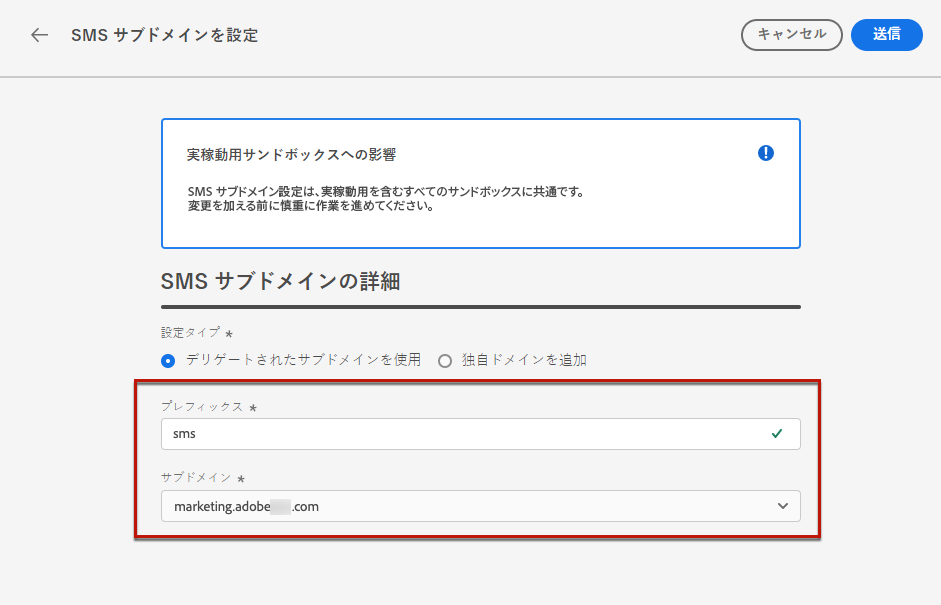
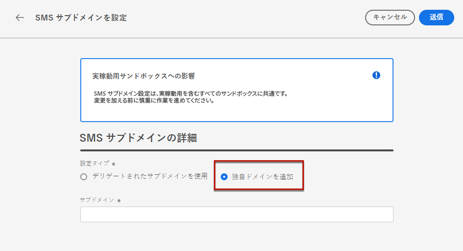
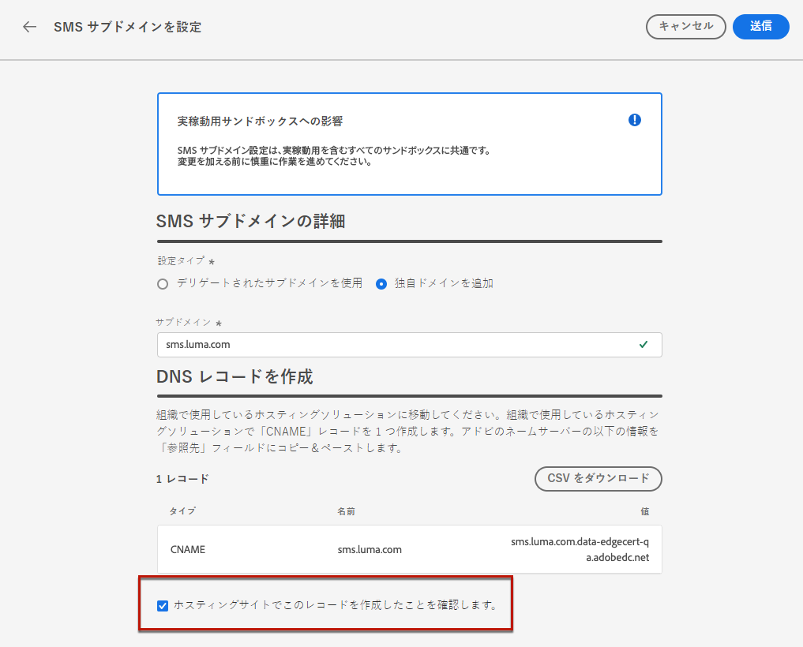

# SMS サブドメインの設定 {#sms-mms-subdomains}

>[!CONTEXTUALHELP]
>id="ajo_admin_subdomain_sms_header"
>title="SMS／MMS サブドメインのデリゲート"
>abstract="テキストメッセージ（SMS／MMS）のサブドメインを設定します。既にアドビにデリゲートされているサブドメインを使用するか、新しいサブドメインを設定できます。"

>[!CONTEXTUALHELP]
>id="ajo_admin_subdomain_sms"
>title="SMS／MMS サブドメインのデリゲート"
>abstract="SMS 設定を作成するにはこのサブドメインが必要なので、テキストメッセージで使用するサブドメインを設定する必要があります。既にアドビにデリゲートされているサブドメインを使用するか、新しいサブドメインを設定できます。"
>additional-url="https://experienceleague.adobe.com/ja/docs/journey-optimizer/using/channels/sms/configure-sms/sms-configuration-surface" text="SMS 設定の作成"

>[!CONTEXTUALHELP]
>id="ajo_admin_config_sms_subdomain"
>title="SMS／MMS サブドメインの選択"
>abstract="SMS 設定を作成できるようにするには、少なくとも 1 つの SMS サブドメインを、サブドメイン名リストから選択するように事前に設定しておく必要があります。"
>additional-url="https://experienceleague.adobe.com/ja/docs/journey-optimizer/using/channels/sms/configure-sms/sms-configuration-surface" text="SMS 設定の作成"

## SMS サブドメインの基本を学ぶ {#gs-sms-mms-subdomains}

SMS／MMS メッセージに追加された URL を短縮できるようにするには、[SMS 設定を作成](sms-configuration.md#message-preset-sms)する際に選択するサブドメインを設定する必要があります。

既にアドビにデリゲートされているサブドメインを使用するか、別のサブドメインを設定できます。サブドメインのアドビへのデリゲートについて詳しくは、[この節](../configuration/delegate-subdomain.md)を参照してください。

SMS サブドメインの設定は、**すべての環境間で共有**&#x200B;されます。したがって、SMS サブドメインを変更すると、他の実稼動サンドボックスにも影響します。

SMS サブドメインにアクセスして編集するには、実稼動サンドボックスにおける **[!UICONTROL SMS サブドメインの管理]**&#x200B;権限が必要です。権限について詳しくは、[この節](../administration/high-low-permissions.md)を参照してください。

## 既存のサブドメインの使用 {#sms-use-existing-subdomain}

既にアドビにデリゲートされているサブドメインを使用するには、次の手順に従います。

1. **[!UICONTROL 管理]**／**[!UICONTROL チャネル]**&#x200B;メニューを参照して、**[!UICONTROL SMS 設定]**／**[!UICONTROL SMS サブドメイン]**&#x200B;を選択します。

1. 「**[!UICONTROL サブドメインを設定]**」をクリックします。

   

1. 「**[!UICONTROL 設定タイプ]**」セクションから「**[!UICONTROL デリゲートサブドメインを使用]**」を選択します。

   

1. SMS の URL に表示する接頭辞を入力します。

   英数字とハイフンのみが使用できます。

   >[!CAUTION]
   >
   >`cdn` または `data` のプレフィックスは内部使用のために予約されているので、使用しないでください。 `dmarc` や `spf` など、制限または予約済みの他のプレフィックスも避ける必要があります。

1. リストからデリゲートされたサブドメインを選択します。

   既に SMS サブドメインとして使用されているサブドメインは選択できません。

   <!--Capital letters are not allowed in subdomains. TBC by PM-->

   

   <!--Note that you cannot use multiple delegated subdomains of the same parent domain. For example, if 'marketing1.yourcompany.com' is already delegated to Adobe for your SMS messages, you will not be able to use 'marketing2.yourcompany.com'. However, multi-level subdomains being supported for SMS, you may proceed using a subdomain of 'marketing1.yourcompany.com' (such as 'email.marketing1.yourcompany.com'), or a different parent domain.-->

   >[!CAUTION]
   >
   >[CNAME メソッド](../configuration/delegate-subdomain.md#cname-subdomain-delegation)を使用してアドビにデリゲートされたドメインを選択する場合、ホスティングプラットフォーム上に DNS レコードを作成する必要があります。DNS レコードを生成する手順は、新しい SMS サブドメインを設定する際の手順と同じです。[この節](#sms-configure-new-subdomain)でその方法を説明します。

1. 「**[!UICONTROL 送信]**」をクリックします。

1. 送信されると、サブドメインは&#x200B;**[!UICONTROL 処理中]**&#x200B;ステータスでリストに表示されます。サブドメインのステータスについて詳しくは、[この節](../configuration/about-subdomain-delegation.md#access-delegated-subdomains)を参照してください。<!--Same statuses?-->

   そのサブドメインを使用してメッセージを送信できるようになるには、必要なチェックがアドビで実行されるまで待つ必要があります（**最大で 4 時間**&#x200B;かかることがあります）。<!--Learn more in [this section](delegate-subdomain.md#subdomain-validation).-->

1. チェックが正常に完了すると、サブドメインのステータスが「**[!UICONTROL 成功]**」になります。SMS チャネル設定を作成する準備が整いました。

## 新しいサブドメインを設定 {#sms-configure-new-subdomain}

>[!CONTEXTUALHELP]
>id="ajo_admin_sms_subdomain_dns"
>title="一致する DNS レコードを生成"
>abstract="新しい SMS サブドメインを設定するには、Journey Optimizer インターフェイスに表示されるアドビのネームサーバー情報をコピーし、ドメインホストソリューションに貼り付けて、一致する DNS レコードを生成する必要があります。チェックが正常に完了すると、SMS 設定の作成にサブドメインを使用する準備が整います。"

新しいサブドメインを設定するには、次の手順に従います。

1. **[!UICONTROL 管理]**／**[!UICONTROL チャネル]**&#x200B;メニューを参照して、**[!UICONTROL SMS 設定]**／**[!UICONTROL SMS サブドメイン]**&#x200B;を選択します。

1. **[!UICONTROL サブドメインを設定]**&#x200B;をクリックします。

   

1. 「 **[!UICONTROL 設定タイプ]** 」セクションから「**[!UICONTROL 独自のドメインを追加]**」を選択します。

   

1. デリゲートするサブドメインを指定します。

   >[!CAUTION]
   >
   >* 既存の SMS サブドメインは使用できません。
   >
   >* サブドメインでは大文字は使用できません。

   無効なサブドメインをアドビにデリゲートすることはできません。組織が所有する有効なサブドメイン（marketing.yourcompany.com など）を入力してください。

   （同じ親ドメインの）複数レベルのサブドメインがサポートされます。例えば、「sms.marketing.yourcompany.com」を使用できます。

1. DNS サーバーに配置するレコードが表示されます。このレコードをコピーするか、CSV ファイルをダウンロードしてから、ドメインをホストするソリューションに移動し、一致する DNS レコードを生成します。

1. DNS レコードがドメインホスティングソリューションに生成されていることを確認します。すべてが正しく設定されている場合は、「確認しました」チェックボックスをオンにし、「**[!UICONTROL 送信]**」をクリックします。

   

   新しい SMS サブドメインを設定すると、常に CNAME レコードを指すようになります。

1. サブドメインのデリゲーションが送信されると、そのサブドメインは「**[!UICONTROL 処理中]**」ステータスでリストに表示されます。サブドメインのステータスについて詳しくは、[この節](../configuration/about-subdomain-delegation.md#access-delegated-subdomains)を参照してください。<!--Same statuses?-->

サブドメインを使用して SMS メッセージを送信するには、必要なチェックがアドビで実行されるまで待つ必要があります（最大で 4 時間かかることがあります）。<!--Learn more in [this section](#subdomain-validation).--> チェックが正常に完了すると、サブドメインのステータスが「**[!UICONTROL 成功]**」になります。SMS チャネル設定を作成する準備が整いました。

ホスティングソリューションで検証レコードを作成できなかった場合、サブドメインは「**[!UICONTROL 失敗]**」とマークされます。

## サブドメインのデリゲート解除 {#undelegate-subdomain}

SMS サブドメインのデリゲートを解除する場合は、デリゲートを解除するサブドメインを持つAdobe担当者にお問い合わせください。

<!--
1. Stop the active campaigns associated with the subdomains. [Learn how](../campaigns/modify-stop-campaign.md#stop)

1. Stop the active journeys associated with the subdomains. [Learn how](../building-journeys/end-journey.md#stop-journey)-->

SMS サブドメインが CNAME レコードを指している場合、SMS サブドメイン用に作成した CNAME DNS レコードをホスティングソリューションから削除できます（ただし、元のメールサブドメインがある場合は削除しないでください）。

>[!NOTE]
>
>SMS サブドメインが CNAME レコードを指す可能性があるのは、それが [CNAME メソッド ](#sms-use-existing-subdomain) を使用してAdobeにデリゲートされた [ 既存のサブドメイン ](../configuration/delegate-subdomain.md#cname-subdomain-delegation) か、設定した [ 新しい SMS サブドメイン ](#sms-configure-new-subdomain) のいずれかであったためです。

アドビがリクエストを処理すると、デリゲート解除したドメインはサブドメイン在庫ページに表示されなくなります。
