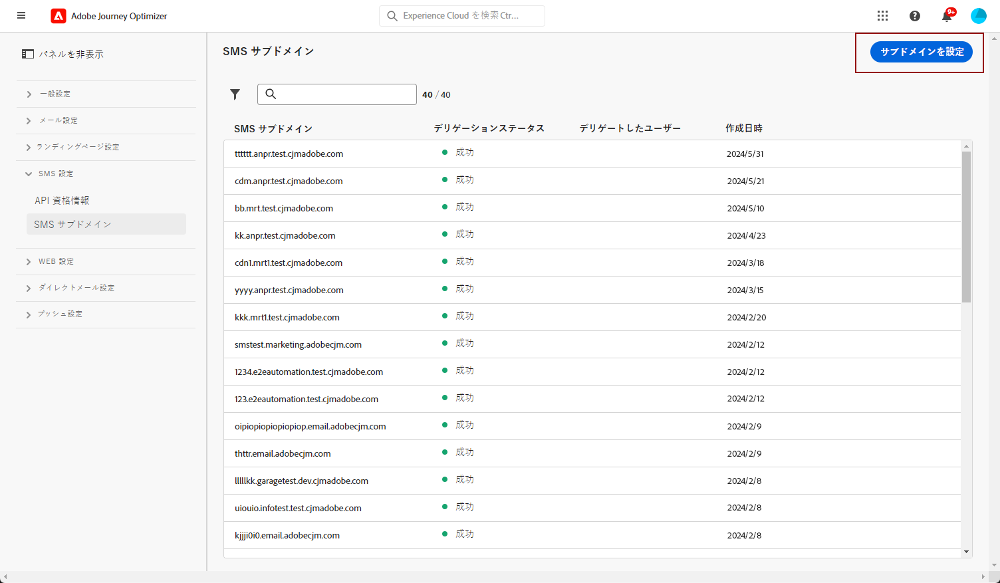

# SMS サブドメインの設定 {#lp-subdomains}

>[!CONTEXTUALHELP]
>id="ajo_admin_subdomain_sms_header"
>title="SMS サブドメインをデリゲート"
>abstract="SMS で使用するサブドメインを設定します。 既にアドビにデリゲートされているサブドメインを使用するか、別のサブドメインを設定できます。"

>[!CONTEXTUALHELP]
>id="ajo_admin_subdomain_sms"
>title="SMS サブドメインをデリゲート"
>abstract="SMS サーフェスを作成するにはこのサブドメインが必要なので、SMS メッセージに使用するサブドメインを設定する必要があります。 既にアドビにデリゲートされているサブドメインを使用するか、新しいサブドメインを設定できます。"
>additional-url="https://experienceleague.adobe.com/docs/journey-optimizer/using/sms/sms-configuration.html#message-preset-sms" text="SMS サーフェスの作成"

>[!CONTEXTUALHELP]
>id="ajo_admin_config_sms_subdomain"
>title="SMS サブドメインを選択"
>abstract="SMS サーフェスを作成するには、少なくとも 1 つの SMS サブドメインを「サブドメイン名」リストから選択するように事前に設定しておく必要があります。"
>additional-url="https://experienceleague.adobe.com/docs/journey-optimizer/using/sms/sms-configuration.html#message-preset-sms" text="SMS サーフェスの作成"

SMS メッセージに追加される URL を短縮するには、次のタイミングで選択するサブドメインを設定する必要があります [SMS サーフェスの作成](sms-configuration.md#message-preset-sms).

既にアドビにデリゲートされているサブドメインを使用するか、別のサブドメインを設定できます。サブドメインのアドビへのデリゲートについて詳しくは、[この節](../configuration/delegate-subdomain.md)で説明します。

>[!CAUTION]
>
>SMS サブドメインの設定は、すべての環境に共通です。 したがって、
>
>* SMS サブドメインにアクセスして編集するには、 **[!UICONTROL SMS サブドメインの管理]** 実稼動サンドボックスに対する権限。
>
> * SMS サブドメインを変更すると、実稼働用サンドボックスにも影響します。

## 既存のサブドメインを使用 {#sms-use-existing-subdomain}

既にアドビにデリゲートされているサブドメインを使用するには、次の手順に従います。

1. 次にアクセス： **[!UICONTROL 管理]** > **[!UICONTROL チャネル]** メニューから、 **[!UICONTROL SMS 設定]** > **[!UICONTROL SMS サブドメイン]**.

   

1. 「**[!UICONTROL サブドメインを設定]**」をクリックします。

   

1. 選択 **[!UICONTROL デリゲートされたサブドメインを使用]** から **[!UICONTROL 設定タイプ]** 」セクションに入力します。

   

1. SMS URL に表示するプレフィックスを入力します。

   >[!NOTE]
   >
   >英数字とハイフンのみが使用できます。

1. リストからデリゲートされたサブドメインを選択します。

   >[!NOTE]
   >
   >既に SMS サブドメインとして使用されているサブドメインは選択できません。

   <!--Capital letters are not allowed in subdomains. TBC by PM-->

   

   <!--Note that you cannot use multiple delegated subdomains of the same parent domain. For example, if 'marketing1.yourcompany.com' is already delegated to Adobe for your SMS messages, you will not be able to use 'marketing2.yourcompany.com'. However, multi-level subdomains being supported for SMS, you may proceed using a subdomain of 'marketing1.yourcompany.com' (such as 'email.marketing1.yourcompany.com'), or a different parent domain.-->

   >[!CAUTION]
   >
   >[CNAME メソッド](../configuration/delegate-subdomain.md#cname-subdomain-delegation)を使用してアドビにデリゲートされたドメインを選択する場合、ホスティングプラットフォーム上に DNS レコードを作成する必要があります。DNS レコードを生成するプロセスは、新しい SMS サブドメインを設定する際のプロセスと同じです。 [この節](#sms-configure-new-subdomain)でその方法を説明します。

1. 「**[!UICONTROL 送信]**」をクリックします。

1. 送信されると、サブドメインは&#x200B;**[!UICONTROL 処理中]**&#x200B;ステータスでリストに表示されます。サブドメインのステータスについて詳しくは、[この節](../configuration/about-subdomain-delegation.md#access-delegated-subdomains)を参照してください。<!--Same statuses?-->

   >[!NOTE]
   >
   >そのサブドメインを使用してメッセージを送信できるようになるには、必要なチェックがアドビで実行されるまで待つ必要があります（最大で 4 時間かかることがあります）。<!--Learn more in [this section](delegate-subdomain.md#subdomain-validation).-->

1. チェックが正常に完了すると、サブドメインのステータスが「**[!UICONTROL 成功]**」になります。SMS チャネルのサーフェスを作成する準備が整いました。

## 新しいサブドメインを設定 {#sms-configure-new-subdomain}

>[!CONTEXTUALHELP]
>id="ajo_admin_sms_subdomain_dns"
>title="一致する DNS レコードを生成"
>abstract="新しい SMS サブドメインを設定するには、Journey Optimizerインターフェイスに表示されるAdobeネームサーバー情報をコピーし、ドメインホストソリューションに貼り付けて、一致する DNS レコードを生成する必要があります。 チェックが正常に完了すると、サブドメインを使用して SMS サーフェスを作成する準備が整います。"

新しいサブドメインを設定するには、次の手順に従います。

1. 次にアクセス： **[!UICONTROL 管理]** > **[!UICONTROL チャネル]** メニューから、 **[!UICONTROL SMS 設定]** > **[!UICONTROL SMS サブドメイン]**.

1. **[!UICONTROL サブドメインを設定]**&#x200B;をクリックします。

1. 「 **[!UICONTROL 設定タイプ]** 」セクションから「**[!UICONTROL 独自のドメインを追加]**」を選択します。

   

1. デリゲートするサブドメインを指定します。

   >[!CAUTION]
   >
   >既存の SMS サブドメインは使用できません。
   >
   >サブドメインでは大文字は使用できません。

   無効なサブドメインをアドビにデリゲートすることはできません。組織が所有する有効なサブドメイン（marketing.yourcompany.com など）を入力してください。

   >[!NOTE]
   >
   >（同じ親ドメインの）複数レベルのサブドメインがサポートされます。 例えば、「sms.marketing.yourcompany.com」を使用できます。

1. DNS サーバーに配置するレコードが表示されます。このレコードをコピーするか、CSV ファイルをダウンロードしてから、ドメインをホストするソリューションに移動し、一致する DNS レコードを生成します。

1. DNS レコードがドメインホスティングソリューションに生成されていることを確認します。すべてが正しく設定されている場合は、「確認しました」チェックボックスをオンにし、「**[!UICONTROL 送信]**」をクリックします。

   

   >[!NOTE]
   >
   >新しい SMS サブドメインを設定する場合、そのサブドメインは常に CNAME レコードを指します。

1. サブドメインのデリゲーションが送信されると、そのサブドメインは「**[!UICONTROL 処理中]**」ステータスでリストに表示されます。サブドメインのステータスについて詳しくは、[この節](../configuration/about-subdomain-delegation.md#access-delegated-subdomains)を参照してください。<!--Same statuses?-->

   >[!NOTE]
   >
   >そのサブドメインを使用して SMS メッセージを送信する前に、Adobeが必要なチェックを実行するまで待つ必要があります（最大 4 時間かかります）。<!--Learn more in [this section](#subdomain-validation).-->

1. チェックが正常に完了すると、サブドメインのステータスが「**[!UICONTROL 成功]**」になります。SMS チャネルのサーフェスを作成する準備が整いました。

   ホスティングソリューションで検証レコードを作成できなかった場合、サブドメインは「**[!UICONTROL 失敗]**」とマークされます。
