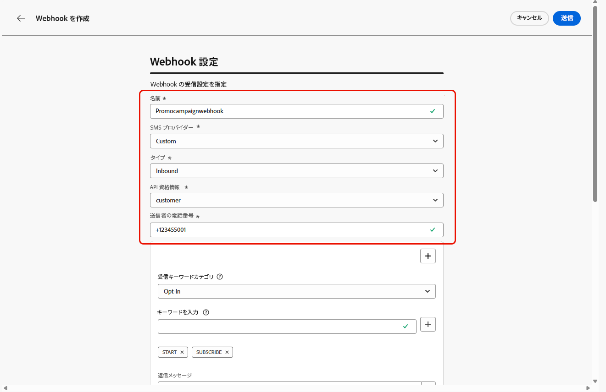

# Webhook の作成 {#webhook}

>[!BEGINSHADEBOX]

オプトインキーワードやオプトアウトキーワードを指定していない場合は、ユーザーのプライバシーを遵守するために標準の同意メッセージが使用されます。カスタムキーワードを追加すると、デフォルト設定が自動的に上書きされます。

**デフォルトのキーワード：**

* **オプトイン**：SUBSCRIBE、YES、UNSTOP、START、CONTINUE、RESUME、BEGIN
* **オプトアウト**：STOP、QUIT、CANCEL、END、UNSUBSCRIBE、NO
* **ヘルプ**：HELP

>[!ENDSHADEBOX]

API 資格情報が正常に作成されたら、Webhook を設定して、オプトインとオプトアウトの同意を管理するインバウンド応答をキャプチャし、利用可能な場合は開封確認などの配信レポートを受信できるようになりました。

Webhook を設定する際に、取得するデータの種類に基づいて目的を定義できます。

* **[!UICONTROL インバウンド]**：オプトインやオプトアウトなどの同意応答を取得し、ユーザーの環境設定を収集する場合は、このオプションを使用します。

* **[!UICONTROL フィードバック]**：このオプションを選択すると、レシートの読み取りやユーザーのインタラクションなど、配信およびエンゲージメントイベントをトラッキングし、レポートや分析をサポートすることができます。

SMS プロバイダーに応じて、以下のタブを参照します。

>[!BEGINTABS]

>[!TAB カスタム]

1. 左側のパネルで、**[!UICONTROL 管理]** `>` **[!UICONTROL チャネル]**&#x200B;に移動し、**[!UICONTROL SMS 設定]**&#x200B;の下にある **[!UICONTROL SMS Webhook]** メニューを選択して、「**[!UICONTROL Webhook を作成]**」ボタンをクリックします。

   {zoomable="yes"}

1. 以下で説明するように、Webhook 設定を指定します。

   * **[!UICONTROL 名前]**：Webhook の名前を入力します。

   * **[!UICONTROL SMS ベンダーを選択]**：カスタム。

   * **[!UICONTROL タイプ]**：インバウンド。

   * **[!UICONTROL API 資格情報]**：[以前に設定した API 資格情報](sms-configuration-custom.md#api-credential)をドロップダウンから選択します。

   * **[!UICONTROL 送信者電話番号]**：コミュニケーションに使用する送信者の電話番号を入力します。

     {zoomable="yes"}

1. 「」をクリックしてキーワードカテゴリを追加し、SMS プロバイダーに応じて設定します。

   * **[!UICONTROL 受信キーワードカテゴリ]**：キーワードカテゴリを「**[!UICONTROL オプトイン]**」、「**[!UICONTROL オプトアウト]**」、「**[!UICONTROL ダブルオプトイン]**」、「**[!UICONTROL ヘルプ]**」または「**[!UICONTROL カスタム]**」から選択します。

   * **[!UICONTROL キーワードを入力]**：メッセージを自動的にトリガーするデフォルトまたはカスタムのキーワードを入力します。「」をクリックして複数のキーワードを追加します。

     **[!UICONTROL カスタムキーワード]**&#x200B;の場合は、ジャーニー内のバッチベースのアクションに同意以外の関連キーワードを使用します。

   * **[!UICONTROL 返信メッセージ]**：自動的に送信されるカスタム応答をドロップダウンから選択します。

   * **[!UICONTROL ファジーオプトアウト]**：このオプションを有効にすると、ニアマッチオプトアウトキーワードが検出された場合に自動返信が送信されます。

   {zoomable="yes"}

1. 受信メッセージが設定されたキーワードまたはカテゴリに一致しない場合に自動的に送信される **[!UICONTROL デフォルトの返信メッセージ]** を入力します。

1. 「**[!UICONTROL ペイロードエディターを表示]**」をクリックして、リクエストペイロードを検証およびカスタマイズします。

   プロファイル属性を使用してペイロードを動的にパーソナライズし、ビルトインのヘルパー関数を使用して、処理と応答の生成のために正確なデータを確実に送信できます。

1. Webhook の設定が完了したら、「**[!UICONTROL 送信]**」をクリックします。

1. **[!UICONTROL フィードバック]** Webhook を作成するには、上記と同じ手順に従い、Webhook **[!UICONTROL タイプ]** として **[!UICONTROL フィードバック]** を選択します。

1. **[!UICONTROL Webhook]** メニューから、既存の Webhook を編集または削除したり、**[!UICONTROL Webhook URL]** にアクセスしてコピーして SMS プロバイダーと統合したりできます。

   {zoomable="yes"}

Webhook の設定を作成および設定した後、SMS メッセージ用に [&#x200B; チャネル設定 &#x200B;](sms-configuration-surface.md) を作成する必要があります。

設定が完了すると、メッセージオーサリング、パーソナライゼーション、リンクトラッキング、レポートなど、すべての標準のチャネル機能を活用できます。

>[!TAB Infobip]

1. 左側のパネルで、**[!UICONTROL 管理]** `>` **[!UICONTROL チャネル]**&#x200B;に移動し、**[!UICONTROL SMS 設定]**&#x200B;の下にある **[!UICONTROL SMS Webhook]** メニューを選択して、「**[!UICONTROL Webhook を作成]**」ボタンをクリックします。

   {zoomable="yes"}

1. 以下で説明するように、Webhook 設定を指定します。

   * **[!UICONTROL 名前]**：Webhook の名前を入力します。

   * **[!UICONTROL SMS ベンダーを選択]**:Infobip。

   * **[!UICONTROL タイプ]**：インバウンド。

   * **[!UICONTROL API 資格情報]**：[以前に設定した API 資格情報](sms-configuration-infobip.md#api-credential)をドロップダウンから選択します。

   * **[!UICONTROL 送信者電話番号]**：コミュニケーションに使用する送信者の電話番号を入力します。

     {zoomable="yes"}

1. 「」をクリックしてキーワードカテゴリを追加し、SMS プロバイダーに応じて設定します。

   * **[!UICONTROL 受信キーワードカテゴリ]**：キーワードカテゴリを「**[!UICONTROL オプトイン]**」、「**[!UICONTROL オプトアウト]**」、「**[!UICONTROL ダブルオプトイン]**」、「**[!UICONTROL ヘルプ]**」または「**[!UICONTROL カスタム]**」から選択します。

   * **[!UICONTROL キーワードを入力]**：メッセージを自動的にトリガーするデフォルトまたはカスタムのキーワードを入力します。「」をクリックして複数のキーワードを追加します。

     **[!UICONTROL カスタムキーワード]**&#x200B;の場合は、ジャーニー内のバッチベースのアクションに同意以外の関連キーワードを使用します。

   * **[!UICONTROL 返信メッセージ]**：自動的に送信されるカスタム応答をドロップダウンから選択します。

   * **[!UICONTROL ファジーオプトアウト]**：このオプションを有効にすると、ニアマッチオプトアウトキーワードが検出された場合に自動返信が送信されます。

   {zoomable="yes"}

1. 受信メッセージが設定されたキーワードまたはカテゴリに一致しない場合に自動的に送信される **[!UICONTROL デフォルトの返信メッセージ]** を入力します。

1. Webhook の設定が完了したら、「**[!UICONTROL 送信]**」をクリックします。

1. **[!UICONTROL フィードバック]** Webhook を作成するには、上記と同じ手順に従い、Webhook **[!UICONTROL タイプ]** として **[!UICONTROL フィードバック]** を選択します。

1. **[!UICONTROL Webhook]** メニューから、既存の Webhook を編集または削除したり、**[!UICONTROL Webhook URL]** にアクセスしてコピーして SMS プロバイダーと統合したりできます。

   {zoomable="yes"}

Webhook のインバウンド設定を作成し指定したら、SMS メッセージ用の[チャネル設定](sms-configuration-surface.md)を作成する必要があります。

設定が完了すると、メッセージオーサリング、パーソナライゼーション、リンクトラッキング、レポートなど、すべての標準のチャネル機能を活用できます。

>[!TAB  シンチ ]

1. 左側のパネルで、**[!UICONTROL 管理]** `>` **[!UICONTROL チャネル]**&#x200B;に移動し、**[!UICONTROL SMS 設定]**&#x200B;の下にある **[!UICONTROL SMS Webhook]** メニューを選択して、「**[!UICONTROL Webhook を作成]**」ボタンをクリックします。

   {zoomable="yes"}

1. 以下で説明するように、Webhook 設定を指定します。

   * **[!UICONTROL 名前]**：Webhook の名前を入力します。

   * **[!UICONTROL SMS ベンダーを選択]**:Sinch。

   * **[!UICONTROL タイプ]**：インバウンド。

   * **[!UICONTROL API 資格情報]**：[以前に設定した API 資格情報](sms-configuration-sinch.md#create-api)をドロップダウンから選択します。

   * **[!UICONTROL 送信者電話番号]**：コミュニケーションに使用する送信者の電話番号を入力します。

     {zoomable="yes"}

1. 「」をクリックしてキーワードカテゴリを追加し、SMS プロバイダーに応じて設定します。

   * **[!UICONTROL 受信キーワードカテゴリ]**：キーワードカテゴリを「**[!UICONTROL オプトイン]**」、「**[!UICONTROL オプトアウト]**」、「**[!UICONTROL ダブルオプトイン]**」、「**[!UICONTROL ヘルプ]**」または「**[!UICONTROL カスタム]**」から選択します。

   * **[!UICONTROL キーワードを入力]**：メッセージを自動的にトリガーするデフォルトまたはカスタムのキーワードを入力します。「」をクリックして複数のキーワードを追加します。

     **[!UICONTROL カスタムキーワード]**&#x200B;の場合は、ジャーニー内のバッチベースのアクションに同意以外の関連キーワードを使用します。

   * **[!UICONTROL 返信メッセージ]**：自動的に送信されるカスタム応答をドロップダウンから選択します。

   * **[!UICONTROL ファジーオプトアウト]**：このオプションを有効にすると、ニアマッチオプトアウトキーワードが検出された場合に自動返信が送信されます。

   {zoomable="yes"}

1. 受信メッセージが設定されたキーワードまたはカテゴリに一致しない場合に自動的に送信される **[!UICONTROL デフォルトの返信メッセージ]** を入力します。

1. Webhook の設定が完了したら、「**[!UICONTROL 送信]**」をクリックします。

1. **[!UICONTROL Webhook]** メニューで、をクリックして、Webhook を削除します。

1. 既存の設定を変更するには、目的の Webhook を見つけて、「**[!UICONTROL 編集]**」オプションをクリックして必要な変更を行います。

1. 以前に送信した **[!UICONTROL Webhook]** から新しい **[!UICONTROL Webhook URL]** にアクセスしてコピーします。

   {zoomable="yes"}

Webhook のインバウンド設定を作成し指定したら、SMS メッセージ用の[チャネル設定](sms-configuration-surface.md)を作成する必要があります。

設定が完了すると、メッセージオーサリング、パーソナライゼーション、リンクトラッキング、レポートなど、すべての標準のチャネル機能を活用できます。

>[!TAB  ツイリオ ]

1. 左側のパネルで、**[!UICONTROL 管理]** `>` **[!UICONTROL チャネル]**&#x200B;に移動し、**[!UICONTROL SMS 設定]**&#x200B;の下にある **[!UICONTROL SMS Webhook]** メニューを選択して、「**[!UICONTROL Webhook を作成]**」ボタンをクリックします。

   {zoomable="yes"}

1. 以下で説明するように、Webhook 設定を指定します。

   * **[!UICONTROL 名前]**：Webhook の名前を入力します。

   * **[!UICONTROL SMS ベンダーを選択]**:Twilio。

   * **[!UICONTROL タイプ]**：インバウンド。

   * **[!UICONTROL API 資格情報]**：[以前に設定した API 資格情報](sms-configuration-twilio.md#create-api)をドロップダウンから選択します。

   * **[!UICONTROL 送信者電話番号]**：コミュニケーションに使用する送信者の電話番号を入力します。

1. 「」をクリックしてキーワードカテゴリを追加し、SMS プロバイダーに応じて設定します。

   * **[!UICONTROL 受信キーワードカテゴリ]**：キーワードカテゴリを「**[!UICONTROL オプトイン]**」、「**[!UICONTROL オプトアウト]**」、「**[!UICONTROL ダブルオプトイン]**」、「**[!UICONTROL ヘルプ]**」または「**[!UICONTROL カスタム]**」から選択します。

   * **[!UICONTROL キーワードを入力]**：メッセージを自動的にトリガーするデフォルトまたはカスタムのキーワードを入力します。「」をクリックして複数のキーワードを追加します。

     **[!UICONTROL カスタムキーワード]**&#x200B;の場合は、ジャーニー内のバッチベースのアクションに同意以外の関連キーワードを使用します。

   * **[!UICONTROL 返信メッセージ]**：自動的に送信されるカスタム応答をドロップダウンから選択します。

   * **[!UICONTROL ファジーオプトアウト]**：このオプションを有効にすると、ニアマッチオプトアウトキーワードが検出された場合に自動返信が送信されます。

1. 受信メッセージが設定されたキーワードまたはカテゴリに一致しない場合に自動的に送信される **[!UICONTROL デフォルトの返信メッセージ]** を入力します。

1. Webhook の設定が完了したら、「**[!UICONTROL 送信]**」をクリックします。

1. **[!UICONTROL Webhook]** メニューで、をクリックして、Webhook を削除します。

1. 既存の設定を変更するには、目的の Webhook を見つけて、「**[!UICONTROL 編集]**」オプションをクリックして必要な変更を行います。

1. 以前に送信した **[!UICONTROL Webhook]** から新しい **[!UICONTROL Webhook URL]** にアクセスしてコピーします。

Webhook のインバウンド設定を作成し指定したら、SMS メッセージ用の[チャネル設定](sms-configuration-surface.md)を作成する必要があります。

設定が完了すると、メッセージオーサリング、パーソナライゼーション、リンクトラッキング、レポートなど、すべての標準のチャネル機能を活用できます。

>[!ENDTABS]

## チュートリアルビデオ {#video}

>[!VIDEO](https://video.tv.adobe.com/v/3459089?captions=jpn)

