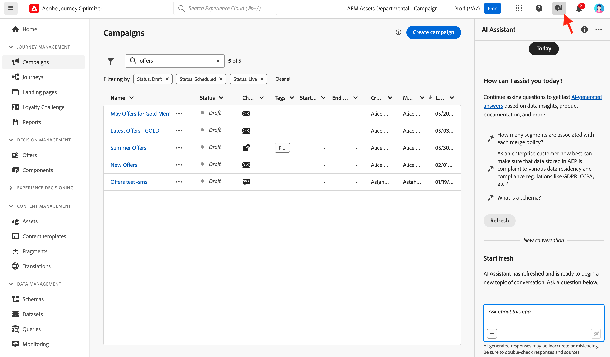

# AI アシスタントの操作 {#ai-assistant}

AI アシスタントは、アドビのコンセプトをナビゲートして理解し、特定の環境の運用上のインサイトを得るために使用できるユーザーインターフェイス機能です。Adobe Journey Optimizer を含む Adobe Experience Cloud 全体の複数の製品で使用できます。

AI アシスタントにアクセスするには、上部バーのアイコンをクリックします。画面の右側のセクションに AI アシスタントが表示されます。

>[!CAUTION]
>
>AI アシスタントを使用するには、Adobe Experience Cloud 生成 AI ユーザーガイドラインに同意する必要があります。契約について詳しくは、[このページ](https://experienceleague.adobe.com/ja/docs/experience-platform/ai-assistant/home){target="_blank"}を参照してください。

Adobe Journey Optimizer では、次のユースケースにアクセスできます。

* **製品知識**（一般公開）

  製品知識の質問は、Adobe Journey Optimizer の側面に関連するアドビコンセプトに関するものです。製品知識に関する質問の例を次に示します。

   * 1 つの Adobe Journey Optimizer サンドボックスにライブアクティビティをいくつ含めることができますか？
   * Adobe Journey Optimizer でキャンペーンを設定するにはどうすればよいですか？
   * Adobe Journey Optimizer ジャーニーで使用するカスタムアクションを作成するにはどうすればよいですか？

* ジャーニーにおける&#x200B;**運用上のインサイト**（ベータ版）

  運用上のインサイトの質問は、組織のサンドボックス内のジャーニーオブジェクトに関するものです。運用上のインサイトの質問やプロンプトの例を次に示します。

   * Adobe Journey Optimizer にはライブジャーニーがいくつありますか？
   * スケジュールされたすべてのジャーニーのリストを提示してください。
   * 過去 7 日間に作成されたジャーニーの数はいくつですか？

  >[!NOTE]
  >
  >AI アシスタントに運用上のインサイトに関する質問をするためにアクセスできる唯一の Adobe Journey Optimizer オブジェクトは、**ジャーニー**&#x200B;です。現在使用しているサンドボックスのデータのみが表示されます。

質問するには、画面の下部にあるフィールドに質問を入力し、Enter キーを押します。

{width="30%" align="left"}

回答を確認し、「**ソースを表示**」ボタンを使用して製品ドキュメントへの直接リンクを取得し、詳細を確認してください。

{width="30%" align="left"}

サムアップまたはサムダウンを使用して回答を評価します。

AI アシスタントの使用方法、AI アシスタントを使用して達成できる目標の例、AI アシスタントの仕組みについて詳しくは、[Adobe Experience Platform ドキュメント](https://experienceleague.adobe.com/ja/docs/experience-platform/ai-assistant/home){target="_blank"}を参照してください。
