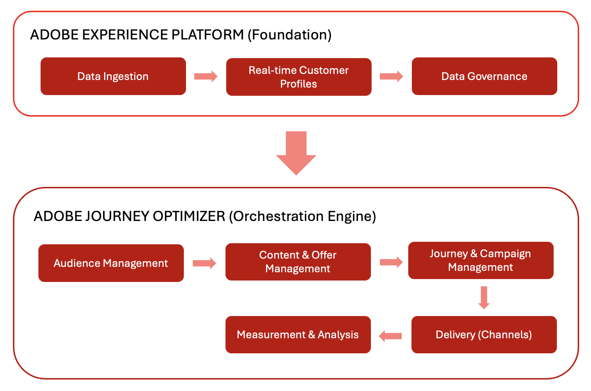

# アーキテクチャ

## 全体像：Adobe Journey Optimizer の連携

Adobe Journey Optimizer（AJO）と Adobe Experience Platform（AEP）は連携して、データ駆動型の大規模なパーソナライゼーションを実現します。このエコシステムは、データを収集、分析および適用する継続的なフローとして機能し、パーソナライズされたカスタマージャーニーを作成します。

### 基盤：Adobe Experience Platform（AEP）

Adobe Experience Platform はバックボーンとして機能し、ブランドがお客様データを一元化し、パーソナライズされたエクスペリエンスのためにアクティブ化できるようにします。

- **データプラットフォーム**：AEP は、お客様データを収集、管理、構造化し、システム間の一貫性を確保する一元的なハブとして機能します。
- **データ取り込み（ソース）**：ブランドは、事前定義済みのコネクタを使用して、CRM プラットフォーム、web サイト、モバイルアプリ、クラウドストレージなど、様々なシステムからデータを読み込みます。例えば、ソースコネクタは、e コマースプラットフォームから購入データを取り込みます。
- **リアルタイム顧客プロファイル**：この機能は、複数のソースからのデータを結合して、統合プロファイルを作成します。例えば、プロファイルは、メールのインタラクションと店舗での購入を組み合わせて、お客様の完全なビューを提供します。
- **ガバナンスレイヤー**：このレイヤーは、データアクセス、プライバシーコンプライアンスおよびセキュリティを管理します。規制に準拠しながら、ブランドがお客様データを安全に利用できるようにします。

### オーケストレーションエンジン：Adobe Journey Optimizer（AJO）

Adobe Journey Optimizer は、AEP からのデータとインサイトを適用し、様々なチャネルをまたいでインテリジェントでパーソナライズされたカスタマーエクスペリエンスを提供します。

- **お客様の理解**：リアルタイム顧客プロファイルにより、ターゲットメッセージ用にオーディエンスをセグメント化できます。例えば、オーディエンスには、購入履歴を通じて特定された頻繁な買い物客が含まれます。
- **コンテンツとオファー**：
   - **コンテンツ管理**：この機能は、チャネルをまたいでコンテンツを作成、管理およびパーソナライズするツールを提供します。例えば、プロモーションのメールヘッダー用に、再利用可能なコンテンツフラグメントを作成できます。
   - **意思決定管理**：このシステムでは、リアルタイムロジックを使用して、各個人に最適なオファーやメッセージを選択します。例えば、実施要件を満たすお客様は、閲覧履歴に基づいてディスカウントオファーを受け取る可能性があります。
- **ジャーニーとキャンペーン管理**：この機能は、インタラクションのシーケンス（ジャーニー）を自動化したり、1 回限りのターゲットメッセージ（キャンペーン）をスケジュールしたりできます。例えば、ジャーニーが製品ビューの後にフォローアップメールをトリガーする場合などです。
- **配信（接続）**：
   - **チャネル**：この機能では、メッセージとオファーを、メール、SMS、プッシュ通知、ダイレクトメールなどのコミュニケーションプラットフォームを通じて配信します。
   - **宛先**：この機能は、アクティブ化または分析に、プロファイルとオーディエンスデータを外部システムに書き出します。例えば、オーディエンスデータは、広告ターゲティング用にソーシャルメディアプラットフォームに送信されます。
- **測定と分析**：この機能は、レポートで顧客エンゲージメントとキャンペーンのパフォーマンスを追跡します。これらのインサイトにより、継続的な改善が可能になります。

## 連続最適化サイクル

このエコシステムは、継続的な最適化サイクルとして機能します。データは、パーソナライズされたコンテンツと決定を提供する、お客様の理解を推進します。これらはジャーニーに調整され、チャネルをまたいで配信され、有効性を測定し、時間の経過と共に調整されます。

## 詳細なアーキテクチャ

## プライバシーとセキュリティ

Adobe Experience Cloud のプライバシーとセキュリティのプラクティスは、Adobe Journey Optimizer に適用されます。これらの対策により、プライバシー規制への準拠が確保され、ブランドはお客様の信頼を維持しながら、パーソナライズされたエクスペリエンスを提供できます。
