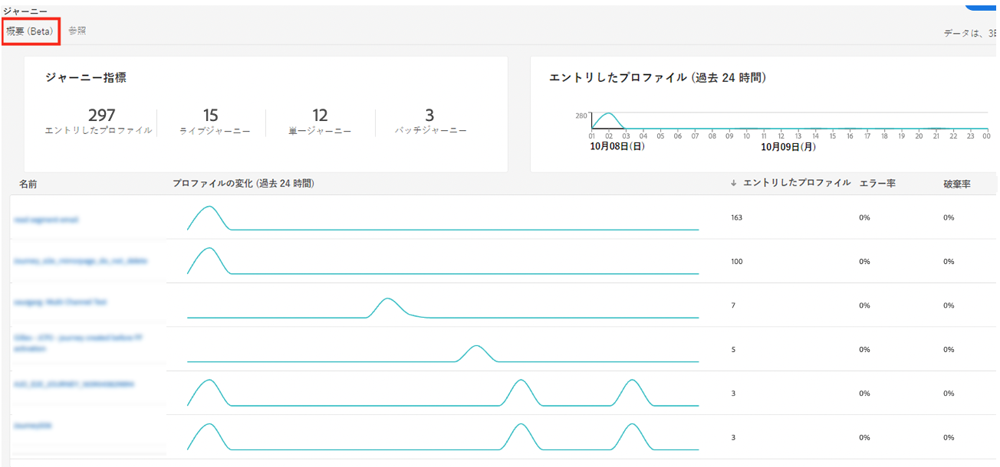
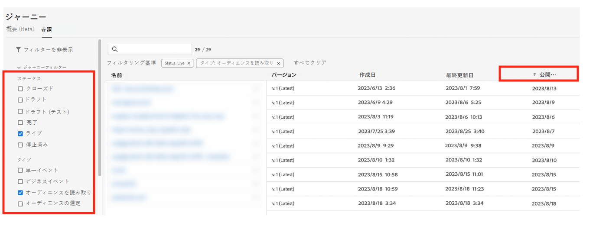

# ベストプラクティス {#best-practices}

## リアルタイムのユースケースとオムニチャネルのパーソナライゼーションガイダンス {#real-time-guidance}

ID サービス 2.0 の更新に従って、リアルタイムの ID ステッチが進化しました。

Adobe Journey Optimizer は、ID サービスを利用してプロファイルを結合し、ユーザーのエクスペリエンスをパーソナライズします。そのため、ユースケースを構築する際には、サービスに関して注意すべき重要な側面がいくつかあります。ブランドは、エクスペリエンスを個人に提供しようとします。ID グラフを使用すると、マーケターは、様々なチャネルをまたいでユーザーが関連付けられているデバイスを把握できます。グラフには、個人（CRMID）または web ブラウザー（ECID）を表す ID を含めることができます。ID サービスはこの情報を結合し、個人の「360 度ビュー」や結合プロファイルを作成できます。つまり、誰かがサイトを閲覧してからログインすると、そのセッションの以前のすべてのデータがログインユーザーに関連付けられる可能性があります。このアクションは、いくつかの異なる手順で実行されます。

1. ID の初期ステッチ - ユーザーがログインすると、ログイン識別子（CRMID）が web ブラウザー識別子（web またはモバイルアプリのセッション）に関連付けられます。

   * これが完了するまでに 30 分〜4 時間かかる場合があります。
   * 通常、このログインイベントにより、CRMID と ECID をリンクする ID グラフが生成されます。

1. 最初のステッチの後、2 つの ID のいずれかで送信されたデータは結合されたプロファイルに関連付けられ、Journey Optimizer でリアルタイムでパーソナライズできるようになります。プロファイルを最新の行動データで更新すると、完了するまでに最大 1 分かかる場合があります。この[ページ](https://experienceleague.adobe.com/docs/experience-platform/ingestion/streaming/overview.html?lang=ja)を参照してください。

ユースケースを構築する際には、次の点を考慮してください。

1. ブランドは、サイト訪問者が離脱してから 30 分後を再エンゲージしたいと考えています（例：放棄された買い物かごのメール）：

   ID をデータ（ECID）と共に使用します。過去 30 分以内にメールアドレス／アプリのインストールを行った訪問者の 100％を取得したい場合は、Cookie ベースの ID を使用してこのジャーニー（ECID）を開始する必要があります。ここでは、エクスペリエンスのメールアドレス、プッシュトークンまたは他のアドレスが ECID に関連付けられていることを前提としています。

1. Web、メール、プッシュなどでのオムニチャネルエンゲージメント。：

   * エンゲージメントの際に、プロファイルで連絡用アドレスを使用できるようにする必要があります。これが一貫してタイムリーに行われるようにするには、使用する ID にデータが関連付けられていることを確認してください。
   * 新しくインストールしたアプリまたはブラウザーセッションの情報と、既知の情報またはログイン情報を組み合わせて使用する必要がある場合、このコミュニケーションは、これらの ID が結び付けられた後に送信する必要があります。このコミュニケーションは顧客ごとに異なる場合があり、最大量のプロファイルを取得すため、は少なくとも 30 分待つことをお勧めします。

## ジャーニーガードレールを使用したスケール {#scale}

このセクションでは、次の 2 つの制限を考慮してスケーリングする方法について説明します。

* Journey Optimizer には、ジャーニーキャンバス内に 50 個のアクティビティのガードレールがあります。このガードレールは、読みやすさ、QA、トラブルシューティングに役立つように設計されています。ジャーニー内のアクティビティ数は、この制限の 10 個のアクティビティ以内になると、ジャーニーキャンバスの左上のセクションに表示されます。

* ジャーニーを公開すると、最大のスループットと安定性を確保するために、Journey Optimizer により自動的にスケールと調整が行われます。サンドボックス内で一度に 100 個のライブジャーニーのマイルストーンに近づくと、この達成に関するインターフェイスにオレンジ色のオーバーレイと警告記号が表示されます。この通知が表示され、一度に 100 のライブジャーニーを超えてジャーニーを拡張する必要がある場合は、カスタマーケアのチケットを作成してください。アドビが目標の達成をお手伝いします。

<!--DOCAC-10977

* As you publish journeys, Journey Optimizer automatically scales and adjusts to ensure maximum throughput and stability. As you near the milestone of 500 live journeys at one time in a sandbox, you will see an orange overlay and warning sign appear in the interface on this achievement. If you see this notification and have a need to extend your journeys beyond 500 live journeys at a time, please create a ticket for customer care and we will help you reach your goals.-->

採用できるベストプラクティスは数多くありますが、これはガードレール内に留まり、システムを効率的に使用するのに役立ちます。

* ライブジャーニーの制限に近づいている場合、最初に実行できる手順は、**ジャーニーの** 概要 **タブに移動して、アクティブなプロファイルを持つ過去 24 時間のジャーニー内でアクティブだったジャーニーの数を確認することです** このセクションでは、ジャーニーにエントリまたは離脱するプロファイル数を確認して判断できます。

  

* 次に、「ジャーニーインベントリ」セクションで、すべてのジャーニーをステータス「ライブ」およびタイプ「オーディエンスを読み取り」でフィルタリングできます。次に、「公開日」（古い順）で並べ替えます。ジャーニーをクリックし、スケジュールに移動します。1 日よりも古く、アクションが 1 つしかない、「**1 回**」または「**できるだけ早く**」実行するスケジュールが設定されているすべてのライブジャーニーを停止します。

  

* **オーディエンスを読み取り**&#x200B;ジャーニーに、1 つのみのアクション、待機／決定、送信時間の最適化がない場合は、それらを Journey Optimizer キャンペーンに移動することを検討してください。キャンペーンは、単一ステップのエンゲージメントに適しています。キャンペーンとジャーニーの主な違いの 1 つは、ユーザーエンゲージメントを積極的にリッスンして次のステップを決定し、別のアクションに取り組むことが重要であると考えるかどうかです。
* ジャーニー内のアクティビティ数を減らすには、条件の手順を確認します。多くの場合、条件をセグメント定義またはオーディエンス構成に移動できます。
* 複数のジャーニー（同意チェック、抑制）で同じ条件が繰り返される場合は、セグメント定義の一部として移動することを検討します。例えば、複数のジャーニーで「メールアドレスが空ではない」ことを確認する条件がある場合、その条件をセグメント定義の一部に含めます。
* ジャーニーに複数の条件があり、オーディエンスを分割して各手順の数値を確認する場合は、分析に適した Customer Journey Analytics または他のレポートソリューションの使用を検討します。
* キャンバス上のノード数の制限に近づいている場合は、明示的なノードではなく、動的パラメーターまたはコンテンツを使用してアクションを統合し、適切なコンテンツを提供することを検討します。

* バッチセグメントを使用した&#x200B;**オーディエンスを読み取り**&#x200B;ジャーニーがあり（A）、かつ、そのジャーニー内で inAudience ストリーミングセグメントを使用して（B）除外する場合（つまり、A - B を実行する場合）、そのロジックをセグメント化ロジックに移すことを検討し、セグメント化ロジック自体の一部として除外を使用します。