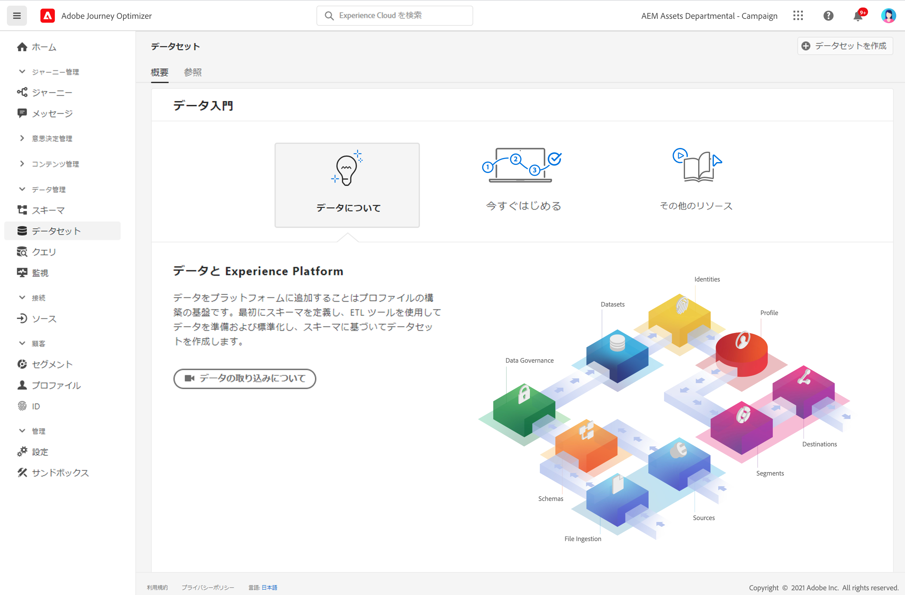

# データセットの基本を学ぶ {#datasets-gs}

Adobe Experience Platform に取り込まれたすべてのデータは、データレイク内にデータセットとして保持されます。 データセットは、スキーマ（列）とフィールド（行）を含んだデータコレクション（通常はテーブル）のストレージおよび管理用の構成体です。

データセットの作成方法については、[このドキュメント](https://experienceleague.adobe.com/docs/experience-platform/catalog/datasets/user-guide.html?lang=ja){target=&quot;_blank&quot;}を参照してください。

Adobe Experience Platform にデータを追加することは、プロファイルを作成するための基盤となります。 そうすれば、[!DNL Adobe Journey Optimizer] でプロファイルを活用できるようになります。 まず、スキーマを定義し、ETL ツールを使用してデータを準備および標準化したあと、スキーマに基づいてデータセットを作成します。

➡️ [このビデオでは、データセットの作成と設定の方法を説明します](#video-dataset)

この **データセット** ワークスペース [!DNL Adobe Journey Optimizer] ユーザーインターフェイスを使用すると、データの調査とデータセットの作成が可能です。

データセット UI の使用方法については、[データ取り込みの概要](https://experienceleague.adobe.com/docs/experience-platform/ingestion/home.html?lang=ja){target=&quot;_blank&quot;}を参照してください。

CSV ファイルを XDM スキーマにマッピングする手順については、[このドキュメント](https://experienceleague.adobe.com/docs/experience-platform/ingestion/tutorials/map-a-csv-file.html?lang=ja){target=&quot;_blank&quot;}を参照してください。

## ハウツービデオ{#video-dataset}

データセットの作成、スキーマへのマッピング、データの追加、データの取り込み確認の方法について説明します。

>[!VIDEO](https://video.tv.adobe.com/v/334293?quality=12)

**関連トピック**

* [スキーマとデータセットの作成およびデータの取り込みによる Journey Optimizer へのテストプロファイルの追加](../segment/creating-test-profiles.md)
* [ストリーミング取得の概要](https://experienceleague.adobe.com/docs/experience-platform/ingestion/streaming/overview.html?lang=ja){target=&quot;_blank&quot;}
* [Adobe Experience Platform へのデータの取り込み](https://experienceleague.adobe.com/docs/experience-platform/ingestion/tutorials/ingest-batch-data.html?lang=ja){target=&quot;_blank&quot;}
