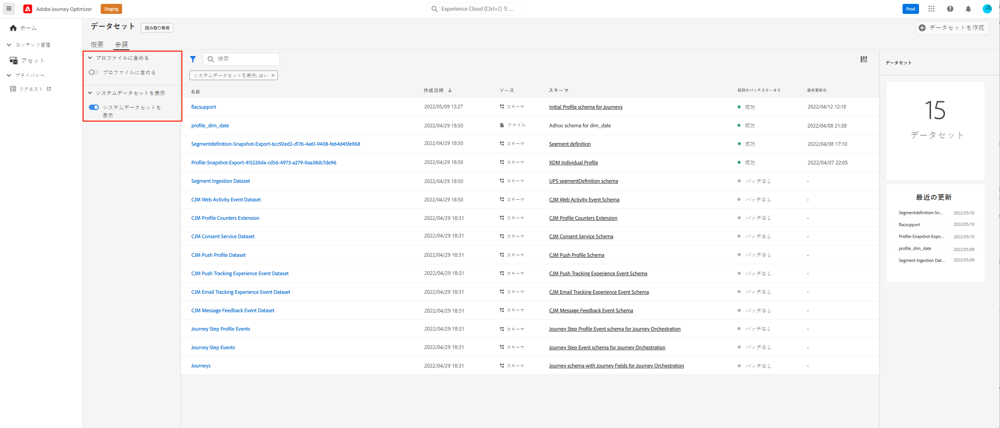
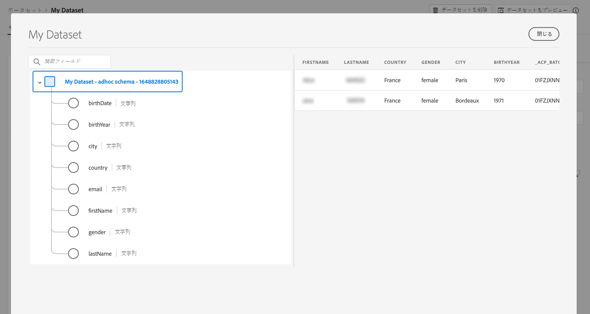

# データセットの基本を学ぶ {#datasets-gs}

Adobe Experience Platform に取り込まれたすべてのデータは、データレイク内にデータセットとして保持されます。 データセットは、スキーマ（列）とフィールド（行）を含んだデータコレクション（通常はテーブル）のストレージおよび管理用の構成体です。

## データセットへのアクセス{#access-datasets}

この **データセット** ワークスペース [!DNL Adobe Journey Optimizer] ユーザーインターフェイスを使用すると、データの調査とデータセットの作成が可能です。

選択 **データセット** 左側のナビゲーションで、「データセット」ダッシュボードを開きます。

データの追加先 [!DNL Adobe Experience Platform] は、プロファイルを構築するための基盤です。 そうすれば、[!DNL Adobe Journey Optimizer] でプロファイルを活用できるようになります。 まず、スキーマを定義し、ETL ツールを使用してデータを準備および標準化したあと、スキーマに基づいてデータセットを作成します。

を選択します。 **参照** タブに移動して、組織で使用可能なすべてのデータセットのリストを表示します。 リストに表示された各データセットに関する詳細（名前、データセットが適用されるスキーマ、最新の取得実行のステータスなど）が表示されます。

デフォルトでは、に取り込んだデータセットのみが表示されます。 システム生成データセットを表示する場合は、 **システムデータセットを表示** フィルターから切り替えます。

データセットの名前を選択して、そのデータセットのアクティビティ画面にアクセスし、選択したデータセットの詳細を確認します。 「アクティビティ」タブには、消費されるメッセージの割合を視覚化したグラフと、成功および失敗したバッチのリストが含まれます。

## データセットをプレビュー{#preview-datasets}

データセットアクティビティ画面で、「 」を選択します。 **データセットをプレビュー** 画面の右上隅付近に、このデータセットで最も新しく成功したバッチをプレビューします。 データセットが空の場合、プレビューリンクは非アクティブになります。

## データセットの作成{#create-datasets}

新しいデータセットを作成するには、まず「 」を選択します。 **データセットを作成** 」と入力します。

次のことができます。

* スキーマからのデータセットの作成. [詳しくは、このドキュメントを参照してください。](https://experienceleague.adobe.com/docs/experience-platform/catalog/datasets/user-guide.html?lang=en#schema){target=&quot;_blank&quot;}
* CSV ファイルからのデータセットの作成. [詳しくは、このドキュメントを参照してください。](https://experienceleague.adobe.com/docs/experience-platform/ingestion/tutorials/map-a-csv-file.html?lang=ja){target=&quot;_blank&quot;}

このビデオでは、データセットの作成、スキーマへのマッピング、データの追加、データの取り込みの確認の方法について説明します。

>[!VIDEO](https://video.tv.adobe.com/v/334293?quality=12)

## データガバナンス

データセットで、 **データガバナンス** タブを使用して、データセットレベルとフィールドレベルでラベルを確認します。 データガバナンスは、適用されるポリシーのタイプに従ってデータを分類します。

の主な機能の 1 つ [!DNL Adobe Experience Platform] は、複数のエンタープライズシステムのデータを統合して、マーケターが顧客をより深く識別、理解し、惹きつけられるようにすることです。 このデータは、組織または法規制によって定義された使用制限の対象となる場合があります。したがって、データ操作がデータ使用ポリシーに準拠していることを確認することが重要です。

 [!DNL Adobe Experience Platform Data Governance]を使用すると、顧客データを管理し、データの使用に適用される規制、制限、ポリシーへのコンプライアンスを確保できます。Experience Platform 内の様々なレベルで重要な役割を果たします（例えば、カタログ化、データ系列、データ使用ポリシー、マーケティングアクションのデータに関するアクセス制御など）。

データガバナンスとデータ使用ラベルについて詳しくは、 [データガバナンスに関するドキュメント](https://experienceleague.adobe.com/docs/experience-platform/data-governance/labels/user-guide.html){target=&quot;_blank&quot;}

## サンプルと使用例{#uc-datasets}

スキーマ、データセットを作成し、データを取り込んで、Adobe Journey Optimizerにテストプロファイルを追加する方法について説明します。 [このエンドツーエンドのサンプル](../segment/creating-test-profiles.md)

でのデータセット作成の詳細を説明します [Adobe Experience Platformドキュメント](https://experienceleague.adobe.com/docs/experience-platform/catalog/datasets/user-guide.html?lang=ja){target=&quot;_blank&quot;}。

データセット UI の使用方法については、[データ取り込みの概要](https://experienceleague.adobe.com/docs/experience-platform/ingestion/home.html?lang=ja){target=&quot;_blank&quot;}を参照してください。

**関連トピック**

* [ストリーミング取得の概要](https://experienceleague.adobe.com/docs/experience-platform/ingestion/streaming/overview.html?lang=ja){target=&quot;_blank&quot;}
* [Adobe Experience Platform へのデータの取り込み](https://experienceleague.adobe.com/docs/experience-platform/ingestion/tutorials/ingest-batch-data.html?lang=ja){target=&quot;_blank&quot;}
