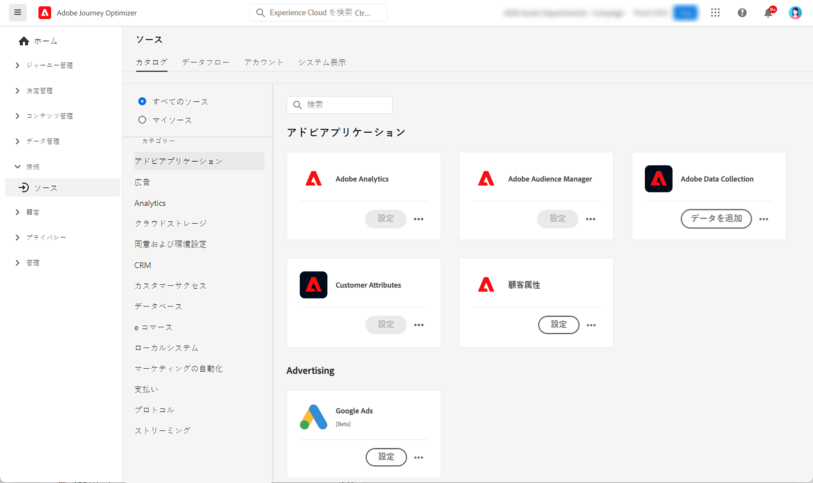

# ソースコネクタの基本を学ぶ {#sources-gs}

Adobe Journey Optimizer では、外部ソースからデータを取り込みながら、Platform サービスを使用して入力データの構造化、ラベル付けおよび強化を行うことができます。アドビのアプリケーション、クラウドベースのストレージ、データベースなど、様々なソースからデータを取り込むことができます。

このビデオでは、ソースコネクタと、Journey Optimizer でのソースコネクタの設定方法について説明します。

>[!VIDEO](https://video.tv.adobe.com/v/335919?quality=12)

Source コネクタを使用して外部ソースからデータを取り込む方法について詳しくは、[Adobe Experience Platform ドキュメント &#x200B;](https://experienceleague.adobe.com/docs/experience-platform/sources/home.html?lang=ja){target="_blank"} を参照してください。
