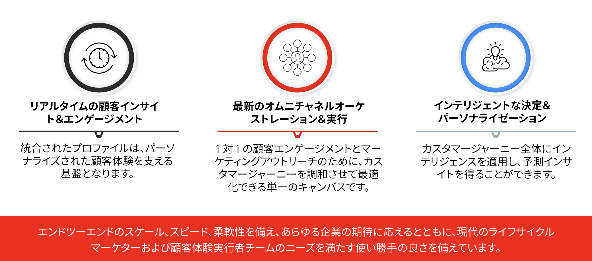
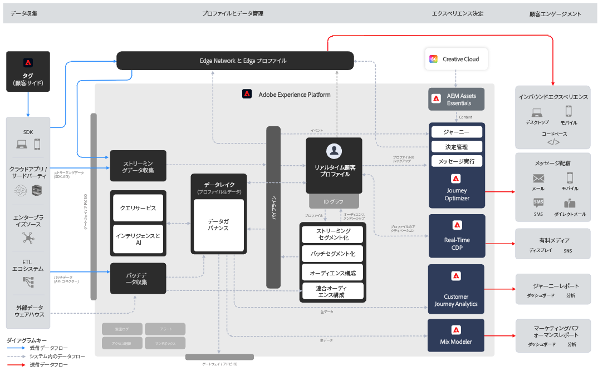
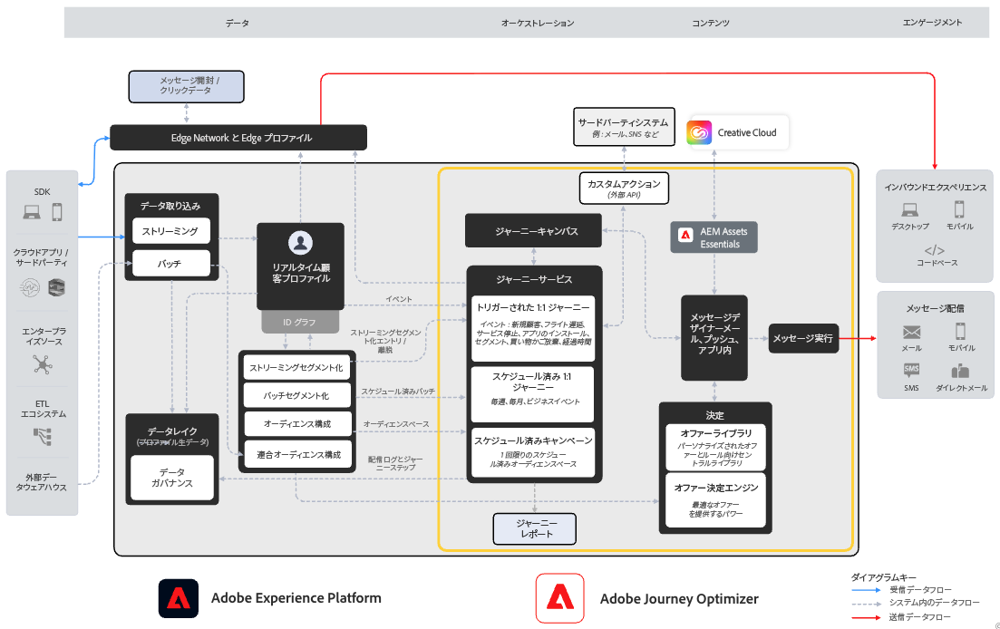

# Journey Optimizer の概要 {#cjm-gs}

## [!DNL Adobe Journey Optimizer] とは？{#about-cjm}

[!DNL Adobe Journey Optimizer] は、会社が顧客に対し、連続性を持ち、顧客の期待に沿う、パーソナライズされたエクスペリエンスを提供するのに役立ちます。カスタマージャーニーは、顧客がブランドに最初に接触した瞬間から離れていくまでの、やり取りのプロセス全体を表します。このジャーニーは、認知フェーズから開始します。このフェーズでは、顧客はブランドを知り、エンゲージメントを開始します。その後、顧客は企業とやり取りし、オンラインショップや実店舗の訪問、購入、メッセージの送信、レビューの投稿をおこないます。

[!DNL Adobe Journey Optimizer] は、[!DNL Adobe Experience Platform] でネイティブに構築され、統合されたリアルタイム顧客プロファイル、API ファーストのオープンフレームワーク、一元化されたオファー決定支援、人工知能（AI）と機械学習（ML）を組み合わせて、パーソナライゼーションと最適化を実現します。Journey Optimizer を使用すると、カスタマージャーニー全体を通じて、スケール、速度、柔軟性を備えた次善のインタラクションをインテリジェントに判断できます。[!DNL Adobe Journey Optimizer] を使用すると、企業は、スケジュールに沿ったマーケティングキャンペーン（小売店向けの週別プロモーションなど）と、カスタマイズされた個々のコミュニケーション（ロイヤルティアプリの顧客が以前表示し、在庫切れだった品目のプッシュ通知など）の両方を同じアプリ内で作成して配信できます。

➡️ [Journey Optimizer の概要を確認](https://experienceleague.adobe.com/docs/journey-optimizer-learn/tutorials/introduction-to-journey-optimizer/introduction.html?lang=ja){target="_blank"}（ビデオ）

<!-- Use [!DNL Adobe Journey Optimizer] to build multi-step customer journeys that initiate a sequence of interactions, offers, and messages across channels in real time. This approach ensures customers are engaged at the optimal moments based on their actions and relevant business signals. Learn how to build journeys in [this section](../building-journeys/journey-gs.md).

You can also create audience-based campaigns to send messages.-->

## ユースケース {#use-cases}

* マーケターは、[!DNL Adobe Journey Optimizer]を使用して、個別のコミュニケーションとオーディエンスベースのバッチコミュニケーションの両方を送信できます。例えば、衣料品店では通常、先週製品を購入したすべての顧客に、購入後の調査を送信できます。悪天候のため商品の出荷が遅れている場合は、衣料品店は、商品をまだ受け取っていない顧客を調べ、スケジュールされた顧客満足度の送信からそれらの顧客を除外することができます。その代わりに、顧客の購入履歴に基づいて、遅延を謝罪し、割引コードと商品レコメンデーション情報を提供する、パーソナライズされたメールを送信できます。

  また、マーケターは、このアプリケーションを使用して、行動ベースのコミュニケーションをリアルタイムで送信できます。例えば、同じ小売業者は、顧客のサイズの在庫が復活した、セーターに関するプッシュ通知を送信することで、店舗の駐車場に到着した常連客をリアルタイムで惹きつけることができます。

* 運営チームや顧客体験に従事するカスタマーサポートなど、マーケター以外の担当者は、[!DNL Adobe Journey Optimizer] を使用して、運用通知やオンボーディングプロセスの監視など、様々なタスクを管理できます。例えば、ある遊園地では、訪問者がその体験の一環としてモバイルアプリをダウンロードします。メンテナンススタッフは、[!DNL Adobe Journey Optimizer]を使用して、メンテナンスのために現在停止されている乗り物を訪問者に通知できます。

## 主な機能 {#key-capabilities}

[!DNL Adobe Journey Optimizer] は、アプリケーション、デバイス、チャネルを問わず、パーソナライズされ、接続されたタイムリーな顧客エクスペリエンスを作成して提供するための、アジャイルで拡張性の高いアプリケーションです。

主な機能は次のとおりです。

* **リアルタイムの顧客インサイトとエンゲージメント**：統合されたプロファイルは、行動データ、トランザクションデータ、財務データ、運用データなど、顧客のタッチポイントを横断するすべてのソースからのライブデータを融合し、顧客の個人的およびコンテキストに応じたエクスペリエンスを最適化します。

* **最新のオムニチャネルオーケストレーションと実行** - 1:1 の顧客エンゲージメントとマーケティングアウトリーチのために、カスタマージャーニーを調和させ、最適化できる単一のキャンバスです。これによってブランドは、カスタマーライフサイクルを通じてより多くの価値を提供できるようになります。[!DNL Adobe Journey Optimizer] で設計されたカスタマージャーニーは、イベントベースの動的なものにすることができます。これにより、ブランドは状況にリアルタイムに反応し、これらのやり取りをスケジュールされたキャンペーンと結び付け、顧客に送信するコミュニケーション、タイミング、チャネルに関して適切な決定を下すことができます。

* **インテリジェントな意思決定とパーソナライゼーション** - ブランドは、一元的な決定を適用し、人工知能と機械学習を組み込んで、顧客体験全体で予測インサイトを設定できます。これにより、意思決定の自動化や、規模に合わせたエクスペリエンスの最適化が容易になります。決定では、[!DNL Adobe Journey Optimizer] を通じ、複数のチャネルをまたぐ大規模な一元的なオファーを支援します。

>[!NOTE]
>
>* 環境で使用できるコンポーネントと機能は、[権限](../administration/permissions.md)と[ライセンスパッケージ](https://helpx.adobe.com/jp/legal/product-descriptions/adobe-journey-optimizer.html){target="_blank"}によって異なります。ご不明な点について詳しくは、アドビカスタマーサクセスマネージャーまたはアドビ担当者までお問い合わせください。
>
>* Adobe Experience Cloud の一般的なプライバシーに関するガイドラインと手順は [!DNL Journey Optimizer] に適用されます。[Adobe Experience Cloud のプライバシーの詳細情報](https://www.adobe.com/jp/privacy/experience-cloud.html){target="_blank"}。

## アーキテクチャ {#architecture}

下の図で、[!DNL Adobe Journey Optimizer] の基本的なアーキテクチャ、統合のポイントおよび [!DNL Journey Optimizer] と [!DNL Experience Platform] との関係について説明します。

Adobe Experience Platform は、データを収集、標準化、管理し、AI のインサイトをデータに適用し、データを統合して、思慮深く関連性の高いデジタル顧客体験を提供する、強力で柔軟性の高い、オープンで一元化されたデータ基盤です。

{width="70%" zoomable="yes"}

Experience Platform には、Adobe Real-Time Customer Data Platform、Journey Optimizer、Customer Journey Analytics、Adobe Mix Modeler の 4 つのアプリケーションがネイティブに作成されています。

Journey Optimizer のコア機能とサービスは、リアルタイム顧客プロファイルを含む Adobe Experience Platform の基本コンポーネントに基づいて動作します。Journey Optimizer は、Real-Time CDP および Customer Journey Analytics とシームレスに連携して相互運用できますが、スタンドアロンアプリケーションとして独立して機能することもできます。

{width="70%" zoomable="yes"}

### Adobe Journey Optimizer ブループリント

デジタルエクスペリエンスブループリントは、Adobe Experience Platform とアプリケーションの統合および実装の仕組みをより深く理解するのに役立つシステム図およびデータフローアーキテクチャ図を提供します。ブループリントは、システム間およびコンポーネントのデータとコンテンツのフロー、操作のシーケンス、依存関係を視覚的に表現し、Adobe Experience Platform とアプリケーションのユースケースのデザインおよびアーキテクチャに役立ちます。

詳しくは、[Adobe Journey Optimizer ブループリント](https://experienceleague.adobe.com/ja/docs/blueprints-learn/architecture/customer-journeys/journey-optimizer/journey-optimizer-overview){target="_blank"}を参照してください。

>[!MORELIKETHIS]
>
>* [開始の主な手順](quick-start.md)
>* [ジャーニーの設計とメッセージの送信](../building-journeys/journey-gs.md)
>* [ライブレポート](../reports/live-report.md)
>* [Journey Optimizerの概要チュートリアル &#x200B;](https://experienceleague.adobe.com/ja/docs/journey-optimizer-learn/tutorials/introduction-to-journey-optimizer/introduction){target="_blank"}
>* [Journey Optimizer Security の概要](https://www.adobe.com/content/dam/cc/en/security/pdfs/AJO_SecurityOverview.pdf)（PDF）
>* [Journey Optimizer 製品説明](https://helpx.adobe.com/jp/legal/product-descriptions/adobe-journey-optimizer.html){target="_blank"}
