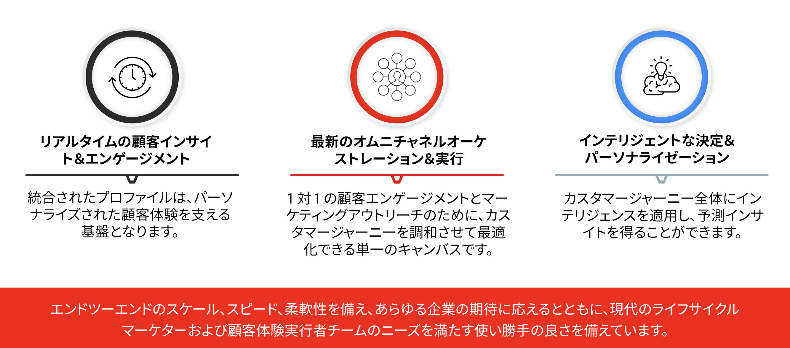

# Journey Optimizer の概要 {#cjm-gs}

>[!CONTEXTUALHELP]
>id="test_id"
>title="一部のテストコンテンツ"
>abstract="コンテンツをテストして、コンテキストヘルプを AJO に統合します。"

## [!DNL Adobe Journey Optimizer] について {#about-cjm}

[!DNL Adobe Journey Optimizer] は、会社が顧客に対し、連続性を持ち、顧客の期待に沿う、パーソナライズされたエクスペリエンスを提供するのに役立ちます。カスタマージャーニーは、顧客がブランドとやり取りするプロセスの全体（最初に接触した時点から顧客が離脱するまで）を表します。このジャーニーは、認知フェーズから開始します。このフェーズでは、顧客はブランドを知り、エンゲージメントを開始します。その後、顧客は企業とやり取りし、オンラインショップや実店舗の訪問、購入、メッセージの送信、レビューの投稿をおこないます。

[!DNL Adobe Journey Optimizer] は、[!DNL Adobe Experience Platform] にネイティブに構築され、統合されたリアルタイム顧客プロファイル、API ファーストのオープンフレームワーク、一元化された Offer Decisioning、人工知能（AI）と機械学習（ML）を組み合わせて、パーソナライゼーションと最適化を実現します。Journey Optimizer を使用すると、カスタマージャーニーをまたいで、スケール、速度、柔軟性を備えた次善のインタラクションをインテリジェントに判断できます。 [!DNL Adobe Journey Optimizer] を使用すると、企業は、スケジュールに沿ったマーケティングキャンペーン（小売店向けの週別プロモーションなど）と、カスタマイズされた個々のコミュニケーション（ロイヤルティアプリの顧客が以前表示し、在庫切れだった品目のプッシュ通知など）の両方を同じアプリ内で作成して配信できます。

➡️ [Journey Optimizer の概要を確認](https://experienceleague.adobe.com/docs/journey-optimizer-learn/tutorials/introduction-to-journey-optimizer/introduction.html?lang=ja){target=&quot;_blank&quot;}（ビデオ）

## 使用例 {#use-cases}

* マーケターは、[!DNL Adobe Journey Optimizer]を使用して、個別のコミュニケーションとオーディエンスベースのバッチコミュニケーションの両方を送信できます。 例えば、衣料品店では通常、先週製品を購入したすべての顧客に、購入後の調査を送信できます。 悪天候のため、いくつかの出荷が遅れています。衣料品店は、商品が配送されていない顧客を調べ、スケジュールされた顧客満足度の送信からそれらの顧客を除外することができます。また、顧客の過去履歴履歴に基づいて、遅延を謝罪し、製品レコメンデーションを含む割引コードを提供する、パーソナライズされたメールを送信できます。

   また、マーケティング担当者は、このアプリケーションを使用して、行動ベースのコミュニケーションをリアルタイムで送信できます。 例えば、同じ小売業者は、在庫が復活した、顧客のサイズのセーターに関するプッシュ通知を送信することで、店舗の駐車場に到着した常連客をリアルタイムで惹きつけることができます。

* 運営チームや顧客体験に従事するカスタマーサポートなど、マーケター以外の担当者は、[!DNL Adobe Journey Optimizer] を使用して、運用通知やオンボーディングプロセスの監視など、様々なタスクを管理できます。 例えば、ある遊園地では、訪問者がその体験の一環としてモバイルアプリをダウンロードします。メンテナンススタッフは、[!DNL Adobe Journey Optimizer]を使用して、メンテナンスのために現在停止されている乗り物を訪問者に通知できます。

## 主な機能 {#key-capabilities}

[!DNL Adobe Journey Optimizer] は、アプリケーション、デバイス、チャネルを問わず、パーソナライズされ、接続されたタイムリーな顧客エクスペリエンスを作成して提供するための、アジャイルで拡張性の高いアプリケーションです。

主な機能は次のとおりです。

* **リアルタイムの顧客インサイトとエンゲージメント**：統合されたプロファイルは、行動データ、取引データ、財務データ、運用データなど、顧客のタッチポイントを横断するすべてのソースからのライブデータを融合し、顧客の個人的およびコンテキストに応じたエクスペリエンスを最適化します。

* **最新のオムニチャネルオーケストレーションと実行**：1 対 1 の顧客エンゲージメントとマーケティングアウトリーチのために、カスタマージャーニーを調和させ、最適化できる単一のキャンバスです。これにより、ブランドは、カスタマーライフサイクルをまたいで、通じてより多くの価値を提供できるようになります。[!DNL Adobe Journey Optimizer] で設計されたカスタマージャーニーは、イベントベースの動的なものにすることができます。これにより、ブランドはリアルタイムの兆候に反応し、これらのやり取りをスケジュールされたキャンペーンと結び付け、顧客に送信するコミュニケーション、タイミング、経路に関して適切な決定を下すことができます。

* **インテリジェント判定とパーソナライズ機能**：ブランドは、一元的な決定を適用し、人工知能と機械学習を組み込んで、顧客体験全体で予測インサイトを得ることができます。これにより、意思決定の自動化や、規模に合わせたエクスペリエンスの最適化が容易になります。Offer Decisioning は、[!DNL Adobe Journey Optimizer] を通じ、複数のチャネルをまたいで一元的なオファーを提供します。

## アーキテクチャ {#architecture}

[!DNL Adobe Journey Optimizer] の基本的なアーキテクチャ、統合のポイントおよび [!DNL Journey Optimizer] と他のアドビアプリケーションとの関係について説明します。

>[!VIDEO](https://video.tv.adobe.com/v/334205?quality=12)

>[!NOTE]
>
> Adobe Experience Cloud の一般的なプライバシーに関するガイドラインと手順は [!DNL Journey Optimizer] に適用されます。[Adobe Experience Cloud のプライバシーの詳細情報](https://www.adobe.com/jp/privacy/experience-cloud.html)。
> また、](https://experienceleague.adobe.com/docs/experience-platform/profile/guardrails.html?lang=ja) を開始する前に、リアルタイム顧客プロファイルデータのガードレールを認識しておく[必要があります。

**関連トピック**

* [開始の主な手順](quick-start.md)
* [最初のメッセージの作成](../messages/get-started-content.md)
* [ジャーニーの設計とメッセージの送信](../building-journeys/journey-gs.md)
* [ライブレポート](../reports/live-report.md)
* [Journey Optimizer に関する FAQ](../assets/do-not-localize/AJO-FAQ.pdf) (PDF)
