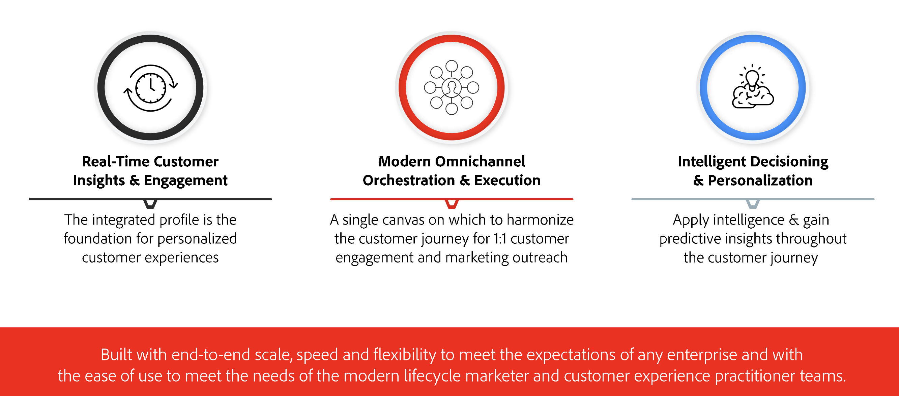

# Journey Optimizer の概要 {#ajo-gs}

Adobe Journey Optimizerとは何か、それは誰のために、その主な能力と、Adobe Experience Platformアーキテクチャにどのように適合するかをご紹介します。 新規ユーザーの出発点として推奨されます。

## [!DNL Adobe Journey Optimizer] とは？{#about-ajo}

[!DNL Adobe Journey Optimizer]は、あらゆるチャネルと顧客接点をまたいで、連続性があり、コンテキストに即して、パーソナライズされた顧客体験を構築および提供するためのエンタープライズアプリケーションです。 [!DNL Adobe Experience Platform]上にネイティブに構築されており、統合されたリアルタイムの顧客プロファイル、API ファーストのオープンフレームワーク、一元化されたオファー決定機能、AI/マシンラーニング機能を活用しています。 Journey Optimizerなら、スケジュール型のマーケティング施策とリアルタイムのイベントトリガーによるコミュニケーションの両方を、単一のアプリケーションから大規模に編成できます。 その結果、顧客のロイヤルティと生涯価値を高める有意義なブランド体験を創出できます。

このガイドは、Journey Optimizerを初めて利用するマーケター、オペレーションチーム、管理者に適用されます。

➡️ [Journey Optimizer の概要を確認](https://experienceleague.adobe.com/docs/journey-optimizer-learn/tutorials/introduction-to-journey-optimizer/introduction.html?lang=ja){target="_blank"}（ビデオ）

<!--
 Use [!DNL Adobe Journey Optimizer] to build multi-step customer journeys that initiate a sequence of interactions, offers, and messages across channels in real time. This approach ensures customers are engaged at the optimal moments based on their actions and relevant business signals. Learn how to build journeys in [this section](../building-journeys/journey-gs.md).

You can also create audience-based campaigns to send messages.
-->

## 主な機能 {#key-capabilities}

[!DNL Adobe Journey Optimizer] は、アプリケーション、デバイス、チャネルを問わず、パーソナライズされ、接続されたタイムリーな顧客エクスペリエンスを作成して提供するための、アジャイルで拡張性の高いアプリケーションです。

主な機能は次のとおりです。

### リアルタイムの顧客インサイトとエンゲージメント

統合プロファイルは、行動データ、トランザクションデータ、財務データ、運用データなど、あらゆるソースからの顧客接点に関するライブデータを統合し、顧客がリアルタイムでパーソナライズされたエクスペリエンスやコンテクストに即したエクスペリエンスを最適化できるようにします。 [&#x200B; プロファイルとオーディエンスについて学ぶ](../audience/get-started-profiles.md)

### 最新のオムニチャネルオーケストレーションと実行

単一のキャンバスで、1:1の顧客エンゲージメントとマーケティングのアウトリーチのカスタマージャーニーを調整および最適化し、顧客ライフサイクル全体でより多くの価値を提供できるよう支援します。 [!DNL Adobe Journey Optimizer]で設計されたカスタマージャーニーは、動的かつイベントベースであり、ブランドがリアルタイムのシグナルに反応し、それらのインタラクションをスケジュールされたキャンペーンと結びつけるのに役立ちます。これにより、どのコミュニケーションを、いつ、どのチャネルを通じて送信すべきかについて、適切な意思決定をおこなうことができます。 ドラッグ&amp;ドロップによるビジュアルデザイナー、再利用可能なテンプレート、コンテンツフラグメント、パーソナライゼーションエディターなどの組み込みのコンテンツ制作ツールを利用して、あらゆるチャネルに対応するメッセージを同じワークフロー内で直接作成、パーソナライズ、管理できます。 [最初のジャーニーを構築](../building-journeys/journey-gs.md) | [&#x200B; コンテンツをデザイン &#x200B;](../../rp_landing_pages/content-management-landing-page.md)

### インテリジェントな意思決定とPersonalization

一元化された意思決定システムを適用し、AI （人工知能）とマシンラーニング（機械学習）を組み込むことで、顧客体験全体で予測的なインサイトを設定することができます。これにより、意思決定の自動化やエクスペリエンスの大規模な最適化が容易になります。 決定機能により、[!DNL Adobe Journey Optimizer]を通じて、チャネル全体で一元化されたオファーを提供できます。 [&#x200B; オファー決定](../offers/get-started/starting-offer-decisioning.md)について| [AI機能について](ai-features.md)詳しく見る

## ユースケース {#use-cases}

これらの例は、Journey Optimizerの能力がさまざまな役割、業界、チャネルでどのように連携しているかを示しています。

### 出荷回収の遅延 {#uc-delayed-shipment}

**役割：** マーケター| **コア機能：** [統合プロファイル + オーディエンスの除外](../audience/get-started-profiles.md)

通常、衣料品店は、先週、商品を購入したあらゆる顧客に購入後のアンケートを送信します。 悪天候のため商品の出荷が遅れている場合は、衣料品店は、商品をまだ受け取っていない顧客を調べ、スケジュールされた顧客満足度の送信からそれらの顧客を除外することができます。その代わりに、顧客の購入履歴に基づいて、遅延を謝罪し、割引コードと商品レコメンデーション情報を提供する、パーソナライズされたメールを送信できます。

[キャンペーンの基本を学ぶ](../campaigns/get-started-with-campaigns.md)

### リアルタイムの店舗内エンゲージメント {#uc-instore}

**役割：** マーケター| **コア機能：** [&#x200B; ジオフェンス トリガー+ プッシュ &#x200B;](../push/get-started-push.md)

Adobe retailerなら、店舗の駐車場にリアルタイムで来店したロイヤル顧客と同様に、顧客サイズで再入荷しているセーターに関するプッシュ通知を送信して、エンゲージメントを促進できます。

[プッシュ通知の基本を学ぶ](../push/get-started-push.md)

### カート放棄の回復 {#uc-cart}

**役割：** マーケター| **コア機能：** [&#x200B; イベントトリガーのマルチステップジャーニー](../building-journeys/journey-gs.md)

顧客がオンラインカートに商品を追加したものの、購入を完了することなくカートを離れた場合、Journey Optimizerはそのイベントをリアルタイムで検出し、自動的にリカバリージャーニーを開始します。 顧客には、残されたアイテムについてリマインドするパーソナライズされたメールが送信されます。 24時間以内にクリックしない場合、閲覧履歴やロイヤルティステータスにもとづいてパーソナライズされたフォローアッププッシュ通知が送信されます。

[最初のジャーニーの構築](../building-journeys/journey-gs.md)

### Streaming service ウェルカムシリーズ {#uc-welcome}

**役割：** マーケター| **コア機能：** [&#x200B; イベントをトリガーにしたウェルカムジャーニー](../building-journeys/journey-gs.md)

顧客がストリーミングサービスに登録すると、Journey Optimizerが登録イベントを検出し、すぐにマルチステップのウェルカムジャーニーを開始します。 顧客には、アプリを初めて開くように促すウェルカムメールが届きます。 48時間以内にログインアクティビティが検出されない場合、サインアップ時に、ユーザーの興味に基づいてパーソナライズされたコンテンツレコメンデーションを含むフォローアッププッシュ通知が送信されます。これにより、消極的な購読者がアクティブでエンゲージメントの高いユーザーへと変わります。

[最初のジャーニーの構築](../building-journeys/journey-gs.md)

### 道順を知らせる予約リマインダー {#uc-reservation}

**役割：** マーケター| **コア機能：** [&#x200B; スケジュール済み+場所に応じたメッセージ &#x200B;](../campaigns/get-started-with-campaigns.md)

ホスピタリティブランドは、各顧客に予約の1時間前にタイムリーなリマインダーを送信します。 この通知には、ゲストの名前、予約時間、会場への位置情報が含まれます。マーケティングチームの手作業なしに、顧客プロファイルと予約データから自動的に組み立てられます。

[キャンペーンの基本を学ぶ](../campaigns/get-started-with-campaigns.md)

### プロアクティブなサービス停止通知 {#uc-outage}

**役割：**&#x200B;操作| **コア機能：** [大規模なオーディエンス選択の自動化](../audience/about-audiences.md)

サービスの中断が発生すると、Journey Optimizerは、アカウントデータと使用パターンにもとづいて、影響を受ける顧客を自動的に特定します。 そのような顧客には、問題を把握し、次のステップを説明する積極的な通知が届きます。これにより、ネガティブな体験を透明性と信頼の瞬間に変え、大規模に提供することができます。

[最初のジャーニーの構築](../building-journeys/journey-gs.md)

### AIを活用したプロモーションキャンペーン {#uc-ai-campaign}

**役割：** マーケター| **コア機能：** [AI コンテンツ生成+実験](ai-features.md)

新製品発売を計画している小売企業は、Journey OptimizerのAI アシスタントを活用して、自然言語のプロンプトとアップロードされたブランドガイドラインに従って、複数の件名と本文のバリエーションを数分で生成します。 ビルトインのコンテンツ実験機能により、最初のオーディエンスサンプルの中で最もパフォーマンスの高いバリエーションを自動的に特定します。 勝者メッセージは残りの受信者にデプロイされ、コピーライティングの作業を増やすことなくエンゲージメントが最大化されます。

[AIとインテリジェント機能について詳しく見る](ai-features.md) | [&#x200B; コンテンツの実験について詳しく見る](../content-management/experiment-accelerator-gs.md)

### モバイルアプリ経由のメンテナンスアラート {#uc-maintenance}

**役割：**&#x200B;操作| **コア機能：** [&#x200B; マーケティング以外のジャーニーオーケストレーション &#x200B;](../building-journeys/journey-gs.md)

運用チームやカスタマーサポートなどのマーケター以外の担当者は、[!DNL Adobe Journey Optimizer]を使用して、運用通知を管理したり、オンボーディングプロセスを監視したりできます。 例えば、訪問者が体験の一環としてモバイルアプリをダウンロードするアミューズメントパーク：メンテナンススタッフは、Journey Optimizerを使用して、メンテナンスのために現在閉鎖されている乗り物を公園の訪問者に通知することができます。

[最初のジャーニーの構築](../building-journeys/journey-gs.md)

## 可用性とライセンス {#availability}

このドキュメントでは、Journey Optimizerの最新リリースについて説明し、特に明記されていない限り、B2CとB2B editionの両方のユーザーに適用されます。 環境で使用できるコンポーネントと機能は、[権限](../administration/permissions.md)と[ライセンスパッケージ](https://helpx.adobe.com/jp/legal/product-descriptions/adobe-journey-optimizer.html){target="_blank"}によって異なります。ご不明な点について詳しくは、アドビカスタマーサクセスマネージャーまたはアドビ担当者までお問い合わせください。

Adobe Experience Cloud の一般的なプライバシーに関するガイドラインと手順は [!DNL Journey Optimizer] に適用されます。[Adobe Experience Cloud のプライバシーの詳細情報](https://www.adobe.com/jp/privacy/experience-cloud.html){target="_blank"}。

## アーキテクチャ {#architecture}

Journey Optimizerは、Adobe Experience Platform上にネイティブに構築され、そのデータ基盤、ID グラフ、およびガバナンスサービスを共有します。これらのシステムの連携の詳細については、[Journey Optimizerについて](understanding-ajo.md)を参照してください。

## 関連リソース {#related-resources}

* [開始するための主な手順](quick-start.md) – 管理者、マーケター、データエンジニア向けのロールベースのクイックスタートガイド。
* [&#x200B; データ管理の基本を学ぶ](../data/gs-data.md) — Journey Optimizerでデータを取り込み、統合し、アクティブ化する方法について説明します。
* [&#x200B; ジャーニーをデザインしてメッセージを送信](../building-journeys/journey-gs.md) – 最初のカスタマージャーニーを構築し、チャネルアクションを設定します。
* [&#x200B; ライブレポート &#x200B;](../reports/live-report.md) — キャンペーンとジャーニーのパフォーマンスをリアルタイムで監視します。
* [Journey Optimizer入門チュートリアル &#x200B;](https://experienceleague.adobe.com/ja/docs/journey-optimizer-learn/tutorials/introduction-to-journey-optimizer/introduction){target="_blank"} — Journey Optimizerの主要な概念を説明するガイド付きビデオチュートリアルです。
* [Journey Optimizer セキュリティの概要](https://www.adobe.com/content/dam/cc/en/security/pdfs/AJO_SecurityOverview.pdf) （PDF） – セキュリティ アーキテクチャ、データ保護、コンプライアンスの詳細。
* [Journey Optimizer製品の説明](https://helpx.adobe.com/jp/legal/product-descriptions/adobe-journey-optimizer.html){target="_blank"} – 公式ライセンス条件とエディション機能の内訳。
