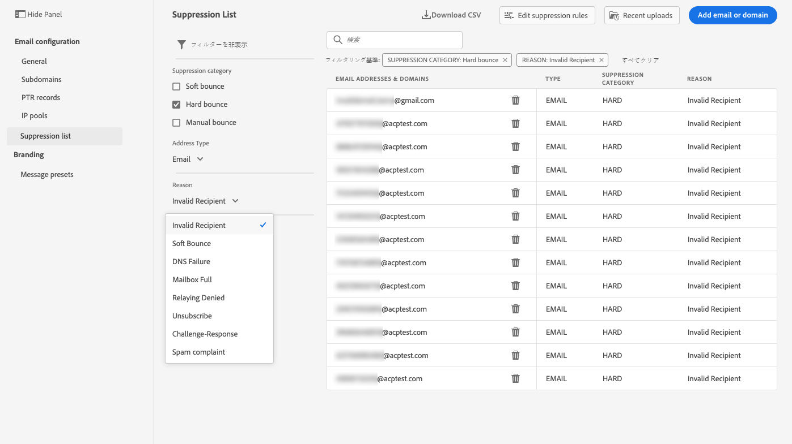

# システム管理者向けの基礎知識 {#get-started-sys-admins}

[!DNL Adobe Journey Optimizer] の使用を開始する前に、環境の準備にいくつかの手順が必要です。[データエンジニア](data-engineer.md)と[ジャーニー実務担当者](marketer.md)が [!DNL Adobe Journey Optimizer] で作業を開始できるように、これらの手順を実行する必要があります。

**システム管理者**&#x200B;は、サンドボックス管理とチャネル設定のために&#x200B;**製品プロファイルを把握し権限を割り当てる**&#x200B;必要があります。また、サンドボックスをセットアップし、使用可能な製品プロファイル用にサンドボックスを管理する必要もあります。その後で、チームメンバーを製品プロファイルに割り当てることができます。

これらの機能は、Admin Console にアクセスできる&#x200B;**[!UICONTROL 製品管理者]**&#x200B;が管理できます。Adobe Admin Console について詳しくは、[こちら](https://helpx.adobe.com/jp/enterprise/admin-guide.html){target=&quot;_blank&quot;}を参照してください。

アクセス管理については、次のページを参照してください。

1. **サンドボックスを作成**&#x200B;して、インスタンスを個別の独立した仮想環境に分割します。 **サンドボックス** は、[!DNL Journey Optimizer] で作成します。詳しくは、[サンドボックス](../../administration/sandboxes.md)の節を参照してください。

   >[!NOTE]
   >**システム管理者**&#x200B;の場合、**[!UICONTROL サンドボックス]**&#x200B;メニューが [!DNL Journey Optimizer] に表示されなければ、[Admin Console](https://adminconsole.adobe.com/){_blank} で権限を更新します。製品プロファイルを更新する方法については、[このページ](../../administration/permissions.md#edit-product-profile)を参照してください。

1. **製品プロファイルを把握**&#x200B;します。製品プロファイルは、インターフェイス内の特定の機能やオブジェクトにユーザーがアクセスできるようにするための単一権限のセットです。詳しくは、[標準の製品プロファイル](../../administration/ootb-product-profiles.md)の節を参照してください。

1. **サンドボックス**&#x200B;を含む製品プロファイルの&#x200B;**権限を設定**&#x200B;します。次に、チームメンバーを様々な製品プロファイルに割り当てることで、それらの製品プロファイルへのアクセス権をチームメンバーに付与します。この手順は、[Admin Console](https://adminconsole.adobe.com/){_blank} で実行します。権限は、**[!UICONTROL 製品プロファイル]**&#x200B;に割り当てる許可を定義できる単一の権利です。各権限は、[!DNL Journey Optimizer] の様々な機能やオブジェクトに相当する、ジャーニー、メッセージ、オファーなどの機能の下に集約されています。詳しくは、[権限レベル](../../administration/high-low-permissions.md)の節を参照してください。

さらに、Assets Essentials にアクセスする必要のあるユーザーを **Assets Essentials Consumer Users** または／および **Assets Essentials Users** の製品プロファイルに追加する必要があります。詳しくは、[Assets Essentials のドキュメント](https://experienceleague.adobe.com/docs/experience-manager-assets-essentials/help/deploy-administer.html?lang=ja){target=&quot;_blank&quot;} を参照してください。

>[!NOTE]
>2022年1月6日（PT）より前に入手した Journey Optimizer 製品の場合、組織に [!DNL Adobe Experience Manager Assets Essentials] をデプロイする必要があります。 詳しくは、[Assets Essentials のデプロイ](https://experienceleague.adobe.com/docs/experience-manager-assets-essentials/help/deploy-administer.html?lang=ja){target=&quot;_blank&quot;} の節を参照してください。

[!DNL Journey Optimizer] に初めてアクセスするときは、実稼動用サンドボックスがプロビジョニングされ、契約に応じて一定数の IP が割り当てられます。

ジャーニーを作成しメッセージを送信できるようにするには、**管理**&#x200B;メニューにアクセスします。**[!UICONTROL チャネル]**&#x200B;メニューを参照して、メールメッセージとプリセットを設定します。

>[!NOTE]
>**システム管理者**&#x200B;の場合、**[!UICONTROL チャネル]**&#x200B;メニューが [!DNL Journey Optimizer] に表示されなければ、[Admin Console](https://adminconsole.adobe.com/){_blank} で権限を更新します。製品プロファイルを更新する方法については、[このページ](../../administration/permissions.md#edit-product-profile)を参照してください。

以下の手順に従います。

1. **メッセージとチャネルを設定**：プリセットを定義し、メールおよびプッシュメッセージの設定を調整しカスタマイズします。

   * [!DNL Adobe Experience Platform] と [!DNL Adobe Experience Platform Launch] の両方で、**プッシュ通知設定**&#x200B;を定義します。[詳細情報](../../messages/push-gs.md)

   * およ&#x200B;**メッセージプリセット**&#x200B;を作成して、メールおよびプッシュ通知メッセージに必要なすべてのテクニカルパラメーターを設定します。[詳細情報](../../configuration/message-presets.md)

   * 抑制リストにメールアドレスを送信するまでに&#x200B;**再試行**&#x200B;を実行する日数を管理します。[詳細](../../configuration/manage-suppression-list.md)

1. **サブドメインをデリゲート**：Journey Optimizer で新規サブドメインを使用する場合、最初の手順としてそのサブドメインをデリゲートします。[詳細](../../configuration/about-subdomain-delegation.md)

   

1. **IP プールの作成**：インスタンスでプロビジョニングされた IP アドレスをグループ化することで、E メールの配信品質と評判を向上させます。[詳細](../../configuration/ip-pools.md)

   

1. **抑制リストと許可リストを管理**：抑制リストと許可リストを使用して配信品質を向上させます。

   * [抑制リスト](../../messages/suppression-list.md)は、配信の対象外とするメールアドレスの一覧です。これらのアドレスに送信すると、送信の評判や配信率が低下する可能性があるなどの理由から対象外にします。無効なアドレス、絶えずソフトバウンスしメールの評判に悪影響を与える可能性のあるアドレス、送信したメールメッセージに対して何らかのスパム苦情を出す受信者など、ジャーニーでの送信から自動的に除外されるすべてのメールアドレスを監視できます。[抑制リスト](../../configuration/manage-suppression-list.md)と[再試行](../../configuration/retries.md)の管理方法については、それぞれのページを参照してください。
   

   * [許可リスト](../../messages/allow-list.md)を使用すると、個々のメールアドレスまたはドメインを指定して、これらの受信者またはドメインでのみ、特定のサンドボックスから送信するメールの受信が許可されるようにすることができます。これにより、テスト環境で実際の顧客アドレスに誤ってメールを送信するのを防ぐことができます。許可リストを有効にする方法については、[こちら](../../messages/allow-list.md)を参照してください。
   [!DNL Adobe Journey Optimizer] での配信品質管理について詳しくは、[このページ](../../messages/deliverability.md)を参照してください。
