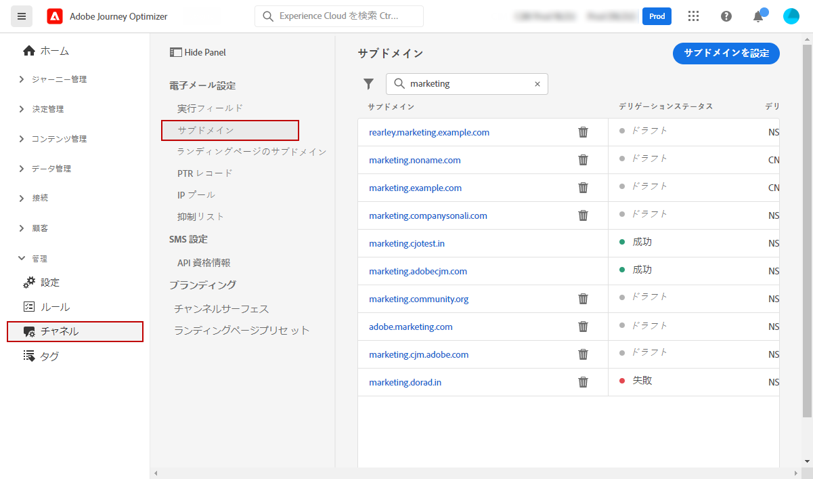
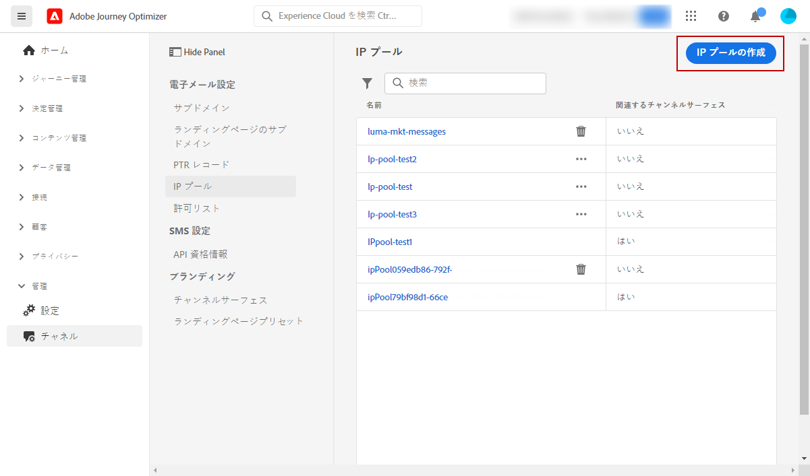
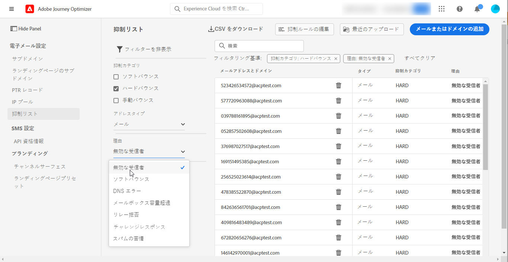

# システム管理者向けの基礎知識 {#get-started-sys-admins}

[!DNL Adobe Journey Optimizer] の使用を開始する前に、環境の準備にいくつかの手順が必要です。[ データエンジニア ](data-engineer.md) と [ジャーニー実務担当者 ](marketer.md) が [!DNL Adobe Journey Optimizer] の作業を開始できるように、これらの手順を実行する必要があります。

**システム管理者** は、サンドボックス管理とチャネル設定のために **役割について理解し、権限を割り当てる** 必要があります。 また、サンドボックスをセットアップし、使用可能な役割のためにそれらを管理する必要があります。 その後、チームメンバーを役割に割り当てることができます。

これらの機能は、権限製品にアクセスできる **[!UICONTROL 製品管理者]** が管理できます。 [ 権限の詳細情報 ](../../administration/permissions.md){target="_blank"}。

アクセス管理については、次のページを参照してください。

1. **サンドボックスを作成**&#x200B;して、インスタンスを個別の独立した仮想環境に分割します。**サンドボックス** は、[!DNL Journey Optimizer] で作成します。詳しくは、[サンドボックス](../../administration/sandboxes.md)の節を参照してください。

   >[!NOTE]
   >**システム管理者** の [!DNL Journey Optimizer] に **[!UICONTROL サンドボックス]** メニューが表示されない場合は、権限を更新する必要があります。 役割を更新する方法については、[ このページ ](../../administration/permissions.md#edit-product-profile) を参照してください。

1. **役割について**。 役割は、インターフェイス内の特定の機能やオブジェクトへユーザーがアクセスできる単一権限のセットです。 詳しくは、[ 標準の役割 ](../../administration/ootb-product-profiles.md) の節を参照してください。

1. **サンドボックス** などの役割の **権限を設定** し、チームメンバーを様々な役割に割り当てることで、それらの役割へのアクセス権をチームメンバーに付与します。 権限は、（役割 **[!UICONTROL に割り当てる許可を定義できる単一の権利]** す。 各権限は、機能群（[!DNL Journey Optimizer] のさまざまな機能やオブジェクトに相当するジャーニー、オファーなど）の下に集められています。詳しくは、[権限レベル](../../administration/high-low-permissions.md)の節を参照してください。

さらに、Assets Essentialsへのアクセスを必要とするユーザーを **Assets Essentialsコンシューマーユーザー** または **Assets Essentialsユーザー** の役割に追加する必要があります。 詳しくは、[Assets Essentials のドキュメント](https://experienceleague.adobe.com/docs/experience-manager-assets-essentials/help/deploy-administer.html?lang=ja){target="_blank"}を参照してください。

>[!NOTE]
>2022年1月6日（PT）より前に入手した Journey Optimizer 製品の場合、組織に [!DNL Adobe Experience Manager Assets Essentials] をデプロイする必要があります。詳しくは、[Assets Essentials のデプロイ](https://experienceleague.adobe.com/docs/experience-manager-assets-essentials/help/deploy-administer.html?lang=ja){target="_blank"}の節をご覧ください。

[!DNL Journey Optimizer] に初めてアクセスするときは、実稼動用サンドボックスがプロビジョニングされ、契約に応じて一定数の IP が割り当てられます。

ジャーニーを作成しメッセージを送信できるようにするには、**管理**&#x200B;メニューにアクセスします。**[!UICONTROL チャネル]**&#x200B;メニューを参照し、メッセージとチャネル設定（メッセージプリセットなど）を設定します。

>[!NOTE]
>**システム管理者** の [!DNL Journey Optimizer] に **[!UICONTROL チャネル]** メニューが表示されない場合は、[ 権限 ](../../administration/permissions.md){target="_blank"} 製品で権限を更新してください。
>

以下の手順に従います。

1. **メッセージとチャネルを設定**：設定を定義し、メール、SMS およびプッシュメッセージの設定を調整しカスタマイズします

   * [!DNL Adobe Experience Platform] と [!DNL Adobe Experience Platform Launch] の両方で、**プッシュ通知設定**&#x200B;を定義します。[詳細情報](../../push/push-gs.md)

   * **チャネル設定**（メッセージプリセットなど）を作成して、メール、SMS およびプッシュ通知に必要なすべての技術パラメーターを設定します。[詳細情報](../../configuration/channel-surfaces.md)

   * **SMS チャネル**&#x200B;で、SMS に必要なすべての技術パラメーターを設定します。[詳細情報](../../sms/sms-configuration.md)

   * 抑制リストにメールアドレスを送信するまでに&#x200B;**再試行**&#x200B;を実行する日数を管理します。[詳細](../../configuration/manage-suppression-list.md)

1. **サブドメインをデリゲート**：Journey Optimizer で新規サブドメインを使用する場合、最初の手順としてそのサブドメインをデリゲートします。[詳細](../../configuration/about-subdomain-delegation.md)

   

1. **IP プールの作成**：インスタンスでプロビジョニングされた IP アドレスをグループ化することで、メールの配信品質と評判を向上させます。[詳細](../../configuration/ip-pools.md)

   

1. **抑制リストと許可リストを管理**：抑制リストと許可リストを使用して配信品質を向上させます。

   * [抑制リスト](../../reports/suppression-list.md)は、配信から除外するメールアドレスの一覧です。これらのアドレスに送信すると、送信の評判や配信率が低下する可能性があるなどの理由から対象外にします。無効なアドレス、絶えずソフトバウンスしメールの評判に悪影響を与える可能性のあるアドレス、送信したメールメッセージに対して何らかのスパム苦情を出す受信者など、ジャーニーでの送信から自動的に除外されるすべてのメールアドレスを監視できます。[抑制リスト](../../configuration/manage-suppression-list.md)と[再試行](../../configuration/retries.md)の管理方法については、それぞれのページを参照してください。

   

   * [許可リスト](../../configuration/allow-list.md)を使用すると、個々のメールアドレスまたはドメインを指定して、これらの受信者またはドメインでのみ、特定のサンドボックスから送信するメールの受信が許可されるようにすることができます。これにより、テスト環境で実際の顧客アドレスに誤ってメールを送信するのを防ぐことができます。許可リストを有効にする方法については、[こちら](../../configuration/allow-list.md)を参照してください。

   [!DNL Adobe Journey Optimizer] での配信品質管理について詳しくは、[このページ](../../reports/deliverability.md)を参照してください。
