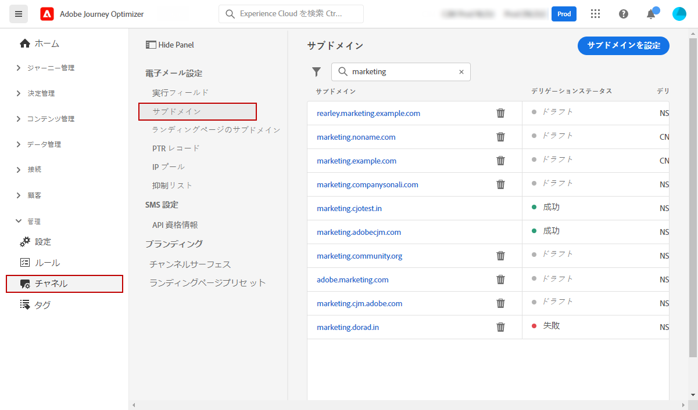
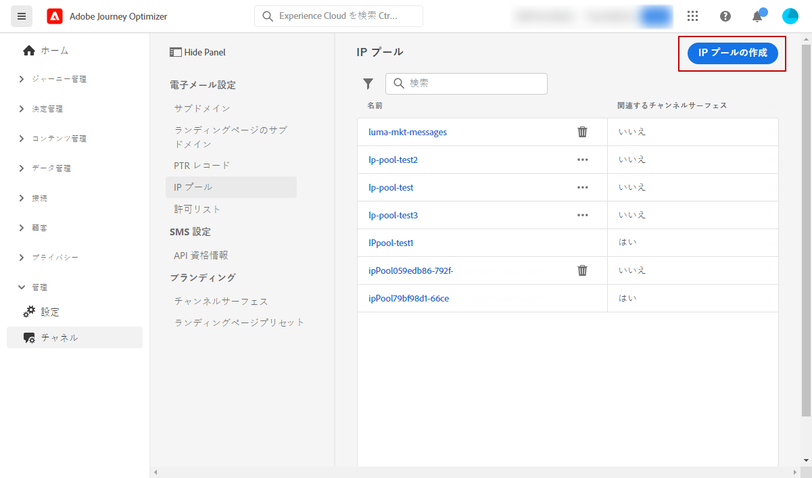
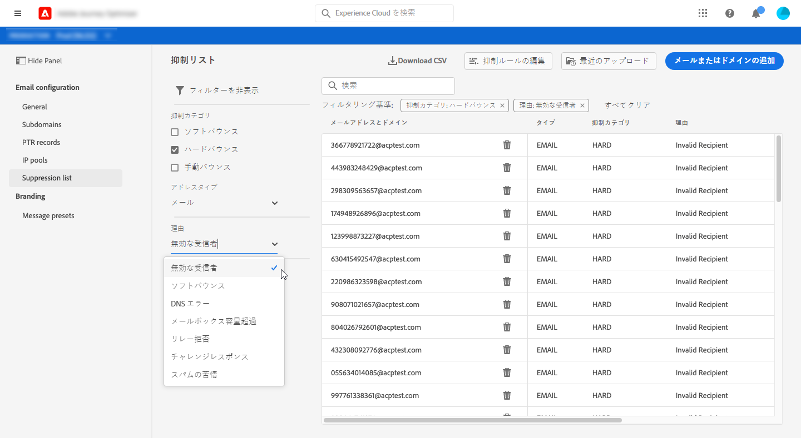

# システム管理者向けの基本を学ぶ {#get-started-sys-admins}

>[!BEGINSHADEBOX]

**このページ：**&#x200B;ユーザー、権限、サンドボックス、チャネルを設定します。これにより、チームは Adobe Journey Optimizer で安全および効率的に作業できます。

>[!ENDSHADEBOX]

**システム管理者**&#x200B;は、Journey Optimizer 環境を設定し、アクセスを管理して、チームが効率的で安全に作業できるようにします。 [データエンジニア](data-engineer.md)、[開発者](developer.md)、[マーケター](marketer.md)が [!DNL Adobe Journey Optimizer] の使用を開始できるように、基本的な設定手順を実行します。

主な責務には、ユーザーグループと権限の設定、様々なユーザーグループのデータとジャーニーをパーティション化するサンドボックスの作成と管理、Journey Optimizer を通じて配信される様々なメッセージとアセットをまたいで一貫性のあるブランディングを確保するための配信チャネルとメッセージプリセットの設定が含まれます。 セキュリティとガバナンスを維持しながら、適切な人物が適切な機能にアクセスできるようにします。

これらの機能は、権限製品にアクセスできる&#x200B;**[!UICONTROL 製品管理者]**&#x200B;が管理できます。 [詳しくは、権限を参照してください](../../administration/permissions.md){target="_blank"}。

>[!NOTE]
>
>**実装手順：**&#x200B;現在地：**管理者** → [&#x200B; データエンジニア &#x200B;](data-engineer.md) → [開発者](developer.md) → [&#x200B; マーケター](marketer.md)
>
>管理者が最初に環境を設定します。 データエンジニア、開発者、マーケターは、プロジェクトを開始する前に、これらの作業を完了する必要があります。

## アクセスと権限の設定

アクセス管理を設定するには、次の手順に従います。

1. **サンドボックスを作成**&#x200B;して、インスタンスを個別の独立した仮想環境に分割します。 **サンドボックス** は、[!DNL Journey Optimizer] で作成します。 詳しくは、[サンドボックス](../../administration/sandboxes.md)の節を参照してください。

   >[!NOTE]
   >**システム管理者**&#x200B;として、[!DNL Journey Optimizer] に&#x200B;**[!UICONTROL サンドボックス]**&#x200B;メニューが表示されない場合は、権限を更新する必要があります。 役割を更新する方法について詳しくは、[このページ](../../administration/permissions.md#edit-product-profile)を参照してください。

1. **役割を把握します**。 役割は、ユーザーがインターフェイス内の特定の機能やオブジェクトにアクセスできるようにするための、一連の単一の権利です。 詳しくは、[標準の役割](../../administration/ootb-product-profiles.md)の節を参照してください。

1. **サンドボックス**&#x200B;を含む役割の&#x200B;**権限を設定**&#x200B;し、チームメンバーに様々な役割を割り当てることでアクセス権を付与します。 権限は、**[!UICONTROL 役割]**&#x200B;に割り当てる許可を定義できるようにするための単一の権利です。 各権限は、機能群（[!DNL Journey Optimizer] のさまざまな機能やオブジェクトに相当するジャーニー、オファーなど）の下に集められています。 詳しくは、[権限レベル](../../administration/high-low-permissions.md)の節を参照してください。

1. **オブジェクトレベルのアクセス制御を使用**&#x200B;します（オプション）。 ジャーニー、キャンペーン、チャネル設定などのオブジェクトにアクセスラベルを適用して、特定のリソースにアクセスできるユーザーを制御します。 詳しくは、[オブジェクトレベルのアクセス制御（OLAC）](../../administration/object-based-access.md)を参照してください。

さらに、Assets Essentials にアクセスする必要のあるユーザーを **Assets Essentials コンシューマーユーザー**&#x200B;または／および **Assets Essentials ユーザー**&#x200B;の役割に追加する必要があります。 [詳しくは、Assets Essentials ドキュメントを参照してください](https://experienceleague.adobe.com/docs/experience-manager-assets-essentials/help/deploy-administer.html?lang=ja){target="_blank"}。

[!DNL Journey Optimizer] に初めてアクセスすると、実稼動サンドボックスがプロビジョニングされ、契約に応じて一定数の IP が割り当てられます。

## チャネルとメッセージの設定

[マーケター](marketer.md)がメッセージを作成および送信できるようにするには、**管理**&#x200B;メニューにアクセスします。 チャネル設定を指定するには、**[!UICONTROL チャネル]**&#x200B;メニューを参照します。

>[!NOTE]
>**システム管理者**&#x200B;として、[!DNL Journey Optimizer] に&#x200B;**[!UICONTROL チャネル]**&#x200B;メニューが表示されない場合は、[権限](../../administration/permissions.md){target="_blank"}製品で権限を更新してください。

次の手順に従います。

1. **チャネル設定を指定**&#x200B;します。 メール、SMS、プッシュ通知、web プッシュ、ダイレクトメール、他のチャネルに必要なすべての技術パラメーターを定義します。

   * [!DNL Adobe Experience Platform] と Adobe Experience Platform Data Collection の両方で&#x200B;**プッシュ通知設定**&#x200B;を定義します。 [詳細情報](../../push/push-gs.md)

   * **Web プッシュ通知**&#x200B;を設定して、モバイルブラウザーとデスクトップブラウザーに通知を配信します。 [詳細情報](../../push/push-configuration-web.md)

   * **チャネル設定**&#x200B;を作成して、メール、SMS、プッシュ、アプリ内、web、他のチャネルに必要なすべての技術パラメーターを設定します。 [詳細情報](../../configuration/channel-surfaces.md)

   * **SMS チャネル**&#x200B;で、SMS に必要なすべての技術パラメーターを設定します。 [詳細情報](../../mobile/mobile-configuration.md)

   * 抑制リストにメールアドレスを送信するまでに&#x200B;**再試行**&#x200B;を実行する日数を管理します。 [詳細情報](../../configuration/manage-suppression-list.md)

   * チャネル設定レベルで&#x200B;**メッセージのエクスポート**&#x200B;を有効にして、必要に応じて送信済みメールや SMS コンテンツをアーカイブします（アドオン機能）。 [詳細情報](../../configuration/message-export.md)

1. **サブドメインをデリゲート**：Journey Optimizer で新規サブドメインを使用する場合、最初の手順としてそのサブドメインをデリゲートします。 [学習を増やす](../../configuration/about-subdomain-delegation.md)。 必要に応じて、サブドメインを CNAME からカスタムデリゲーションに移行できます。 [詳細情報](../../configuration/custom-subdomain-migration.md)

   

1. **IP プールの作成**：インスタンスでプロビジョニングされた IP アドレスをグループ化することで、メールの配信品質と評判を向上させます。 [詳細情報](../../configuration/ip-pools.md)

   

1. **抑制リストと許可リストを管理**：抑制リストと許可リストを使用して配信品質を向上させます。

   * [抑制リスト](../../reports/suppression-list.md)は、配信から除外するメールアドレスの一覧です。これらのアドレスに送信すると、送信の評判や配信率が低下する可能性があるなどの理由から対象外にします。 無効なアドレス、絶えずソフトバウンスしメールの評判に悪影響を与える可能性のあるアドレス、送信したメールメッセージに対して何らかのスパム苦情を出す受信者など、ジャーニーでの送信から自動的に除外されるすべてのメールアドレスを監視できます。 [抑制リスト](../../configuration/manage-suppression-list.md)と[再試行](../../configuration/retries.md)の管理方法については、それぞれのページを参照してください。

   

   * [許可リスト](../../configuration/allow-list.md)を使用すると、個々のメールアドレスまたはドメインを指定して、これらの受信者またはドメインでのみ、特定のサンドボックスから送信するメールの受信が許可されるようにすることができます。 これにより、テスト環境で実際の顧客アドレスに誤ってメールを送信するのを防ぐことができます。 許可リストを有効にする方法については、[こちら](../../configuration/allow-list.md)を参照してください。

   [!DNL Adobe Journey Optimizer] での配信品質管理について詳しくは、[このページ](../../reports/deliverability.md)を参照してください。

## その他の機能

組織のニーズが拡大するにつれて、次の高度な機能を考慮します。

* **同意ポリシー**：組織が Healthcare Shield または Privacy and Security Shield を購入している場合は、チャネルをまたいで顧客の環境設定を適用する同意ポリシーを作成します。 [詳細情報](../../action/consent.md)

* **データガバナンスポリシー**：データ使用ラベルとポリシーを適用して、マーケティングアクションでのデータの使用方法を制御します。 [詳細情報](../../action/action-privacy.md)

* **IP ウォームアッププラン**：メールの送信量を徐々に増やして、メールプロバイダーでの送信者の評判を作成します。 [詳細情報](../../configuration/ip-warmup-gs.md)

* **クワイエットアワー**：特定の期間にメッセージを送信しないようにするための、時間ベースの除外ルールセットを設定します。 [詳細情報](../../conflict-prioritization/quiet-hours.md)

## 役割をまたいだ共同作業

管理作業により、すべてのチームの成功が可能になります。

>[!BEGINTABS]

>[!TAB データエンジニアのサポート]

データ管理とアクセスに関して、[データエンジニア](data-engineer.md)と共同作業を行います。 データエンジニアが設定する必要があるスキーマ、データセット、データソースについて詳しく、[データ管理の基本を学ぶ](../../data/gs-data.md)の概要を参照してください。

* データ管理およびスキーマ作成の権限を付与
* 開発とテスト用のサンドボックスへのアクセスを承認
* データ保持ポリシーとガバナンスルールを調整
* 連合オーディエンス構成などの高度な機能へのアクセスを有効にする

>[!TAB 開発者を有効にする]

API アクセスとテストに関する[開発者](developer.md)との共同作業：

* Adobe Developer Console を通じて API 資格情報を提供
* 開発とテスト用のサンドボックス環境を設定
* チャネル設定（プッシュ証明書、SMS プロバイダー）を承認
* テスト環境とデプロイメント戦略を調整

>[!TAB マーケターの強化]

権限とチャネル設定に関する[マーケター](marketer.md)との共同作業：

* ジャーニーとキャンペーンを作成する適切な権限を割り当て
* 使用するチャネル（メール、プッシュ、SMS など）を設定
* テスト環境と承認ワークフローをサポート
* 新しい特長と機能へのアクセスを有効にする
* 意思決定ガイドを共有して、適切なアプローチの選択を支援します。[ジャーニーとキャンペーン &#x200B;](../journeys-vs-campaigns.md)および[ジャーニーの種類：適切なものを選択](../../building-journeys/journey-types-selection.md)

>[!ENDTABS]

## 次の手順

環境を設定したら、次の手順を実行します。

1. **設定を確認**：すべてのチームメンバーが必要な機能にアクセスできることを確認します
2. **使用状況を監視**：管理ダッシュボードを使用してシステムの使用状況を追跡し、問題を特定します
3. **権限を維持**：チームの役割の進化に合わせて、定期的に権限を確認および更新します

## その他のロールガイド {#other-role-guides}

| 役割 | ガイド |
|------|-------|
| 管理者 | [管理者の基本を学ぶ](administrator.md) |
| データエンジニア | [&#x200B; データエンジニア向けの基本を学ぶ](data-engineer.md) |
| 開発者 | [開発者向けの基本を学ぶ](developer.md) |
| マーケター | [マーケター向けの基本を学ぶ](marketer.md) |

[役割と責任の概要](../quick-start.md)に戻る・ [に戻る開始](../../../rp_landing_pages/get-started-landing-page.md)
