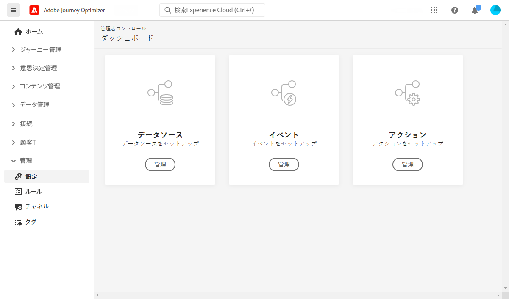

# データエンジニア向けの基礎知識 {#data-engineer}

**Adobe Journey Optimizer データエンジニア**&#x200B;は、[!DNL Journey Optimizer] で調整されたエクスペリエンスを強化するための顧客プロファイルデータの準備と維持、スキーマによる顧客データとビジネスデータのモデル化、データを取り込むためのソースコネクタの設定を行います。[システム管理者](administrator.md) からアクセス権を付与され、環境の準備ができたら、[!DNL Adobe Journey Optimizer] での作業を開始できます。

**データを特定しスキーマとデータセットを作成**&#x200B;して Adobe Experience Platform にデータを取り込む方法については、このページを参照してください。

>[!NOTE]
>
>**データ取り込み**&#x200B;について詳しくは、[Adobe Experience Platform ドキュメント](https://experienceleague.adobe.com/docs/experience-platform/ingestion/home.html?lang=ja){target=&quot;_blank&quot;}を参照してください。

ID 名前空間、プロファイルに対して有効化されたデータセット、テストプロファイルなどを作成する手順について詳しくは、以下の節を参照してください。

1. **ID 名前空間を作成**&#x200B;します。Adobe [!DNL Journey Optimizer] では、**ID** であらゆるデバイスやチャネルにわたって消費者がリンクされ、その結果が ID グラフになります。リンクされた ID グラフを使用すると、あらゆるビジネスタッチポイントでのインタラクションに基づいてエクスペリエンスをパーソナライズすることができます。ID と ID 名前空間について詳しくは、[このページ](../get-started-identity.md)を参照してください。

1. **スキーマを作成**&#x200B;してプロファイルに対して有効にします。スキーマは、データの構造と形式を表現し検証する一連のルールです。スキーマは、概要レベルで実世界のオブジェクト（人など）の抽象的な定義を提供し、そのオブジェクトの各インスタンスに含めるデータ（名、姓、生年月日など）の概要を示します。スキーマについて詳しくは、[このページ](../get-started-schemas.md)を参照してください。

1. **データセットを作成**&#x200B;してプロファイルに対して有効にします。データセットは、スキーマ（列）とフィールド（行）で構成されるデータコレクション（通常はテーブル）を格納し管理するための構造です。データセットには、保存するデータの様々な側面を記述したメタデータも含まれます。データセットを作成したら、既存のスキーマにマッピングし、データを追加できます。データセットについて詳しくは、[このページ](../get-started-datasets.md)を参照してください。

1. **ソースコネクタを設定**&#x200B;します。Adobe Experience Platform では、外部ソースからデータを取り込みながら、Platform サービスを使用して入力データの構造化、ラベル付けおよび強化を行うことができます。アドビのアプリケーション、クラウドベースのストレージ、データベースなど、様々なソースからデータを取り込むことができます。ソースコネクタについて詳しくは、[このページ](../get-started-sources.md)を参照してください。

1. **テストプロファイルを作成**&#x200B;します。ジャーニーで[テストモード](../../building-journeys/testing-the-journey.md)を使用する際や、送信前に[メッセージをプレビューしてテストする](../../messages/preview.md)には、テストプロファイルが必要です。テストプロファイルを作成する手順については、[このページ](../../building-journeys/creating-test-profiles.md)を参照してください。

©さらに、ジャーニーでメッセージを送信できるようにするには、**[!UICONTROL データソース]**、**[!UICONTROL イベント]**&#x200B;および&#x200B;**[!UICONTROL アクション]**&#x200B;を設定する必要があります。詳しくは、[この節](../../configuration/about-data-sources-events-actions.md)を参照してください。

* **データソース**&#x200B;を設定すると、システムへの接続を定義して、ジャーニーで使用する追加情報を取得することができます。データソースについて詳しくは、[この節](../../datasource/about-data-sources.md)を参照してください。

* **イベント**&#x200B;を使用すると、ジャーニーをまとめてトリガーし、ジャーニーに流入してくる個人にリアルタイムでメッセージを送信できます。イベントの設定では、ジャーニーで必要なイベントを設定します。受信イベントのデータは、Adobe Experience Data Model（XDM）に従って正規化されます。イベントは、認証済みイベントと未認証イベント（Adobe Mobile SDK イベントなど）のストリーミング取り込み API から取り込みます。イベントについて詳しくは、[この節](../../event/about-events.md)を参照してください。

* [!DNL Journey Optimizer] には、メッセージ機能が組み込まれており、コンテンツをデザインしメッセージを公開することができます。Adobe Campaign などのサードパーティシステムを使用してメッセージを送信する場合は、**カスタムアクション**&#x200B;を作成します。アクションについて詳しくは、[この節](../../action/action.md)を参照してください。
