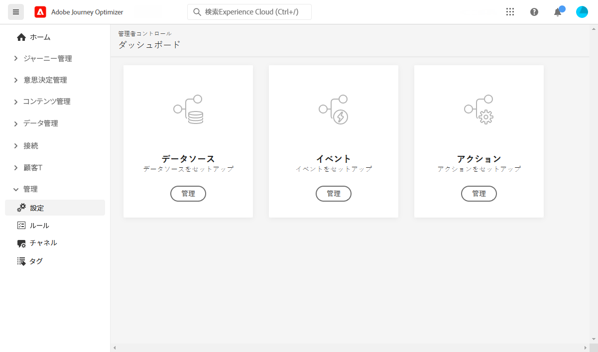

# データエンジニア向けの基本を学ぶ {#data-engineer}

>[!BEGINSHADEBOX]

**このページ：** Adobe Journey Optimizer を活用するスキーマ、データセット、ID、データソースを作成します。これにより、チームはリアルタイムでパーソナライズされたカスタマーエクスペリエンスを提供できます。

>[!ENDSHADEBOX]

**データアーキテクト**&#x200B;または&#x200B;**データエンジニア**&#x200B;は、[!DNL Journey Optimizer] により調整されるエクスペリエンスを向上する顧客プロファイルデータや他のデータソースを設定および管理します。 これには、web、CRM、オフラインソースなど、すべての顧客データとビジネスデータを顧客の統合された 360 度表示を統合することが含まれます。 顧客プロファイルデータとビジネスデータをスキーマにモデル化し、データを取り込むソースコネクタを設定し、データがスムーズにフローするようにして、リアルタイムの顧客インサイトとエンゲージメントを実現します。 [システム管理者](administrator.md)からアクセス権を付与され、環境の準備ができたら、[!DNL Adobe Journey Optimizer] での作業を開始できます。

>[!NOTE]
>
>**実装指示：** [管理者](administrator.md) →現在地：**データエンジニア** → [開発者](developer.md) → [&#x200B; マーケター](marketer.md)
>
>データ基盤の作業を開始する前に、[管理者の設定](administrator.md)を完了してください。

>[!NOTE]
>
>**データ取り込み**&#x200B;について詳しくは、[Adobe Experience Platform ドキュメント](https://experienceleague.adobe.com/docs/experience-platform/ingestion/home.html?lang=ja){target="_blank"}を参照してください。

>[!TIP]
>
>Journey Optimizer のデータを初めて使用しますか？ 設定に進む前に、[データ管理の基本を学ぶ](../../data/gs-data.md)の概要から開始し、スキーマ、データセット、ID、プロファイルフラグメントモデル、完全なデータ準備チェックリストを理解します。

## 基本的なデータ設定手順

Journey Optimizer のデータ基盤を設定するには、次の手順に従います。

1. **ID 名前空間を作成します**。 Adobe [!DNL Journey Optimizer] では、**ID** であらゆるデバイスやチャネルにわたって消費者がリンクされ、その結果が ID グラフになります。 リンクされた ID グラフは、すべてのビジネスタッチポイントにわたるインタラクションに基づいてエクスペリエンスをパーソナライズするために使用します。 ID と ID 名前空間について詳しくは、[このページ](../../audience/get-started-identity.md)を参照してください。

   さらに、注文 ID や予約 ID などのセカンダリ識別子に基づいて、同じプロファイルで複数のジャーニーインスタンスをエントリできるように、**補助識別子**&#x200B;を設定します。 詳しくは、[補足識別子](../../building-journeys/supplemental-identifier.md)を参照してください。

1. **スキーマを作成**&#x200B;してプロファイルに対して有効にします。 スキーマは、データの構造と形式を表し、検証する一連のルールです。 スキーマは、概要レベルで、実世界のオブジェクト（人など）の抽象的な定義を提供し、そのオブジェクトの各インスタンスに含めるデータ（名、姓、誕生日など）の概要を示します。

   * 標準のジャーニーとキャンペーンの場合：[XDM スキーマ](../../data/get-started-schemas.md)を使用します
   * オーケストレーションキャンペーンの場合：[リレーショナルスキーマ](../../orchestrated/gs-schemas.md)を作成して、複数のエンティティのセグメント化を有効にします

1. **データセットを作成**&#x200B;してプロファイルに対して有効にします。 データセットは、スキーマ（列）とフィールド（行）で構成されるデータコレクション（通常はテーブル）を格納し管理するための構造です。 データセットには、保存するデータの様々な側面を記述したメタデータも含まれます。 データセットを作成したら、既存のスキーマにマッピングし、データを追加できます。 データセットについて詳しくは、[このページ](../../data/get-started-datasets.md)を参照してください。

   高度なシナリオの場合は、**ランタイム参照用のデータセット**&#x200B;を準備して、レコードデータセットからのリアルタイムデータを使用してジャーニーの実行を強化します。 詳しくは、[データセットの参照](../../building-journeys/dataset-lookup.md)を参照してください。

1. **ソースコネクタを設定します**。 Adobe Journey Optimizer では、外部ソースからデータを取り込みながら、Platform サービスを使用して入力データの構造化、ラベル付けおよび強化を行うことができます。 アドビのアプリケーション、クラウドベースのストレージ、データベースなど、様々なソースからデータを取り込むことができます。 ソースコネクタについて詳しくは、[このページ](../get-started-sources.md)を参照してください。

1. **テストプロファイルを作成**&#x200B;します。 ジャーニーで[テストモード](../../building-journeys/testing-the-journey.md)を使用する際や、送信前に[メッセージをプレビューしてテストする](../../content-management/preview-test.md)には、テストプロファイルが必要です。 テストプロファイルの作成手順について詳しくは、[このページ](../../audience/creating-test-profiles.md)を参照してください。

1. **計算属性を設定します**（オプション）。 プロファイルデータから派生属性を作成して、セグメントとパーソナライゼーションを簡素化します。 計算属性は、「過去 90 日間の合計購入額」や「平均注文額」などの複雑な指標を自動的に計算します。 詳しくは、[計算属性](../../audience/computed-attributes.md)を参照してください。

1. **メッセージエクスポートデータセット**（オプション）。 チャネル設定レベルでメッセージのエクスポートが有効になっている場合、送信されたメールと SMS コンテンツは、コンプライアンス、アーカイブ、ダウンストリーム分析のために、専用の Experience Platform データセットに自動的にエクスポートされます。 詳しくは、[メッセージのエクスポート](../../configuration/message-export.md)を参照してください。

さらに、ジャーニーでメッセージを送信できるようにするには、**[!UICONTROL データソース]**、**[!UICONTROL イベント]**&#x200B;および&#x200B;**[!UICONTROL アクション]**&#x200B;を設定する必要があります。 詳しくは、[この節](../../configuration/about-data-sources-events-actions.md)を参照してください。

* **データソース**&#x200B;を設定すると、システムへの接続を定義して、ジャーニーで使用する追加情報を取得することができます。 データソースについて詳しくは、[この節](../../datasource/about-data-sources.md)を参照してください。

* **イベント**&#x200B;を使用すると、ジャーニーをまとめてトリガーし、ジャーニーに流入してくる個人にリアルタイムでメッセージを送信できます。 イベントの設定では、ジャーニーで想定されるイベントを設定します。 受信イベントのデータは、Adobe Experience Data Model（XDM）に従って正規化されます。 イベントは、認証済みイベントと未認証イベント（Adobe Mobile SDK イベントなど）のストリーミング取得 API から取り込みます。 イベントについて詳しくは、[この節](../../event/about-events.md)を参照してください。

* [!DNL Journey Optimizer] にはビルトインのメッセージ機能があり、ジャーニー内でメッセージを作成し、コンテンツをデザインできます。 Adobe Campaign などのサードパーティシステムを使用してメッセージを送信する場合は、**カスタムアクション**&#x200B;を作成します。 アクションについて詳しくは、[この節](../../action/action.md)を参照してください。

## ジャーニーデータの監視と分析

ジャーニーが実行されると、データレイクでジャーニーステップイベントのクエリを実行して、パフォーマンスの監視、問題のトラブルシューティング、顧客行動の分析を行うことができます。 SQL クエリを使用して以下を分析します。

* プロファイルのエントリパターンと終了パターン
* エラー率と破棄理由
* オーディエンスを読み取りエクスポートジョブのパフォーマンス
* カスタムアクションのパフォーマンス指標
* ジャーニーインスタンスの状態とボトルネック

データ分析とトラブルシューティングを開始するには、すぐに使用できる[ジャーニー分析用のクエリ例](../../reports/query-examples.md)を参照してください。

## 役割をまたいだ共同作業

データ設定作業は、他のチームに不可欠です。

>[!BEGINTABS]

>[!TAB 管理者との連携]

アクセスとガバナンスに関する[管理者](administrator.md)との共同作業：

* データ管理とスキーマ作成に必要な権限をリクエスト
* 開発とテスト用のサンドボックスへのアクセスを調整
* データガバナンスポリシーと同意管理に関して調整
* データ保持ポリシーとストレージ要件について相談

>[!TAB 開発者との連携]

データ構造とイベントに関する[開発者](developer.md)との共同作業：

* 実装に必要な XDM スキーマとイベント構造を指定
* 送信する必要があるイベントとその必須のペイロード形式を定義
* データ収集要件とデータ品質基準に関して調整
* イベント配信とデータ取り込みを連携してテスト

>[!TAB マーケターとの連携]

オーディエンスとデータに関する[マーケター](marketer.md)との共同作業：

* パーソナライゼーションとセグメント化用の計算属性を作成
* キャンペーンとジャーニーの要件に基づいてオーディエンスを作成
* オーケストレーションキャンペーン用のリレーショナルスキーマを設定
* 高度なユースケース用にマルチエンティティのセグメント化をサポート
* マーケターがジャーニーとキャンペーンのどちらかを選ぶ場合は、[ジャーニーとキャンペーン &#x200B;](../journeys-vs-campaigns.md)と[ジャーニーの種類を分け合います。適切なものを選び](../../building-journeys/journey-types-selection.md) ユースケースに適したデータアーキテクチャを選ぶのに役立てましょう

>[!ENDTABS]

## その他のロールガイド {#other-role-guides}

| 役割 | ガイド |
|------|-------|
| 管理者 | [管理者の基本を学ぶ](administrator.md) |
| データエンジニア | [&#x200B; データエンジニア向けの基本を学ぶ](data-engineer.md) |
| 開発者 | [開発者向けの基本を学ぶ](developer.md) |
| マーケター | [マーケター向けの基本を学ぶ](marketer.md) |

[役割と責任の概要](../quick-start.md)に戻る・ [に戻る開始](../../../rp_landing_pages/get-started-landing-page.md)
