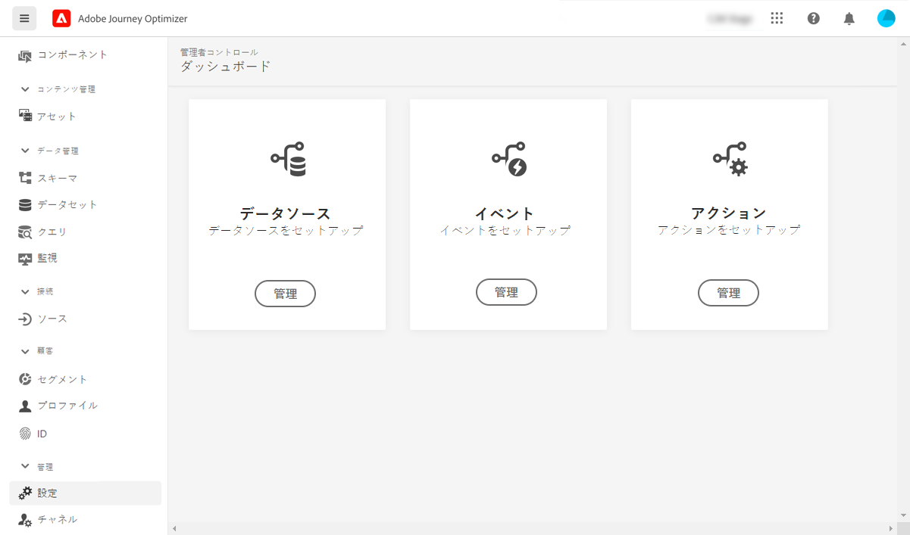

# データエンジニア向けの入門 {#data-engineer}

**Adobe 旅オプティマイザーのデータエンジニア** として、によって [!DNL Journey Optimizer] 調整されたエクスペリエンスの消費電力を求めるカスタマープロファイルデータを準備して管理し、スキーマでの顧客データとビジネスデータをモデル化し、ingesting データのソースコネクターを設定します。ユーザーは、システム管理者 ](administrator.md) によってユーザーのアクセスと準備が完了 [ して [!DNL Adobe Journey Optimizer] から、作業を開始することができます。

データを識別し、スキーマとデータセット **を作成して、このページの Adobe エクスペリエンスプラットフォームにデータを取り込む方法** について説明します。

>[!NOTE]
>
>Adobe エクスペリエンスプラットフォームマニュアル ](https://experienceleague.adobe.com/docs/experience-platform/ingestion/home.html) のデータ取り込み **について詳しくは、 [ {target = &quot;_blank&quot;} を参照して** ください。

Id 名前空間とプロファイルに対して有効なデータセットを作成する手順は、次のセクションで詳しく説明しています。

1. **Id 名前空間** を作成します。 Adobe [!DNL Journey Optimizer] **では、デバイスとチャネルの間でアイデンティティ** をリンクするコンシューマーにおいて、その結果は id グラフになります。 リンクされたアイデンティティーグラフは、すべてのビジネス touchpoints でのインタラクションに基づいてエクスペリエンスをカスタマイズするために使用されます。  このページ ](../../segment/get-started-identity.md) で id および identity 名前空間 [ について詳しく説明します。

1. **スキーマ** を作成し、プロファイルに対して有効にします。 スキーマは、データの構造とフォーマットを表し、検証する一連のルールです。 スキーマには、実際に使用されるオブジェクト (person など) の抽象的な定義が含まれており、そのオブジェクトの各インスタンスにどのデータを含める必要があるか (姓、姓、誕生日など) がアウトラインされます。  スキーマ [ について詳しくは、このページ ](../../data/get-started-schemas.md) を参照してください。

1. **データセット** を作成し、プロファイルに対して有効にします。 データセットは、データのコレクション (通常はテーブルで、スキーマ (列) とフィールド (行) が含まれるテーブル) の格納と管理の構成要素です。 データセットには、格納されるデータの様々な側面を記述するメタデータも含まれています。 データセットを作成した後は、それを既存のスキーマにマップし、データを追加することができます。 データセット [ について詳しくは、このページ ](../../data/get-started-datasets.md) を参照してください。

1. **ソースコネクタ** を設定します。 Adobe の Optimzer を使用すると、プラットフォームサービスを使用してデータを構造化、ラベル付けして、その機能を向上させることができるので、外部ソースからデータを ingested することができます。 Adobe アプリケーションやクラウドベースの記憶域、データベースなど、様々なソースからデータを取り込むことができます。 ソースコネクタ [ について詳しくは、このページ ](../get-started-sources.md) を参照してください。

1. **テストプロファイル** を作成します。 「テスト」モード ](../../building-journeys/testing-the-journey.md) を使用して [ 、送信前にメッセージ ](../../email/preview.md) をプレビューしてテストする [ 場合は、テストプロファイルが必要になります。テストプロファイルを作成する手順について詳しく [ は、このページ ](../../segment/creating-test-profiles.md) を確認してください。

さらに、journeys でメッセージを送信するには、と **[!UICONTROL Actions]** を **[!UICONTROL Events]** 設定 **[!UICONTROL Data Sources]** する必要があります。詳しく [ は、ここを ](../../configuration/about-data-sources-events-actions.md) 参照してください。

* **データソース** 設定を使用すると、journeys で使用される追加情報を取得するための、システムへの接続を定義することができます。データソース [ について詳しくは、ここ ](../../datasource/about-data-sources.md) を参照してください。

* **イベント** を使用すると、journeys unitarily を利用して、その過程に流れている個々のメッセージをリアルタイムに送信することができます。 イベントの設定では、journeys に必要なイベントを設定します。 受信イベントデータは、Adobe エクスペリエンスデータモデル (XDM) の後に標準化されています。 イベントは、認証および認証されていないイベント (Adobe Mobile SDK イベントなど) 用のストリーミング取り込み Api によって発生します。 イベント [ について詳しくは、ここを ](../../event/about-events.md) 参照してください。

* [!DNL Journey Optimizer] には、メッセージ機能が組み込まれています。ここでは、旅にメッセージを作成してコンテンツをデザインすることができます。 Adobe キャンペーンなど、サードパーティのシステムを使用してメッセージを送信する場合は、カスタムアクション **を** 作成します。このセクション ](../../action/action.md) の操作 [ について詳しくは、こちらを参照してください。
