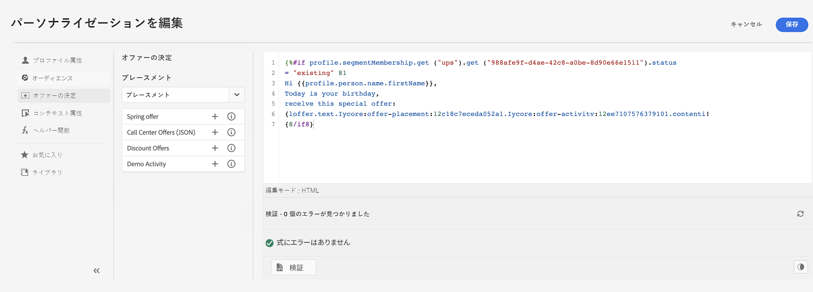
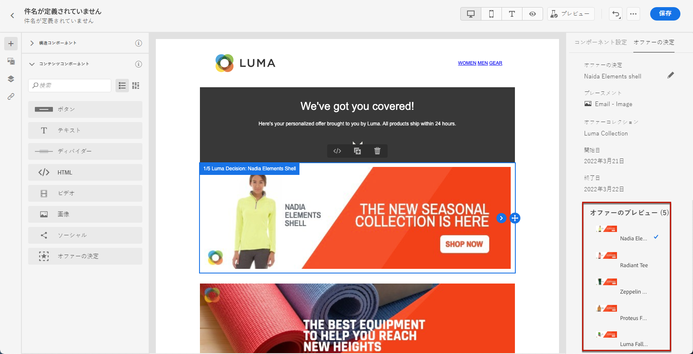
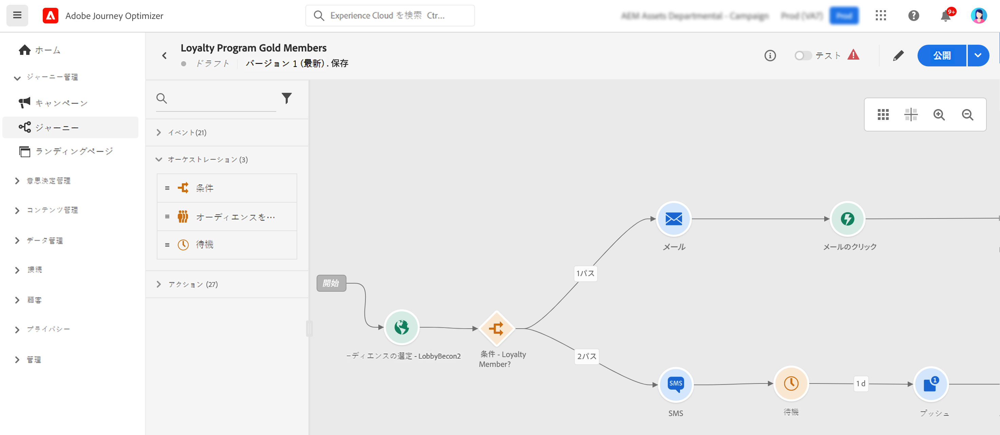

# マーケター向けの基礎知識 {#get-started-marketers}

**マーケター**&#x200B;つまり&#x200B;**ジャーニー実務担当者**&#x200B;は、オファーおよびジャーニーの作成とコンテンツのデザインを担当します。[システム管理者](administrator.md)と[データエンジニア](data-engineer.md)からアクセス権を付与され、環境の準備ができたら、[!DNL Adobe Journey Optimizer] での作業を開始できます。

初めてのジャーニーをセットアップし、オファーとアセットを追加して、メッセージを送信するには、以下の節を参照してください。

1. **オーディエンスを作成**&#x200B;します。Journey Optimizer では、**オーディエンス**&#x200B;メニューから直接セグメント定義を通じてオーディエンスを作成し、ジャーニーに活用することができます。オーディエンスについて詳しくは [ このページを参照 ](../../audience/about-audiences.md)。 セグメント定義を作成する方法については、[このサンプル ](../../audience/creating-a-segment-definition.md)を参照してください。

1. **パーソナライズ機能と動的コンテンツを追加します**。Journey Optimizer のパーソナライズ機能と動的コンテンツ機能を活用して、メッセージをオーディエンスに合わせます。[パーソナライズ機能](../../personalization/personalize.md)と[動的コンテンツ](../../personalization/get-started-dynamic-content.md)の詳細をご覧ください。

   

1. **アセットを作成し管理**&#x200B;します。[!DNL Adobe Experience Manager Assets] は、メッセージへの入力に使用できるアセットの一元的な集中リポジトリを提供します。詳しくは、[この節](../../integrations/assets.md)を参照してください。

1. **オファーを追加**&#x200B;します。[!DNL Journey Optimizer] を使用すると、顧客に最適なオファーとエクスペリエンスをすべてのタッチポイントにわたって適切なタイミングで提供できます。設計を終えたら、パーソナライズされたオファーを使用してオーディエンスをターゲットに設定します。意思決定管理について詳しくは、[この節](../../offers/get-started/starting-offer-decisioning.md)を参照してください。

   

1. **テストして検証します**。コンテンツを定義したら、CSV／JSON ファイルからアップロードした、または手動で追加したテストプロファイルやサンプル入力データを使用して、そのコンテンツをプレビューできます。

   [パーソナライズされたコンテンツ](../../personalization/personalize.md)を挿入した場合は、そのコンテンツがメッセージ内でどのように表示されるかを確認できます。さらに、[!DNL Journey Optimizer] で **Litmus** アカウントを利用すると、一般的なメールクライアントでの&#x200B;**メールのレンダリング結果**&#x200B;を即座にプレビューすることができ、すべてのインボックスでメールコンテンツが適切に表示され、正しく機能することを確認できます。メッセージのテストと検証の方法については、[この節](../../content-management/preview-test.md)を参照してください。

1. **カスタマージャーニーを設計**&#x200B;して、状況に即したパーソナライズされたエクスペリエンスを提供します。[!DNL Journey Optimizer] を使用すると、イベントやデータソースに保存されたコンテキストデータを使用して、リアルタイムオーケストレーションの使用例を作成できます。次の機能を活用して、複数のステップから成る高度なシナリオを設計できます。

   * イベントの受信をトリガーにしてリアルタイムに&#x200B;**単一配信**&#x200B;を送信したり、Adobe Experience Platform のオーディエンスを使用してメッセージを&#x200B;**一括で**&#x200B;送信したりできます。

   * イベント、Adobe Experience Platform の情報、サードパーティの API サービスのデータなどの&#x200B;**コンテキストデータ**&#x200B;を活用できます。

   * **組み込みのチャネルアクション**（メール、SMS、プッシュ、アプリ内）を使用して [!DNL Journey Optimizer] でデザインしたメッセージを送信したり、サードパーティのシステムを使用している場合は&#x200B;**カスタムアクション**&#x200B;を作成してメッセージを送信したりできます。

   * **ジャーニーデザイナー**&#x200B;を使用すると、エントリイベントや「オーディエンスを読み取り」アクティビティを簡単にドラッグ＆ドロップして、条件を追加し、パーソナライズされたメッセージを送信するなど、複数のステップから成るユースケースを作成できます。

   

   ジャーニーを設計して実行する方法については、[この節](../../building-journeys/journey-gs.md)を参照してください。

1. **メッセージとジャーニーを監視**&#x200B;します。メッセージが正常に実行、送信および配信されていることを確認するため、[!DNL Journey Optimizer] では、現在公開およびトリガーされているメッセージを監視する機能を提供しています。パフォーマンス監視の方法については、[この節](../../reports/report-gs-cja.md)を参照してください。
