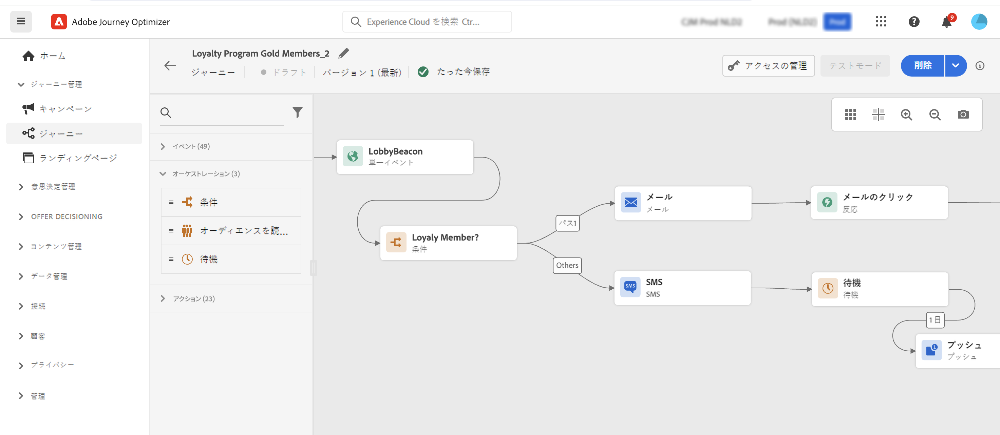

# 基本を学ぶ（マーケター向け） {#get-started-marketers}

**マーケター**&#x200B;または&#x200B;**ジャーニー実務担当者**&#x200B;は、オファーおよびジャーニーの作成とコンテンツのデザインを担当します。[システム管理者](administrator.md)と[データエンジニア](data-engineer.md)からアクセス権を付与され、環境の準備ができたら、[!DNL Adobe Journey Optimizer] での作業を開始できます。

## 基本事項の基本を学ぶ

Journey Optimizerを使用すると、メール、SMS、プッシュ、アプリ内、web、コンテンツカードなど、パーソナライズされた接続されたカスタマーエクスペリエンスを作成できます。 [ 管理者 ](administrator.md) と連携してアクセス権を取得し、[ データエンジニア ](data-engineer.md) と連携してオーディエンスとデータを設定します。

エクスペリエンスの作成を開始するには、次のコア手順に従います。

1. **オーディエンスを作成**&#x200B;します。セグメント定義を通じたオーディエンスの構築、CSV ファイルのアップロード、オーディエンス構成の使用のいずれかを行います。 Journey Optimizerには、適切な顧客をターゲットにする方法が複数あります。 [ オーディエンス ](../../audience/about-audiences.md) および [ セグメント定義の作成 ](../../audience/creating-a-segment-definition.md) について説明します。

1. **コンテンツをデザイン**。 チャネルをまたいで魅力的なメッセージを作成します。
   * **AI アシスタント** を使用して、ブランドガイドラインに基づいてメールコンテンツ、件名、画像を生成します。 [AI コンテンツ生成について ](../../content-management/gs-generative.md)
   * 顧客データ、動的コンテンツおよび条件付きロジックを使用した **メッセージのパーソナライズ**。 [パーソナライゼーションの詳細情報](../../personalization/personalize.md)
   * **コンテキストデータの反復** により、イベント、カスタムアクション、データセット検索からの動的リストを表示します。 [ コンテキストデータの繰り返しについて学ぶ ](../../personalization/iterate-contextual-data.md)
   * ブランドの一貫性を維持するために、再利用可能な **コンテンツテンプレート** および **フラグメント** を作成します。 [ テンプレートの操作 ](../../content-management/content-templates.md)
   * **Adobe Experience Manager Assets** 統合によるアセットの管理。 [ アセットについて ](../../integrations/assets.md)

   

1. **オファーと決定を追加**。 AI を活用した意思決定を使用して、適切なタイミングで各顧客に最高のオファーを提供します。 [ 意思決定管理 ](../../offers/get-started/starting-offer-decisioning.md) および [ エクスペリエンス決定 ](../../experience-decisioning/gs-experience-decisioning.md) について説明します。

   

1. **テストして検証します**。送信前のコンテンツのプレビューとテスト：
   * **テストプロファイル** を使用して、パーソナライゼーションをプレビューし、デバイス間でのレンダリングを確認します
   * CSV/JSON ファイルからの **サンプルデータ** を使用したテスト
   * 一般的なメールクライアントでのプレビュー **メールのレンダリング**
   * キャンペーンおよびジャーニー用に **承認ワークフロー** を設定（追加のライセンスが必要）

   メッセージのテストと検証 [ を行う方法を説明 ](../../content-management/preview-test.md) ます。

1. **カスタマージャーニーを作成** します。 ジャーニーキャンバスを使用して、パーソナライズされたリアルタイムのエクスペリエンスを作成します。

   * **イベント** （トリガーアクション）または **オーディエンス** （バッチ送信）を使用したカスタマージャーニー
   * **条件** を追加し、顧客データに基づいてパーソナライズされたパスを作成します
   * **待機アクティビティ** を使用すると、メッセージとメッセージの最適なタイミングを作成できます
   * 1 つのジャーニー内で **複数のチャネル** をまたいでメッセージを送信する
   * **A/B テスト** を適用してジャーニーの有効性を最適化する
   * **データセットルックアップ** を使用して、Adobe Experience Platformのリアルタイムデータでジャーニーを強化します。 [ データセット参照について ](../../building-journeys/dataset-lookup.md)
   * **追加の識別子** を活用して、同じプロファイルが複数のジャーニーインスタンス（異なる注文や予約など）にエントリできるようにします。 [ 追加の識別子について学ぶ ](../../building-journeys/supplemental-identifier.md)

   

   ジャーニーを設計して実行する方法 [ ジャーニーのユースケース ](../../building-journeys/journey-gs.md) と [ ジャーニーのユースケース ](../../building-journeys/jo-use-cases.md) について説明します。 [ 入口/終了条件 ](../../building-journeys/entry-exit-criteria-guide.md) を理解して、プロファイルフローを制御します。

1. **監視と最適化**。 パフォーマンスの追跡と結果の経時的な改善：
   * **ライブジャーニー** のパフォーマンスを監視し、ボトルネックを特定
   * **メッセージ配信** 率とエンゲージメント指標の分析
   * Customer Journey Analytics統合での **レポートダッシュボード** の使用
   * **コンバージョン** およびビジネスへの影響の追跡

   [ パフォーマンスの監視 ](../../reports/report-gs-cja.md) 方法を説明します。

## 最新機能の活用

Journey Optimizerは、マーケティング効果を高める新機能で進化し続けています。

* **コンテンツカード**：ユーザーが都合のよいときに関与できる、モバイルアプリや web サイト内の永続的で非侵入的なメッセージを配信します。 プッシュ通知とは異なり、コンテンツカードは閉じられるまで表示されたままになります。 [ コンテンツカードについて学ぶ ](../../content-card/get-started-content-card.md)

* **競合管理と優先順位付け**：メッセージの頻度を制御し、高度なキャッピングルールで過剰通信を防ぎます。 優先度スコアを設定して、最も重要なメッセージが最初に顧客に届くようにします。 [ 競合管理について説明します ](../../conflict-prioritization/gs-conflict-prioritization.md)

* **AI を活用した送信時間最適化**：過去のエンゲージメントパターンに基づいて各顧客の最適な送信時間を AI が予測し、開封率とクリック率を最大 10% 向上させます。 [ 送信時間の最適化について学ぶ ](../../building-journeys/send-time-optimization.md)

* **マルチアームバンディット実験**：テスト中に、より多くのトラフィックをリアルタイムで勝者のバリエーションに自動的に割り当て、テストが完了するまで待たずに結果を最大化します。 [ 実験について学ぶ ](../../content-management/content-experiment.md)

* **承認ワークフロー**：キャンペーンとジャーニーのレビュープロセスを、運用開始前に実装します（追加ライセンスで利用可能）。 [ 承認について ](../../test-approve/gs-approval.md)

## 成功のベストプラクティス

### コンテンツの作成

* **テンプレートから開始**：事前定義済みのテンプレートとコンテンツフラグメントを使用して、作成を高速化し、一貫性を維持します
* **早期にテスト、頻繁にテスト**：常に複数のデバイスにわたってコンテンツをプレビューし、テストプロファイルを使用してパーソナライゼーションを検証します
* **AI を賢く活用**：最初のドラフトとバリエーションには AI アシスタントを使用しますが、ブランドの声には常にレビューと調整を行います
* **シンプルに**：強力なコールトゥアクション（CTA）機能を備えた明確で簡潔なメッセージは、複雑なレイアウトよりもパフォーマンスが高くなります

### ジャーニー設計

* **明確な目標の定義**：ジャーニーを構築する前に成功指標を確立する
* **カスタマーエクスペリエンスのマッピング**：実装前にジャーニー全体を視覚化します
* **待機アクティビティを戦略的に使用**：フォローアップを送信する前に、顧客が関与する時間を与えます
* **終了戦略の計画**：顧客がジャーニーを終了するタイミングと理由を定義する
* **ドラフトモードでテスト**：アクティブ化する前に、ドライランでジャーニーロジックを検証します

[ジャーニーのベストプラクティスを学ぶ](../../building-journeys/entry-exit-criteria-guide.md#best-practices)

### オーディエンスのターゲティング

* **セグメントは慎重に**：明確な条件に基づいて、アクションにつながる特定のオーディエンスセグメントを作成します
* **定期的に更新**：適切な評価スケジュールを設定して、オーディエンスを最新の状態に保ちます
* **サイズと精度のバランス**：統計的有意性には十分な大きさがあるが、関連性には十分に特異的なオーディエンスをターゲットにします
* **エンリッチメント属性の使用**：計算済み属性とエンリッチメントデータを活用して、より深いパーソナライゼーションを行います

### 頻度管理

* **顧客の環境設定を尊重**：オプトアウトおよびコミュニケーションの環境設定に従う
* **フリークエンシーキャップの設定**：ルールセットを使用して、チャネル全体にわたるメッセージの疲労を防ぎます
* **キャンペーンの調整**：競合管理を使用して、顧客が適切なメッセージを適切なタイミングで受け取れるようにします
* **エンゲージメントの監視**：疲労の兆候に注意する（開封率の低下、登録解除の増加）

[フリークエンシーキャップについて学ぶ](../../conflict-prioritization/channel-capping.md)

## ユースケースの調査

Journey Optimizerの機能を示す実践的な例から学びます。

**一般的なユースケース：**

* **ウェルカムシリーズ**：パーソナライズされた複数の手順を持つジャーニーで新規顧客をオンボーディングします。 [ ユースケースを表示 ](https://experienceleague.adobe.com/ja/docs/journey-optimizer-learn/tutorials/use-cases/customer-onboarding)
* **放棄された買い物かごの回復**：買い物かごにアイテムを残した顧客を再び引き付けます。 [ ユースケースを表示 ](https://experienceleague.adobe.com/ja/docs/journey-optimizer-learn/tutorials/use-cases/abandoned-cart)
* **再エンゲージメントキャンペーン**：ターゲットオファーを使用して、非アクティブな顧客を取り戻します。 [ ユースケースを表示 ](https://experienceleague.adobe.com/ja/docs/experience-platform/rtcdp/use-cases/personalization-insights-engagement/use-cases-luma)
* **誕生日キャンペーン**：特別オファーを含むパーソナライズされた誕生日メッセージの送信
* **製品レコメンデーション**：閲覧および購入履歴に基づいて関連する製品を提案します
* **イベント駆動型メッセージ**：顧客のアクションにリアルタイムで対応

**ジャーニーパターン：**

* [ サブスクライバーへのメッセージの送信 ](../../building-journeys/message-to-subscribers-uc.md)：パーソナライズされたコンテンツを含むターゲット購読リスト
* [ マルチチャネルメッセージ ](../../building-journeys/journeys-uc.md)：メールとプッシュを反応イベントと組み合わせます
* [ 平日のみのメール ](../../building-journeys/weekday-email-uc.md)：時間に基づく条件を使用して通信をスケジュールします

その他のパターンと実装については、完全な [ ジャーニーユースケースライブラリ ](../../building-journeys/jo-use-cases.md) を参照してください。

## 他の役割との共同作業

マーケティング作業は他のチームとつながっています。

* **[ データエンジニアとの連携](data-engineer.md)**：新しい計算属性のリクエスト、オーディエンスの品質に関するフィードバックの提供、データ要件の調整
* **[ デベロッパーとの連携](developer.md)**：イベントトリガーに合わせて、モバイル実装をテストし、トラッキングを検証します
* **[ 管理者との連携](administrator.md)**：チャネル設定をリクエストし、権限に関する問題を報告し、新機能のイネーブルメントについて調整します

## 最新情報を入手

最新のJourney Optimizerの機能とマーケティング機能を常に把握します。

* **[リリースノート](../../rn/release-notes.md)**：毎月リリースされる新機能、チャネル更新、機能強化を確認します
* **[ドキュメントの更新](../../rn/documentation-updates.md)**：新しいユースケース、ベストプラクティス、機能ドキュメントなど、最近の変更を追跡します
* **製品通知**:[Adobe Experience Cloud プロファイル ](https://experience.adobe.com/preferences){target="_blank"} で通知を有効にすると、次の内容に関するアラートを受け取ることができます。
   * 利用可能な新しいチャネルと機能
   * 今後の機能のローンチとベータ版プログラム
   * ベストプラクティスとトレーニングの機会
   * キャンペーンに影響する重要なお知らせ

  通知を有効にするには、Adobe Experience Cloudの右上にあるプロファイルアイコンをクリックして、**環境設定/通知** に移動し、Journey Optimizer通知の環境設定を指定します。

## 次の手順

1. **小規模から開始**：シンプルなウェルカムジャーニーまたは単一メッセージキャンペーンを作成して、プラットフォームを学習します
2. **AI の活用**:AI アシスタントを使用して質問を行い、コンテンツ作成を高速化します
3. **コミュニティに参加**:[Journey Optimizer コミュニティで他のExperience League ユーザーとつながる ](https://experienceleaguecommunities.adobe.com/t5/journey-optimizer/ct-p/journey-optimizer){target="_blank"}
4. **チュートリアルを見る**: [Experience Leagueのステップバイステップのビデオをご覧ください ](https://experienceleague.adobe.com/docs/journey-optimizer-learn/tutorials/overview.html?lang=ja){target="_blank"}
