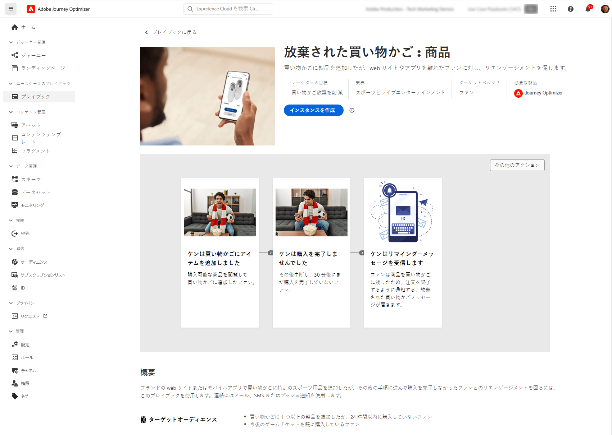
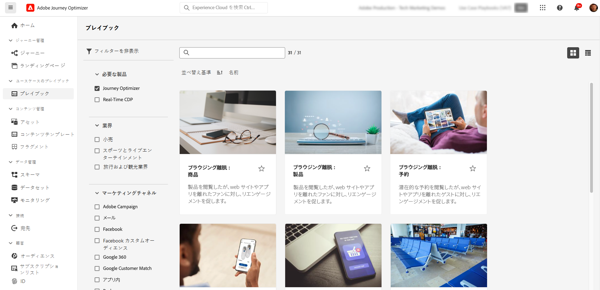

# ユースケースプレイブック {#playbooks}

## ユースケースプレイブックとは {#gs}

ユースケースプレイブックは、Adobe Experience Platform と Journey Optimizer を使用して実行できる一般的なユースケースに対処する事前定義済みのワークフローです。

{width="85%"}

各プレイブックは、意図、目標、ターゲットペルソナ、実装に必要なリソースなどの包括的な概要を示します。また、各プレイブックでは、プレイブックに関連付けられた実際の顧客タッチポイントを視覚的に表すマインドマップが利用可能です。

{width="85%"}

## 前提条件 {#prerequisites}

ユースケースプレイブックを使用する前に、次の設定手順が必要です。各手順について詳しくは、ユースケースプレイブックドキュメントの[基本を学ぶ](https://experienceleague.adobe.com/docs/experience-platform/use-case-playbooks/playbooks/get-started.html?lang=ja){target="_blank"}ページを参照してください。

* サンドボックスの作成
* ユーザー権限の設定
* メール、プッシュおよび SMS 通知用の Journey Optimizer チャネル設定の指定

## プレイブックへのアクセスと有効化 {#access}

プレイブックにアクセスするには、左側のナビゲーションパネルにある&#x200B;**[!UICONTROL プレイブック]**&#x200B;メニューに移動します。ライブラリには、Adobe Journey Optimizer を使用して実装されたいくつかのプレイブックが含まれます。簡単にアクセスするには、検索バーの横にあるフィルターを使用します。Journey Optimizer プレイブックの包括的なリストは、[ユースケースプレイブックドキュメント](https://experienceleague.adobe.com/docs/experience-platform/use-case-playbooks/playbooks/playbooks-list.html?lang=ja){target="_blank"}で参照できます。

{width="85%"}

ニーズに最適なプレイブックを選択したら、有効にすることができます。これにより、プレイブックのインスタンスが作成され、特定のユースケースをサポートするために必要なリソースが自動的に生成されます。リソースには、ジャーニー、メッセージなどの Journey Optimizer アセットと、スキーマやセグメントなどの Adobe Experience Platform アセットが含まれます。

>[!NOTE]
>
>これらのオブジェクトの目的は、特定のユースケースを実装するために必要なすべてのリソースを理解できるようサポートすることです。これらはデータを含まず、開発用サンドボックス上に作成されます。

ユースケースを実装するには、各オブジェクトに移動し、ニーズに合わせて適応させることができます。また、プレイブックインスタンスページの URL をチーム間で共有して、ユースケースの実装に関する共同作業を行うこともできます。

さらに、プレイブックアセットを他のサンドボックスに読み込むこともできます。これにより、独自のスキーマ、フィールドおよびフィールドグループを既に設定している場合、生成されたアセットを既存のアセットに合わせ、データとの互換性を確保できます。これらの手順について詳しくは、ユースケースプレイブックドキュメントの[プレイブックで生成されたアセットの他のサンドボックスへの公開](https://experienceleague.adobe.com/docs/experience-platform/use-case-playbooks/playbooks/data-awareness.html?lang=ja){target="_blank"}を参照してください。

## 独自のプレイブックの作成（Private Beta） {#create}

>[!AVAILABILITY]
>
>ユースケースプレイブックの作成は、現在、一連の組織に対してのみ Private Beta として使用できます。アクセスするには、アドビ担当者にお問い合わせください。

事前定義済みのプレイブックの活用に加えて、Adobe Experience Platform 内で独自のプレイブックを作成および共有できます。

AI アシスタントまたは手動入力を使用してメタデータを定義し、スキーマやセグメントなどの技術アセットを関連付け、様々な IMS 組織をまたいでプレイブックを共有できます。

プレイブックの作成および共有方法について詳しくは、ユースケースプレイブックドキュメントの [AI アシスタントを使用した独自のプレイブックの作成および共有](https://experienceleague.adobe.com/docs/experience-platform/use-case-playbooks/playbooks/author.html?lang=ja#sharing-playbooks-sandboxes){target="_blank"}を参照してください。
