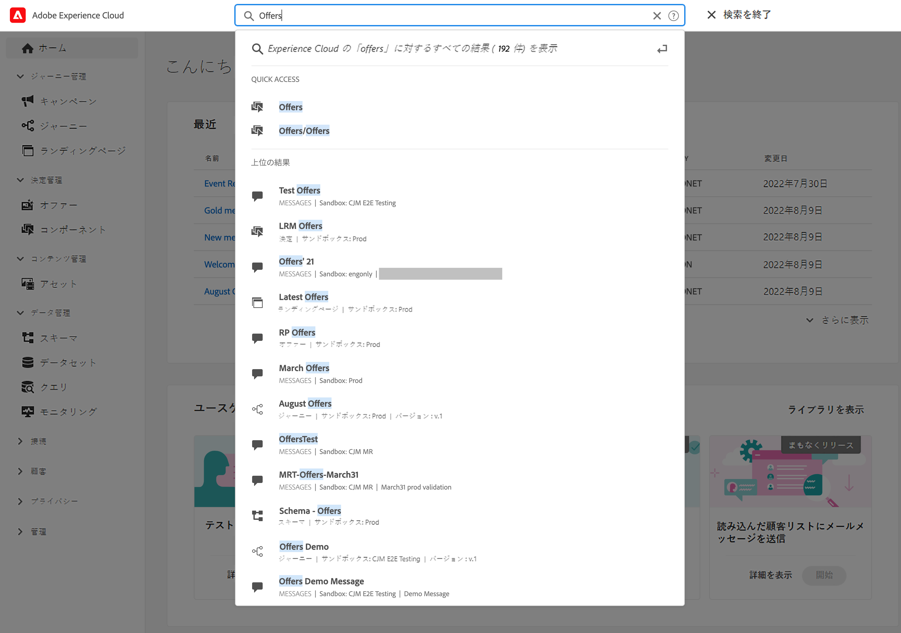
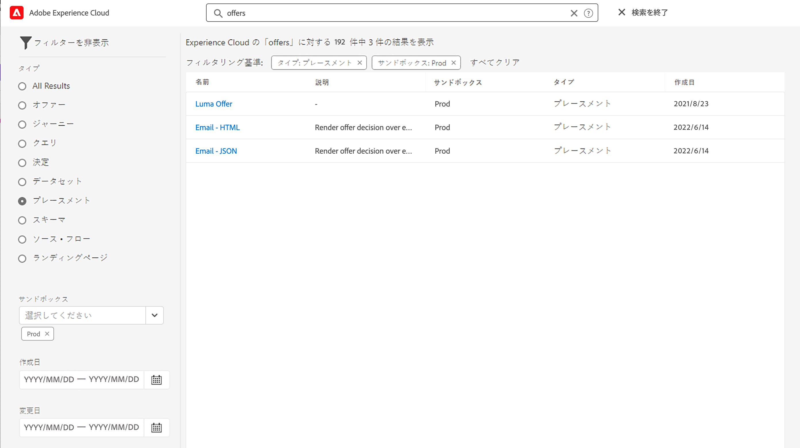
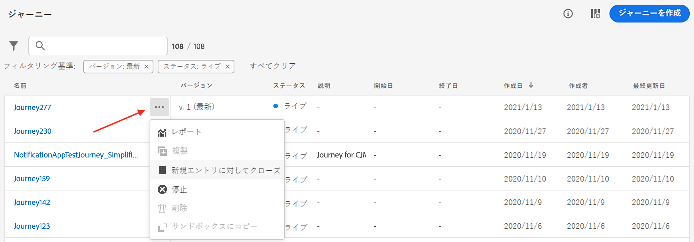
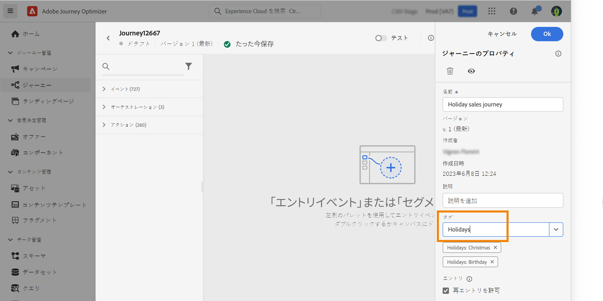
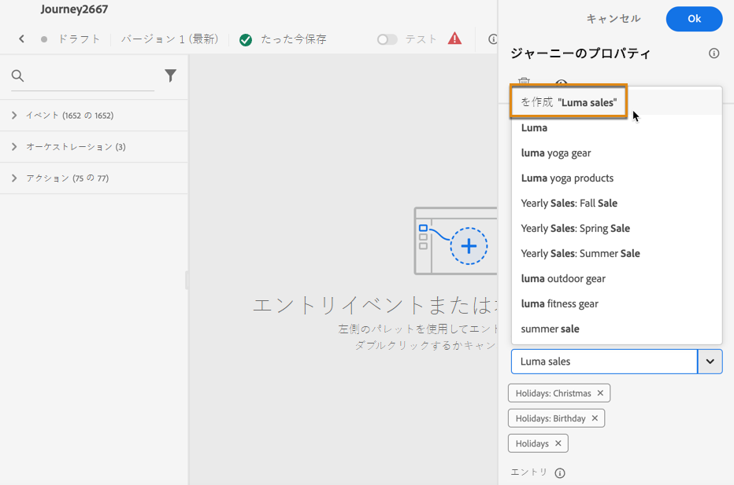
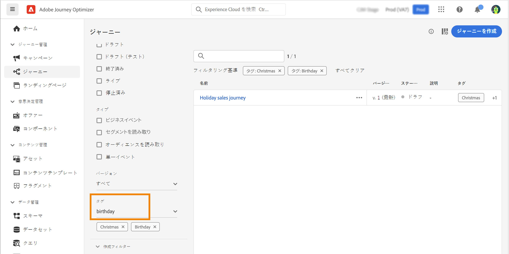
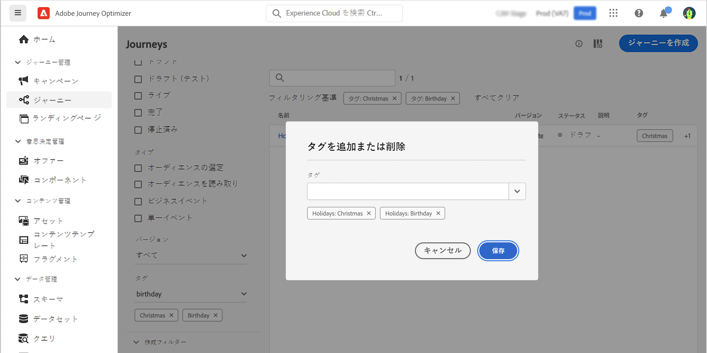

# 検索、フィルター、整理 {#search-filter-organize}

Adobe Journey Optimizer プロジェクトが拡大するにつれて、効率的な作業にはコンテンツの検索と整理が不可欠になります。 このページでは、ユニバーサル検索を使用してジャーニー、キャンペーン、アセットをすばやく見つける方法、リストをフィルタリングして特定の項目に焦点を当てる方法、タグとカテゴリを使用して作業を整理する方法について説明します。 これらのツールは、大量のコンテンツを移動し、チームをまたいで一貫性を維持し、毎日のワークフローを効率化するのに役立ちます。

## 検索 {#unified-search}

Adobe Journey Optimizer インターフェイスから、上部バーの中央にある Adobe Experience Cloud 統合検索機能を使用して、サンドボックスをまたいでアセット、ジャーニー、データセットなどを検索できます。

コンテンツの入力を開始すると、上位の結果が表示されます。 入力したキーワードに関するヘルプ記事も結果に表示されます。

**Enter** キーを押すと、すべての結果にアクセスでき、ビジネスオブジェクトでフィルタリングできます。

## フィルターリスト {#filter-lists}

ほとんどのリストでは、検索バーを使用して特定の項目を検索し、フィルター条件を定義します。 列ヘッダーをクリックして、任意のリストを並べ替えることもできます。 キャンペーンフォルダービューでは、**[!UICONTROL 優先度]**&#x200B;および&#x200B;**[!UICONTROL チャネル設定]**&#x200B;による並べ替えもサポートされています。

フィルターにアクセスするには、リストの左上にあるフィルターアイコンをクリックします。 フィルターメニューを使用すると、様々な条件に従って表示される要素をフィルタリングできます。特定のタイプまたはステータスの要素、自分で作成した要素、過去 30 日間に変更された要素のみを表示するように選択できます。 オプションはコンテキストによって異なります。

さらに、統合タグを使用して、オブジェクトに割り当てられたタグに応じてリストをフィルタリングできます。 現時点では、ジャーニーとキャンペーンにタグを使用できます。 [タグの操作方法については、こちらを参照してください](#tags)

>[!NOTE]
>
>表示される列は、リストの右上にある設定ボタンを使用してパーソナライズできます。 パーソナライズ設定は、各ユーザーに対して個別に保存されます。

リストで、各要素に対して基本的な操作を実行できます。 例えば、項目の複製や削除が可能です。

## 一括アクション {#bulk-actions}

**キャンペーン**、**フラグメント**、**テンプレート**&#x200B;のリストでは、チェックボックスを使用して一度に複数の項目を選択し、画面の下部に表示される一括アクションバーからすべての項目に操作を適用できます。

次の操作を使用できます。

* **[!UICONTROL パッケージに追加]** – 選択したアイテムを別のサンドボックスにエクスポートします。 [オブジェクトのエクスポート方法の詳細情報 →](../configuration/copy-objects-to-sandbox.md)
* **[!UICONTROL フォルダーに移動]** – 選択したアイテムをフォルダーに移動します。
* **[!UICONTROL タグを編集]** – 選択した項目に割り当てられたタグを編集します。 [タグの使用方法の詳細情報 →](#add-tags)
* **[!UICONTROL アクセスの管理]** – 選択した項目にアクセスラベルを適用します。 [ オブジェクトレベルのアクセス制御の詳細→](../administration/object-based-access.md)
* **[!UICONTROL アーカイブ]** – 選択したアイテムをアーカイブします。 フラグメントとテンプレートで使用できます。
* **[!UICONTROL 削除]** – 選択した項目を完全に削除します。 キャンペーンでのみ使用できます。

## 統合タグの操作 {#tags}

>[!CONTEXTUALHELP]
>id="ajo_campaigns_tags"
>title="タグ"
>abstract="このフィールドを使用すると、Adobe Experience Platform 統合タグをキャンペーンに割り当てることができます。 これにより、キャンペーンを簡単に分類し、キャンペーンリストからの検索を改善できます。"

Adobe Experience Platform [統合タグ](https://experienceleague.adobe.com/docs/experience-platform/administrative-tags/overview.html?lang=ja)を使用すると、Journey Optimizer のオブジェクトを簡単に分類し、リストからの検索を改善できます。

Journey Optimizer でオーディエンスに意味のあるタグを追加すると、後でフィルタリングや検索を行って、オーディエンスをより簡単に見つけることができます。 さらに、タグを使用すると、関連性のある検索可能なフォルダーでオーディエンスを整理したり、パーソナライズされたオファーやエクスペリエンスを作成したり、エクスペリエンス決定ルールで使用したりすることもできます。

### オブジェクトへのタグの追加 {#add-tags}

「**[!UICONTROL タグ]**」フィールドでは、オブジェクトのタグを定義できます。 タグは、次のオブジェクトで使用できます。

* [キャンペーン](../campaigns/create-campaign.md)
* [決定項目](../experience-decisioning/items.md)
* [フラグメント](../content-management/fragments.md)
* [ジャーニー](../building-journeys/journey-properties.md)
* [ランディングページ](../landing-pages/create-lp.md)
* [サブスクリプションリスト](../landing-pages/subscription-list.md)
* [テンプレート](../content-management/content-templates.md)
* [チャネル設定](../configuration/channel-surfaces.md#channel-config-tags)

既存のタグを選択することも、新しいタグを作成することもできます。 これを行うには、以下の手順に従います。

1. 目的のタグの名前を入力するか、リストからタグを選択します。

   

   >[!NOTE]
   >
   > タグでは大文字と小文字を区別しません。

1. 検索しているタグが使用できない場合は、「**[!UICONTROL 「[タグ名]」を作成]**」をクリックして新しいタグを定義します。新しいタグは現在のオブジェクトに自動的に追加され、他のすべてのオブジェクトで使用できるようになります。

   

1. 選択または作成したタグのリストが、「**[!UICONTROL タグ]**」フィールドの下に表示されます。 必要な数だけタグを定義できます。

>[!NOTE]
> 
> オブジェクトの新しいバージョンを複製または作成した場合、タグは保持されます。

### タグに関するフィルタリング {#filter-on-tags}

各オブジェクトリストには専用の列が表示されるので、タグを簡単に視覚化できます。

また、フィルターは、特定のタグを持つオブジェクトのみを表示する場合にも使用できます。

任意のタイプのジャーニーまたはキャンペーン（ライブ、ドラフトなど）のタグを追加または削除できます。 これを行うには、オブジェクトの横にある「**[!UICONTROL その他のアクション]**」アイコンをクリックし、「**[!UICONTROL タグを編集]**」を選択します。

### タグの管理 {#manage-tags}

管理者は、「**[!UICONTROL 管理]**」の下の&#x200B;**[!UICONTROL タグ]**&#x200B;メニューを使用して、タグを削除し、カテゴリ別に整理できます。 タグの管理について詳しくは、[統合タグのドキュメント](https://experienceleague.adobe.com/docs/experience-platform/administrative-tags/ui/managing-tags.html?lang=ja)を参照してください。

>[!NOTE]
>
> Journey Optimizer の「**[!UICONTROL タグ]**」フィールドから直接作成されたタグは、ビルトインの「未分類」カテゴリに自動的に追加されます。
