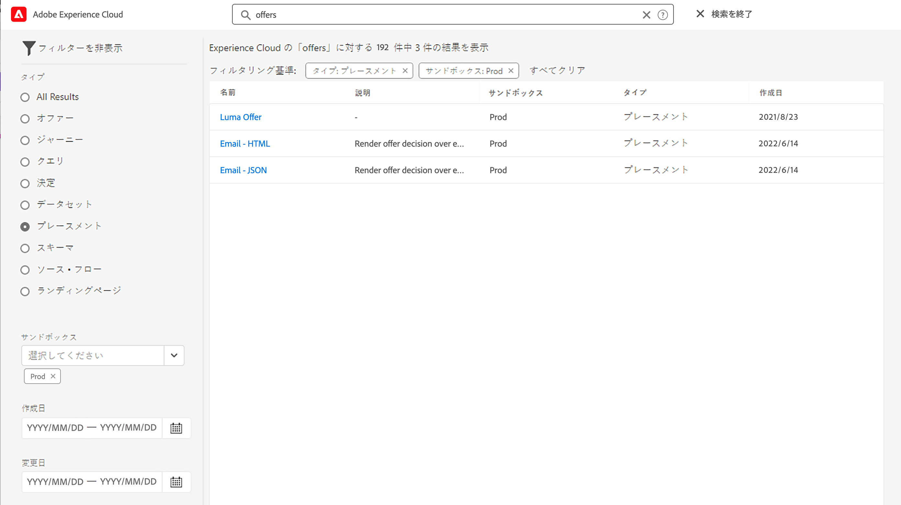

# 検索、フィルタリング、整理 {#search-filter-organize}

## 検索{#unified-search}

Adobe Journey Optimizer インターフェイスのどこからでも、上部バーの中央にある Adobe Experience Cloud 統合検索機能を使用して、サンドボックスをまたいでアセット、ジャーニー、データセットなどを検索できます。

コンテンツの入力を開始すると、上位の結果が表示されます。入力したキーワードに関するヘルプ記事も結果に表示されます。

**Enter** キーを押すと、すべての結果にアクセスでき、ビジネスオブジェクトでフィルタリングできます。

## フィルターリスト{#filter-lists}

ほとんどのリストでは、検索バーを使用して特定の項目を検索し、フィルター条件を定義します。

フィルターにアクセスするには、リストの左上にあるフィルターアイコンをクリックします。フィルターメニューを使用すると、様々な条件に従って表示される要素をフィルタリングできます。特定のタイプまたはステータスの要素、自分で作成した要素、過去 30 日間に変更された要素のみを表示するように選択できます。 オプションはコンテキストによって異なります。

また、統合タグを使用して、オブジェクトに割り当てられたタグに応じてリストをフィルタリングすることもできます。 現時点では、ジャーニーとキャンペーンでタグを使用できます。 [タグの使用方法を説明します。](#tags)

>[!NOTE]
>
>表示される列は、リストの右上にある設定ボタンを使用してパーソナライズできます。パーソナライズ設定は、各ユーザーに対して個別に保存されます。

リストで、各要素に対して基本的な操作を実行できます。例えば、項目の複製や削除が可能です。

## 統合タグの使用 {#tags}

Adobe Experience Platform [統合タグ](https://experienceleague.adobe.com/docs/experience-platform/administrative-tags/overview.html?lang=ja)を使用すると、Journey Optimizerのジャーニーやキャンペーンを簡単に分類して、リストからの検索を改善できます。

>[!AVAILABILITY]
>
>統合タグは現在ベータ版です。 ドキュメントと機能は変更される場合があります。

## オブジェクトにタグを追加する

この **タグ** フィールド、 [ジャーニー](../building-journeys/journey-gs.md#change-properties) または [campaign](../campaigns/create-campaign.md#create) プロパティを使用すると、オブジェクトのタグを定義できます。 既存のタグを選択することも、新しいタグを作成することもできます。

目的のタグ名の入力を開始し、リストから選択します。 使用できない場合は、 **作成** をクリックして新しいものを作成し、追加します。 必要な数だけタグを定義できます。

定義したタグのリストは、「**タグ**」フィールドの下に表示されます。

>[!NOTE]
>
> タグでは大文字と小文字が区別されます
> 
> ジャーニーまたはキャンペーンの新しいバージョンを複製または作成した場合、タグは保持されます。

## タグに対するフィルター

ジャーニーおよびキャンペーンリストには専用の列が表示されるので、タグを簡単に視覚化できます。

また、フィルターは、特定のタグを持つジャーニーまたはキャンペーンのみを表示する場合にも使用できます。

任意のタイプのジャーニーやキャンペーン（ライブ、ドラフトなど）にタグを追加したり、タグを削除したりできます。 これをおこなうには、 **その他のアクション** オブジェクトの横のアイコンをクリックし、「 」を選択します。 **タグを編集**.

## タグの管理

管理者は、「**管理**」の下の&#x200B;**タグ**&#x200B;メニューを使用して、タグを削除し、カテゴリ別に整理できます。タグ管理について詳しくは、 [統合タグドキュメント](https://experienceleague.adobe.com/docs/experience-platform/administrative-tags/ui/managing-tags.html).

>[!NOTE]
>
> タグを **[!UICONTROL タグ]** Journey Optimizerのフィールドは、組み込みの「未分類」カテゴリに自動的に追加されます。
