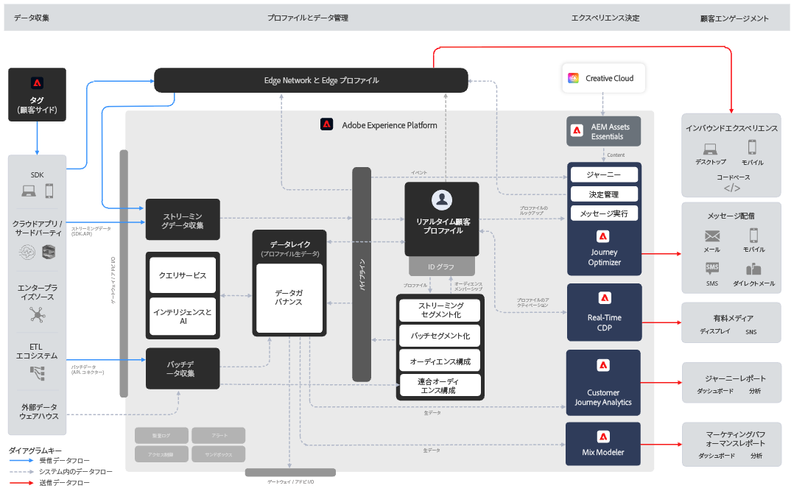
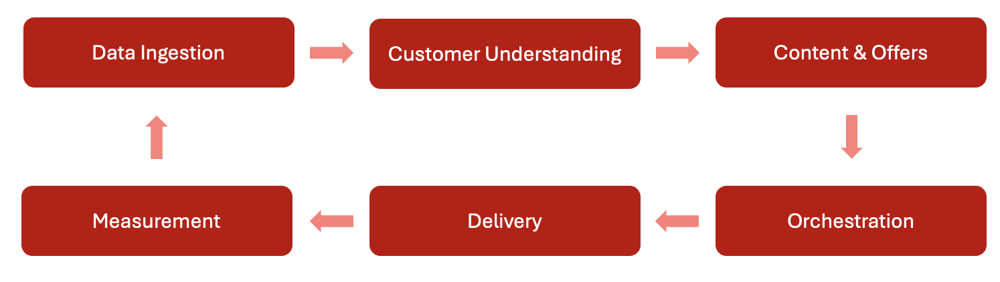

# Journey Optimizer について {#understanding-ajo}

>[!BEGINSHADEBOX]

**このページでは、** Adobe Journey OptimizerとAdobe Experience Platformの連携の仕組みを説明します。これにより、パーソナライズされたジャーニーの背後にある、データからエクスペリエンスへのサイクル、機能領域、アーキテクチャを理解できます。

>[!ENDSHADEBOX]

ここでは、Adobe Experience PlatformとJourney Optimizerの連携の仕組み、継続的なデータツーエクスペリエンスのサイクル、主な機能領域、アーキテクチャの詳細、統合ポイントについて説明します。

Adobe Journey Optimizer と Adobe Experience Platform は連携して、データ駆動型の大規模なパーソナライゼーションを実現します。 このページでは、これらのシステムが動作する仕組みと、主要な機能領域を組み合わせて優れたカスタマーエクスペリエンスを実現する仕組みについて説明します。 [主な機能の詳細情報](get-started.md) | [主な用語について](terminology.md)

## Journey Optimizerの仕組み {#how-it-works}

統合されたデータ基盤がなければ、ブランドは複数のチャネル固有のツールに依存せざるを得ません。そのため、各顧客の一貫性のあるビューを維持したり、リアルタイムでのそれぞれの行動に対応することが困難になります。 Journey Optimizerなら、Adobe Experience Platformを基盤として、顧客データ、コンテンツの制作、ジャーニーオーケストレーションをつなぎ合わせ、単一の継続的なシステムを構築できます。 その結果、顧客ロイヤルティと生涯価値を高める有意義なブランド体験を創出できます。

Adobe Journey Optimizer は、データを収集、分析および適用する継続的なフローとして機能し、パーソナライズされたカスタマージャーニーを作成します。

### Adobe Experience Platform:the foundation {#aep-foundation}

Adobe Experience Platform はバックボーンとして機能し、ブランドがお客様データを一元化し、パーソナライズされたエクスペリエンスのためにアクティブ化できるようにします。

* **データプラットフォーム** - お客様データを収集、管理、構造化し、システム間の一貫性を確保する一元的なハブ。 [スキーマとデータセットの詳細情報](../data/get-started-schemas.md)
* **データ取り込み（ソース）** - 事前定義済みのコネクタを使用して、CRM プラットフォーム、web サイト、モバイルアプリ、クラウドストレージからデータをインポートします。 [データソースについて](get-started-sources.md)
* **リアルタイム顧客プロファイル** - 複数のソース（メールのインタラクション、店舗での購入、web 動作）からのデータを結合して、統合プロファイルを作成します。 [プロファイルの詳細情報](../audience/get-started-profiles.md)
* **ガバナンスレイヤー** - 規制に準拠しながら、データアクセス、プライバシーコンプライアンスおよびセキュリティを管理します。 [プライバシードキュメントの表示](../privacy/get-started-privacy.md)

### Adobe Journey Optimizer：オーケストレーションエンジン {#ajo-orchestration}

Adobe Journey Optimizer は、Adobe Experience Platform からのデータとインサイトを適用し、インテリジェントでパーソナライズされたカスタマーエクスペリエンスを提供します。

* **お客様の理解** - リアルタイム顧客プロファイルにより、ターゲットメッセージ用にオーディエンスをセグメント化できます。 [オーディエンスの作成](../audience/about-audiences.md)
* **コンテンツとオファー** – 組み込みのビジュアルデザイナー、再利用可能なテンプレート、一元化されたアセットライブラリにより、プラットフォームを離れることなく、あらゆるチャネル向けにメッセージを作成およびパーソナライズできます。 動的パーソナライゼーションでは、顧客の属性、行動、コンテキストにもとづいてコンテンツを調整します。 その後、リアルタイムの意思決定ロジックによって、各個人に最適なオファーが選択されます。 [ デザインコンテンツ ](../../rp_landing_pages/content-management-landing-page.md) | [ アセットの管理](../integrations/assets.md) | [ オファーの管理](../offers/get-started/starting-offer-decisioning.md)
* **ジャーニーとキャンペーン管理** - インタラクションのシーケンス（ジャーニー）を自動化したり、1 回限りのターゲットメッセージ（キャンペーン）をスケジュールします。 [ジャーニーの作成](../building-journeys/journey-gs.md) | [キャンペーンの作成](../campaigns/get-started-with-campaigns.md)
* **配信（接続）** - メール、SMS、プッシュ通知、ダイレクトメールなどのチャネルを通じてメッセージを配信し、データを外部システムにエクスポートします。 [チャネルの設定](../configuration/get-started-configuration.md)
* **測定と分析** - 継続的な改善のためにレポートで顧客エンゲージメントとキャンペーンのパフォーマンスを追跡します。 [レポートの表示](../reports/campaign-global-report-cja.md)

### 継続的な最適化サイクル {#optimization-cycle}

このエコシステムは、継続的な最適化サイクルとして機能します。 データは、パーソナライズされたコンテンツと決定を提供する、お客様の理解を推進します。 これらはジャーニーに調整され、チャネルをまたいで配信され、有効性を測定し、時間の経過と共に調整されます。

## 主な活動分野 {#functional-areas}

Journey Optimizer には、シームレスに連携するいくつかの主要な機能領域が含まれています。

| 機能領域 | 目的 | 主なアクティビティ |
|-----------------|---------|----------------|
| **データ管理** | 顧客データの整理 | スキーマの定義、データセットの作成、様々なシステムからのデータのインポートを行います。 [詳細情報](../data/get-started-schemas.md) |
| **顧客管理** | お客様の理解 | 統合プロファイルの作成、ID の解決、オーディエンスの作成を行います。 [詳細情報](../audience/get-started-profiles.md) |
| **コンテンツ管理** | パーソナライズされたメッセージの作成 | メールのデザイン、アセットの管理、テンプレートとフラグメントの作成、コンテンツのパーソナライズを行います。 [詳細情報](../../rp_landing_pages/content-management-landing-page.md) |
| **意思決定管理** | リアルタイムでの最適なオファーの選択 | オファーライブラリの管理、ルールの定義、制約の適用、ランキングロジックの確立を行います。 [詳細情報](../offers/get-started/starting-offer-decisioning.md) |
| **ジャーニー管理** | 自動化されたカスタマーエクスペリエンスのデザイン | ビジュアルデザイナーでのジャーニーの作成、トリガーの設定、条件の追加、待機ステップの追加を行います。 [詳細情報](../building-journeys/journey-gs.md) |
| **接続** | データソースとチャネルの接続 | ソースコネクタの設定、チャネルの設定、外部プラットフォームへの接続を行います。 [詳細情報](../configuration/get-started-configuration.md) |
| **管理とプライバシー** | 設定とコンプライアンスの制御 | ユーザーの管理、サンドボックスの設定、チャネルの設定、プライバシーリクエストの処理を行います。 [詳細情報](../administration/permissions.md) |

### 連携の仕組み {#working-together}

これらの機能領域は、継続的なサイクルで動作します。

1. **データ取り込み** - データは、データ管理によって構造化され、Adobe Experience Platform にフローされます
2. **お客様の理解** - リアルタイム顧客プロファイルにより、データが統合され、顧客管理により、オーディエンスが作成されます
3. **コンテンツとオファー戦略** - コンテンツ管理では、メッセージを作成し、意思決定管理では、オファーロジックを定義します
4. **オーケストレーション** - ジャーニー管理では、お客様データ、コンテンツ、決定を使用してチャネル間でインタラクションをマッピングします
5. **配信** - 接続により、チャネル経由でのメッセージ配信や外部システムとのデータの共有が容易になります
6. **測定** - パフォーマンスデータでは、インサイトがフィードバックされ、オーディエンス、コンテンツ、決定、ジャーニーが絞り込まれます
7. **ガバナンス** - 管理とプライバシーの制御により、全体を通じてコンプライアンスが確保されます

## アーキテクチャの詳細 {#architecture-details}

Journey Optimizerは、Real-Time CDP、Customer Journey Analytics、Adobe Mix Modelerに加え、Adobe Experience Platform上にネイティブに構築された4つのアプリケーションのひとつです。 Adobe AEPのコアサービスであるReal-Time Customer Profile、ID グラフ、データガバナンス、クエリサービスを共有することで、別々の統合を必要とせずに、統合された顧客データ基盤を利用できます。 Journey Optimizerは、スタンドアロンアプリケーションとして動作したり、他のAEP ネイティブアプリケーションと相互運用したりできます。

統合パターン、前提条件、システムデータフローなど、技術的なアーキテクチャについて詳しくは、[Adobe Journey Optimizer ブループリント ](https://experienceleague.adobe.com/en/docs/blueprints-learn/architecture/architecture-diagrams/customer-journeys/journey-optimizer/journey-optimizer-overview){target="_blank"}を参照してください。 実装に関する考慮事項については、[ ガードレールと制限事項を確認](guardrails.md)してください。

## プライバシーとセキュリティ {#privacy-security}

Adobe Experience Cloud のプライバシーとセキュリティのプラクティスは、Adobe Journey Optimizer に適用されます。 これらの対策により、GDPR などのプライバシー規制への準拠が確保され、お客様の信頼を維持しながら、パーソナライズされたエクスペリエンスを提供できます。 [Journey Optimizer でのプライバシーの詳細情報](../privacy/get-started-privacy.md)
