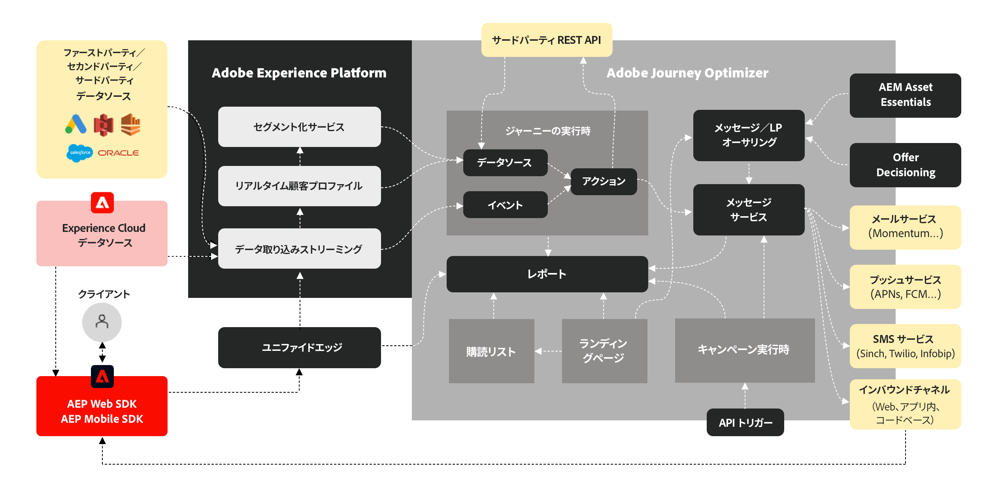

# Journey Optimizerについて {#understanding-ajo}

Adobe Journey OptimizerとAdobe Experience Platformが連携することで、データ駆動型パーソナライゼーションを大規模に実現します。 このページでは、これらのシステムがどのように動作するか、主要な機能領域がどのように組み合わさって優れた顧客体験を提供するかについて説明します。 [&#x200B; 主な機能について学ぶ &#x200B;](get-started.md) | [&#x200B; 主要用語を調べる &#x200B;](terminology.md)

## Journey Optimizerの仕組み {#how-it-works}

Adobe Journey Optimizerは、パーソナライズされたカスタマージャーニーを作成するために、データを収集、分析、適用する継続的なフローとして機能します。

### Adobe Experience Platform:The Foundation {#aep-foundation}

Adobe Experience Platformはバックボーンとして機能するので、企業は顧客データを一元化し、パーソナライズされたエクスペリエンスのためにアクティブ化できます。

* **データプラットフォーム** – 顧客データを収集、管理、構造化して、システム間の一貫性を確保するための一元的なハブ。 [&#x200B; スキーマとデータセットについて &#x200B;](../data/get-started-schemas.md)
* **データ取り込み（ソース）** – 事前定義済みのコネクタを使用して、CRM プラットフォーム、web サイト、モバイルアプリ、クラウドストレージからデータをインポートします。 [&#x200B; データソースの調査 &#x200B;](../data/get-started-sources.md)
* **リアルタイム顧客プロファイル** – 複数のソース（メールのやり取り、店舗での購入、web 行動）からのデータを結合して、統合プロファイルを作成します。 [&#x200B; プロファイルについて &#x200B;](../audience/get-started-profiles.md)
* **ガバナンスレイヤー** – 規制に準拠しながら、データアクセス、プライバシーコンプライアンス、セキュリティを管理します。 [&#x200B; プライバシードキュメントを表示 &#x200B;](../privacy/get-started-privacy.md)

### Adobe Journey Optimizer：オーケストレーションエンジン {#ajo-orchestration}

Adobe Journey Optimizerは、Adobe Experience Platformのデータとインサイトを適用して、インテリジェントでパーソナライズされたカスタマーエクスペリエンスを提供します。

* **顧客の理解** - リアルタイム顧客プロファイルを使用すると、ターゲットメッセージング用にオーディエンスをセグメント化できます。 [オーディエンスの作成](../audience/about-audiences.md)
* **コンテンツとオファー** - コンテンツを作成、管理およびパーソナライズするツール。個々のユーザーに最適なオファーを選択するリアルタイムロジック。 [&#x200B; コンテンツのデザイン &#x200B;](../content-management/get-started-content.md) | [&#x200B; オファーの管理 &#x200B;](../offers/get-started/starting-offer-decisioning.md)
* **ジャーニーとキャンペーン管理** - インタラクションのシーケンス（ジャーニー）を自動化したり、1 回限りのターゲットメッセージ（キャンペーン）をスケジュールしたりできます。 [&#x200B; ジャーニーの作成 &#x200B;](../building-journeys/journey-gs.md) | [&#x200B; キャンペーンの作成 &#x200B;](../campaigns/get-started-with-campaigns.md)
* **配信（接続）** - メール、SMS、プッシュ通知、ダイレクトメールなどのチャネルを通じてメッセージを配信し、データを外部システムに書き出します。 [チャネルの設定](../configuration/get-started-configuration.md)
* **測定と分析** – 継続的な改善に役立つレポートを使用して、顧客エンゲージメントとキャンペーンのパフォーマンスを追跡します。 [&#x200B; レポートの表示 &#x200B;](../reports/campaign-global-report.md)

### 継続的な最適化サイクル {#optimization-cycle}

このエコシステムは、継続的な最適化サイクルとして機能します。データは、パーソナライズされたコンテンツと決定を提供する、お客様の理解を推進します。これらはジャーニーに調整され、チャネルをまたいで配信され、有効性を測定し、時間の経過と共に調整されます。

## 主要な機能領域 {#functional-areas}

Journey Optimizerには、シームレスに連携する 7 つの主要な機能領域が含まれています。

| 機能領域 | 目的 | 主要なアクティビティ |
|-----------------|---------|----------------|
| **データ管理** | 顧客データの整理 | スキーマの定義、データセットの作成、様々なシステムからのデータの読み込みを行います。 [詳細情報](../data/get-started-schemas.md) |
| **顧客管理** | お客様の理解 | 統合プロファイルを作成し、ID を解決し、オーディエンスを作成します。 [詳細情報](../audience/get-started-profiles.md) |
| **コンテンツ管理** | パーソナライズされたメッセージの作成 | メールの設計、アセットの管理、テンプレートとフラグメントの作成、コンテンツのパーソナライズをおこないます。 [詳細情報](../content-management/get-started-content.md) |
| **意思決定管理** | 最適なオファーをリアルタイムで選択 | オファーライブラリの管理、ルールの定義、制約の適用、ランキングロジックの確立を行います。 [詳細情報](../offers/get-started/starting-offer-decisioning.md) |
| **ジャーニーの管理** | 自動化された顧客体験の設計 | ビジュアルデザイナーでジャーニーを作成し、トリガーを設定し、条件を追加して、待機ステップを追加します。 [詳細情報](../building-journeys/journey-gs.md) |
| **接続** | データソースとチャネルの接続 | ソースコネクタの設定、チャネルの設定、外部プラットフォームへの接続を行います。 [詳細情報](../configuration/get-started-configuration.md) |
| **管理とプライバシー** | コントロールの設定とコンプライアンス | ユーザーの管理、サンドボックスの設定、チャネルの設定、プライバシーリクエストの処理を行います。 [詳細情報](../administration/permissions.md) |

### これらの領域の連携 {#working-together}

これらの機能領域は、連続したサイクルで動作します。

1. **データ取り込み** - Data Management で構造化されたAdobe Experience Platformへのデータフロー
2. **顧客の理解** - リアルタイム顧客プロファイルはデータを統合し、顧客管理はオーディエンスを作成します
3. **コンテンツとオファー戦略** - コンテンツ管理はメッセージを作成し、意思決定管理はオファーロジックを定義します
4. **オーケストレーション** - Customer Management は、ジャーニーデータ、コンテンツ、意思決定を使用して、チャネルをまたいでインタラクションをマッピングします
5. **配信** – 接続により、チャネルを介したメッセージ配信や外部システムとのデータ共有が容易になります
6. **測定** - パフォーマンスデータは、インサイトをフィードして、オーディエンス、コンテンツ、決定およびジャーニーを絞り込みます
7. **ガバナンス** – 管理とプライバシー制御により、全体を通してコンプライアンスを確保します

## アーキテクチャの詳細 {#architecture-details}

技術チーム向けに、Journey OptimizerとAdobe Experience Platformの統合方法を示す詳細なアーキテクチャ図を以下に示します。 [&#x200B; インターフェイスに移動 &#x200B;](user-interface.md) して、これらのコンポーネントを実際に参照します。

Experience Platformには、Adobe Real-Time Customer Data Platform、Journey Optimizer、Customer Journey Analytics、Adobe Mix Modelerの 4 つのアプリケーションがネイティブに構築されています。 Journey Optimizerは、これらのアプリケーションとシームレスに連携しますが、独立して機能することもできます。 実装に関する考慮事項については、[&#x200B; ガードレールと制限を確認 &#x200B;](guardrails.md) してください。

### 統合ポイント {#integration-points}

Journey Optimizerは、複数のレベルでAdobe Experience Platformと統合されます。

* **データレイヤー** – 同じリアルタイム顧客プロファイル、ID グラフ、データセットを共有します
* **サービスレイヤー** - Adobe Experience Platformのガバナンス、プライバシー、クエリサービスを活用します
* **アプリケーションレイヤー** - Adobe Experience Platform上でジャーニーオーケストレーション、意思決定管理、コンテンツ管理を提供します

[Adobe Journey Optimizer ブループリント &#x200B;](https://experienceleague.adobe.com/ja/docs/blueprints-learn/architecture/customer-journeys/journey-optimizer/journey-optimizer-overview){target="_blank"} の詳細情報。

## プライバシーとセキュリティ {#privacy-security}

Adobe Experience Cloud のプライバシーとセキュリティのプラクティスは、Adobe Journey Optimizer に適用されます。これらの対策により、GDPR などのプライバシー規制への準拠が確保され、顧客の信頼を維持しながら、パーソナライズされたエクスペリエンスを提供できるようになります。 [Journey Optimizerのプライバシーの詳細情報 &#x200B;](../privacy/get-started-privacy.md)
