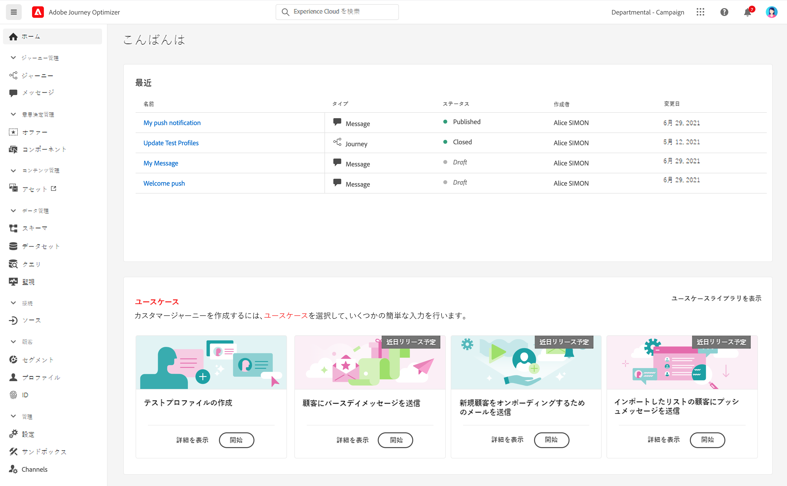
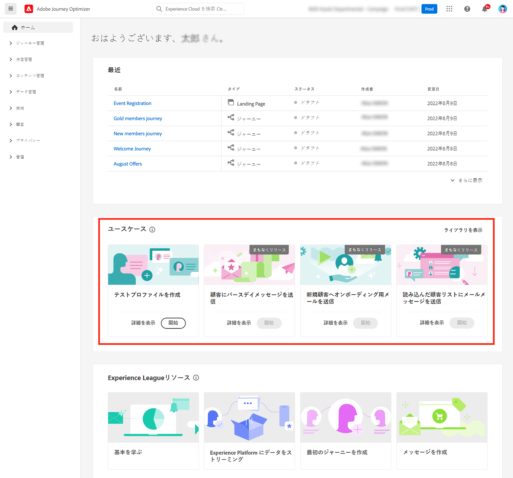
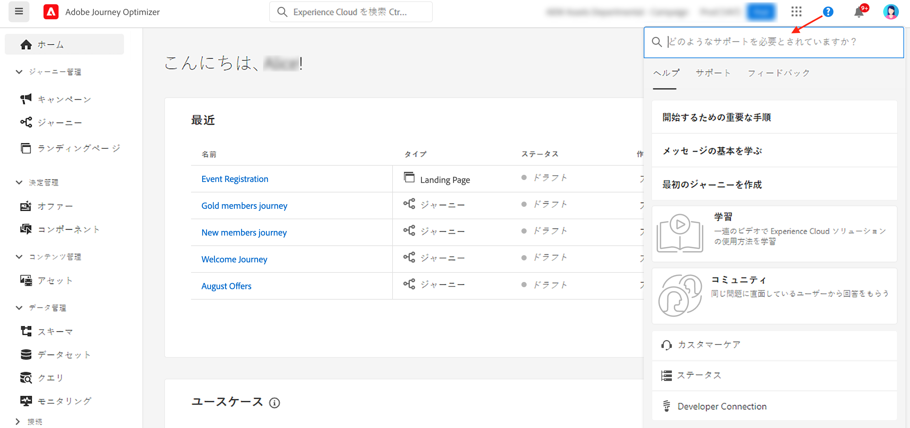
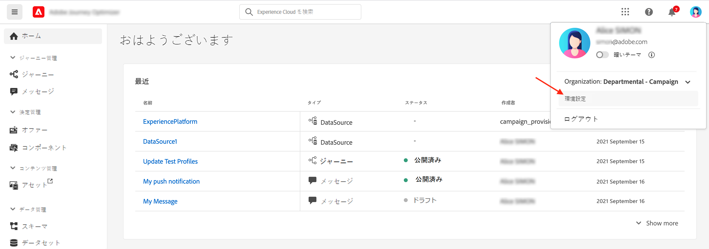
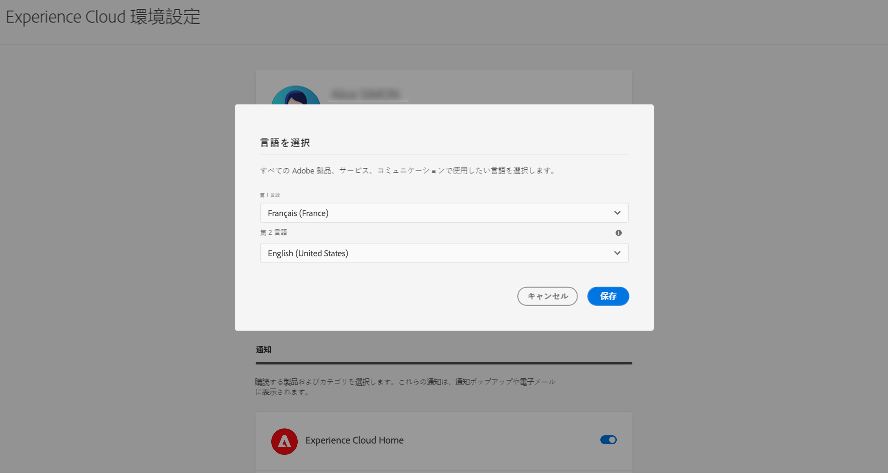

# ユーザーインターフェイス {#cjm-user-interface}

[!DNL Adobe Journey Optimizer] にアクセスするには、Adobe ID を使用して [Adobe Experience Cloud](https://experience.adobe.com) に接続し、[!DNL Journey Optimizer] を選択します。

ユーザーインターフェイスを閲覧する際の主要な概念は、Adobe Experience Platform と共通です。詳しくは、[Adobe Experience Platform ドキュメント](https://experienceleague.adobe.com/docs/experience-platform/landing/platform-ui/ui-guide.html?lang=ja#adobe-experience-platform-ui-guide){target="_blank"}を参照してください。

このユーザーインターフェイスで使用できるコンポーネントと機能は、付与されている[権限](../administration/permissions.md)と、使用している[ライセンスパッケージ](https://helpx.adobe.com/jp/legal/product-descriptions/adobe-journey-optimizer.html){target="_blank"}によって異なります 。ご不明な点については、アドビカスタマーサクセスマネージャーまでお問い合わせください。

>[!NOTE]
>
>このドキュメントは、製品のユーザーインターフェイスの最新の変更を反映して、頻繁に更新されます。ただし、一部のスクリーンショットは、ユーザーインターフェイスと少し異なる場合があります。

## 左側のナビゲーション {#left-nav}

左側のリンクを参照して、[!DNL Journey Optimizer] 機能にアクセスします。

>[!NOTE]
>
>使用できる機能は、ユーザーの権限と使用許諾契約によって異なる可能性があります。

左側のナビゲーションで利用できるサービスと機能の一覧と、関連するヘルプページへのリンクを以下に示します。

### ホーム {#left-nav-home}

[!DNL Journey Optimizer] ホームページには、開始するための主要なリンクとリソースが含まれています。

**[!UICONTROL 最近使用したもの]**&#x200B;リストには、最近作成したイベントおよびジャーニーへのショートカットが表示されます。このリストには、作成日と変更日およびステータスが表示されます。

製品内のユースケースを参照して、リソースとメッセージの作成を開始します。[詳細情報](#in-product-use-cases)

ホームページの下部にあるリンクを使用して、[!DNL Journey Optimizer] の使用を開始する方法を確認します。[詳細情報](#find-help-and-support)

### [!UICONTROL ジャーニー管理] {#left-nav-journey}

このセクションでは、キャンペーンとジャーニーを作成します。

* **[!UICONTROL キャンペーン]** - キャンペーンを作成、設定および調整し、様々なチャネルを使用して特定のオーディエンスに 1 回限りのコンテンツを配信します。[詳細情報](../campaigns/get-started-with-campaigns.md)

* **[!UICONTROL ジャーニー]** - カスタマージャーニーを作成、設定および調整します。イベント、オーケストレーション、アクションアクティビティを組み合わせて、複数の手順からなるクロスチャネルシナリオを作成します。[詳細情報](../building-journeys/journey-gs.md#jo-build)

* **[!UICONTROL ランディングページ]** - ランディングページを作成、設計、テストおよび公開します。オンラインフォームへのリンクをユーザーに送信することで、ユーザーは、通信の受信をオプトインまたはオプトアウトしたり、特定のサービスを購読したりできます。[詳細情報](../landing-pages/get-started-lp.md)

### [!UICONTROL 意思決定管理] {#left-nav-decision}

このセクションでは、オファーとコンポーネントを作成します。

* **[!UICONTROL オファー]**：このメニューから最新のソースおよびデータセットにアクセスします。このセクションを使用して、オファーを作成します。[詳細情報](../offers/offer-library/creating-personalized-offers.md)

* **[!UICONTROL コンポーネント]**：プレースメント、ルールおよびタグを作成します。[詳細情報](../offers/offer-library/key-steps.md)

### [!UICONTROL コンテンツ管理] {#left-nav-content}

このセクションでは、コンテンツを作成および管理します。

* **[!UICONTROL アセット]**：[!DNL Adobe Experience Manager Assets] は、メッセージへの入力に使用できるアセットの一元的リポジトリーです。[詳細情報](../integrations/assets.md)

* **[!UICONTROL コンテンツテンプレート]** - 改善されて高速化した設計プロセスを実現するために、スタンドアロンテンプレートを作成して、Journey Optimizer キャンペーンやジャーニー全体でカスタムコンテンツを簡単に再利用できます。[詳細情報](../content-management/content-templates.md)

* **[!UICONTROL フラグメント]** - フラグメントを作成および管理してメールの設計プロセスをスムーズにします。メールのコンテンツをすばやく組み立てるために使用できるカスタムコンテンツブロックを事前に作成します。[詳細情報](../content-management/fragments.md)

### [!UICONTROL データ管理] {#left-nav-data}

このセクションでは、データを管理します。

* **[!UICONTROL スキーマ]**：Adobe Experience Platform を使用すると、スキーマエディターと呼ばれるインタラクティブなビジュアルキャンバスで Experience Data Model（XDM）スキーマを作成および管理できます。[詳細情報](../data/get-started-schemas.md)

* **[!UICONTROL データセット]**：Adobe Experience Platform に取り込まれたすべてのデータは、データレイク内にデータセットとして保持されます。データセットは、スキーマ（列）とフィールド（行）で構成されるデータコレクション（通常はテーブル）を格納し管理するための構造です。[詳細情報](../data/get-started-datasets.md)

* **[!UICONTROL クエリ]**：Adobe Experience Platform クエリサービスを使用すると、クエリの作成と実行、実行済みのクエリの表示、組織内のユーザーが保存したクエリへのアクセスなどを行えます。[詳細情報](../data/get-started-queries.md)

* **[!UICONTROL 監視]**：このメニューを使用すると、Adobe Experience Platform ユーザーインターフェイス内でデータの取得を監視できます。詳しくは、[Adobe Experience Platform ドキュメント](https://experienceleague.adobe.com/docs/experience-platform/ingestion/quality/monitor-data-ingestion.html?lang=ja){target="_blank"}を参照してください。

### [!UICONTROL 接続] {#left-nav-connections}

このセクションでは、他のアプリやクラウドとのデータ接続を管理します。

* **[!UICONTROL ソース]**：このメニューを使用すると、アドビのアプリケーション、クラウドベースのストレージ、データベースなど、様々なソースからデータを取り込むことができます。受信データの構造化、ラベル付けおよび拡充を行えます。[詳細情報](get-started-sources.md)

* **[!UICONTROL 宛先]** - このメニューを使用すると、データセットの内容を書き出すためにクラウドストレージの場所とのライブ接続を作成できます。[詳細情報](../data/export-datasets.md)

### [!UICONTROL 顧客] {#left-nav-customers}

このセクションでは、オーディエンスとプロファイルデータを管理します。

* **[!UICONTROL オーディエンス]** - Experience Platform オーディエンスを作成および管理し、それらをジャーニーに使用します。[詳細情報](../audience/about-audiences.md)

* **[!UICONTROL 購読リスト]** - [!DNL Journey Optimizer] では、購読サービスにオプトインした顧客が購読リストに収集されます。[詳細情報](../landing-pages/subscription-list.md)

* **[!UICONTROL プロファイル]**：リアルタイム顧客プロファイルは、オンライン、オフライン、CRM、サードパーティデータなど複数のチャネルからのデータを組み合わせて、個々の顧客の全体像を作成します。[詳細情報](../audience/get-started-profiles.md)

* **[!UICONTROL ID]**：Adobe Experience Platform ID サービスは、クロスデバイス、クロスチャネル、ほぼリアルタイムの顧客識別を Adobe Experience Platform 内のいわゆる ID グラフで管理します。[詳細情報](../audience/get-started-identity.md)

### [!UICONTROL プライバシー] {#left-nav-privacy}

このセクションでは、プライバシーの管理とリクエストを制御します。

* **[!UICONTROL ポリシー]** - Adobe Experience Platform では、フィールドにラベルを付け、各チャネルのマーケティングアクションを作成できます。次に、ラベルとマーケティングアクションにリンクされたガバナンスポリシーを定義します。[詳細情報](../action/action-privacy.md)

* **[!UICONTROL リクエスト]** - プライバシーリクエストは、Adobe Experience Platform Privacy Service で管理されます。これにより、顧客データのリクエストを管理しやすくする RESTful API およびユーザーインターフェイスが提供されます。[詳細情報](../privacy/requests.md)

* **[!UICONTROL 監査]** - このセクションを参照して、アクティビティログを確認します。[詳細情報](../privacy/audit-logs.md)

* **[!UICONTROL データハイジーン]** - このセクションでは、データハイジーン操作を設定およびスケジュールして、レコードが適切に保持されるようにします。[詳細情報](../privacy/data-hygiene.md)

### [!UICONTROL 管理] {#left-nav-admin}

* **[!UICONTROL 設定]** - このメニューを使用すると、ジャーニーで使用する[イベント](../event/about-events.md)、[データソース](../datasource/about-data-sources.md)、[アクション](../action/action.md)を設定できます。

  また、「**レポート**」セクションにアクセスして、キャンペーン実験および web／モバイル用にレポートを設定することもできます。[詳細情報](../reports/reporting-configuration.md)

* **[!UICONTROL ビジネスルール]** - このセクションを使用すると、ユーザーがメッセージを受信する頻度やジャーニーにエントリする頻度を制御するクロスチャネルビジネスルールを作成できます。[詳細情報](../configuration/rule-sets.md)

* **[!UICONTROL アラート]** - ユーザーインターフェイスを使用すると、Adobe Experience Platform の Observability Insights で明らかになった指標に基づいて、受信したアラートの履歴を表示できます。また、UI を使用すると、使用可能なアラートルールの表示、有効化および無効化を行うこともできます。[詳細情報](../reports/alerts.md)

* **[!UICONTROL サンドボックス]** - Adobe Experience Platform が提供するサンドボックスを使用すると、単一のインスタンスを別々の仮想環境に分割して、デジタルエクスペリエンスアプリケーションの開発と展開に役立てることができます。このセクションを参照して、サンドボックスを管理します。[詳細情報](../administration/sandboxes.md)

* **[!UICONTROL チャネル]**：このセクションを使用すると、サブドメイン、設定、配信品質の設定などのチャネルを設定できます。[詳細情報](../configuration/get-started-configuration.md)

* **[!UICONTROL タグ]** - 統合タグを使用すると、ジャーニーやキャンペーンを簡単に分類し、リストからの検索を改善できます。[詳細情報](../start/search-filter-categorize.md#work-with-unified-tags)

## 製品内の使用例 {#in-product-uc}

[!DNL Adobe Journey Optimizer] のホームページでは、製品のユースケースからテストプロファイルや最初のカスタマージャーニーを作成するための簡単な入力を提供します。

利用可能なユースケースは次のとおりです。

* **テストプロファイルを作成する**：CSV テンプレートを使用してテストプロファイルを作成し、パーソナライズされたメッセージとジャーニーをテストします。このユースケースの実装方法については、[このページ](../audience/creating-test-profiles.md#use-case-1)を参照してください。
* **顧客に誕生日のメッセージを送信する**：顧客の誕生日を祝うメールを自動的に送信します。（近日公開）
* **新規顧客をオンボーディングするためのメールを送信する**：新規登録した顧客を歓迎するために最大 2 通のメールを簡単に送信します。（近日公開）
* **読み込んだ顧客リストにプッシュメッセージを送信する**：CSV ファイルからインポートされた顧客リストにプッシュ通知をすばやく送信します。（近日公開）

各ユースケースについて詳しくは、**[!UICONTROL 詳細を表示]**&#x200B;リンクをクリックしてください。

ユースケースを実行するには、「**[!UICONTROL 開始]**」ボタンをクリックします。

「**[!UICONTROL ライブラリを表示]**」ボタンから、実行済みのユースケースにアクセスできます。

## ヘルプとサポートを検索 {#find-help}

Adobe Journey Optimizer の主要なヘルプページには、ホームページの下部のセクションからアクセスできます。

「**ヘルプ**」アイコンを使用すると、ヘルプページにアクセスしたり、サポートに問い合わせたり、フィードバックを共有したりできます。検索フィールドからヘルプ記事やビデオを検索できます。

各ページでは、コンテキストヘルプボタンを使用して機能の詳細を確認したり、**[!DNL Adobe Experience League]** ドキュメントを参照したりできます。

## 言語の環境設定 {#language-pref}

ユーザーインターフェイスは、次の言語で使用できます。

* 英語
* フランス語
* ドイツ語
* イタリア語
* スペイン語
* ポルトガル語（ブラジル）
* 日本語
* 韓国語
* 繁体字中国語
* 簡体字中国語

デフォルトのインターフェイス言語は、ユーザープロファイルで指定されている優先言語によって決まります。

言語を変更するには：

* 右上のアバターから「**環境設定**」をクリックします。
  
* 次に、メールアドレスの下に表示される言語をクリックします
* 希望する言語を選択し、「**保存**」をクリックします。使用しているコンポーネントが第一希望の言語にローカライズされていない場合に備えて、第二の言語を選択できます。
  

<!--CONTEXTUAL HELP TO DISPATCH IN DOCS ONCE FEATURE LIVE-->

<!--CONTENT LOCKING-->

<!--APPROVAL POLICIES-->

>[!CONTEXTUALHELP]
>id="ajo_campaigns_edit_disabled"
>title="無効化を編集"
>abstract="無効な（キャンペーン）を編集"

>[!CONTEXTUALHELP]
>id="ajo_journey_edit_disabled"
>title="無効化を編集"
>abstract="無効な（ジャーニー）を編集"

>[!CONTEXTUALHELP]
>id="ajo_approval_policy_approval_status"
>title="承認ステータス"
>abstract="承認ステータス"

>[!CONTEXTUALHELP]
>id="ajo_campaigns_approve"
>title="承認"
>abstract="承認（キャンペーン）"

>[!CONTEXTUALHELP]
>id="ajo_journey_approve"
>title="承認"
>abstract="承認（ジャーニー）"

<!-- ExD in email-->

>[!CONTEXTUALHELP]
>id="ajo_exd_decision_attribute"
>title="カタログから決定属性を選択する"
>abstract="決定属性はカタログのスキーマに保存されます。選択したカタログから、ここで使用する属性を選択します。"

>[!CONTEXTUALHELP]
>id="ajo_exd_decision_policy"
>title="決定ポリシー"
>abstract="決定ポリシーを使用すると、決定エンジンから最適な項目を選択し、各オーディエンスに配信できます。"

>[!CONTEXTUALHELP]
>id="ajo_exd_placements"
>title="プレースメント"
>abstract="プレースメントにより、決定エンジンから返された項目がメッセージ内に表示される場所が決まります。レポートでは、様々なプレースメントにわたるパフォーマンスを追跡できます。"
