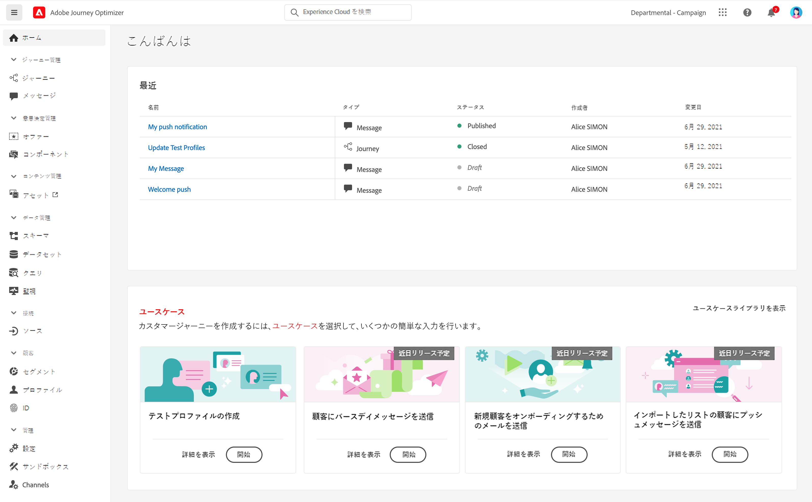
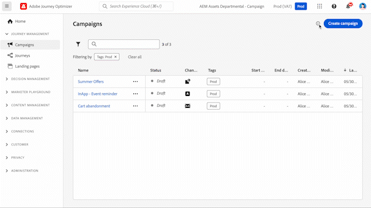

# インターフェイスの操作 {#user-interface}

Adobe Journey Optimizer にアクセスするには、Adobe ID を使用して [Adobe Experience Cloud](https://experience.adobe.com) にログインし、「[!DNL Journey Optimizer]」を選択します。

>[!NOTE]
>
>* 環境で使用できるコンポーネントと機能は、[権限](../administration/permissions.md)と[ライセンスパッケージ](https://helpx.adobe.com/jp/legal/product-descriptions/adobe-journey-optimizer.html){target="_blank"}によって異なります。
>* このドキュメントは頻繁に更新されます。一部のスクリーンショットは、お使いのユーザーインターフェイスと多少異なる場合があります。

## クイックツアー {#quick-tour}

Journey Optimizer インターフェイスは、次の 4 つの主な領域で構成されます。

1. **左側のナビゲーション** - 機能別に整理されたすべての機能と特長へのアクセス
2. **上部バー** - ユニバーサル検索、ヘルプ、通知、設定
3. **ホームページ** - 最近作成した項目や役立つリソースへのクイックアクセス
4. **主なワークスペース** - コンテンツを作成および管理する場所

**ヒント：**&#x200B;新規ユーザーは、**ホーム** ページから開始して、最近のアイテムとユースケースにアクセスするか、上部バーの&#x200B;**ヘルプ** アイコンを使用してコンテキストガイダンスを得ることができます。

## 上部バーの機能 {#top-bar}

### ユニバーサル検索 {#universal-search}

検索アイコンを使用すると、Journey Optimizer をまたいでジャーニー、キャンペーン、アセット、他のオブジェクトをすばやく検索できます。キーワードを入力すると、プラットフォームのあらゆる領域から関連結果を確認できます。 [&#x200B; ユニバーサル検索の詳細](search-filter-categorize.md#unified-search)。

### ヘルプ&amp;サポート {#help}

**ヘルプ**&#x200B;アイコンをクリックすると、次の操作を実行できます。

* ヘルプ記事とビデオを検索
* 現在のページのコンテキストヘルプにアクセス
* アドビサポートに問い合わせ
* フィードバックを共有

コンテキストヘルプには、表示中の画面に関連するガイダンスが表示され、対応するドキュメントに直接リンクされるので、ワークフローから離れることなく適切な情報を入手できます。

#### サポートチケットのガイドライン {#support-ticket-guidelines}

Adobe サポートに連絡する際は、根本原因の分析と解決を迅速に進めるために、次の情報を含めてください。

* **環境の詳細** - サンドボックス名、組織ID、および製品領域（例：ジャーニー、キャンペーン、決定）
* **影響レベル** – 問題の重要度（例：実稼動がブロックされている、機能が制限されている、化粧品）
* **レプリケーション手順** – 問題を再現するための明確な手順の手順
* **ログまたはスクリーンショット** – 関連するエラーメッセージ、リクエスト ID、または問題を示すスクリーンショット
* **関連ID** - ジャーニー ID、キャンペーン ID、オーディエンス ID、または問題に関連するその他のオブジェクト ID

### 通知 {#in-product-uc}

製品内通知とメール通知を有効にすると、次の情報を入手できます。

* **アラート** - システムエラーとパフォーマンスの問題
* **承認** - レビューが必要なリクエスト
* **新しいリリース** - 製品アップデートと新機能

通知を設定するには：

1. プロファイルアイコンをクリックし、「**[!UICONTROL 環境設定]**」を選択します
2. **[!UICONTROL 通知]**&#x200B;の下にある **[!UICONTROL Journey Optimizer]** を見つけます。
3. 受信する通知タイプを有効にします

{width="60%" align="center"}

### 言語の環境設定 {#language}

インターフェイスは、英語、フランス語、ドイツ語、イタリア語、スペイン語、ポルトガル語（ブラジル）、日本語、韓国語、繁体字中国語、簡体字中国語で使用できます。

言語を変更するには：

1. プロファイルメニューで「**[!UICONTROL 環境設定]**」をクリックします
2. 優先言語を選択します
3. オプションで、フォールバックとして第 2 言語を選択します
4. 「**保存**」をクリックします。

キーボードショートカットとアクセシビリティ機能を利用できます。 [詳細情報](accessibility.md)

## ホームページ {#home-page}

ホームページには、次の内容があります。

* **最近使用したもの** - 最近作成したイベント、ジャーニー、キャンペーン、他のオブジェクトへのショートカット
* **ユースケース** - すぐに開始するのに役立つ、事前定義済みのシナリオ（テストプロファイルの作成、誕生日メッセージの送信など）
* **リソース** - ドキュメント、チュートリアル、サポートへのリンク

### ユースケースとクイックスタートワークフロー {#use-cases}

クイックスタートワークフローは、次の一般的なタスクの実行に役立ちます。

* **テストプロファイルを作成** - CSV テンプレートを使用してテストプロファイルを生成します
* **誕生日メッセージを送信** - 誕生日メールを自動送信します（近日リリース予定）
* **新規顧客をオンボード** - 新規顧客向けのウェルカムシリーズ（近日リリース予定）
* **インポートしたリストにプッシュを送信** - CSV データからのクイックプッシュ通知（近日リリース予定）

各ユースケースの詳細を確認するには「**[!UICONTROL 詳細を表示]**」をクリックし、開始するには「**[!UICONTROL 開始]**」をクリックします。

## 左側のナビゲーション {#left-nav}

左側のナビゲーションでは、Journey Optimizer の機能が機能カテゴリに整理されています。使用可能なメニュー項目は、権限とライセンスによって異なります。

| セクション | 目的 |
|---------|---------|
| Journey Management | キャンペーン、ジャーニー、レポート |
| 意思決定管理 | オファーとパーソナライゼーション |
| コンテンツ管理 | Assets、テンプレート、フラグメント、ランディングページ |
| データ管理 | スキーマ、データセット、クエリ |
| 接続 | ソースと宛先 |
| 顧客 | オーディエンス、プロファイル、ID |
| プライバシー | ポリシー、リクエスト、監査 |
| 管理 | 設定、チャネル、サンドボックス |

### メインセクション {#main-sections}

**ホーム** - 最近作成した項目や役立つリソースへのクイックアクセスを含む開始点

**ジャーニー管理** - カスタマーエクスペリエンスを作成および管理します

* **キャンペーン** - 特定のオーディエンスに対して 1 回限りのメッセージまたはスケジュール済みのメッセージを作成します。[キャンペーンの基本を学ぶ](../campaigns/get-started-with-campaigns.md)
* **ジャーニー** - マルチステップのクロスチャネルのカスタマーエクスペリエンスを作成します。[初めてのジャーニーの作成](../building-journeys/journey-gs.md)
* **レポート** - 統合された Customer Journey Analytics レポートを使用してパフォーマンスを分析します。[レポートドキュメントの表示](../reports/campaign-global-report-cja.md)

**意思決定管理** - パーソナライズされたオファーを管理します。[意思決定管理の詳細情報](../offers/get-started/starting-offer-decisioning.md)

* **オファー** - パーソナライズされたオファーを作成および管理します
* **コンポーネント** - オファーのプレースメント、ルールおよびタグを設定します

**コンテンツ管理** - コンテンツを作成および整理します

* **アセット** - 画像とメディアの一元化されたリポジトリ。[アセットの管理](../integrations/assets.md)
* **コンテンツテンプレート** - キャンペーンやジャーニー用の再利用可能なメッセージテンプレート。[テンプレートの作成](../content-management/content-templates.md)
* **フラグメント** - 複数のメッセージをまたいで使用できるコンテンツブロック。[フラグメントの操作](../content-management/fragments.md)
* **ランディングページ** - 購読と環境設定用の web フォーム。[ランディングページの設計](../landing-pages/get-started-lp.md)
* **ユースケースプレイブック** - 一般的なマーケティングシナリオ用の事前定義済みワークフロー。[プレイブックの探索](ai-features.md#playbooks)

**データ管理** - データ基盤を管理します。[スキーマとデータセットの詳細情報](../data/get-started-schemas.md)

* **スキーマ** - データ構造を定義します
* **データセット** - データ収集を保存および管理します
* **クエリ** - クエリを書き込んで実行します
* **監視** - データ取り込みを追跡します

**接続** - 他のシステムと統合します

* **ソース** - 外部システムからデータを取り込みます。[ソースの設定](get-started-sources.md)
* **宛先** - クラウドストレージにデータをエクスポートします。[宛先の設定](../data/export-datasets.md)

**顧客** - オーディエンスとプロファイルを管理します

* **オーディエンス** - 顧客セグメントを作成および管理します。[オーディエンスの操作](../audience/about-audiences.md)
* **購読リスト** - オプトインリストを管理します。 [購読の管理](../landing-pages/subscription-list.md)
* **プロファイル** - 統合された顧客プロファイルを表示します。[プロファイルの探索](../audience/get-started-profiles.md)
* **ID** - ID 解決を管理します。[ID の詳細情報](../audience/get-started-identity.md)

**プライバシー** - プライバシーとコンプライアンスを制御します。[プライバシーの概要](../privacy/get-started-privacy.md)

* **ポリシー** - データガバナンスポリシーを定義します
* **リクエスト** - プライバシーリクエスト（GDPR、CCPA）を処理します
* **監査** - アクティビティログを確認します。[監査ログの表示](../privacy/audit-logs.md)
* **データライフサイクル** - データ保持を設定します

**管理** - システム設定を指定します。[アクセス制御の概要](../administration/permissions-overview.md)

* **設定** - イベント、データソース、アクションを設定します。[チャネルの設定](../configuration/get-started-configuration.md)
* **ビジネスルール** - メッセージの頻度とジャーニーのエントリを制御します。[ビジネスルールの設定](../conflict-prioritization/rule-sets.md)
* **アラート** - システムアラートを表示および管理します。[アラートの監視](../reports/alerts.md)
* **サンドボックス** - 環境を管理し、サンドボックス間でオブジェクトをコピーします。[サンドボックスの操作](../administration/sandboxes.md)
* **チャネル** - チャネル設定と配信品質を設定します。[チャネル設定の指定](../configuration/channel-surfaces.md) | [設定の基本を学ぶ](../configuration/get-started-configuration.md)
* **タグ** - コンテンツを整理および分類します。[統合タグの操作](search-filter-categorize.md#tags)

## AI アシスタント {#ai-assistant}

AI アシスタントは、即座に役立つヘルプと運用上のインサイトを提供します。上部バーの AI アシスタントアイコンをクリックすると、次の操作を実行できます。

* 製品機能に関する回答を取得
* ジャーニーに関する運用上のインサイトを受信
* 概念とベストプラクティスを参照

[AI アシスタントの詳細情報](ai-features.md#ai-assistant)

## 関連トピック {#related-topics}

* [役割別の学習パスの選択](quick-start.md)
* [コンテンツの検索、フィルタリング、分類](search-filter-categorize.md)
* [Journey Optimizer の仕組みについて](understanding-ajo.md)
* [アクセシビリティ機能](accessibility.md)

<!--CONTEXTUAL HELP TO DISPATCH IN DOCS ONCE FEATURE LIVE-->

<!--ORCHESTRATED CAMPAIGNS - Overview page-->

<!--OVERVIEW TAB ORCHESTRATED CAMPAIGNS SKU only-->

>[!CONTEXTUALHELP]
>id="ajo_oc_campaign_ovv_1"
>title="キャンペーンオーケストレーション"
>abstract="リレーショナルデータセットを分割、組み合わせ、強化、操作して、オーディエンスを定義する"

>[!CONTEXTUALHELP]
>id="ajo_oc_campaign_ovv_2"
>title="マルチエンティティデータの活用"
>abstract="調整されたキャンペーンでリレーショナルデータセットを活用して、セグメント化とパーソナライゼーションのためのデータを強化する方法を学ぶ"

>[!CONTEXTUALHELP]
>id="ajo_oc_campaign_ovv_3"
>title="アドホックセグメント化と正確なカウント"
>abstract="正確なカウント数を使用してセグメントを段階的に作成する"

>[!CONTEXTUALHELP]
>id="ajo_oc_campaign_ovv_4"
>title="使用可能なチャネル"
>abstract="メール, SMS, プッシュ通知, ダイレクトメール"

<!--OVERVIEW TAB ORCHESTRATED CAMPAIGNS + JOURNEYS SKU -->

>[!CONTEXTUALHELP]
>id="ajo_oc_jo_campaign_ovv_1"
>title="キャンペーンを作成して送信するためのガイド付き UI"
>abstract="チャネルでの 1 つまたは複数のアクションの設定、オーディエンスの選択、コンテンツの設定、スケジュールの定義を行うと、送信の準備が整います"

>[!CONTEXTUALHELP]
>id="ajo_oc_jo_campaign_ovv_2"
>title="使用可能なチャネル"
>abstract="メール，SMS, プッシュ通知，アプリ内，web, コードベースのエクスペリエンス"

<!--OVERVIEW TAB ORCHESTRATED CAMPAIGNS - API triggered tab -->

>[!CONTEXTUALHELP]
>id="ajo_oc_api_campaign_ovv_1"
>title="トランザクション API トリガーキャンペーン"
>abstract="API 呼び出しを通じてリアルタイムメッセージをトリガー"

>[!CONTEXTUALHELP]
>id="ajo_oc_api_campaign_ovv_2"
>title="マーケティングメッセージ"
>abstract="プロモーションコンテンツ（オプトインが必要。ビジネスルールの対象です）"

>[!CONTEXTUALHELP]
>id="ajo_oc_api_campaign_ovv_3"
>title="トランザクションメッセージ"
>abstract="サービス関連コンテンツ（確認、アラート。マーケティングの同意の対象ではありません）"

>[!CONTEXTUALHELP]
>id="ajo_oc_api_campaign_ovv_4"
>title="使用可能なチャネル"
>abstract="メール, SMS, プッシュ通知"

<!--APPROVAL POLICIES-->

>[!CONTEXTUALHELP]
>id="ajo_campaigns_edit_disabled"
>title="無効化を編集"
>abstract="無効な（キャンペーン）を編集"

>[!CONTEXTUALHELP]
>id="ajo_journey_edit_disabled"
>title="無効化を編集"
>abstract="無効な（ジャーニー）を編集"

>[!CONTEXTUALHELP]
>id="ajo_approval_policy_approval_status"
>title="承認ステータス"
>abstract="承認ステータス"

>[!CONTEXTUALHELP]
>id="ajo_campaigns_approve"
>title="承認"
>abstract="承認（キャンペーン）"

>[!CONTEXTUALHELP]
>id="ajo_journey_approve"
>title="承認"
>abstract="承認（ジャーニー）"

>[!CONTEXTUALHELP]
>id="ajo_journey_simulation"
>title="ジャーニーのシミュレート"
>abstract="ジャーニーシミュレーションを使用すると、ジャーニーを検証し、アクティブ化する前にジャーニーのパフォーマンスを確認できます。トレーニング済みモデルのデータを使用して、ジャーニー全体にわたる数値を提供し、実際のシナリオでのジャーニーの動作を確認します。"

<!-- WEBHOOKS -->

>[!CONTEXTUALHELP]
>id="ajo_channels_feedback_webhook_settings"
>title="Webhook を有効にする"
>abstract="Webhook を有効にすると、メッセージの実行ステータスに関するリアルタイムのフィードバックを受信できます。このオプションをアクティブ化する前に、**管理**／**チャネル**／**フィードバック Webhook** メニューで webhook が設定されていることを確認します。"

>[!CONTEXTUALHELP]
>id="ajo_channels_feedback_webhook_settings_create"
>title="フィードバック Webhook"
>abstract="フィードバック webhook を使用すると、トランザクション API トリガーキャンペーンで送信されたメッセージの実行ステータスに関するリアルタイムのフィードバックを受信できます。組織 + サンドボックスの組み合わせごとに、1 つの webhook 設定のみが許可されます。"

>[!CONTEXTUALHELP]
>id="ajo_channels_feedback_webhook_settings_configuration"
>title="基本設定"
>abstract="このセクションでは、webhook を特定するためのわかりやすい名前を入力し、この webhook がフィードバックを受信するチャネル（メールや SMS）を選択します。Webhook URL フィールドに、フィードバックイベントを配信する必要がある HTTPS エンドポイントを指定します。"

>[!CONTEXTUALHELP]
>id="ajo_channels_feedback_webhook_settings_authentication"
>title="認証"
>abstract="エンドポイントで JWT 認証が必要な場合は、リストから「**JWT 認証**」を選択し、必要な詳細を指定します。"

>[!CONTEXTUALHELP]
>id="ajo_channels_feedback_webhook_settings_header_parameters"
>title="ヘッダーパラメーター"
>abstract="このセクションでは、各 webhook リクエストと共に送信される追加のカスタムヘッダーを設定できます。"

>[!CONTEXTUALHELP]
>id="ajo_orchestration_incrementalquery"
>title="増分クエリ"
>abstract="増分クエリは、オーケストレートキャンペーンが実行されるたびにデータベースクエリを実行するターゲティングアクティビティです。 新しいレコードのみを返し、以前の実行に既に含まれているユーザーは除外されるので、同じユーザーを再ターゲットしたり、同じ行を再度書き出したりするのを避けることができます。"

>[!CONTEXTUALHELP]
>id="ajo_orchestration_incrementalquery_processeddata"
>title="処理済みデータ"
>abstract="「処理済みデータ」で、以前の実行からレコードを除外する方法を選択します。 「以前の実行の結果を除外」を使用すると、アクティビティは、以前の実行で返されたレコードのリストを保持します。各実行では、それらのレコードが除外され、新しいレコードのみが返されます。 「日付フィールドを使用」オプションでは、アクティビティは個々の ID を追跡する代わりに選択された日付フィールドを使用し、各実行は、日付が最後の実行の後にある行のみを返します。"

>[!CONTEXTUALHELP]
>id="ajo_orchestration_incrementalquery_history"
>title="履歴（日数）"
>abstract="この設定は、そのリストを保持する期間を制御します。 値が 0 の場合は、保持が無限であることを意味し、レコードは削除されません。"

>[!CONTEXTUALHELP]
>id="ajo_inbox_location"
>title="ページ上の場所"
>abstract="。"

>[!CONTEXTUALHELP]
>id="ajo_inbox_app_id"
>title="アプリ ID"
>abstract="。"
