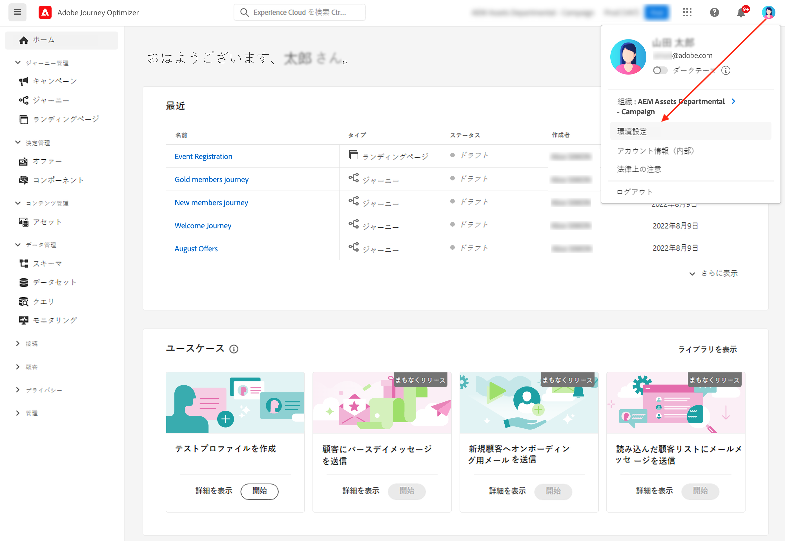

# ユーザーインターフェイス {#cjm-user-interface}

[Adobe Experience Cloud](http://experience.adobe.com?lang=ja) に接続して、[!DNL Journey Optimizer] を参照します。

ユーザーインターフェイスを閲覧する際の主要な概念は、Adobe Experience Platform と共通です。詳しくは、[Adobe Experience Platform ドキュメント](https://experienceleague.adobe.com/docs/experience-platform/landing/platform-ui/ui-guide.html?lang=ja#adobe-experience-platform-ui-guide){target="_blank"}を参照してください。

このユーザーインターフェイスで使用できるコンポーネントと機能は、付与されている[権限](../administration/permissions.md)と、使用している[ライセンスパッケージ](https://helpx.adobe.com/jp/legal/product-descriptions/adobe-journey-optimizer.html){target="_blank"}によって異なります 。ご不明な点については、アドビカスタマーサクセスマネージャーまでお問い合わせください。

>[!NOTE]
>
>このドキュメントは、製品のユーザーインターフェイスの最新の変更を反映して、頻繁に更新されます。ただし、一部のスクリーンショットは、ユーザーインターフェイスと少し異なる場合があります。

## 左側のナビゲーション {#left-nav}

左側のリンクを参照して、[!DNL Journey Optimizer] 機能にアクセスします。

>[!NOTE]
>
>使用できる機能は、ユーザーの権限と使用許諾契約によって異なる可能性があります。

左側のナビゲーションで利用できるサービスと機能の一覧と、関連するヘルプページへのリンクを以下に示します。

**ホーム**

[!DNL Journey Optimizer] ホームページには、開始するための主要なリンクとリソースが含まれています。**[!UICONTROL 最近使用したもの]**&#x200B;リストには、最近作成したイベントおよびジャーニーへのショートカットが表示されます。このリストには、作成日と変更日およびステータスが表示されます。

**[!UICONTROL ジャーニー管理]**

* **[!UICONTROL ジャーニー]** - カスタマージャーニーを作成、設定および調整します。[詳細情報](../building-journeys/journey-gs.md#jo-build)

* **[!UICONTROL ランディングページ]** - ランディングページを作成、デザイン、テストおよび公開します。[詳細情報](../landing-pages/get-started-lp.md)

**[!UICONTROL 意思決定管理]**

* **[!UICONTROL オファー]**：このメニューから最新のソースおよびデータセットにアクセスします。このセクションを使用して、新しいオファーを作成します。[詳細情報](../offers/offer-library/creating-personalized-offers.md)

* **[!UICONTROL コンポーネント]**：プレースメント、ルールおよびタグを作成します。[詳細情報](../offers/offer-library/key-steps.md)

**[!UICONTROL コンテンツ管理]**

* **[!UICONTROL アセット]**：[!DNL Adobe Experience Manager Assets Essentials] は、メッセージへの入力に使用できるアセットの一元的リポジトリーです。[詳細情報](../email/assets-essentials.md)

**[!UICONTROL データ管理]**

* **[!UICONTROL スキーマ]**：Adobe Experience Platform を使用すると、スキーマエディターと呼ばれるインタラクティブなビジュアルキャンバスで Experience Data Model（XDM）スキーマを作成および管理できます。[詳細情報](../data/get-started-schemas.md)

* **[!UICONTROL データセット]**：Adobe Experience Platform に取り込まれたすべてのデータは、データレイク内にデータセットとして保持されます。データセットは、スキーマ（列）とフィールド（行）で構成されるデータコレクション（通常はテーブル）を格納し管理するための構造です。[詳細情報](../data/get-started-datasets.md)

* **[!UICONTROL クエリ]**：Adobe Experience Platform クエリサービスを使用すると、クエリの作成と実行、実行済みのクエリの表示、組織内のユーザーが保存したクエリへのアクセスなどを行えます。[詳細情報](../data/get-started-queries.md)

* **[!UICONTROL 監視]**：このメニューを使用すると、Adobe Experience Platform ユーザーインターフェイス内でデータの取得を監視できます。[詳細情報](https://experienceleague.adobe.com/docs/experience-platform/ingestion/quality/monitor-data-ingestion.html?lang=ja){target="_blank"}

**[!UICONTROL 接続]**

* **[!UICONTROL ソース]**：このメニューを使用すると、Adobe アプリケーション、クラウドベースのストレージ、データベースなど、様々なソースからデータを取り込み、受信データの構造化、ラベル付けおよび拡充を行えます。[詳細情報](get-started-sources.md)

**[!UICONTROL 顧客]**

* **[!UICONTROL セグメント]** - Experience Platform セグメントの定義を作成および管理し、それらをジャーニーで活用します。[詳細情報](../segment/about-segments.md)

* **[!UICONTROL プロファイル]**：リアルタイム顧客プロファイルは、オンライン、オフライン、CRM、サードパーティデータなど複数のチャネルからのデータを組み合わせて、個々の顧客の全体像を作成します。[詳細情報](../segment/get-started-profiles.md)

* **[!UICONTROL ID]**：Adobe Experience Platform ID サービスは、クロスデバイス、クロスチャネル、ほぼリアルタイムの顧客識別を Adobe Experience Platform 内のいわゆる ID グラフで管理します。[詳細情報](../segment/get-started-identity.md)

**[!UICONTROL 管理]**

* **[!UICONTROL ジャーニー管理]** - このメニューを使用して、ジャーニーで使用する [イベント](../event/about-events.md)、[データソース](../datasource/about-data-sources.md)、[アクション](../action/action.md) を設定します。

* **[!UICONTROL サンドボックス]** - Adobe Experience Platform が提供するサンドボックスを使用すると、単一のインスタンスを別々の仮想環境に分割して、デジタルエクスペリエンスアプリケーションの開発と展開に役立てることができます。[詳細情報](../administration/sandboxes.md)

* **[!UICONTROL アラート]** - ユーザーインターフェイスを使用すると、Adobe Experience Platform の Observability Insights で明らかになった指標に基づいて、受信したアラートの履歴を表示できます。また、UI を使用すると、使用可能なアラートルールの表示、有効化および無効化を行うこともできます。[詳細情報](https://experienceleague.adobe.com/docs/experience-platform/observability/alerts/overview.html?lang=ja){target="_blank"}

## 製品内の使用例 {#in-product-uc}

ホームページの [!DNL Adobe Journey Optimizer] のユースケースを活用し、カスタマージャーニーを作成するための簡単な入力をいくつか提供します。

利用可能なユースケースは次のとおりです。

* **テストプロファイルを作成する**：CSV テンプレートを使用してテストプロファイルを作成し、パーソナライズされたメッセージとジャーニーをテストします。このユースケースの実装方法については、[このページ](../segment/creating-test-profiles.md#use-case-1)を参照してください。
* **顧客に誕生日のメッセージを送信する**：顧客の誕生日を祝うメールを自動的に送信します。（近日公開）
* **新規顧客をオンボーディングするためのメールを送信する**：新規登録した顧客を歓迎するために最大 2 通のメールを簡単に送信します。（近日公開）
* **読み込んだ顧客リストにプッシュメッセージを送信する**：CSV ファイルからインポートされた顧客リストにプッシュ通知をすばやく送信します。（近日公開）

各ユースケースの詳細を確認するには、「**[!UICONTROL 詳細を表示]**」をクリックします。

「**[!UICONTROL 開始]**」ボタンをクリックして、ユースケースを開始します。

「**[!UICONTROL ユースケースライブラリを表示]**」ボタンから、実行済みの使用例にアクセスできます。

## ヘルプとサポートを検索 {#find-help}

Adobe Journey Optimizer の主要なヘルプページには、ホームページの下部のセクションからアクセスできます。

**ヘルプ**&#x200B;アイコンを使用して、ヘルプページにアクセスしたり、サポートに問い合わせたり、フィードバックを共有したりします。検索フィールドからヘルプ記事やビデオを検索できます。

## サポートされているブラウザー {#browsers}

Adobe [!DNL Journey Optimizer] のインターフェイスは、最新バージョンの Google Chrome で最適に動作するようにデザインされています。古いバージョンや他のブラウザーでは、特定の機能を使用すると問題が発生する場合があります。

## 言語の環境設定 {#language-pref}

現在、ユーザーインターフェイスは次の言語で利用できます。

* 英語
* フランス語
* ドイツ語
* イタリア語
* スペイン語
* ポルトガル語（ブラジル）
* 日本語
* 韓国語

デフォルトのインターフェイス言語は、ユーザープロファイルで指定されている優先言語によって決まります。

言語を変更するには：

* 右上のアバターから「**環境設定**」をクリックします。
   
* 次に、メールアドレスの下に表示される言語をクリックします
* 希望する言語を選択し、「**保存**」をクリックします。使用しているコンポーネントが第一希望の言語にローカライズされていない場合に備えて、第二の言語を選択できます。
   

## 検索{#unified-search}

Adobe Journey Optimizer インターフェイスのどこからでも、上部バーの中央にある Adobe Experience Cloud 統合検索機能を使用して、サンドボックスをまたいでアセット、ジャーニー、データセットなどを検索できます。

コンテンツの入力を開始すると、上位の結果が表示されます。入力したキーワードに関するヘルプ記事も結果に表示されます。

**Enter** キーを押すと、すべての結果にアクセスでき、ビジネスオブジェクトでフィルタリングできます。

## フィルターリスト{#filter-lists}

ほとんどのリストでは、検索バーを使用して特定の項目を検索し、フィルター条件を定義します。

フィルターにアクセスするには、リストの左上にあるフィルターアイコンをクリックします。フィルターメニューを使用すると、表示される要素をさまざまな条件で絞り込むことができます。表示する要素を、特定のタイプまたはステータスの要素、自分で作成した要素、過去 30 日間に変更された要素などに限るように選択することができます。オプションはコンテキストによって異なります。

ジャーニーのリストの「**[!UICONTROL ステータスとバージョンフィルター]**」で、ステータス、タイプおよびバージョンに従ってジャーニーをフィルタリングできます。タイプは、**[!UICONTROL 単一イベント]**、**[!UICONTROL セグメントの選定]**、**[!UICONTROL セグメントを読み取り]**、**[!UICONTROL ビジネスイベント]**、**[!UICONTROL バースト]**&#x200B;のいずれかになります。**[!UICONTROL アクティビティフィルター]**&#x200B;と&#x200B;**[!UICONTROL データフィルター]**&#x200B;で、特定のイベント、フィールドグループ、アクションなどを使用するジャーニーのみを表示するように選択できます。**[!UICONTROL 公開フィルター]**&#x200B;を使用すると、公開日またはユーザーを選択できます。例えば、昨日公開されたライブなジャーニーの最新バージョンのみを表示するように選択できます。[詳細情報](../building-journeys/using-the-journey-designer.md)。

>[!NOTE]
>
>表示される列は、リストの右上にある設定ボタンを使用してパーソナライズできます。パーソナライズ設定は、各ユーザーに対して個別に保存されます。

**[!UICONTROL 最終更新日]**&#x200B;列と&#x200B;**[!UICONTROL 最終更新者]**&#x200B;の列を使用すると、最新のジャーニーを更新した日時とユーザーを確認できます。

イベント、データソース、アクションの設定ウィンドウの「**[!UICONTROL 使用されている場所]**」フィールドには、特定のイベント、フィールドグループ、アクションを使用するジャーニーの数が表示されます。「**[!UICONTROL ジャーニーを表示]**」ボタンをクリックすると、対応するジャーニーのリストを表示できます。

リストで、各要素に対して基本的な操作を実行できます。例えば、項目の複製や削除が可能です。

