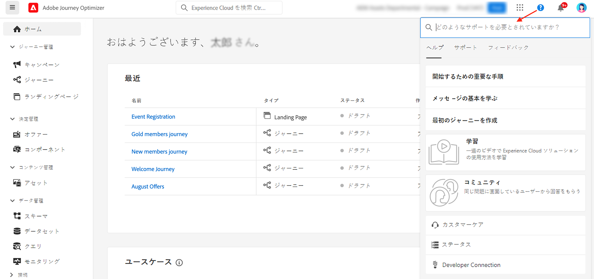

# ユーザーインターフェイス {#cjm-user-interface}

Adobe エクスペリエンス Cloud ](http://experience.adobe.com) に [ 接続して、を [!DNL Journey Optimizer] 参照してください。

ユーザーインターフェイスを表示するときの主な概念は、Adobe エクスペリエンスプラットフォームでよく使用されています。 [詳しくは、『 Adobe エクスペリエンスプラットフォームマニュアル ](https://experienceleague.adobe.com/docs/experience-platform/landing/platform-ui/ui-guide.html#adobe-experience-platform-ui-guide) {target = &quot;_blank&quot;} 参照してください。

ユーザーインターフェイスで使用可能なコンポーネントと機能は、アクセス許可 ](../administration/permissions.md) によって異なります。 licencing package ](https://helpx.adobe.com/legal/product-descriptions/adobe-journey-optimizer.html) ({target = _blank &quot;) に [ よって異なり [ ます。どのような場合でも、ご不明な点がある場合は、Adobe カスタマーの成功についてご連絡ください。

>[!NOTE]
>
>このマニュアルは、製品のユーザーインターフェイスに最新の変更が反映されるように頻繁に更新されています。 ただし、一部のスクリーンショットはユーザーインターフェイスと多少異なる場合があります。

## 左側のナビゲーション {#left-nav}

Access の機能にアクセス [!DNL Journey Optimizer] するには、左側のリンクを参照してください。

>[!NOTE]
>
>使用できる機能は、アクセス許可と使用許諾契約によって異なります。

以下に示すのは、左側のナビゲーションに表示可能なサービスと機能の一覧と、関連するヘルプページへのリンクです。

**オート**

[!DNL Journey Optimizer] ホームページには、開始する主要なリンクとリソースが含まれています。 **[!UICONTROL Recents]**&#x200B;このリストでは、最近作成したイベントおよび journeys に対するショートカットが表示されます。このリストには、作成日と修正日およびステータスが表示されます。

**[!UICONTROL JOURNEY MANAGEMENT]**

* **[!UICONTROL Journeys]** -お客様の journeys を作成し、構成して、オーケストレーションを行います。 [詳細情報](../building-journeys/journey-gs.md#jo-build)

* **[!UICONTROL Landing pages]** -ランディングページの作成、設計、テストおよびパブリッシュを行います。 [詳細情報](../landing-pages/get-started-lp.md)

**[!UICONTROL DECISION MANAGEMENT]**

* **[!UICONTROL Offers]** -最新のソースおよびデータセットにアクセスするには、このメニューを参照してください。 このセクションを使用して、新しいオファーを作成します。 [詳細情報](../offers/offer-library/creating-personalized-offers.md)

* **[!UICONTROL Components]** -配置、ルール、タグを作成します。 [詳細情報](../offers/offer-library/key-steps.md)

**[!UICONTROL CONTENT MANAGEMENT]**

* **[!UICONTROL Assets]**[!DNL Adobe Experience Manager Assets Essentials]&#x200B;は、メッセージを作成するために使用できるアセットの一元的なリポジトリです。[詳細情報](../email/assets-essentials.md)

**[!UICONTROL DATA MANAGEMENT]**

* **[!UICONTROL Schemas]** -Adobe エクスペリエンスプラットフォームを使用すると、スキーマエディターと呼ばれるインタラクティブなビジュアルキャンバスで、経験データモデル (XDM) スキーマを作成および管理できます。 [詳細情報](../data/get-started-schemas.md)

* **[!UICONTROL Datasets]** -Adobe エクスペリエンスプラットフォームに ingested れるデータはすべて、データセットとして Data Lake 内に保存されます。 データセットは、データのコレクション (通常はテーブルで、スキーマ (列) とフィールド (行) が含まれるテーブル) の格納と管理の構成要素です。 [詳細情報](../data/get-started-datasets.md)

* **[!UICONTROL Queries]** -Adobe エクスペリエンス Platform Query サービスを使用して、クエリーを作成して実行し、以前に実行したクエリーを表示し、ユーザーによって保存されたクエリーを組織内に保存します。 [詳細情報](../data/get-started-queries.md)

* **[!UICONTROL Monitoring]** このメニューを使用して、Adobe エクスペリエンスプラットフォームのユーザーインターフェイス内のデータの取り込みを監視します。 詳しくは、target = &quot;_blank 「}」を参照してください。

**[!UICONTROL CONNECTIONS]**

* **[!UICONTROL Sources]** このメニューを使用して、Adobe アプリケーション、クラウドベースの記憶域、データベース、その他のソースからデータを取り込み、その他の情報を提供します。このメニューを使用して、着信データを提供します。 [詳細情報](get-started-sources.md)

**[!UICONTROL CUSTOMER]**

* **[!UICONTROL Segments]** -エクスペリエンスプラットフォームセグメントの定義を作成および管理し、それらを journeys に活用します。 [詳細情報](../segment/about-segments.md)

* **[!UICONTROL Profiles]** -「リアルタイム」カスタマー・プロファイルによって、各お客様の全体像を把握し、オンライン、オフライン、CRM、サードパーティのデータを含む複数のチャネルのデータを組み合わせることができます。 [詳細情報](../segment/get-started-profiles.md)

* **[!UICONTROL Identities]** -Adobe エクスペリエンス Platform Identity サービスによって、デバイス間、クロスチャネル、およびほぼリアルタイムでの顧客 id が管理されます。これは、Adobe エクスペリエンスプラットフォーム内の id グラフと呼ばれるものです。 [詳細情報](../segment/get-started-identity.md)

**[!UICONTROL ADMINISTRATION]**

* **[!UICONTROL Journey Administration]**&#x200B;このメニューを使用して、journeys で使用するイベント、データソース ](../datasource/about-data-sources.md) 、および [ アクション ](../action/action.md) を設定 [ し [ ます。 ](../event/about-events.md)

* **[!UICONTROL Sandboxes]** -Adobe エクスペリエンスプラットフォームによって、1つのインスタンスを別々の仮想環境に分割し、デジタルエクスペリエンスアプリケーションを開発および発展させることができます。 [詳細情報](../administration/sandboxes.md)

* **[!UICONTROL Alerts]** -ユーザーインターフェイスを使用すると、Adobe エクスペリエンス Platform Observability Insights によって明らかにされたメトリックスに基づいて、受信した警告の履歴を表示できます。 使用可能なアラートルールを表示したり、有効または無効にしたりすることもできます。 詳しくは、target = &quot;_blank 「}」を参照してください。

## 製品内使用例 {#in-product-uc}

ホームページからユースケースを活用 [!DNL Adobe Journey Optimizer] すると、お客様の旅をすばやく入力することができます。

使用可能な使用例を次に示します。

* **テストプロファイル** を作成し、CSV テンプレートを使用して、パーソナライズされたメッセージおよび journeys をテストするためのテストプロファイルを作成します。 このようなユースケース [ の実装方法については、このページ ](../segment/creating-test-profiles.md#use-case-1) を参照してください。
* **お客様に** 誕生日の電子メールを送信することができます。 (近日中)
* **新規** ユーザーに電子メールを送信することにより、新規登録顧客を歓迎する電子メールを送信することができます。 (近日中)
* **インポートされた得意** 先リストに push メッセージを送信すると、CSV ファイルからインポートされた顧客リストに、push 通知がすばやく送信されます。 (近日中)

各ユースケースについて詳しくは、ここをクリックし **[!UICONTROL View details]** てください。

**[!UICONTROL Begin]**&#x200B;ボタンをクリックして、ユースケースを起動します。

ボタンをクリックすると、実行されたユースケースに **[!UICONTROL View use case library]** アクセスできます。

## 機能{#accessibility}

の [!DNL Adobe Journey Optimizer] アクセシビリティ機能は、Adobe エクスペリエンスプラットフォームから継承されています。

* キーボードのアクセシビリティ
* カラーコントラスト
* 必須フィールドの検証

詳しくは、Adobe エクスペリエンス Platform マニュアルの「target =」 _blank 「」を参照してください。

では、次の [!DNL Journey Optimizer] 一般的なキーボードショートカットを使用できます。

| アクション | ショートカット |
| --- | --- |
| ユーザーインターフェイス要素、セクション、およびメニューグループ間の移動 | タブ |
| ユーザーインターフェイスのエレメント、セクション、およびメニューグループ間を後ろに移動する | Shift キーを押しながら Tab キーを押します。 |
| セクション内を移動して、個別のエレメントにフォーカスを設定します。 | ← |
| フォーカスのあるエレメントを選択または選択解除します。 | Enter キーまたはスペースバー |
| 選択範囲の取り消し、ペインの折りたたみ、またはダイアログボックスの終了 | Esc |

詳しくは、Adobe エクスペリエンス Platform マニュアルの「target =」 _blank 「」を参照してください。

これらのショートカットは、次のように、旅オプティマイザーの特定の部分で使用できます。

<table>
  <thead>
    <tr>
      <th>Interface エレメント</th>
      <th>アクション</th>
      <th>ショートカット</th>
    </tr>
  </thead>
  <tr>
    <td>Journeys、アクション、データソース、またはイベントのリスト</td>
    <td>「旅」、「アクション」、「データソース」または「イベント」の作成</td>
    <td>Iso-c</td>
  </tr>
  <tr>
    <td rowspan="3">下書き状態の旅キャンバス</td>
    <td>最初に使用可能な位置 (上から下) に、左パレットからアクティビティーを追加します。</td>
    <td>アクティビティをダブルクリックします。</td>
  </tr>
  <tr>
    <td>すべてのアクティビティを選択します。</td>
    <td>Ctrl + A (Windows)   Command + a キー (Mac os)</td>
  </tr>
  <tr>
    <td>選択した活動の削除</td>
    <td>削除または Backspace を入力してから、削除を確認するために Enter キーを押します。</td>
  </tr>
  <tr>
  <td rowspan="3">

次の要素の設定区画:

<ul>
  <li>旅のアクティビティ</li>
  <li>イベント</li>
  <li>データソース</li>
  <li>アクション</li>
</ul>

</td>
    <td>設定対象となる次のフィールドに移動します。</td>
    <td>タブ</td>
  </tr>
  <tr>
    <td>変更を保存して、構成ペインを閉じます。</td>
    <td>を</td>
  </tr>
  <tr>
    <td>変更を破棄して、configuration pane を閉じます。</td>
    <td>Esc</td>
  </tr>
  <tr>
    <td rowspan="4">テストモードでの旅</td>
    <td>テストモードの有効化または無効化</td>
    <td>Itu-t</td>
  </tr>
  <tr>
    <td>イベントベースの旅でイベントをトリガーします。</td>
    <td>~</td>
  </tr>
  <tr>
    <td>

このオプションがオンになっているセグメントベースの旅でイベントをトリガーし **[!UICONTROL Single profile at a time]** ます。

</td>
    <td>担当</td>
  </tr>
  <tr>
    <td>テストログの表示</td>
    <td>L</td>
  </tr>
<!-- //Ajouter ce raccourci quand il marchera (actuellement, le raccourci Ctrl/Cmd+F du navigateur a priorité sur celui de AJO).//
  <tr>
    <td>Page with a search bar</td>
    <td>Select the search bar</td>
    <td>Ctrl/Command + F</td>
  </tr>
-->
  <tr>
    <td>テキストフィールド</td>
    <td>選択したフィールド内のすべてのテキストを選択します。</td>
    <td>Ctrl + A (Windows)   Command + a キー (Mac os)</td>
  </tr>
  <tr>
    <td rowspan="2">ポップアップウィンドウ</td>
    <td>変更内容を保存する、または操作を確認する</td>
    <td>を</td>
  </tr>
  <tr>
    <td>ウィンドウを閉じます。</td>
    <td>Esc</td>
  </tr>
  <tr>
    <td>単純な式エディター</td>
    <td>フィールドを選択して追加する</td>
    <td>フィールドをダブルクリック</td>
  </tr>
  <tr>
    <td>XDM フィールド間のブラウズ</td>
    <td>ノードのすべてのフィールドを選択します。</td>
    <td>親ノードを選択します。</td>
  </tr>
  <tr>
    <td>ペイロードプレビュー</td>
    <td>ペイロードを選択します。</td>
    <td>Ctrl + A (Windows)   Command + a キー (Mac os)</td>
  </tr>
</table>

## ヘルプとサポートの検索 {#find-help}

「ホーム」ページの下部にある Adobe 旅オプティマイザーキーヘルプページにアクセスしてください。

ヘルプアイコンを使用して **** 、ヘルプページにアクセスします。サポートへのお問い合わせ、および共有フィードバックをご利用ください。 検索フィールドからヘルプ記事やビデオを検索することができます。

## サポートされているブラウザー {#browsers}

Adobe [!DNL Journey Optimizer] interface は、最新バージョンの Google Chrome で最適に機能するように設計されています。 古いバージョンや他のブラウザーで特定の機能を使用すると問題が発生することがあります。

## 言語設定 {#language-pref}

現在のユーザーインターフェイスは、次の言語で使用できます。

* 英語
* フランス語
* ドイツ語
* イタリア語
* スペイン語
* ポルトガル語 (ブラジル)
* 日本語
* 韓国語

デフォルトのインターフェイス言語は、ユーザープロファイルで指定されている言語によって異なります。

言語を変更するには:

* 右上にあるアバターから「環境設定 **」をクリックし** ます。
   
* 電子メールアドレスの下に表示されている言語をクリックします。
* 適切な言語を選択し、「保存 **」をクリック** します。使用しているコンポーネントが最初の言語でローカライズされていない場合は、2番目の言語を選択することもできます。
   

## 検索{#unified-search}

Adobe の旅のオプティマイザーインターフェイスからは、トップバーの中央にある統合された Adobe エクスペリエンスクラウド検索機能を使用して、アセット、journeys、データセットなどをサンドボックス全体にわたって検索できます。

トップの検索結果を表示するには、コンテンツの入力を開始します。 入力したキーワードに関するヘルプ記事も結果に表示されます。

Enter **キーを押す** と、すべての結果にアクセスして、ビジネスオブジェクトによるフィルター処理を実行できます。

## フィルターリスト{#filter-lists}

ほとんどのリストでは、検索バーを使用して特定のアイテムを検索し、フィルター条件を選択することができます。

フィルターにアクセスするには、リストの左上にある「フィルター」アイコンをクリックします。 「フィルター」メニューを使用すると、異なる条件に基づいて表示されたエレメントをフィルター処理できます。 特定のタイプまたはステータスのエレメントのみ、作成したエレメント、または過去30日間に修正したエレメントのみを表示することを選択できます。 オプションは状況によって異なります。

Journeys のリストでは、のステータス、タイプ、バージョンに応じて、 **[!UICONTROL Status and version filters]** から journeys にフィルターを適用することができます。 タイプには、、 **[!UICONTROL Business event]** **[!UICONTROL Segment qualification]** **[!UICONTROL Read segment]** 、、、のいずれか **[!UICONTROL Burst]** を使用でき **[!UICONTROL Unitary event]** ます。特定のイベント、フィールドグループまたは **[!UICONTROL Activity filters]** **[!UICONTROL Data filters]** を使用する journeys のみを表示するかどうかを選択できます。 では、 **[!UICONTROL Publication filters]** 「公開日」または「ユーザー」を選択できます。 例えば、昨日公開した最新バージョンのライブ journeys を表示するように選択することもできます。 [詳しく ](../building-journeys/using-the-journey-designer.md) は、こちらを参照してください。

>[!NOTE]
>
>表示される列は、リストの右上にある「設定」ボタンを使用してパーソナライズすることができます。 各ユーザーに対して個人用設定が保存されます。

「」および **[!UICONTROL Last update by]** 「」列は **[!UICONTROL Last update]** 、最新の journeys アップデートが発生したかどうかを確認するために使用されます。

「イベント」、「データソース」および「アクション」ウィンドウ **[!UICONTROL Used in]** のフィールドには、その特定のイベント、フィールドグループまたはアクションを使用している journeys の数が表示されます。 ボタンをクリック **[!UICONTROL View journeys]** すると、対応する journeys のリストが表示されます。

このリストでは、各エレメントについて基本的なアクションを実行することができます。 例えば、アイテムは複製または削除することができます。

