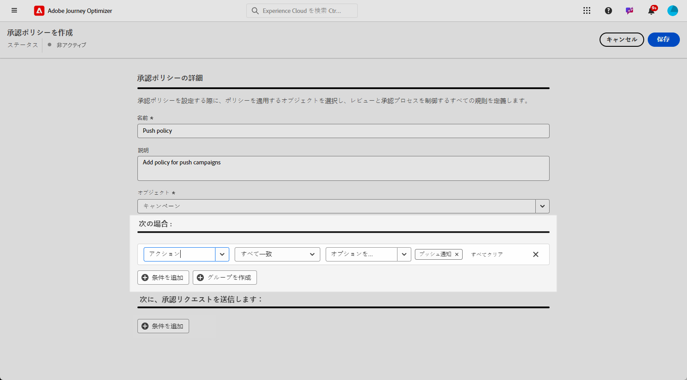
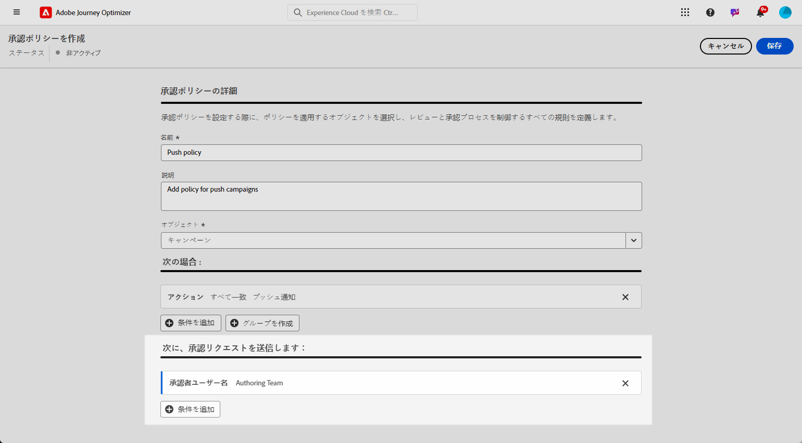
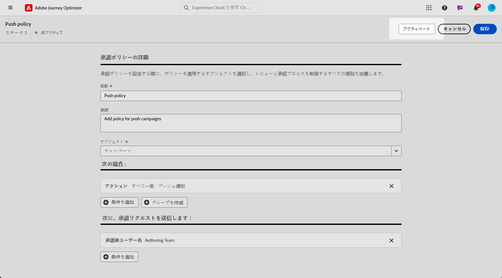

# 承認ポリシーの作成と管理 {#approval-policies}

>[!CONTEXTUALHELP]
>id="ajo_approval_policy_request_approval"
>title="承認をリクエスト"
>abstract="承認をリクエスト"

>[!CONTEXTUALHELP]
>id="ajo_approval_policy_request_change"
>title="変更をリクエスト"
>abstract="変更をリクエスト"

>[!NOTE]
>
>承認ポリシーを作成するには、Adobe Experience Platform のシステム管理者権限または製品管理者権限が必要です。[詳細情報](https://experienceleague.adobe.com/ja/docs/experience-platform/access-control/home)

承認ポリシーを使用すると、管理者はジャーニーとキャンペーンの検証プロセスを確立できます。このシステムは、ジャーニーまたはキャンペーンが承認を必要とするかどうかを決定する特定の条件の概要を示します。これらのポリシーは、単純にすべてのキャンペーンを特定のユーザーまたはチームによるレビューが必要となることから、キャンペーンの作成者に基づいて条件を設定することまで、複雑さが異なる場合があります。

## 承認ポリシーの作成 {#create-policies}

>[!CONTEXTUALHELP]
>id="ajo_permissions_approval_policy"
>title="新規承認ポリシー"
>abstract="この画面で、承認ポリシーの名前を入力し、コンテキストを選択してから、承認リクエストを開始できるユーザーと検証できるユーザーを決定する条件を作成します。"

承認ポリシーを作成するには、次の手順に従います。

1. Journey Optimizer の&#x200B;**[!UICONTROL 管理]**&#x200B;メニューから、**[!UICONTROL 権限]**／**[!UICONTROL ポリシー]**&#x200B;にアクセスします。

   

1. 「**[!UICONTROL 承認ポリシー]**」タブの「**[!UICONTROL 作成]**」をクリックし、「**[!UICONTROL 承認ポリシー]**」を選択して「**[!UICONTROL 確認]**」をクリックします。

1. ポリシーの「**[!UICONTROL 名前]**」と「**[!UICONTROL 説明]**」を入力します。

1. ポリシーを「**[!UICONTROL ジャーニー]**」に適用するか「**[!UICONTROL キャンペーン]**」に適用するかを選択します。

   

条件を調整して、承認リクエストを開始するユーザーと検証するユーザーを指定できるようになりました。

## 承認ポリシーの条件を設定 {#conditions}

承認ポリシーに関連付ける条件を定義するには、次の手順に従います。

1. **[!UICONTROL 承認ポリシー]**&#x200B;にアクセスします。

1. **[!UICONTROL If]** メニューの「**[!UICONTROL 条件を追加]**」をクリックして、承認リクエストをトリガーにするオブジェクトまたはユーザーを定義します。

1. 適切な「**[!UICONTROL カテゴリ]**」、「**[!UICONTROL 一致するルール]**」および「**[!UICONTROL オプション]**」を選択します。

   例えば、「If Action match any Direct Mail」や「If Requestor Username match John Doe」などです。

   

+++ 詳しくは、利用可能なカテゴリとオプションを参照してください。
   <table>
    <tr>
      <th>カテゴリ</th>
      <th>オプション</th>
    </tr>
    <tr>
      <td rowspan="3">キャンペーンのタイプ</td>
      <td>スケジュール済み（マーケティング）</td>
    </tr>
    <tr>
    <td>API トリガー（マーケティング）</td>
    </tr>
    <tr>
    <td>API トリガー（トランザクション）</td>
    </tr>
    <tr>
    <td rowspan="8">アクション</td>
    <td>アプリ内</td>
    </tr>
    <tr>
    <td>プッシュ通知</td>
   </tr>
    <tr>
    <td>SMS</td>
    </tr>
    <tr>
    <td>メール</td>
    </tr>
    <tr>
    <td>ダイレクトメール</td>
    </tr>
    <tr>
    <td>Web</td>
    </tr>
    <tr>
    <td>コードベース</td>
    </tr>
    <tr>
    <td>コンテンツカード</td>
    </tr>
    <tr>
    <td>タグ</td>
    <td>オーディエンスを整理するために使用されるタグの名前。 </td>
    </tr>
    <tr>
    <td>オブジェクト名</td>
    <td>オブジェクトの名前</td>
    </tr>
    <tr>
    <td>依頼者のユーザー名</td>
    <td>設計された依頼者の名前とメールアドレス</td>
    </tr>
    <tr>
    <td>依頼者のユーザーグループ</td>
    <td>設計された依頼者のユーザーグループの名前</td>
    </tr>
    </table>

1. 条件を追加するには、「**[!UICONTROL 条件を追加]**」をクリックして追加のルールを定義し、「**[!UICONTROL And]**」または「**[!UICONTROL Or]**」を選択して条件の接続方法を指定します。

1. **[!UICONTROL 次に、承認リクエストを送信する]**&#x200B;メニューの「**[!UICONTROL 条件を追加]**」をクリックして、承認リクエストを承認できるユーザーを定義します。

1. **[!UICONTROL カテゴリ]**&#x200B;ドロップダウンから、ユーザーグループを選択するか個人ユーザーを選択するかを選択します。

1. 次に、**[!UICONTROL オプション]**&#x200B;ドロップダウンから、特定のユーザーグループまたはユーザーを選択します。

   選択したユーザーまたはユーザーグループが、承認リクエストを検証することになります。

   

1. 条件を追加するには、「**[!UICONTROL 条件を追加]**」をクリックして追加のルールを定義し、「**[!UICONTROL And]**」または「**[!UICONTROL Or]**」を選択して条件の接続方法を指定します。

1. ポリシーを完全に設定したら、「**[!UICONTROL 保存]**」をクリックします。

これで、承認ポリシーをアクティブ化して適用できるようになりました。

## 承認ポリシーのアクティブ化と管理 {#activate-policies}

承認ポリシーを適用するには、アクティブ化する必要があります。これを行うには、次の手順に従います。

1. 「**[!UICONTROL 承認ポリシー]**」にアクセスします。

1. 次に、「**[!UICONTROL アクティブ化]**」をクリックして、設定した条件を環境に適用します。

   >[!NOTE]
   >
   >アクティブ化したポリシーは編集できません。条件を変更するには、まずポリシーを非アクティブ化します。

   

1. **[!UICONTROL ポリシー]**&#x200B;メニューから、必要に応じてポリシーの詳細オプションを開いて&#x200B;**[!UICONTROL 編集]**、**[!UICONTROL 非アクティブ化]**、**[!UICONTROL 複製]**&#x200B;を実行します。

   
