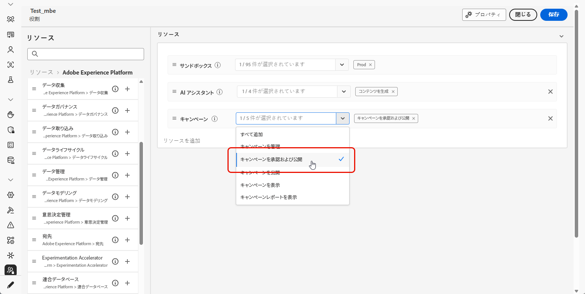
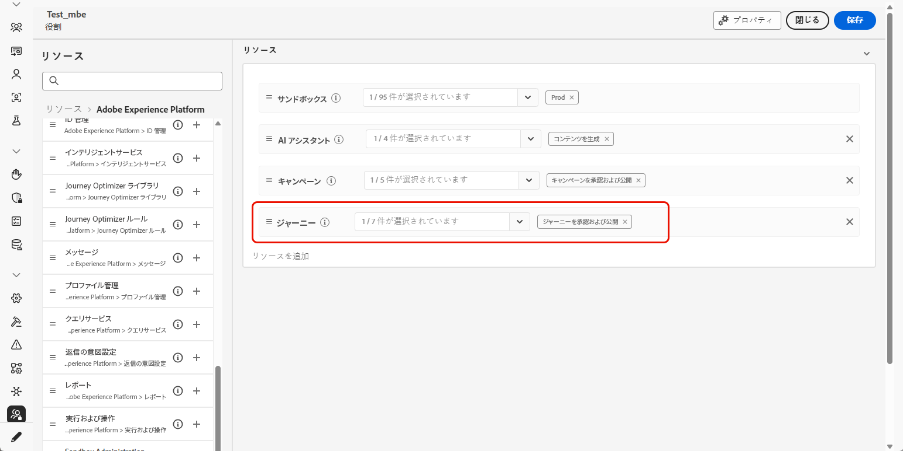
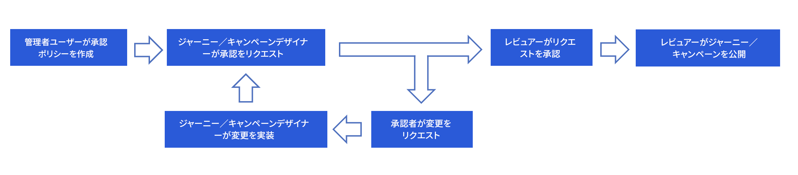
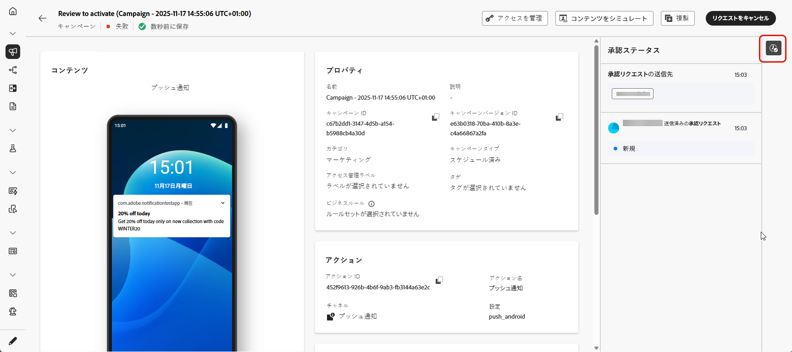

# ジャーニーとキャンペーンの承認の基本を学ぶ {#send-proofs}

## 承認ポリシーの基本を学ぶ {#gs}

[!DNL Journey Optimizer] では、マーケティングチームはキャンペーンとジャーニーが運用開始前に適切な関係者によってレビューされ、署名されていることを確認できる承認プロセスを設定できます。

承認ポリシーを使用すると、ユーザーインターフェイス内に直接構造化されたワークフローが導入されるので、メールやタスク管理ツールなどの外部メディアが不要になり、すべての承認が一元的に管理および追跡されます。

さらに、この機能により、ジャーニーとキャンペーンの公開に対する制御が強化されます。Journey Optimizer に組み込まれた承認プロセスにより、キャンペーンとジャーニーはレビュー中に「ロック」状態に保たれ、必要なすべての承認が完了する前に変更や意図しないアクティブ化が行われなくなります。

## 前提条件 {#prerequisites}

開始する前に、以下の権限が設定されていることを確認してください。

ジャーニーおよびキャンペーンの承認と公開にアクセスするには、ユーザーに&#x200B;**キャンペーンの承認と公開**&#x200B;および&#x200B;**ジャーニーの承認と公開**&#x200B;の権限を付与する必要があります。 [詳細情報](../administration/permissions.md)

+++  承認関連の権限を割り当てる方法を学ぶ

1. **権限**&#x200B;付きの製品で、「**役割**」タブに移動し、目的の「**役割**」を選択します。

1. 「**編集**」をクリックして、権限を変更します。

1. **キャンペーン**&#x200B;リソースを追加し、ドロップダウンメニューから「**キャンペーンの承認と公開**」を選択します。

   {zoomable="yes"}

1. **ジャーニー**&#x200B;リソースを追加して、ドロップダウンメニューから「**ジャーニーの承認と公開**」を選択します。

   {zoomable="yes"}

1. 「**保存**」をクリックして、変更を適用します。

この役割に既に割り当てられているユーザーの権限は、自動的に更新されます。

1. この役割を新しいユーザーに割り当てるには、**役割**&#x200B;ダッシュボード内の「**ユーザー**」タブに移動し、「**ユーザーを追加**」をクリックします。

1. ユーザーの名前、メールアドレスを入力するか、リストから選択して、「**保存**」をクリックします。

1. まだユーザーを作成していない場合は、[このドキュメント](https://experienceleague.adobe.com/ja/docs/experience-platform/access-control/abac/permissions-ui/users)を参照してください。

ユーザーは、インスタンスにアクセスする手順が記載されたメールを受信します。

+++

## 承認プロセスの概要 {#process}

グローバルな承認プロセスは以下のようになります。

{zoomable="yes"}

1. **承認ポリシーの設定**

   管理者ユーザーは、ジャーニーまたはキャンペーンに適用するポリシーの条件を定義して、承認ポリシーを作成します。 例えば、特定のユーザーが作成したすべてのスケジュール済みキャンペーンをアクティブ化する前に承認する必要がある承認ポリシーを作成できます。 [承認ポリシーの作成方法を学ぶ](approval-policies.md)

1. **承認用のキャンペーン／ジャーニーの送信**

   キャンペーン／ジャーニー作成者がジャーニーまたはキャンペーンを作成し、承認用に送信します。 キャンペーン／ジャーニーは「レビュー中」状態になり、その間はリクエストがキャンセルされない限り編集できません。 [承認をリクエストする方法を学ぶ](request-approval.md)

   >[!NOTE]
   >
   >キャンペーンとジャーニーは、承認ポリシーが設定されている場合にのみ、承認用に送信する必要があります。 そのようなポリシーが適用されない場合、作成者は、承認を必要とせずにキャンペーンまたはジャーニーを直接公開できます。

1. **レビューと承認**

   ジャーニーまたはキャンペーンに適用される承認ポリシーで定義された承認者が通知を受け取ります。 ジャーニーまたはキャンペーンのコンテンツ、オーディエンス、設定を確認できます。 変更が必要な場合は、承認者がリクエストし、キャンペーンを修正用に「ドラフト」に戻します。 準備ができている場合は、ジャーニーまたはキャンペーンをアクティブ化して開始できます。 [リクエストのレビューと承認の方法について学ぶ](review-approve-request.md)

## 承認リクエストの監視 {#monitor}

特定のジャーニーまたはキャンペーンに対して送信されたすべての承認および変更リクエストを監視できます。 これを行うには、ジャーニーキャンバスまたはキャンペーンレビュー画面の右上のセクションにある「**[!UICONTROL 監査記録を表示]**」アイコンをクリックします。

## よくある質問 {#faq}

+++キャンペーンやジャーニーごとに承認ポリシーを作成する必要がありますか？

いいえ。 承認ポリシーは条件付きです。 特定のキャンペーンやジャーニー（特定のチームによって作成されたすべてのスケジュール済みキャンペーンなど）に対してレビューを実施する場合にのみ、ポリシーを作成する必要があります。 キャンペーンやジャーニーに適用されるポリシーがない場合、作成者は承認を求めることなく直接公開できます。

+++

+++承認者が不在の場合はどうなりますか？

承認者が対応するまで、リクエストは「レビュー中」のままになります。 リクエストをキャンセルし（項目を「ドラフト」に戻し）、適切な承認者が対応可能になったら再送信できます。 また、管理者は、承認ポリシーを更新して、承認者を追加することもできます。

+++

+++承認待ちのキャンペーンやジャーニーを編集できますか？

いいえ。 承認リクエストを送信した後、キャンペーンやジャーニーは「レビュー中」の状態となり、変更できません。 変更を行うには、作成者または承認者が最初にリクエストをキャンセルする必要があります。 項目は「ドラフト」に戻り、再送信する前に編集できます。

+++

+++ドロップダウンに承認と公開権限が表示されません。何を確認すればよいですか？

最初に、正しいリソースを追加していることを確認します。 **キャンペーンを承認および公開**&#x200B;権限には、役割に&#x200B;**キャンペーン**&#x200B;リソースを追加する必要があり、**ジャーニーを承認および公開**&#x200B;権限には、**ジャーニー**&#x200B;リソースを追加する必要があります。 どちらも個別に追加する必要があります。 [承認関連の権限を割り当てる方法の詳細情報](#prerequisites)

+++

+++[!DNL Journey Optimizer] は、複数の承認ポリシーが一致する可能性がある場合、適用する承認ポリシーをどのように判断するのですか？

同じジャーニーまたはキャンペーンに複数の承認ポリシーが適用される可能性がある場合、**最後にアクティブ化**&#x200B;したポリシーが優先されます。 そのポリシーで定義されている承認者ユーザーグループに通知が送信され、リクエストの承認権限が付与されます。

[詳細情報](approval-policies.md#multiple-policies)

+++

+++依頼者が複数のユーザーグループに属している場合、承認リクエストの送信先グループを選択できますか？

いいえ。 依頼者は、承認リクエストの受信先またはルーティング先となるユーザーグループを手動で選択できません。 適用される承認ポリシーで指定されたユーザーグループに（[ポリシーの優先順位に従って](approval-policies.md#multiple-policies)）自動的に通知されます。

+++

## その他のリソース

* **[承認ポリシーの作成](approval-policies.md)** - キャンペーンとジャーニーでレビューワークフローを実施するための承認ポリシーの設定方法について説明します。
* **[承認のリクエスト](request-approval.md)** - 承認用にコンテンツを送信し、承認ステータスを追跡する方法について説明します。
* **[リクエストのレビューと承認](review-approve-request.md)** - 承認者として承認リクエストをレビュー、承認または却下する方法について説明します。
* **[サンプル入力でのシミュレート](simulate-sample-input.md)** - サンプルプロファイルデータを使用してコンテンツをテストおよび検証する方法について説明します。
