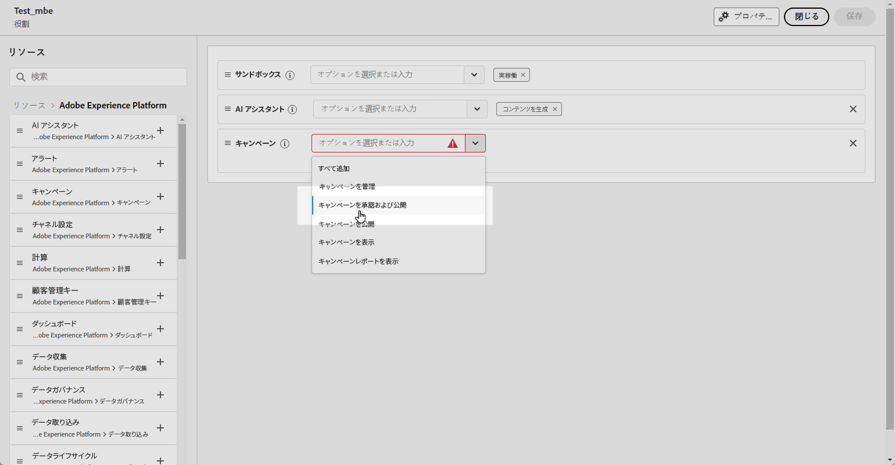
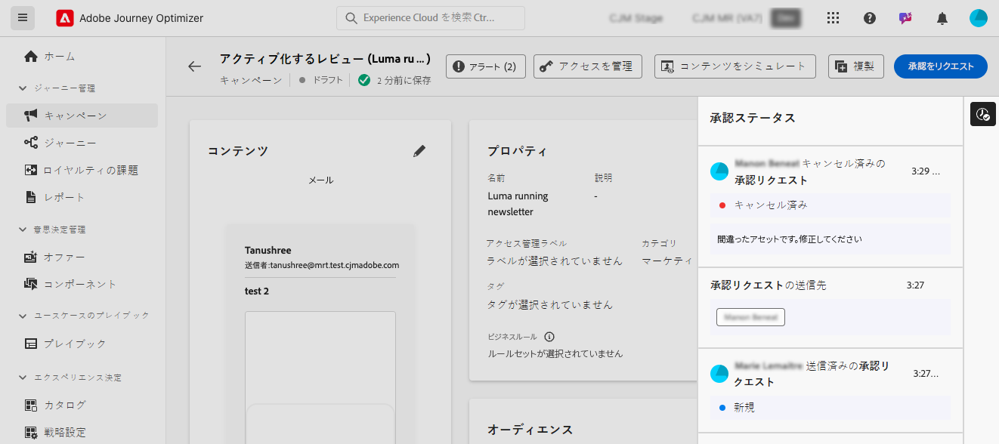

# ジャーニーとキャンペーンの承認の概要 {#send-proofs}

>[!AVAILABILITY]
>
> 承認ポリシーは現在、一連の組織でのみ使用できます（使用制限あり）。 アクセスするには、アドビ担当者にお問い合わせください。

## 承認ポリシーの基本を学ぶ {#gs}

Journey Optimizerでは、マーケティングチームが、キャンペーンやジャーニーが実稼動前に、適切な関係者にレビューされサインオフされたことを確認できる承認プロセスを設定できます。

承認ポリシーを使用すると、ユーザーインターフェイス内で直接構造化されたワークフローが導入されるので、メールやタスク管理ツールなどの外部メディアが不要になり、すべての承認が一元的に管理および追跡されます。

さらに、この機能により、ジャーニーとキャンペーンの公開に対する制御が強化されます。Journey Optimizerに組み込まれた承認プロセスにより、キャンペーンとジャーニーはレビュー中に「ロック」ステートのままになり、必要なすべての承認が行われる前に変更や意図しないアクティベーションが行われなくなります。

## 前提条件 {#prerequisites}

開始する前に、以下の権限が設定されていることを確認してください。

ジャーニーおよびキャンペーンの承認と公開にアクセスするには、ユーザーに **キャンペーンの承認と公開** および **ジャーニーの承認と公開** 権限を付与する必要があります。 [詳細情報](../administration/permissions.md)

+++  承認関連の権限を割り当てる方法を学ぶ

1. **権限**&#x200B;付きの製品で、「**役割**」タブに移動し、目的の「**役割**」を選択します。

1. 「**編集**」をクリックして、権限を変更します。

1. **キャンペーン** リソースを追加し、ドロップダウンメニューから **キャンペーンを承認および公開** を選択します。

   {zoomable="yes"}

1. **ジャーニー** リソースを追加して、ドロップダウンメニューから **ジャーニーを承認して公開** を選択します。

   {zoomable="yes"}

1. 「**保存**」をクリックして、変更を適用します。

この役割に既に割り当てられているユーザーの権限は、自動的に更新されます。

1. この役割を新しいユーザーに割り当てるには、**役割**&#x200B;ダッシュボード内の「**ユーザー**」タブに移動し、「**ユーザーを追加**」をクリックします。

1. ユーザーの名前、メールアドレスを入力するか、リストから選択して、「**保存**」をクリックします。

1. まだユーザーを作成していない場合は、[このドキュメント](https://experienceleague.adobe.com/ja/docs/experience-platform/access-control/abac/permissions-ui/users)を参照してください。

ユーザーは、インスタンスにアクセスする手順が記載されたメールを受信します。

+++

## 承認プロセスの概要 {#process}

グローバル承認プロセスは次のとおりです。

{zoomable="yes"}

1. **承認ポリシーの設定**

   管理者ユーザーは、ジャーニーまたはキャンペーンにポリシーを適用する条件を定義して、承認ポリシーを作成します。 例えば、特定のユーザーが作成したすべてのスケジュール済みキャンペーンをアクティブ化する前に承認する必要がある承認ポリシーを作成できます。 [ 承認ポリシーの作成方法を説明します ](approval-policies.md)

1. **承認用のキャンペーン/ジャーニーの送信**

   キャンペーン/ジャーニー作成者がジャーニーまたはキャンペーンを作成し、承認用に送信します。 キャンペーン/ジャーニーは「レビュー中」状態になり、その間はリクエストがキャンセルされない限り編集できません。 [ 承認をリクエストする方法を説明します ](request-approval.md)。

   >[!NOTE]
   >
   >キャンペーンとジャーニーは、承認ポリシーが設定されている場合にのみ、承認用に送信する必要があります。 そのようなポリシーが適用されない場合、作成者は、承認を必要とせずにキャンペーンまたはジャーニーを直接公開できます。

1. **レビューと承認**

   ジャーニーまたはキャンペーンに適用される承認ポリシーで定義された承認者が通知を受け取ります。 ジャーニーまたはキャンペーンのコンテンツ、オーディエンス、設定を確認できます。 変更が必要な場合は、承認者が変更をリクエストし、キャンペーンを修正用に「ドラフト」に戻します。 準備ができている場合は、ジャーニーまたはキャンペーンをアクティブ化して開始できます。 [ リクエストのレビューと承認の方法について説明します ](review-approve-request.md)。

## 承認要求の監視 {#monitor}

特定のジャーニーまたはキャンペーンに対して送信されたすべての承認および変更リクエストを監視できます。 これを行うには、ジャーニーキャンバスまたはキャンペーンレビュー画面の右上セクションにある「**[!UICONTROL 監査記録を表示]**」ボタンをクリックします。

