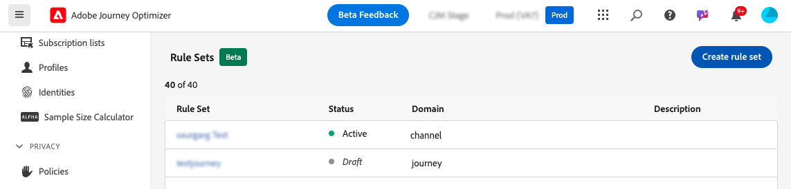

# ジャーニーのキャッピングと判別 {#journey-capping}

>[!BEGINSHADEBOX]

このドキュメントガイドの内容は次のとおりです。

* [競合管理と優先順位付けの概要](gs-conflict-prioritization.md)
* [ジャーニーとキャンペーンで発生する可能性のある競合を検出](conflicts.md)
* [ジャーニーとキャンペーンへの優先度スコアの割り当て](priority-scores.md)
* **[ジャーニーのキャッピングと判別](journey-capping.md)**

>[!ENDSHADEBOX]

>[!AVAILABILITY]
>
>競合管理および優先順位付けツールは、現在、一部のユーザーのみが限定提供（LA）として利用できます。

ジャーニーキャッピングを使用すると、プロファイルを登録できるジャーニーの数を制限し、通信が過負荷になるのを防ぐことができます。 Journey Optimizerでは、次の 2 種類のキャッピングルールを設定できます。

* **エントリキャッピング** は、プロファイルに対して指定された期間のジャーニーエントリ数を制限します。
* **同時実行キャッピング** は、プロファイルを同時に登録できるジャーニーの数を制限します。

どちらのタイプのジャーニーキャッピングも、優先度スコアを利用してエントリを調停します。

## ジャーニーキャッピングルールの作成 {#create-rule}

ジャーニーキャッピングルールを作成するには、次の手順に従います。

1. **[!UICONTROL ビジネス・ルール（Beta）]** メニューに移動し、ルール・セットのインベントリにアクセスします。

1. キャッピングルールを追加するルールセットを選択するか、新しいルールセットを作成します。

   * 既存のルールセットを使用するには、リストから選択します。 ジャーニーキャッピングルールは、「ジャーニー」ドメインを持つルールセットにのみ追加できます。 この情報は、ルールセットのリストの **[!UICONTROL ドメイン]** 列で確認できます。

     

   * 新しいルールセット内にキャッピングルールを作成するには、「**[!UICONTROL ルールセットを作成]**」をクリックし、ルールセットの一意の名前を指定して、「**[!UICONTROL ルールセットのドメイン]**」ドロップダウンから「ジャーニー」を選択して、「**[!UICONTROL 保存]**」をクリックします。

     

1. ルールセット画面で「**[!UICONTROL ルールを追加]**」ボタンをクリックして、必要に応じてルールを設定します。

   

   * ルールの一意の名前を指定します。

   * **[!UICONTROL ルールタイプ]** ドロップダウンリストで、ルールのキャッピングのタイプを指定します。

      * **[!UICONTROL ジャーニーエントリの上限]**: プロファイルに対して指定された期間にジャーニーにエントリするエントリ数を制限します。
      * **[!UICONTROL ジャーニー同時実行性の上限]**：プロファイルを同時に登録できるジャーニーの数を制限します。

   * 以下の節を展開して、キャッピングの各タイプを設定する方法を確認してください。

     +++ジャーニーエントリキャッピングルールの設定

      1. **[!UICONTROL キャッピング]** フィールドに、プロファイルが入力できるジャーニーの最大数を設定します。
      1. 「**[!UICONTROL 期間]**」フィールドに、考慮する期間を定義します。 期間は UTC タイムゾーンに基づいていることに注意してください。 例えば、1 日の上限は午前 0 時（UTC）にリセットされます。

     この例では、プロファイルが 1 か月に「5」を超えるジャーニーにエントリすることを制限します。

     

     >[!NOTE]
     >
     >システムでは、この同じルールが適用される今後のスケジュール済みジャーニーの優先度を考慮します。
     >
     >この例では、マーケターが既に 4 つのジャーニーにエントリし、今月には優先度が高い別のスケジュールされたジャーニーが予定されている場合、優先度が低いジャーニーにエントリすることは顧客に対して抑制されます。

+++

     +++ジャーニーの同時実行キャッピングルールの設定

      1. **[!UICONTROL キャッピング]** フィールドで、プロファイルを同時に登録できるジャーニーの最大数を設定します。

      1. **[!UICONTROL 優先順位付けの先読み]** フィールドを使用し、選択した期間（1 日、7 日、30 日など）の優先度スコアに基づいてジャーニーエントリをアービトレートします。 これは、プロファイルが複数のジャーニーに対して適格な場合、より価値の高いジャーニーへのエントリを優先順位付けするのに役立ちます。

     この例では、同じルールセットを含む別のジャーニーに既に登録されているプロファイルがジャーニーにエントリするのを制限します。 次の 7 日以内の別のジャーニーの優先度スコアが高い場合、プロファイルはこのジャーニーにエントリしません。

     {width="50%" zommable="yes"}

+++

1. キャッピングルールをジャーニーに適用する準備ができたら、名前の横にある省略記号ボタンをクリックしてアクティブにします。

   

1. 画面の右上隅にある「ルールを追加」ボタンの横の省略記号ボタンをクリックして、ルールセット全体をアクティブにします。

   {width="50%" zommable="yes"}

## ジャーニーへのキャッピングルールの適用 {#apply-capping}

キャッピングルールをジャーニーに適用するには、ジャーニーにアクセスしてプロパティを開きます。 **[!UICONTROL キャッピングルール]** ドロップダウンで、関連するルールセットを選択します。

ジャーニーがアクティブ化されると、ルールセットで定義されたキャッピングルールが有効になります。

>[!IMPORTANT]
>
>ジャーニーがすぐにアクティブ化された場合、システムが顧客の抑制を開始するまで最大 15 分かかる場合があります。 この可能性を防ぐために、少なくとも 15 分後にジャーニーを開始するようにスケジュールできます。
