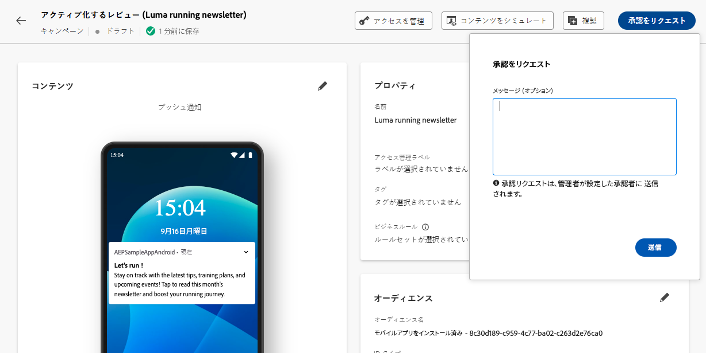
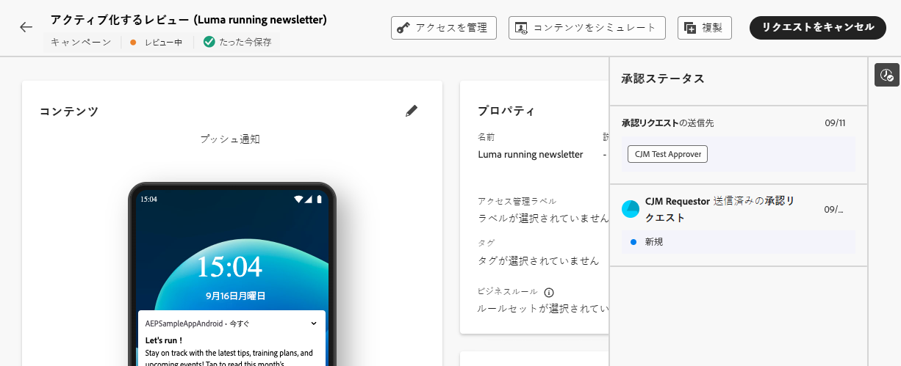
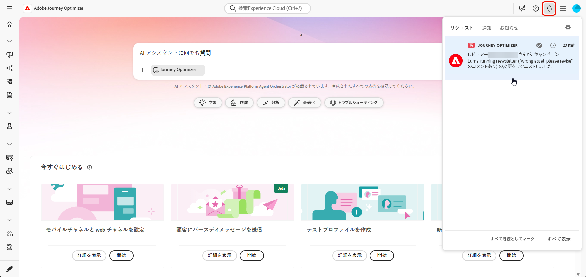

# 承認をリクエスト {#request-approval}

承認ワークフローへのアクセスは、特定のユースケースによって決まります。

* **アクティブな承認ポリシーがない場合**

   * **キャンペーン**：サンドボックス内のキャンペーンオブジェクトに対してアクティブな承認ポリシーがない場合、キャンペーンには「**[!UICONTROL アクティベート]**」ボタンが表示され、承認を必要とせずにキャンペーンをアクティベートできます。

   * **ジャーニー**：ジャーニーオブジェクトに対してアクティブな承認ポリシーがない場合、ジャーニーには「**[!UICONTROL 公開]**」ボタンが表示され、直接公開できます。

* **アクティブな承認ポリシーがある場合**

   * **キャンペーン**：サンドボックス内のキャンペーンオブジェクトにアクティブな承認ポリシーが 1 つ以上存在する場合、そのサンドボックス内のすべてのキャンペーンに「**[!UICONTROL 承認をリクエスト]**」ボタンが表示されます。
「**[!UICONTROL 承認をリクエスト]**」ボタンをクリックしたときに、選択したオブジェクトに承認ポリシーが適用されない場合、自動承認ワークフローがトリガーされます。

   * **ジャーニー**：サンドボックス内のジャーニーオブジェクトにアクティブな承認ポリシーが 1 つ以上存在する場合、すべてのジャーニーに「**[!UICONTROL 承認をリクエスト]**」ボタンが表示されます。
「**[!UICONTROL 承認をリクエスト]**」ボタンをクリックしたときに、選択したオブジェクトに承認ポリシーが適用されない場合、自動承認ワークフローがトリガーされます。

## 承認リクエストを送信

キャンペーンまたはジャーニーを作成したら、「**[!UICONTROL 承認をリクエスト]**」ボタンをクリックします。 これにより、キャンペーンまたはジャーニーに適用されるアクティブな承認ポリシーがサンドボックス内にあるかどうかが確認されます。

* 該当する承認ポリシーが見つかった場合、キャンペーンまたはジャーニーはレビュー用に送信されます。

* 「**[!UICONTROL 承認をリクエスト]**」ボタンをクリックした後、キャンペーンまたはジャーニーに承認ポリシーが適用されない場合、キャンペーンまたはジャーニーは自動的に承認され、アクティベートまたは公開されます。

「**[!UICONTROL 承認をリクエスト]**」ペインが開きます。 必要に応じて承認者にメッセージを入力し、「**[!UICONTROL 送信]**」をクリックしてリクエストを送信します。

キャンペーンまたはジャーニーが「**[!UICONTROL レビュー中]**」状態の間は、承認リクエストをキャンセルするオプションがあります。 「**[!UICONTROL リクエストをキャンセル]**」ボタンをクリックすると、キャンペーンまたはジャーニーがドラフトステージに戻り、リクエストがキャンセルされたことを知らせる通知がレビュー担当者に送信されます。 その後、必要な編集を行い、キャンペーンまたはジャーニーを再送信して承認を得ることができます。

## 承認要求の管理

承認リクエストが承認者に送信されたら、承認者はそれを確認し、ジャーニーやキャンペーンをアクティブ化して本番稼動させるか、必要に応じて変更を要求することができます。 [詳しくは、リクエストのレビューと承認の方法を参照してください。](review-approve-request.md)

承認者から変更のリクエストがある場合、メールと Journey Optimizer アラートで通知されます。これには、画面右上の「**[!UICONTROL リクエスト]**」タブのベルアイコンをクリックするとアクセスできます。

変更リクエストを実行するには、メールまたはアラートからリクエストを開いてジャーニーまたはキャンペーンにアクセスし、リクエストに応じた変更を行います。 ジャーニー／キャンペーンを再度レビューに送信する準備が整ったら、「**[!UICONTROL 承認をリクエスト]**」ボタンを使用して新しい承認リクエストを送信します。
