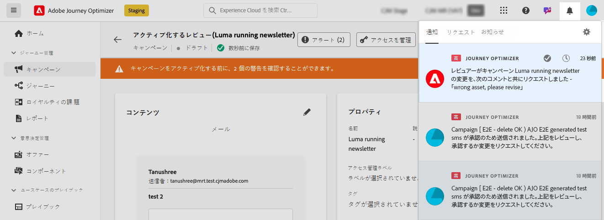

# 承認のリクエスト {#request-approval}

承認ワークフローへのアクセスは、特定のユースケースによって決まります。

* **アクティブな承認ポリシーがありません**

   * **キャンペーン**：サンドボックス内のキャンペーンオブジェクトに対してアクティブな承認ポリシーがない場合、キャンペーンには「**[!UICONTROL アクティブ化]**」ボタンが表示され、承認を必要とせずにアクティブ化できます。

   * **ジャーニー**：承認オブジェクトに対してアクティブなジャーニーポリシーがない場合、ジャーニーには「**[!UICONTROL Publish]**」ボタンが表示され、直接公開できます。

* **アクティブな承認ポリシーが存在します**

   * **キャンペーン**：サンドボックス内のキャンペーンオブジェクトにアクティブな承認ポリシーが 1 つ以上存在する場合、そのサンドボックス内のすべてのキャンペーンには「**[!UICONTROL 承認をリクエスト]**」ボタンが表示されます。 つまり、承認がないとキャンペーンを直接アクティブ化することはできません。

   * **ジャーニー**：サンドボックス内のジャーニーオブジェクトにアクティブな承認ポリシーが 1 つ以上存在する場合、すべてのジャーニーに「**[!UICONTROL 承認をリクエスト]**」ボタンが表示されます。 キャンペーンと同様に、承認ポリシーがアクティブな場合は、ジャーニーを直接公開できません。

## 承認要求の送信

キャンペーンまたはジャーニーを作成したら、「**[!UICONTROL 承認をリクエスト]** ボタンをクリックします。 これにより、キャンペーンまたはジャーニーに適用されるアクティブな承認ポリシーがサンドボックス内にあるかどうかが確認されます。

* 該当する承認ポリシーが見つかった場合、キャンペーンまたはジャーニーはレビュー用に送信されます。

* 「承認をリクエスト **[!UICONTROL ボタンをクリックした後、キャンペーンまたはジャーニーに承認ポリシーが適用されない場合、キャンペーンまたはジャーニーは自動的に承認され、アクティブ化または公開されます]**。

「**[!UICONTROL 承認をリクエスト]**」ペインが開きます。必要に応じて承認者にメッセージを入力し、「**[!UICONTROL 送信]**」をクリックしてリクエストを送信します。

キャンペーンまたはジャーニーが「**[!UICONTROL レビュー中]**」状態の間は、承認リクエストをキャンセルするオプションがあります。**[!UICONTROL リクエストをキャンセル]** ボタンをクリックすると、キャンペーンまたはジャーニーがドラフトステージに戻り、リクエストがキャンセルされたことを知らせる通知がレビュー担当者に送信されます。 その後、必要な編集を行い、キャンペーンまたはジャーニーを再送信して承認を得ることができます。

## 承認リクエストの管理

承認リクエストが承認者に送信されたら、レビューし、ジャーニー／キャンペーンをアクティブ化して公開するか、必要に応じて変更をリクエストできます。[詳しくは、リクエストのレビューと承認の方法を参照してください。](review-approve-request.md)

承認者から変更のリクエストがある場合、メールと Journey Optimizer アラートで通知されます。これには、画面右上の「**[!UICONTROL リクエスト]**」タブのベルアイコンをクリックするとアクセスできます。

変更リクエストを実行するには、メールまたはアラートからリクエストを開いてジャーニーまたはキャンペーンにアクセスし、リクエストに応じた変更を行います。ジャーニー／キャンペーンを再度レビューに送信する準備が整ったら、「**[!UICONTROL 承認をリクエスト]**」ボタンを使用して新しい承認リクエストを送信します。

