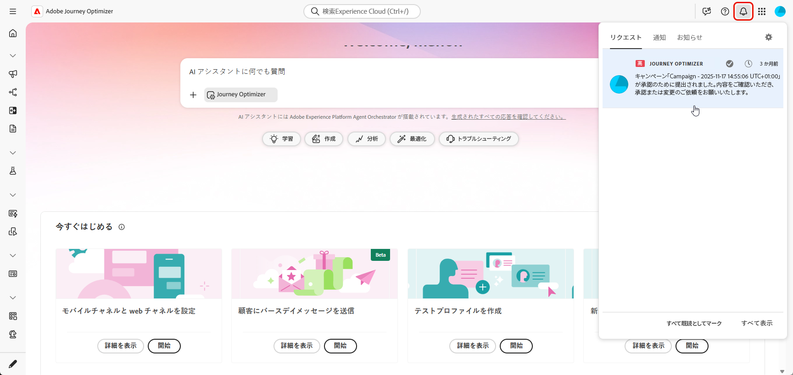
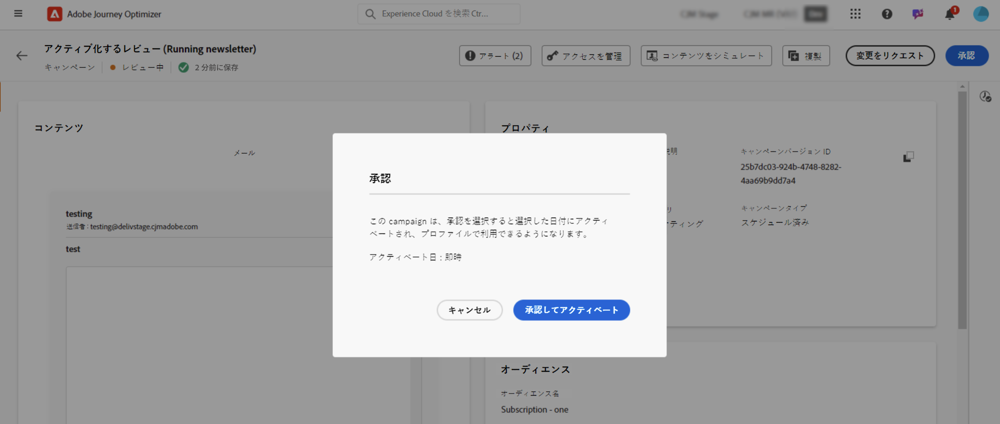
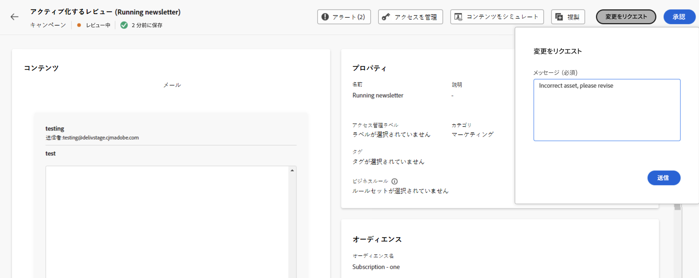

# リクエストのレビューと承認 {#approve-requests}

承認ポリシーがジャーニーまたはキャンペーンに適用される場合、公開するには承認用に送信する必要があります。 これを行うには、ジャーニー/キャンペーン作成者は承認ポリシーで定義された承認者にリクエストを送信し、ジャーニー/キャンペーンは&#x200B;**[!UICONTROL レビュー中]**&#x200B;のステータスを取得します。

承認者として選択した場合は、メールと Journey Optimizer アラートによって通知されます。これには、画面右上の「**[!UICONTROL リクエスト]**」タブのベルアイコンをクリックするとアクセスできます。

ジャーニー/キャンペーンを確認するには、メールまたはアラートからジャーニーを開き、オーディエンス、コンテンツ、設定などの設定を確認します。
完了したら、[ジャーニー／キャンペーンを承認して公開する](#approve)か、[アクティブ化する前に変更をリクエストする](#changes)ことができます。

>[!NOTE]
>
>キャンペーンのレビューは読み取り専用の手順です。すべての設定を視覚化できますが、アクションを実行することはできません。
>
>ジャーニーまたはキャンペーンをレビューする前に、必要な権限があることを確認します。

## ジャーニー／キャンペーンの承認と公開 {#approve}

ジャーニーまたはキャンペーンの運用を開始する準備が整ったら、「**[!UICONTROL 承認]**」ボタンをクリックして承認できます。

表示されるウィンドウで、「**[!UICONTROL 承認してアクティブ化]**」をクリックして、ジャーニー／キャンペーンを公開します。

## ジャーニー／キャンペーンへの変更のリクエスト {#changes}

承認用に送信されたジャーニーまたはキャンペーンに変更が必要な場合は、作成者にリクエストを送信して、必要な変更を加えることができます。

それには、「**[!UICONTROL 変更をリクエスト]**」ボタンをクリックします。 開いたペインで、リクエストの詳細を示すメッセージを入力し、**[!UICONTROL 送信]**&#x200B;をクリックしてリクエストを送信します。

リクエストを送信すると、メールと Journey Optimizer アラートでジャーニー／キャンペーン作成者に通知されます。 キャンペーンは「ドラフト」ステータスに戻ります。 変更を統合したら、ジャーニー/キャンペーン作成者は、承認のために変更を再送信できます。

>[!NOTE]
>
> メールで承認通知を受け取っていない場合は、Experience Cloud プロファイルのサブスクリプション設定を更新する必要があります。 [詳細情報](https://experienceleague.adobe.com/ja/docs/core-services/interface/features/account-preferences)
