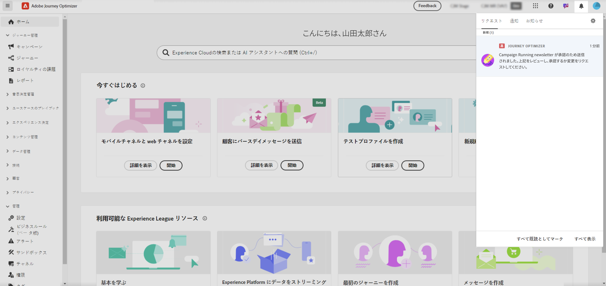

# リクエストのレビューと承認 {#approve-requests}

>[!AVAILABILITY]
>
> 承認ポリシーは現在、一連の組織でのみ使用できます（使用制限あり）。 アクセスするには、アドビ担当者にお問い合わせください。

承認ポリシーがジャーニーまたはキャンペーンに適用される場合、公開するには承認用に送信する必要があります。 これを行うには、ジャーニー/キャンペーンの作成者が承認ポリシーで定義された承認者にリクエストを送信し、ジャーニー/キャンペーンのステータスが **[!UICONTROL レビュー中]** になります。

承認者として選択した場合は、メールとJourney Optimizer アラートによって通知されます。このアラートには、画面右上の「**[!UICONTROL リクエスト]**」タブのベルアイコンをクリックするとアクセスできます。

ジャーニー/キャンペーンを確認するには、メールまたはアラートからジャーニー/キャンペーンを開き、オーディエンス、コンテンツ、設定などの設定を確認します。
完了したら、[ ジャーニー/キャンペーンを承認して公開する ](#approve) か、[ アクティブ化する前に変更をリクエストする ](#changes) ことができます。

>[!NOTE]
>
>キャンペーンのレビューは読み取り専用の手順です。すべての設定を視覚化できますが、アクションを実行することはできません。
>
>ジャーニーまたはキャンペーンをレビューする前に、必要な権限があることを確認します。

## ジャーニー/キャンペーンの承認と公開 {#approve}

ジャーニーまたはキャンペーンの運用を開始する準備が整ったら、「**[!UICONTROL 承認]** ボタンをクリックして承認できます。

表示されるウィンドウで、「**[!UICONTROL 承認してアクティブ化]**」をクリックして、ジャーニー/キャンペーンをライブにします。

## ジャーニー/キャンペーンの変更をリクエスト {#changes}

承認用に送信されたジャーニーまたはキャンペーンで変更が必要な場合は、作成者にリクエストを送信して、必要な変更を加えることができます。

変更を要求するには、「**[!UICONTROL 変更を要求]**」ボタンをクリックします。 開いたパネルで、要求の詳細を説明するメッセージを入力し、「**[!UICONTROL 送信]**」をクリックして要求を送信します。

リクエストを送信すると、メールとJourney Optimizer アラートでジャーニー/キャンペーン作成者に通知されます。 キャンペーンは「ドラフト」ステータスに戻ります。 変更が統合されると、ジャーニー/キャンペーンの作成者は承認用に変更を再送信できます。
