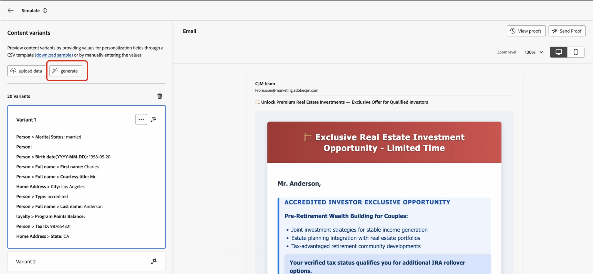

# コンテンツバリアントの自動生成（Beta）{#auto-generate-variants}

>[!AVAILABILITY]
>
>この機能は現在 **プライベートベータ版** で、お使いの環境では使用できない可能性があります。 アクセス権を取得するには、アドビ担当者にお問い合わせください。

[!DNL Journey Optimizer] では、コンテンツをテストするために複数のバリアントを自動的に生成できる AI ベースのシミュレーションを導入します。 この機能により、バリアントを手動で作成する必要性が軽減され、複雑なテンプレート間でパーソナライゼーションロジックを簡単に検証できます。

シミュレーションまたはプルーフ用にコンテンツをレンダリングする際、システムはコンテンツを分析し、すべてのパーソナライゼーショントークンとブランチルールを特定します。 パーソナライゼーショントークンを、最終的なコンテンツのほぼ現実的なプレビューを提供する意味のある値に置き換えます。

**投資家タイプ**、**年齢グループ**、**配偶者の有無**、**納税者の確認**、**場所** に基づくブランチロジックを持つ金融機関のメールテンプレートについて考えてみます。

バリアントを生成しない場合、すべてのパスを検証するには、多数のバリアントを手動で作成する必要があります。 自動生成されたバリアントを使用すると、これらの条件に自動的に対応する代表的なバリアントが生成されます。  生成された各バリアントはプレビューペインにレンダリングされ、適用されるブロックと条件が正確に表示されます。

>[!NOTE]
>
>この機能は、標準のコンテンツバリエーションをシミュレート機能と同じように機能します。 コンテンツのバリエーションのシミュレーションと、関連するガードレールと制限について詳しくは、次の節を参照してください。[ コンテンツのバリエーションをシミュレート ](../test-approve/simulate-sample-input.md)

## コンテンツバリアントの生成

コンテンツのバリエーションを生成し、プレビューするには、次の手順に従います。

1. コンテンツを開き、「**[!UICONTROL コンテンツをシミュレート]**/**[!UICONTROL コンテンツのバリエーションをシミュレート]** を選択します。

   

2. 「**[!UICONTROL 生成]** ボタンをクリックします。

   

3. 検出 [!DNL Journey Optimizer] れた属性に基づいてバリアントを自動的に生成します。

4. 生成されたバリアントのリストを左側のペインで確認し、バリアントを選択して、パーソナライズされたレンダリングをプレビューペインで表示します。
