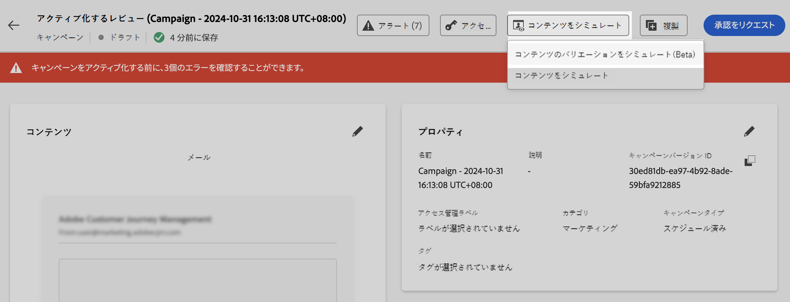

# コンテンツバリアントの自動生成（Beta）{#auto-generate-variants}

>[!AVAILABILITY]
>
>この機能は現在 **Private Beta** であり、お使いの環境では使用できない場合があります。アクセス権を取得するには、アドビ担当者にお問い合わせください。

[!DNL Journey Optimizer] では、コンテンツをテストする複数のバリアントを自動的に生成できる AI ベースのシミュレーションを導入します。この機能により、手動でバリアントを作成する必要性が軽減され、複雑なテンプレート間でパーソナライゼーションロジックを簡単に検証できます。

シミュレーションやプルーフにコンテンツをレンダリングする際、システムではコンテンツを分析し、すべてのパーソナライゼーショントークンと分岐ルールを特定します。パーソナライゼーショントークンを、最終的なコンテンツのほとんど現実的なプレビューを提供する意味のある値に置き換えます。

**投資家タイプ**、**年齢グループ**、**婚姻ステータス**、**税 ID の検証**、**場所**&#x200B;に基づいた分岐ロジックを備えた金融サービスメールテンプレートを考慮します。バリアントを生成しない場合、すべてのパスを検証するには、多数のバリアントを手動で作成する必要があります。自動生成されたバリアントでは、システムでこれらの条件を自動的に対象とする代表的なバリアントが生成されます。生成された各バリアントは、プレビューパネルにレンダリングされ、適用されるブロックと条件が正確に表示されます。

## コンテンツバリアントの生成

コンテンツのバリエーションを生成し、プレビューするには、次の手順に従います。

1. コンテンツを開き、**[!UICONTROL コンテンツをシミュレート]**／**[!UICONTROL コンテンツバリエーションをシミュレート]**&#x200B;を選択します。

   

2. 「**[!UICONTROL 生成]**」ボタンをクリックします。

   

3. [!DNL Journey Optimizer] では、検出された属性に基づいてバリアントを自動的に生成します。

4. 左側のパネルで生成されたバリアントのリストを確認し、バリアントを選択して、プレビューパネルでパーソナライズされたレンダリングを確認します。

>[!NOTE]
>
>この機能は、標準のコンテンツバリエーションをシミュレート機能と同じように動作します。コンテンツバリエーションのシミュレーションと関連するガードレールおよび制限について詳しくは、[コンテンツバリエーションのシミュレート](../test-approve/simulate-sample-input.md)の節を参照してください。
