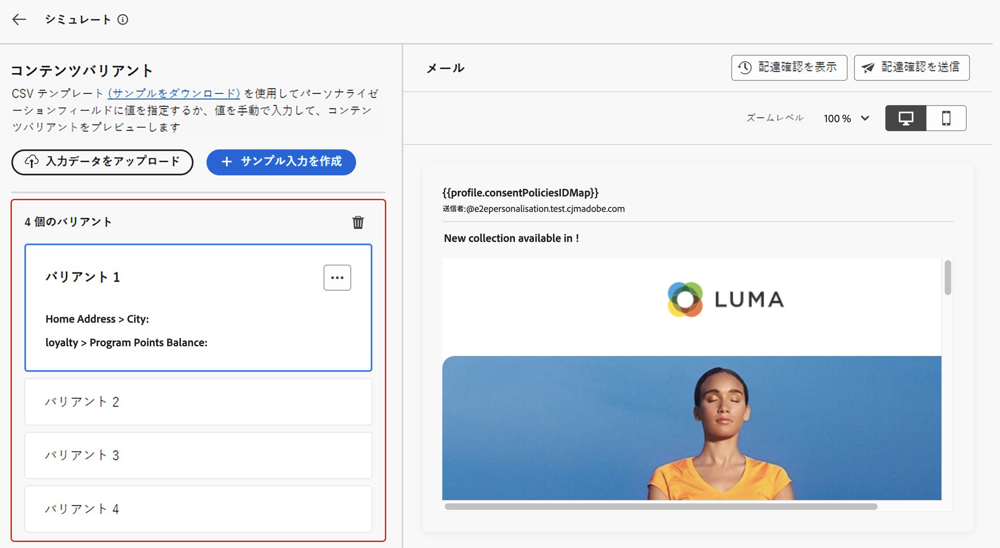
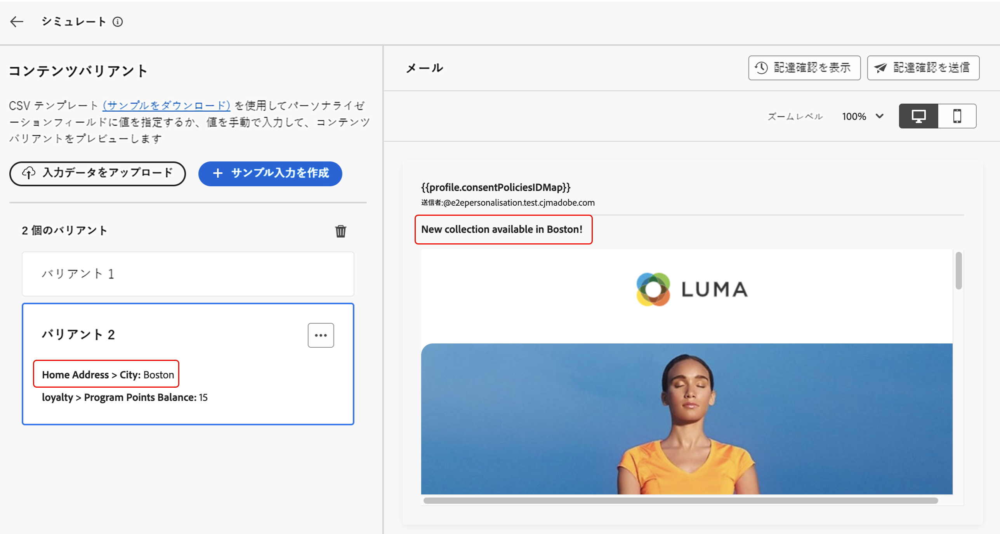
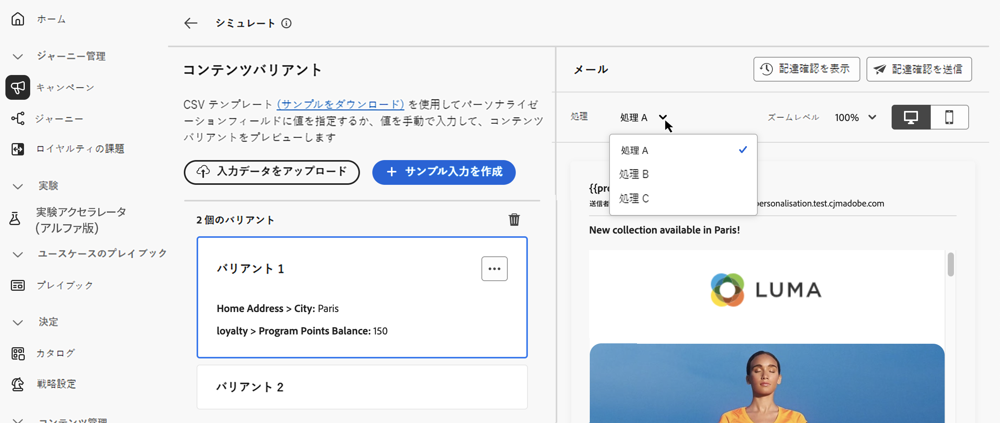

# コンテンツのバリエーションをシミュレート {#custom-profiles}

>[!CONTEXTUALHELP]
>id="ajo_simulate_sample_profiles"
>title="サンプル入力を使用したシミュレート"
>abstract="この画面では、CSV または JSON テンプレートを通じてパーソナライゼーションフィールドに値を指定するか、手動で値を入力することで、コンテンツの様々なバリアントをテストできます。"

ジャーニーオプティマイザーを使用すると、CSV または JSON ファイルからアップロードされた、または手動で追加されたサンプル入力データを使用して、様々なバリエーションのコンテンツをプレビューできます。

パーソナライゼーションのためにコンテンツで使用されるすべての属性は、システムによって自動的に検出され、テストで複数のバリアントを作成するために使用できます。 バリアントは、属性の値が異なるコンテンツのバージョンを意味します。

>[!NOTE]
>
>バリアントは、現在のコンテンツのテスト目的でのみ使用できます。 これらはAdobe Experience Platform内ではなく、ユーザーブラウザーセッションに保存されます。つまり、ログオフ時や別のデバイスから操作する際には表示されません。

## ガードレールと制限 {#limitations}

サンプル入力データを使用してコンテンツのテストを開始する前に、次のガードレールと前提条件を考慮してください。

* **チャネル** - コンテンツのバリエーションのシミュレーションは、メール、SMS およびプッシュ通知チャネルでのみ使用できます。

* **サポートされる機能** - コンテンツのバリエーションを、[!DNL Journey Optimizer] の多言語コンテンツやコンテンツ実験機能で使用できます。 これにより、複数の言語でメッセージをテストし、実験を通じてコンテンツを最適化できます。

  また、コンテンツのバリエーションを活用して、コンテンツテンプレートをテストすることもできます。

  >[!NOTE]
  >
  >現時点では、現在のエクスペリエンスでは受信ボックスレンダリングとスパムレポートは使用できません。 これらの機能を使用するには、コンテンツから「**[!UICONTROL コンテンツをシミュレート]**」ボタンを選択して、以前のユーザーインターフェイスにアクセスします。

* **属性** - プロファイル属性とコンテキスト属性の両方がサポートされています。

* **データタイプ** - バリアントのデータを入力する際には、数値（整数および小数）、文字列、ブール値、日付タイプのデータタイプのみがサポートされます。 その他のデータタイプの場合は、エラーが表示されます。

* **バリアントの数** - ファイルを使用するか手動で、最大 30 個のバリアントを追加してコンテンツをテストできます。

## コンテンツのバリエーションの追加とプレビュー

コンテンツのバリエーションを作成してプレビューするには、「**[!UICONTROL コンテンツをシミュレート]**」ボタンをクリックし、「**[!UICONTROL コンテンツバリエーションをシミュレート]**」を選択します。


コンテンツをテストする主な手順は、次のとおりです。

1. **バリアントの追加** - ファイルをアップロードするかデータを手動で追加して、サンプルの入力データを使用して最大 30 個のバリアントを追加します。 [詳しくは、バリアントの追加方法を参照してください。](#profiles)
1. **コンテンツバリエーションのプレビュー** – 異なるバリアントを使用してコンテンツのプレビューを確認します。 [詳しくは、コンテンツをプレビューする方法を参照してください。](#preview)
1. **メール配達確認の送信** - メールコンテンツの場合は、異なるバリアントを使用して最大 10 件の配達確認をメールアドレスに送信します。 [詳しくは、配達確認の送信方法を参照してください。](#proofs)

### バリアントの追加 {#profiles}

コンテンツバリエーションエクスペリエンスにアクセスすると、コンテンツで使用されるすべてのパーソナライゼーションフィールドが自動的に検出され、空白のバリアントのリストに表示されます。

例えば、メールに「市区町村」と「プログラムポイントバランス」という 2 つのパーソナライゼーションフィールドが含まれている場合、それらはリストに表示されます。 最初は値が入力されず、プレビューペインにはパーソナライズされたコンテンツは表示されません。



バリアントの値を編集するには：

1. バリアントの横にある「。..」ボタンをクリックします。
1. 「**[!UICONTROL 編集]**」を選択して、各パーソナライゼーションフィールドにカスタム値を入力します。
1. プレビューペインが更新され、入力した値を使用してコンテンツがレンダリングされる方法が表示されます。

新しいバリアントを追加するには：

1. 「**[!UICONTROL サンプル入力を作成]**」ボタンをクリックします。
1. 検出されたすべてのパーソナライゼーションフィールドを含む、新しい空白のバリアントが表示されます。
1. 必要に応じて、新しいバリアントを編集します。


また、事前に定義されたバリアントと値を含むファイルをアップロードして、プロセスを高速化することもできます。

1. **[!UICONTROL サンプルをダウンロード]** をクリックして、ファイルテンプレートをダウンロードします。
1. ファイル形式（CSV、JSON、JSONLINES）を選択します。
1. テンプレートファイルを開き、各プロファイル属性に必要な値を入力します。 テンプレートには、パーソナライゼーション用にコンテンツで使用される各プロファイル属性の列が含まれています。

   JSON 構文の例：

   ```
   {
   "profile": {
       "attributes": {
       "person": {
           "name": {
               "lastName": "Doe",
               "firstName": "John"
               }
           }
       }
   }
   }
   ```

1. ファイルの準備が整ったら、「**[!UICONTROL 入力データをアップロード]**」をクリックして読み込みます。
1. アップロード後、ファイル内の各エントリのリストに新しいバリアントが追加されます。

   

バリアントが追加されたら、それらを使用して、右側のパネルでコンテンツをプレビューしたり、メール配達確認を送信したりできます。

### コンテンツのバリエーションのプレビュー {#preview}

バリアントを使用してコンテンツをプレビューするには、関連するバリアントをリストから選択し、このバリアントに入力した情報でプレビューペインのコンテンツを更新します。

次の例では、メールの件名に 2 つのバリアントを追加しています。

| バリアント 1 の選択 | バリアント 2 の選択 |
|----------|-------------|
|  |  |

多言語コンテンツおよび実験の場合、様々な言語のバリアントまたは処理を切り替えるためにドロップダウンが使用できます。



右上隅の省略記号ボタンを使用して「**[!UICONTROL 削除]**」を選択すると、いつでもバリアントを削除できます。バリアントの情報を編集するには、省略ボタンをクリックし、「**[!UICONTROL 編集]**」を選択します。

### 配達確認の送信 {#proofs}

Journey Optimizer を使用すると、シミュレーション画面に追加した 1 つまたは複数のバリアントを借用して、メールアドレスに配達確認を送信できます。手順は次の通りです。

1. コンテンツをテストするバリアントが追加されていることを確認し、「**[!UICONTROL 配達確認を送信]**」ボタンをクリックします。

1. 「**[!UICONTROL 受信者]**」フィールドで、配達確認の送信先のメールアドレスを入力し、「**[!UICONTROL 追加]**」をクリックします。操作を繰り返して、追加のメールアドレスに配達確認を送信します。最大 10 人の配達確認受信者を追加できます。

1. 画面の下部セクションで、配達確認で使用するバリアントを選択します。複数のバリアントを選択できます。この場合、メールには、選択したバリアントと同じ数の配達確認が含まれます。

   バリアントについて詳しくは、**[!UICONTROL プロファイルの詳細を表示]**&#x200B;リンクを選択してください。これにより、異なるバリアントに対して、前の画面で入力した情報を表示できます。

   

1. 「**[!UICONTROL 配達確認を送信]**」ボタンをクリックして、配達確認の送信を開始します。

1. 配達確認の送信を追跡するには、コンテンツをシミュレート画面の「**[!UICONTROL 配達確認を表示]**」ボタンをクリックします。


