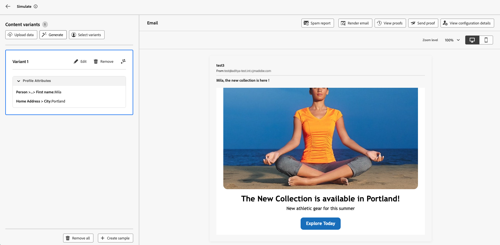
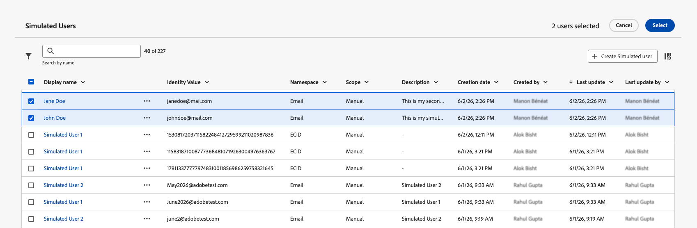

# コンテンツバリエーションのシミュレート {#custom-profiles}

>[!CONTEXTUALHELP]
>id="ajo_simulate_sample_profiles"
>title="サンプル入力を使用したシミュレート"
>abstract="この画面では、AI で自動生成するか、CSV または JSON テンプレートを通じて値を追加するか、手動で入力するか、テストプロファイルを使用することで、コンテンツのバリアントをテストできます。"

コンテンツにパーソナライゼーションや条件付きロジックが含まれている場合は、送信する前に、受信者のあらゆるタイプに対して正しくレンダリングされていることを確認する必要があります。

[!DNL Journey Optimizer]の&#x200B;**[!UICONTROL コンテンツバリエーションのシミュレーション]** エクスペリエンスでは、単一の画面、AIで自動的に生成、手動で入力、ファイルから読み込み、再利用可能なシミュレートされたユーザーに基づいて、コンテンツの複数のバリエーションをテストできるので、この問題を解決できます。 Adobe Experience Platformで事前に永続的なプロファイルを作成することなく、各バリエーションのレンダリング方法やプルーフの送信方法をプレビューできます。

コンテンツから、**[!UICONTROL コンテンツをシミュレート]**&#x200B;をクリックして、次の操作を行える単一のエクスペリエンスを開きます。

* AIを活用してパーソナライゼーションと条件付き分岐をカバーする&#x200B;**バリエーションを自動生成**
* **バリエーションを手動で追加**&#x200B;するか、CSVまたはJSON ファイルから追加します
* **シミュレートされたユーザー**&#x200B;を使用して、保存された再利用可能なテストデータを使用してプレビューとプルーフを行います
* 選択したバリエーションの&#x200B;**プレビュー** レンダリングと&#x200B;**電子メール校正**&#x200B;を送信

パーソナライゼーション用のコンテンツで使用されているすべての属性が自動的に検出されます。 バリアントとは、属性に異なる値を持つコンテンツのバージョンです。

>[!NOTE]
>
>バリアントは、現在のコンテンツのテスト目的でのみ使用できます。 これらは Adobe Experience Platform 内ではなく、ユーザーブラウザーセッションに保存されます。つまり、ログオフ時や別のデバイスから操作する場合には表示されません。

## ガードレールと制限 {#limitations}

サンプル入力データを使用してコンテンツのテストを開始する前に、次のガードレールと前提条件を考慮してください。

* **チャネル** - コンテンツバリエーションのシミュレートは、次の場合に使用できます。

   * メール、SMS およびプッシュ通知チャネル。
   * すべてのインバウンドチャネル（web、コードベースのエクスペリエンス、アプリ内、コンテンツカード）;
   * オーケストレーションされたキャンペーン：

* **サポートされる機能** - コンテンツのバリエーションは、[!DNL Journey Optimizer] の多言語コンテンツとコンテンツ実験機能で使用できます。 これにより、複数の言語でメッセージをテストし、実験を通じてコンテンツを最適化できます。

  また、コンテンツのバリエーションを活用して、コンテンツテンプレートをテストすることもできます。

  >[!NOTE]
  >
  >現時点では、インボックスのレンダリングとスパムレポートは、現在のエクスペリエンスでは使用できません。 これらの機能を使用するには、「**[!UICONTROL コンテンツをシミュレート]**」をクリックし、ドロップダウンから「**[!UICONTROL コンテンツをシミュレート（AEP プロファイル）]**」を選択して、以前のユーザーインターフェイスにアクセスします。

* **属性** - プロファイル属性とコンテキスト属性の両方がサポートされます。

* **データ型** - バリアントのデータを入力する場合は、数値（整数と小数）、文字列、ブール値、日付タイプのデータ型のみがサポートされます。 その他のデータタイプの場合は、エラーが表示されます。

* **バリエーションの数** - ファイルを使用または手動で追加する場合、コンテンツをテストするために最大30個のバリエーションを追加できます。 AIによる自動生成を使用する場合、システムはコンテンツ（パーソナライゼーションフィールドと条件付き分岐）にもとづいて作成するバリエーションの数を決定します。最大40個のバリエーションが必要です。

## コンテンツバリアントを作成

コンテンツのバリエーションを作成するには、「**[!UICONTROL コンテンツをシミュレート]**」ボタンをクリックします。

バリエーションは、次の方法で作成できます。

* [手動またはファイルからバリエーションを追加](#profiles)。
* AIを使用して[&#x200B; バリエーションを自動生成](#auto-generate-variants)。
* [既存のシミュレートされたユーザーからバリエーションを選択](#simulated-users)。

バリエーションを作成したら、[&#x200B; コンテンツをプレビューしてプルーフを送信](#preview-proofs)できます。

### 手動またはファイルからのバリエーションの追加 {#profiles}

コンテンツバリエーションのエクスペリエンスにアクセスすると、コンテンツで使用されているすべてのパーソナライゼーションフィールドが自動的に検出され、空白のバリエーションで表示されます。

例えば、メールに「名」と「市区町村」の2つのパーソナライゼーションフィールドが含まれている場合、それらのフィールドはリストに表示されます。 最初は値が入力されず、プレビューパネルにはパーソナライズされたコンテンツは表示されません。


バリエーションは手動で追加することも、ファイルからアップロードすることもできます。

+++ バリエーションを手動で追加

デフォルトのバリアントの値を編集するには、**[!UICONTROL 編集]** ボタンをクリックして、パーソナライゼーションフィールドごとにカスタム値を指定します。 プレビューパネルが更新され、入力した値を使用してコンテンツがレンダリングされる方法が表示されます。

新しいバリエーションを追加するには、「**[!UICONTROL サンプルを作成]**」ボタンをクリックします。 検出されたすべてのパーソナライゼーションフィールドを含む、新しい空白のバリアントが表示されます。 必要に応じて新しいバリエーションを編集できます。


+++

+++ ファイルからバリエーションを追加

事前に定義されたバリエーションと値を含むファイルをアップロードすることで、プロセスを迅速化できます。

1. 「**[!UICONTROL データをアップロード]**」ボタンをクリックして、ファイルのアップロード画面を開きます。
1. 「**[!UICONTROL サンプルをダウンロード]**」を選択して、CSV、JSON、またはJSONLINES ファイルテンプレートをダウンロードします。
1. テンプレートファイルを開き、各プロファイル属性に必要な値を入力します。 テンプレートには、パーソナライゼーション用にコンテンツで使用される各プロファイル属性の列が含まれています。

   JSON 構文の例：

   ```json
   {
   "profile": {
       "attributes": {
       "person": {
           "name": {
               "lastName": "Doe",
               "firstName": "John"
               }
           }
       }
   }
   }
   ```

1. ファイルの準備ができたら、**[!UICONTROL 確認]**&#x200B;を選択して読み込みます。 アップロード後、ファイル内の各エントリのリストに新しいバリアントが追加されます。

+++

### コンテンツのバリエーションを自動生成 {#auto-generate-variants}

[!DNL Journey Optimizer]は、AI ベースのシミュレーションを使用してコンテンツのバリエーションを自動的に生成できるため、バリエーションを手作業で作成することなくパーソナライゼーション ロジックを検証できます。 コンテンツを分析し、パーソナライゼーションフィールドと条件付き分岐を特定し、必要な数のバリエーションを作成して、ほぼ現実的なプレビューを実現するために有意義な値でカバーします。

バリエーションを自動生成するには、「**[!UICONTROL 生成]**」ボタンをクリックし、システムが生成を完了するのを待ちます。 バリエーション リストで生成されたバリエーションと、プレビューペインでのレンダリングを確認します。



>[!NOTE]
>
>作成されるバリエーションの数は、コンテンツによって異なります。 シンプルなパーソナライゼーションを含むメッセージでは、ひとつのバリエーションを生成し、複数の条件付きブランチを含むコンテンツでは、複数のバリエーションを生成できます。 **[!UICONTROL 生成]**&#x200B;をクリックすると、リスト内の既存のコンテンツバリエーション（手動またはファイルから追加されたものを含む）がすべて、AIが生成したバリエーションに置き換えられます。

### シミュレートされたユーザーからバリエーションを選択 {#simulated-users}

**[!UICONTROL コンテンツのバリエーションをシミュレート]**&#x200B;では、**シミュレートされたユーザー**&#x200B;に基づいてバリエーションを作成できます。 シミュレートされたユーザーは、Adobe Experience Platformで永続的なプロファイルを使用せずに、テスト用に作成されたプロファイルのような一時的なエンティティです。 現在のブラウザーセッションにのみ追加されるバリエーションとは異なり、シミュレートされたユーザーは保存され、ジャーニー間や他のユーザーが再利用できます。

シミュレートされたユーザーは、ジャーニー&#x200B;**[!UICONTROL シミュレーション]**&#x200B;機能から作成および管理されます。 作成、保存、再利用の全手順については、[&#x200B; シミュレートされたユーザーの作成と管理](../building-journeys/simulate-journey.md#test-users)を参照してください。

シミュレートされたユーザーを作成したら、それを使用してコンテンツをプレビューできます。 それには、次の手順に従います。

1. 「**[!UICONTROL バリエーションを選択]**」ボタンをクリックします。
1. 既存のシミュレートされたユーザーのリストで、使用するユーザーを選択し、**[!UICONTROL 選択]**&#x200B;をクリックします。

   

1. 選択したシミュレートされたユーザーがコンテンツバリエーションのリストに追加され、コンテンツとその属性値をプレビューできます。 テスト用にバリアントの値を手動で編集することもできますが、これらの変更はシミュレートされたユーザーに保存されません。

## コンテンツのプレビューとプルーフの送信 {#preview-proofs}

バリアントが追加されたら、それらを使用して右側のパネルでコンテンツをプレビューし、メール本配信前確認を送信できます。

### コンテンツバリエーションのプレビュー {#preview}

バリアントを使用してコンテンツをプレビューするには、リストから関連するバリアントを選択して、このバリアントに入力した情報でプレビューパネルのコンテンツを更新します。

次の例では、メールの件名に 2 つのバリアントを追加しています。

| バリアント 1 の選択 | バリアント 2 の選択 |
|----------|-------------|
|  |  |

<!--
For multilingual content and experimentation, a dropdown is available to switch between the different language variants or treatments.


-->

### 本配信前確認の送信 {#proofs}

Journey Optimizer を使用すると、シミュレーション画面に追加した 1 つまたは複数のバリアントを借用して、メールアドレスに配達確認を送信できます。 手順は次の通りです。

1. コンテンツをテストするバリアントが追加されていることを確認し、「**[!UICONTROL 配達確認を送信]**」ボタンをクリックします。

1. 「**[!UICONTROL 受信者]**」フィールドで、配達確認の送信先のメールアドレスを入力し、「**[!UICONTROL 追加]**」をクリックします。 操作を繰り返して、追加のメールアドレスに配達確認を送信します。 最大 10 人の配達確認受信者を追加できます。

1. 画面の下部セクションで、配達確認で使用するバリアントを選択します。 複数のバリアントを選択できます。この場合、メールには、選択したバリアントと同じ数の配達確認が含まれます。

   バリアントについて詳しくは、**[!UICONTROL プロファイルの詳細を表示]**&#x200B;リンクを選択してください。 これにより、異なるバリアントに対して、前の画面で入力した情報を表示できます。

   

1. 「**[!UICONTROL 配達確認を送信]**」ボタンをクリックして、配達確認の送信を開始します。

1. 配達確認の送信を追跡するには、コンテンツをシミュレート画面の「**[!UICONTROL 配達確認を表示]**」ボタンをクリックします。


