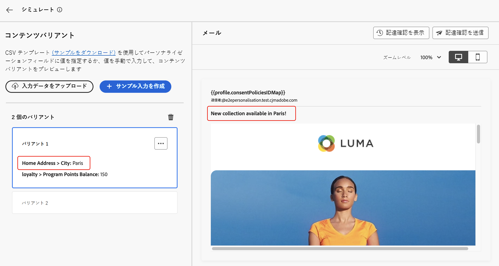

# サンプル入力データを使用したコンテンツのテスト（ベータ版） {#custom-profiles}

>[!CONTEXTUALHELP]
>id="ajo_simulate_sample_profiles"
>title="サンプル入力を使用したシミュレート"
>abstract="この画面では、CSV または JSON テンプレートを通じてパーソナライゼーションフィールドに値を指定するか、手動で値を入力することで、コンテンツの様々なバリアントをテストできます。"

>[!AVAILABILITY]
>
>この機能は現在、パブリックベータ版としてすべてのお客様に対して提供されています。

Journey Optimizer を使用すると、CSV または JSON ファイルからアップロードされた、または手動で追加されたサンプル入力データを使用して、プレビューし配達確認を送信することで、コンテンツの様々なバリアントをテストできます。パーソナライズ機能のコンテンツで使用されるすべてのプロファイル属性は、システムによって自動的に検出され、テストで複数のバリアントを作成するのに使用できます。

>[!NOTE]
>
>現時点では、コンテンツのバリエーションのシミュレーションは、メール、SMS、プッシュ通知チャネルでのみ使用できます。

このエクスペリエンスにアクセスするには、「**[!UICONTROL コンテンツをシミュレート]**」ボタンをクリックし、「**[!UICONTROL コンテンツのバリエーションをシミュレート（ベータ版）]**」を選択します。

コンテンツをテストする主な手順は、次のとおりです。

1. ファイルをアップロードするか、データを手動で追加して、サンプル入力データのバリアントを最大 30 個追加します。[詳しくは、バリアントの追加方法を参照してください。](#profiles)
1. 別のバリアントを使用してコンテンツのプレビューを確認します。[詳しくは、コンテンツをプレビューする方法を参照してください。](#preview)
1. メールのコンテンツについては、異なるバリアントを使用して、メールアドレスに最大 10 個の配達確認を送信します。[詳しくは、配達確認の送信方法を参照してください。](#proofs)

## ガードレールと制限 {#limitations}

サンプル入力データを使用してコンテンツのテストを開始する前に、次のガードレールと前提条件を考慮してください。

* 現在、サンプル入力データを使用したテストは、メール、SMS、プッシュ通知チャネルでのみ使用できます。E メールデザイナー内の「コンテンツをシミュレート」ボタンからエクスペリエンスにアクセスすることはできません。
* 現在のエクスペリエンスでは、インボックスレンダリング、スパムレポート、多言語コンテンツ、コンテンツ実験の機能は使用できません。これらの機能を使用するには、コンテンツから「**[!UICONTROL コンテンツをシミュレート]**」ボタンを選択して、以前のユーザーインターフェイスにアクセスします。
* 現在、プロファイル属性のみがサポートされています。コンテンツでパーソナリゼーションにコンテキスト属性が使用されている場合、これらの属性を使用してコンテンツをテストすることはできません。
* バリアントのデータを入力する際には、数値（整数および小数）、文字列、ブール値、日付タイプのデータタイプのみがサポートされます。その他のデータタイプの場合は、エラーが表示されます。

## バリアントの追加 {#profiles}

ファイルを使用するか手動で、最大 30 個のバリアントを追加してコンテンツをテストできます。

>[!NOTE]
>
>追加されたバリアントは、現在のコンテンツのテスト目的でのみ使用できます。これらは Adobe Experience Platform 内ではなく、ユーザーブラウザーセッションに保存されます。つまり、ログオフ時や別のデバイスから操作する場合には表示されません。

### ファイルを使用したバリアントの追加 {#file}

ファイルからバリアントを追加するには、次の手順に従います。

1. **[!UICONTROL サンプルをダウンロード]**&#x200B;リンクをクリックしてファイルテンプレートを取得し、使用するファイル形式（CSV、JSON または JSONLINES）を選択します。

1. 「**[!UICONTROL ダウンロード]**」をクリックして、目的の場所にテンプレートを保存します。

1. ファイルを開き、ニーズに合わせてテンプレートに入力します。テンプレートには、パーソナライゼーション用にコンテンツで使用される各プロファイル属性の列が含まれています。

1. ファイルの準備ができたら、「**[!UICONTROL 入力データをアップロード]**」をクリックして読み込み、コンテンツをテストします。

1. ファイルがアップロードされると、ファイルの各行の左側のパネルにボックスが追加されます。各ボックスには、パーソナライゼーション用にコンテンツで使用されるすべてのプロファイル属性が含まれます。バリアントを使用して、右側のパネルでコンテンツをプレビューし、配達確認を送信できるようになりました。

   

### 手動でのバリアントの追加 {#manual}

バリアントを手動で追加するには、次の手順に従います。

1. 「**[!UICONTROL サンプル入力を作成]**」ボタンをクリックします。

   左側のパネルにボックスが追加され、パーソナライゼーション用にコンテンツで使用されるすべてのプロファイル属性が表示されます。

1. バリアントのサンプル入力データを入力し、「**[!UICONTROL 保存]**」をクリックします。

   

1. バリアントが追加されたら、それらを使用して右側のパネルでコンテンツをプレビューし、配達確認を送信できます。

## コンテンツバリアントのプレビュー {#preview}

バリアントの 1 つを使用してコンテンツをプレビューするには、関連するボックスを選択して、このバリアントに入力した情報で右側のセクションのコンテンツプレビューを更新します。

右上隅の省略記号ボタンを使用して「**[!UICONTROL 削除]**」を選択すると、いつでもバリアントを削除できます。バリアントの情報を編集するには、省略ボタンをクリックし、「**[!UICONTROL 編集]**」を選択します。

## 配達確認の送信 {#proofs}

Journey Optimizer を使用すると、シミュレーション画面に追加した 1 つまたは複数のバリアントを借用して、メールアドレスに配達確認を送信できます。手順は次の通りです。

1. コンテンツをテストするバリアントが追加されていることを確認し、「**[!UICONTROL 配達確認を送信]**」ボタンをクリックします。

1. 「**[!UICONTROL 受信者]**」フィールドで、配達確認の送信先のメールアドレスを入力し、「**[!UICONTROL 追加]**」をクリックします。操作を繰り返して、追加のメールアドレスに配達確認を送信します。最大 10 人の配達確認受信者を追加できます。

1. 画面の下部セクションで、配達確認で使用するバリアントを選択します。複数のバリアントを選択できます。この場合、メールには、選択したバリアントと同じ数の配達確認が含まれます。

   バリアントについて詳しくは、**[!UICONTROL プロファイルの詳細を表示]**&#x200B;リンクを選択してください。これにより、異なるバリアントに対して、前の画面で入力した情報を表示できます。

   

1. 「**[!UICONTROL 配達確認を送信]**」ボタンをクリックして、配達確認の送信を開始します。

1. 配達確認の送信を追跡するには、コンテンツをシミュレート画面の「**[!UICONTROL 配達確認を表示]**」ボタンをクリックします。

