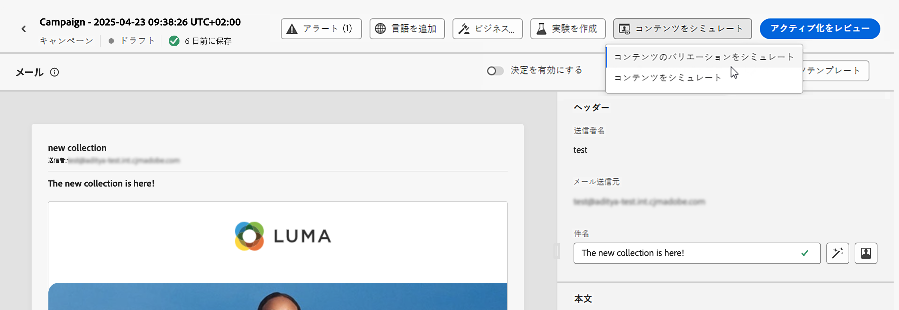
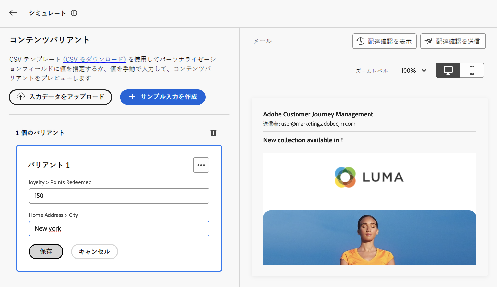

# サンプル入力データを使用したコンテンツのテスト {#custom-profiles}

>[!CONTEXTUALHELP]
>id="ajo_simulate_sample_profiles"
>title="サンプル入力を使用したシミュレート"
>abstract="この画面では、CSV テンプレート（CSV をダウンロード）を通じてパーソナライゼーションフィールドに値を指定するか、手動で値を入力することで、メールコンテンツの様々なバリアントをテストできます。"

>[!AVAILABILITY]
>
>この機能は、現在、一部のユーザーのみがベータ版として利用できます。

ジャーニーオプティマイザーを使用すると、CSV ファイルからアップロードされた、または手動で追加されたサンプル入力データを使用して、プレビューおよび配達確認を送信することで、メールコンテンツの様々なバリアントをテストできます。 パーソナライゼーションのためにコンテンツで使用されるすべてのプロファイル属性は、システムによって自動的に検出され、テストで複数のバリアントを作成するために使用できます。

このエクスペリエンスにアクセスするには、「**[!UICONTROL コンテンツをシミュレート]**」ボタンをクリックし、「**[!UICONTROL CSV でシミュレート（Beta）]**」を選択します。

コンテンツをテストする主な手順は次のとおりです。

1. CSV ファイルをアップロードするか、データを手動で追加して、サンプル入力データのバリアントを最大 30 個追加します。 [ バリアントの追加方法を学ぶ ](#profiles)
1. 別のバリアントを使用してコンテンツのプレビューを確認します。 [ コンテンツのプレビュー方法を学ぶ ](#preview)
1. 異なるバリアントを使用して、メールアドレスに最大 10 件の配達確認を送信します。 [詳しくは、本配信前確認の送信方法を参照してください。](#proofs)

## ガードレールと制限 {#limitations}

サンプル入力データを使用してコンテンツのテストを開始する前に、次のガードレールと前提条件を考慮してください。

* 現在、サンプル入力データを使用したテストは、メールチャネルでのみ使用できます。 メールDesigner内の「コンテンツをシミュレート」ボタンからエクスペリエンスにアクセスすることはできません。
* 現在のエクスペリエンスでは、受信ボックスレンダリング、スパムレポート、多言語コンテンツ、コンテンツ実験の機能は使用できません。 これらの機能を使用するには、コンテンツから「**[!UICONTROL コンテンツをシミュレート]**」ボタンを選択して、以前のユーザーインターフェイスにアクセスします。
* 現在、プロファイル属性のみがサポートされています。 コンテンツでパーソナライゼーションにコンテキスト属性が使用されている場合、これらの属性を使用してコンテンツをテストすることはできません。
* バリアントのデータを入力する際には、数値（整数および小数）、文字列、ブール、日付タイプのデータタイプのみがサポートされます。 その他のデータタイプの場合は、エラーが表示されます。

## バリアントを追加 {#profiles}

CSV ファイルを使用するか手動で、最大 30 個のバリアントを追加してコンテンツをテストできます。

* CSV ファイルからサンプル入力データをアップロードするには、「**[!UICONTROL CSV をダウンロード]**」リンクをクリックして CSV ファイルテンプレートを取得します。 このテンプレートには、パーソナライゼーション用にコンテンツで使用される各プロファイル属性の列が含まれています。

  CSV ファイルに入力し、**[!UICONTROL 入力データをアップロード]** をクリックして読み込み、コンテンツをテストします。

* バリアントを手動で追加するには、「**[!UICONTROL サンプル入力を作成]**」ボタンをクリックして、バリアントのサンプル入力データを入力します。 パーソナライゼーション用にコンテンツで使用されるプロファイル属性ごとに 1 つのフィールドが表示されます。

  

プロファイルを選択すると、画面の左側にバリアントごとに 1 つのボックスが表示されます。 これらのプロファイルを使用して、コンテンツをプレビューし、配達確認を送信できます。

>[!NOTE]
>
>追加されたバリアントは、現在のコンテンツのテスト目的でのみ使用できます。 はAdobe Experience Platform内ではなく、ユーザーブラウザーセッションに保存されます。つまり、ログオフ時や別のデバイスから操作する場合には表示されません。

## コンテンツのバリアントのプレビュー {#preview}

バリアントの 1 つを使用してコンテンツをプレビューするには、関連するボックスを選択して、このバリアントに入力した情報で右側のセクションのコンテンツプレビューを更新します。

右上隅の省略記号ボタンを使用して「**[!UICONTROL 削除]** を選択すると、いつでもバリアントを削除できます。 バリアントの情報を編集するには、「。..」ボタンをクリックし、「**[!UICONTROL 編集]** を選択します。

## 配達確認の送信  {#proofs}

Journey Optimizerを使用すると、シミュレーション画面に追加した 1 つまたは複数のバリアントを借用して、メールアドレスに配達確認を送信できます。 手順は次の通りです。

1. コンテンツをテストするためのバリアントが追加されていることを確認し、「**[!UICONTROL 配達確認を送信]** ボタンをクリックします。

1. **[!UICONTROL 受信者]** フィールドで、配達確認の送信先のメールアドレスを入力し、「**[!UICONTROL 追加]**」をクリックします。 操作を繰り返して、追加のメールアドレスに配達確認を送信します。 最大 10 人のプルーフ受信者を追加できます。

1. 画面の下部で、配達確認で使用するバリアントを選択します。 複数のバリアントを選択できます。この場合、メールには、選択したバリアントと同じ数の配達確認が含まれます。

   バリアントについて詳しくは、「**[!UICONTROL プロファイルの詳細を表示]** リンクを選択してください。 これにより、異なるバリアントに対して、前の画面で入力した情報を表示できます。

   

1. 「**[!UICONTROL 配達確認を送信]**」ボタンをクリックして、配達確認の送信を開始します。

1. 配達確認の送信を追跡するには、コンテンツをシミュレート画面の **[!UICONTROL 配達確認を表示]** ボタンをクリックします。

