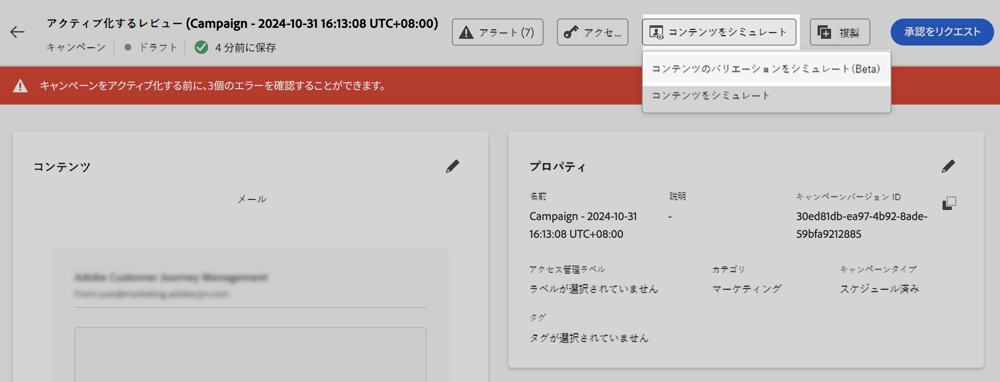
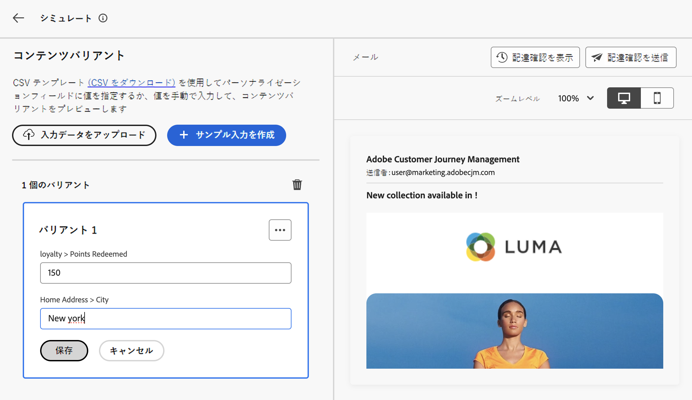
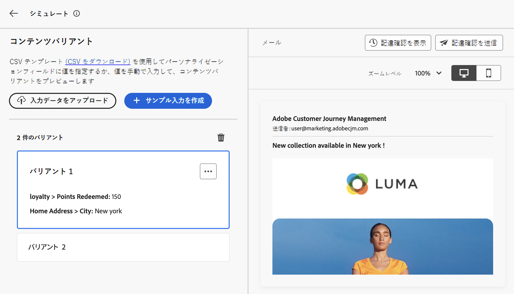
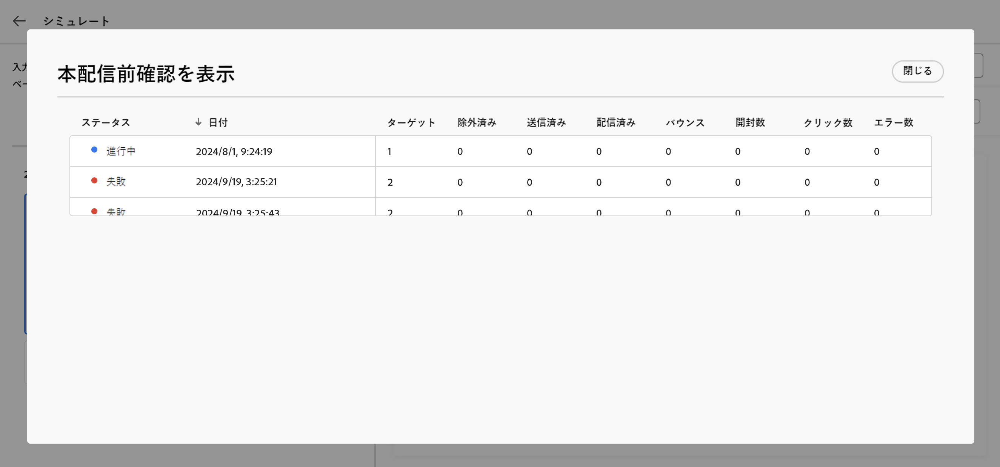

# サンプルプロファイルを使用したコンテンツのテスト {#custom-profiles}

>[!CONTEXTUALHELP]
>id="ajo_simulate_sample_profiles"
>title="サンプルプロファイルを使用したシミュレーション"
>abstract="この画面では、サンプルプロファイルを借用してメールコンテンツをプレビューし、配達確認を送信できます。このプロファイルは、CSV ファイルからアップロードすることも、この画面から直接手動で追加することもできます。"

<!--ATTENTE CONFIRMATION 

- nom (custom/sample)
- campaigns/journeys ou que campaigns

-->

>[!AVAILABILITY]
>
>この機能は、現在、一部のユーザーのみがベータ版として利用できます。

ジャーニーオプティマイザーでは、サンプルプロファイルを使用してメールコンテンツをプレビューおよびテストできます。このプロファイルは、CSV ファイルからアップロードすることも、コンテンツのシミュレーション時に手動で追加することもできます。 この機能を使用すると、コンテンツのプレビューや配達確認の送信に使用するサンプルプロファイルを選択できます。 パーソナライゼーションのためにコンテンツで使用されるすべてのプロファイル属性は、システムによって自動的に検出され、テストに使用できます。

このエクスペリエンスにアクセスするには、「**[!UICONTROL コンテンツをシミュレート]**」ボタンをクリックし、「**[!UICONTROL CSV でシミュレート（Beta）]**」を選択します。

コンテンツをテストする主な手順は次のとおりです。

1. CSV ファイルをアップロードするか、手動で 1 つずつ追加して、最大 30 個のサンプルプロファイルを追加します。 [ サンプルプロファイルの追加方法を学ぶ ](#profiles)
1. 追加したプロファイルを使用してコンテンツのプレビューを確認します。 [ コンテンツのプレビュー方法を学ぶ ](#preview)
1. 目的のサンプルプロファイルを別のユーザーとして実行し、最大 10 件の配達確認をメールアドレスに送信します。 [詳しくは、本配信前確認の送信方法を参照してください。](#proofs)

## ガードレールと制限 {#limitations}

サンプルプロファイルを使用してコンテンツのテストを開始する前に、次のガードレールと前提条件を考慮してください。

* 現在、サンプルプロファイルを使用したテストは、キャンペーン内、およびメールチャネルでのみ使用できます。
* 現在のエクスペリエンスでは、受信ボックスレンダリング、スパムレポート、多言語コンテンツ、コンテンツ実験の機能は使用できません。 これらの機能を使用するには、コンテンツから「**[!UICONTROL コンテンツをシミュレート]**」ボタンを選択して、以前のユーザーインターフェイスにアクセスします。
* 現在、プロファイル属性のみがサポートされています。 コンテンツでパーソナライゼーションにコンテキスト属性が使用されている場合、これらの属性を使用してコンテンツをテストすることはできません。
* サンプルプロファイルのデータを入力する際にサポートされているデータタイプは、数値（整数および小数）、文字列、ブール値、日付タイプのみです。 その他のデータタイプの場合は、エラーが表示されます。

## サンプルプロファイルの追加 {#profiles}

最大 30 個のサンプルプロファイルを追加して、CSV ファイルを使用または手動でコンテンツをテストできます。

* CSV ファイルからプロファイルをアップロードするには、「**[!UICONTROL テンプレートをダウンロード]** リンクをクリックして、CSV ファイルテンプレートを取得します。 このテンプレートには、パーソナライゼーション用にコンテンツで使用される各プロファイル属性の列が含まれています。

  CSV ファイルを入力し、「**[!UICONTROL サンプルプロファイルをアップロード]**」をクリックして読み込み、コンテンツをテストします。

* プロファイルを手動で追加するには、「**[!UICONTROL サンプルプロファイルを作成]**」ボタンをクリックし、プロファイルの情報を入力します。 パーソナライゼーション用にコンテンツで使用されるプロファイル属性ごとに 1 つのフィールドが表示されます。

  

プロファイルを選択すると、画面の左側にプロファイルごとに 1 つのボックスが表示されます。 これらのプロファイルを使用して、コンテンツをプレビューし、配達確認を送信できます。

>[!NOTE]
>
>追加されたサンプルプロファイルは、現在のコンテンツのテスト目的でのみ使用できます。 はAdobe Experience Platform内ではなく、ユーザーブラウザーセッションに保存されます。つまり、ログオフ時や別のデバイスから操作する場合には表示されません。

## サンプルプロファイルを使用したコンテンツのプレビュー {#preview}

プロファイルの 1 つを使用してコンテンツをプレビューするには、関連するボックスを選択して、右側のセクションのコンテンツプレビューを、このプロファイルに入力した情報で更新します。

右上隅の省略記号ボタンを使用して「**[!UICONTROL 削除]**」を選択すると、いつでもボックスを削除できます。 プロファイルの情報を編集するには、「。..」ボタンをクリックし、「**[!UICONTROL 編集]**」を選択します。

## 配達確認の送信  {#proofs}

Journey Optimizerを使用すると、シミュレーション画面に追加した 1 つまたは複数のサンプルプロファイルを借用して、メールアドレスに配達確認を送信できます。 手順は次の通りです。

1. コンテンツをテストするためにサンプルプロファイルが追加されていることを確認し、「**[!UICONTROL 配達確認を送信]**」ボタンをクリックします。

1. **[!UICONTROL 受信者]** フィールドで、配達確認の送信先のメールアドレスを入力し、「**[!UICONTROL 追加]**」をクリックします。 操作を繰り返して、追加のメールアドレスに配達確認を送信します。 最大 10 人のプルーフ受信者を追加できます。

1. 画面の下部セクションで、プルーフで別のユーザーとして実行するサンプルプロファイルを選択します。 複数のプロファイルを選択できます。この場合、メールには、選択したプロファイルと同じ数の配達確認が含まれます。

   プロファイルについて詳しくは、「**[!UICONTROL プロファイルの詳細を表示]**」リンクを選択してください。 これにより、異なるプロファイル属性用に、前の画面で入力した情報を表示できます。

   

1. 「**[!UICONTROL 配達確認を送信]**」ボタンをクリックして、配達確認の送信を開始します。

コンテンツをシミュレート画面の「**[!UICONTROL 配達確認を表示]**」ボタンをクリックすると、送信はいつでも追跡できます。

