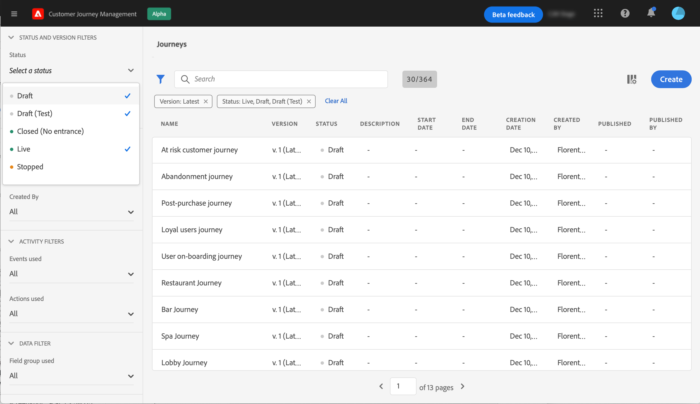

# ユーザーインターフェイス {#cjm-user-interface}

このドキュメントは、製品に対する最近の変更を反映するために頻繁に更新されています。ただし、一部のスクリーンショットは、ユーザーインターフェイスと多少異なる場合があります。

## Workspace {#cjm-workspace}

[Adobe Experience Cloud](http://experience.adobe.com)に接続したら、[!DNL Journey Optimizer]を参照します。

>[!NOTE]
>
>ユーザーインターフェイスを閲覧する際の主な概念については、[Adobe Experience Platformのドキュメント](https://experienceleague.adobe.com/docs/experience-platform/landing/platform-ui/ui-guide.html?lang=en#adobe-experience-platform-ui-guide)を参照してください。

左側のリンクを使用して、機能を参照します。

>[!NOTE]
>
>使用できる機能は、使用する権限および使用許諾契約によって異なります。

左側のナビゲーションバーのエントリの完全なリストを下に示し、関連ドキュメントへのリンクを示します。

**ホーム**

[!DNL Journey Optimizer] ホームページには、開始への主要なリンクとリソースが含まれています。**[!UICONTROL Recents]**&#x200B;リストは、最近作成または更新したメッセージ、イベント、ジャーニーへのショートカットを提供します。 このリストには、作成日と変更日およびステータスが表示されます。

**[!UICONTROL ジャーニー管理]**

* **[!UICONTROL ジャーニー]** ：お客様のジャーニーを作成、構成、調整します。詳しくは、[この節](building-journeys/journey-gs.md#jo-build)を参照してください。

* **[!UICONTROL メッセージ]**  — 電子メールメッセージとプッシュメッセージを作成、設計、テストおよび公開します。詳しくは、[この節](create-message.md)を参照してください。

**[!UICONTROL 意思決定管理]**

* **[!UICONTROL オファー]**  — このメニューから最新のソースおよびデータセットにアクセスします。このセクションを使用して、新しいオファーを作成します。 [詳細情報](offers/offer-library/creating-personalized-offers.md)

* **[!UICONTROL コンポーネント]**  — 配置、ルール、タグを作成します。詳細は[このセクション](offers/offer-library/key-steps.md)を参照

**[!UICONTROL コンテンツ管理]**

* **[!UICONTROL アセット]** - [!DNL Adobe Experience Manager Assets Essentials] は、メッセージの入力に使用できるアセットの一元的なリポジトリです。詳細は[このセクション](assets-essentials.md)を参照

**[!UICONTROL データ管理]**

* **[!UICONTROL スキーマ]** -Adobe Experience Platformを使用して、スキーマエディターと呼ばれるインタラクティブなビジュアルキャンバスでExperience Data Model(XDM)スキーマを作成および管理します。[このドキュメントの詳細情報](https://experienceleague.adobe.com/docs/experience-platform/xdm/tutorials/create-schema-ui.html)

* **[!UICONTROL データセット]** -Adobe Experience Platformに取り込まれるすべてのデータは、データセットとしてデータレーク内に保持されます。データセットは、通常、スキーマ（列）とフィールド（行）を含むテーブルであるデータコレクションのストレージと管理をおこなう構成体です。[このドキュメントで、データセットのプレビュー方法と作成方法を説明します。](https://experienceleague.adobe.com/docs/experience-platform/catalog/datasets/user-guide.html)

* **[!UICONTROL クエリ]** -Adobe Experience Platformクエリサービスを使用して、クエリの作成と実行、表示が以前に実行したクエリの作成と実行、および組織内のユーザーが保存したクエリへのアクセスを行います。[このドキュメントの詳細情報](https://experienceleague.adobe.com/docs/experience-platform/query/ui/overview.html)

* **[!UICONTROL 監視]**  — このメニューを使用して、Adobe Experience Platformユーザーインターフェイス内のデータ取り込みを監視します。[このドキュメントの詳細情報](https://experienceleague.adobe.com/docs/experience-platform/ingestion/quality/monitor-data-ingestion.html)

**[!UICONTROL 接続]**

* **[!UICONTROL ソース]**  — このメニューを使用して、Adobeアプリケーション、クラウドベースのストレージ、データベースなど、様々なソースからデータを取り込み、構造、ラベル付け、受信データの拡張を行います。[このドキュメントの詳細情報](https://experienceleague.adobe.com/docs/experience-platform/sources/home.html?lang=ja)

**[!UICONTROL お客様]**

* **[!UICONTROL セグメント]** -Experience Platformセグメント定義を作成および管理し、それらをジャーニーに活用します。詳細は[このページ](segment/about-segments.md)を参照

* **[!UICONTROL プロファイル]**  — リアルタイム顧客プロファイルは、オンライン、オフライン、CRM、サードパーティなどの複数のチャネルからのデータを組み合わせて、各顧客の全体的な表示を作成します。[このドキュメントの詳細情報](https://experienceleague.adobe.com/docs/experience-platform/profile/ui/user-guide.html)

* **[!UICONTROL ID]**  -Adobe Experience PlatformIDサービスは、Adobe Experience Platform内のIDグラフと呼ばれる、デバイス間、チャネル間、およびお客様のほぼリアルタイムの識別を管理します。[このドキュメントでID名前空間の作成方法を説明します。](https://experienceleague.adobe.com/docs/experience-platform/identity/namespaces.html?lang=en#manage-namespaces)

**[!UICONTROL 管理]**

* **[!UICONTROL ジャーニー管理]**  — このメニューを使用して、 [イベント](event/about-events.md)、 [データ](datasource/about-data-sources.md) ソース、およびジャーニーで使用する  アクションを設定します。

* **[!UICONTROL サンドボックス]** -Adobe Experience Platformは、デジタルエクスペリエンスアプリケーションの開発と発展に役立つ、単一のインスタンスを別々の仮想環境に分割するサンドボックスを提供します。[サンドボックスの詳細については、このドキュメントを参照してください](https://experienceleague.adobe.com/docs/experience-platform/sandbox/ui/user-guide.html)

## ブラウザーと言語のサポート

Adobe[!DNL Journey Optimizer]のインターフェイスは、最新バージョンのGoogle Chromeで最適に動作するように設計されています。 古いバージョンや他のブラウザーで特定の機能を使用すると問題が発生する場合があります。

現在、ユーザーインターフェイスは次の言語で利用できます。

* 英語
* フランス語
* ドイツ語

デフォルトのインターフェイス言語は、ユーザープロファイルで指定されている優先言語によって決まります。

言語を変更するには：

* 右上のアバターから「**環境設定を編集**」をクリックします。
* 次に、「**Adobeアカウント**&#x200B;にアクセス」をクリックしてAdobeプロファイルにアクセスします。
* 上部の「**通知**」タブを選択し、「**環境設定**」をクリックします。
* 目的の言語を選択し、「**保存**」をクリックします。

>[!NOTE]
>
>変更を適用するには、サインアウトしてから[!DNL Journey Optimizer]に再度サインインする必要があります。

## 検索とフィルター{#section_lgm_hpz_pgb}

ほとんどのリストで、検索バーを使用して項目を検索できます。

**[!UICONTROL フィルター]**&#x200B;にアクセスするには、リストの左上にあるフィルターアイコンをクリックします。フィルターメニューを使用すると、様々な条件に従って表示要素をフィルターできます。 特定のタイプまたはステータスの要素、作成した要素、過去30日間に変更された要素のみを表示するよう選択できます。

ジャーニーリストでは、**[!UICONTROL 作成フィルター]**&#x200B;に加えて、ステータスとバージョン(**[!UICONTROL ステータスとバージョンのフィルター]**)に従って、表示されたジャーニーをフィルタリングすることもできます。 特定のイベント、フィールドグループまたはアクション(**[!UICONTROL アクティビティフィルター]**&#x200B;と&#x200B;**[!UICONTROL データフィルター]**)を使用するジャーニーのみを表示するように選択できます。 **[!UICONTROL パブリケーションフィルター]**&#x200B;では、発行日またはユーザーを選択できます。 例えば、昨日公開されたライブジャーニーの最新バージョンを表示するように選択できます。 [詳細情報](building-journeys/using-the-journey-designer.md).

>[!NOTE]
>
>表示される列は、リストの右上にある設定ボタンを使用してパーソナライズできます。パーソナライズ機能は、各ユーザーに対して保存されます。

**[!UICONTROL 最終更新]**&#x200B;列と&#x200B;****&#x200B;最終更新列を使用して、ジャーニーの最終更新日時と、そのユーザーを保存したユーザーを確認します。

イベント、データソースおよびアクションの設定ペインの&#x200B;**[!UICONTROL 「]**&#x200B;で使用」フィールドには、その特定のイベント、フィールドグループまたはアクションを使用するジャーニーの数が表示されます。 「**[!UICONTROL ジャーニーを表示]**」ボタンをクリックすると、対応するジャーニーのリストを表示できます。

様々なリストで、各要素に対して基本的な操作を実行できます。例えば、項目の複製や削除が可能です。

## Adobe Experience Platformフィールドを閲覧{#friendly-names-display}

[イベントペイロード](event/about-creating.md#define-the-payload-fields)と[フィールドグループペイロード](datasource/configure-data-sources.md#define-field-groups)を定義して[式エディター](https://experienceleague.adobe.com/docs/journeys/using/building-advanced-conditions-journeys/expressionadvanced.html)でフィールドを選択する際には、フィールド名に加えて表示名が表示されます。この情報は、エクスペリエンスデータモデルのスキーマ定義から取得されます。

スキーマの設定中に「xdm:alternateDisplayInfo」などの記述子が指定された場合、表示名はユーザーにわかりやすい名前に置き換えられます。この変数は、「eVar」および汎用フィールドを操作する場合に特に便利です。 API呼び出しを使用して、わかりやすい名前記述子を設定できます。 詳しくは、[スキーマレジストリデベロッパーガイド](https://experienceleague.adobe.com/docs/experience-platform/xdm/api/getting-started.html)を参照してください。

わかりやすい名前が使用できる場合は、フィールドが `<friendly-name>(<name>)` と表示されます。わかりやすい名前がない場合は、表示名（例：`<display-name>(<name>)`）が表示されます。いずれも定義されていない場合は、フィールドの技術的な名前のみが表示されます`<name>`。

>[!NOTE]
>
>スキーマの和集合からフィールドを選択した場合、わかりやすい名前は取得されません。

## アクセシビリティ{#cjm-accessibility}

次に、[!DNL Journey Optimizer] のインターフェイスで使用できる様々なショートカットを示します。

_ジャーニー、アクション、データソース、イベントのリスト：_

* 「**c**」を押して新しいジャーニー、アクション、データソース、イベントを作成します。

_ジャーニーでアクティビティを設定している場合：_

キャンバスは自動的に保存されます。キャンバスの左上に、保存状態が表示されます。

* 設定ペインを閉じて変更を破棄するには、**Escape** キーを押します。これは、「**[!UICONTROL キャンセル]**」ボタンと同じです。
* **Enter** キーを押すか、ペインの外側をクリックして、設定ペインを閉じます。変更が保存されます。これは、「**[!UICONTROL OK]**」ボタンと同じです。
* **Delete** キーまたは **Backspace** キーを押してから、**Enter** キーを押すと、削除を確定できます。

_ポップアップ：_

* Escape **キーを押して閉じます**（「**[!UICONTROL キャンセル]**」ボタンと同じ）。
* 保存または確定するには、**Enter** キーを押します（「**[!UICONTROL OK]**」または「**[!UICONTROL 保存]**」ボタンと同じ）。

_イベント、データソース、アクションの設定ペイン：_

* 保存せずに設定ウィンドウを閉じるには、**Escape** キーを押します。
* 変更を保存して設定ペインを閉じるには、**Enter** キーを押します。
* フィールド間をジャンプして設定するには、**Tab** を押します。

_シンプルな式エディター：_

* クエリを追加するには、左側のフィールドをダブルクリックします（ドラッグ&amp;ドロップと同じ）。

_XDM フィールドを参照している場合：_

* 「ノード」をチェックすると、そのノードのすべてのフィールドが選択されます。

_すべてのテキスト領域：_

* テキストを選択するには、**Ctrl/Command + A** キーの組み合わせを使用します。ペイロードプレビューでは、ペイロードが選択されます。

_検索バーのある画面：_

* 検索バーを選択するには、**Ctrl/Command + F** キーの組み合わせを使用します。

_ジャーニーのキャンバス：_

* すべてのアクティビティを選択するには、**Ctrl/Command + A** キーの組み合わせを使用します。
* 1 つまたは複数のアクティビティが選択されている場合、削除するには **Delete** キーまたは **Backspace** キーを押します。次に、**Enter** キーを押して確定ポップアップで確定できます。
* 左側のパレットからアクティビティをダブルクリックすると、最初の使用可能な位置（上から下まで）に追加できます。

_ジャーニー内：_

* **T**&#x200B;キーを押して、テストモードを有効/無効にします。
* テストモードのイベントベースのジャーニーで、**E**&#x200B;キーを押してイベントをトリガーします。
* セグメントベースのジャーニーでは、テストモードで「**一度に1つのプロファイルを指定**」オプションが選択されている場合、**P**&#x200B;キーを押してイベントをトリガーします。
* テストモードでは、**L**&#x200B;を押してログを表示します。
