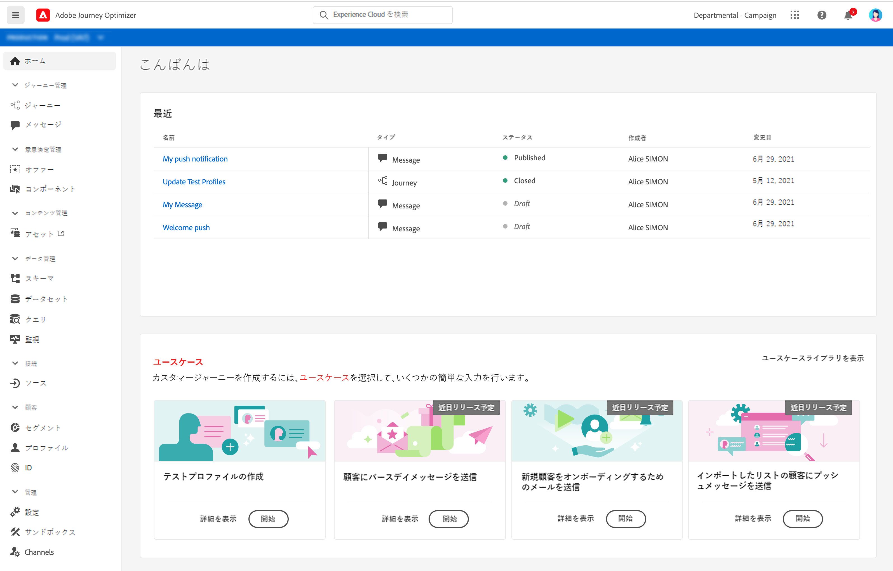
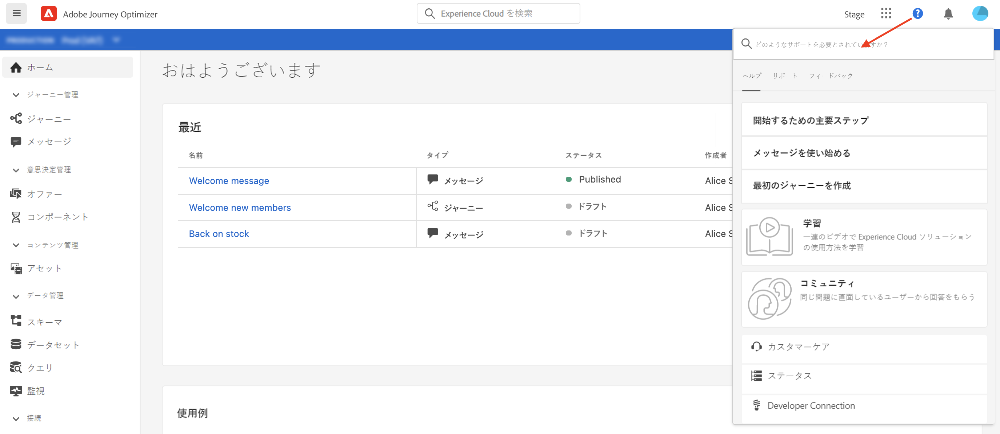
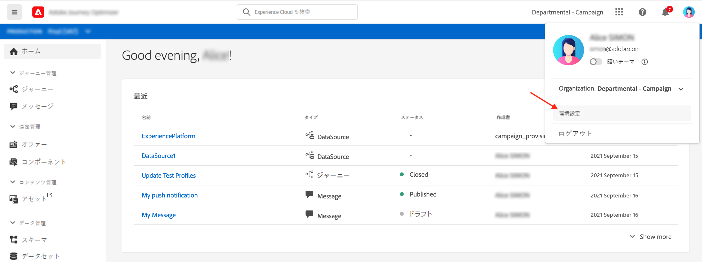
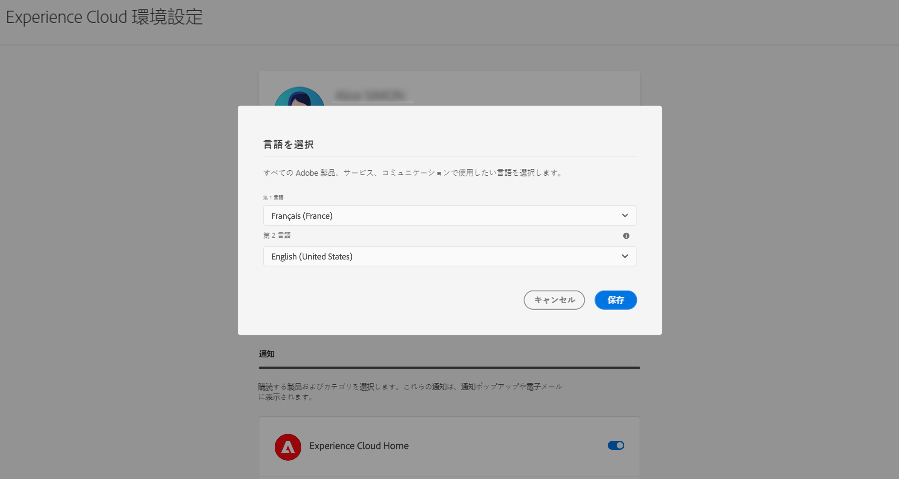
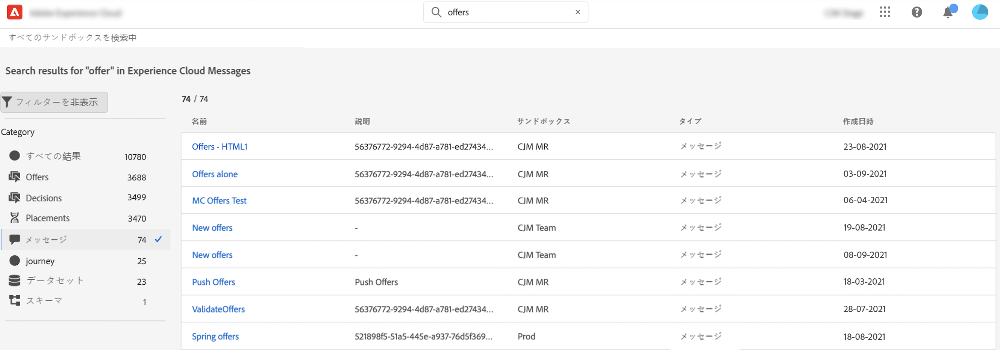
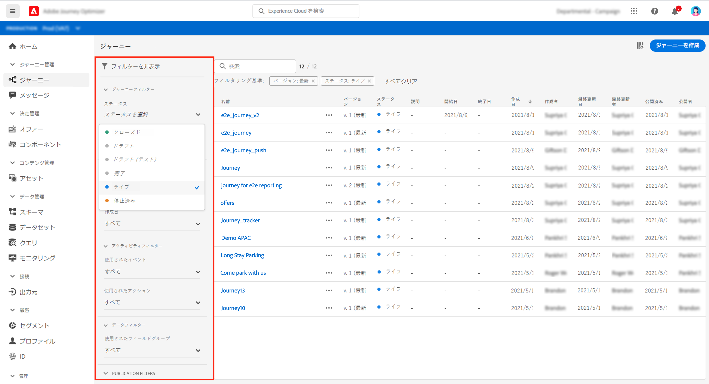
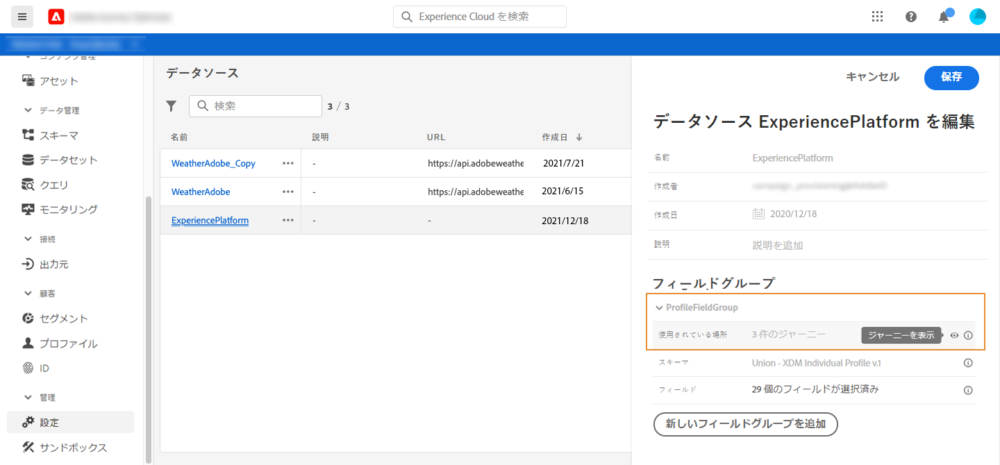
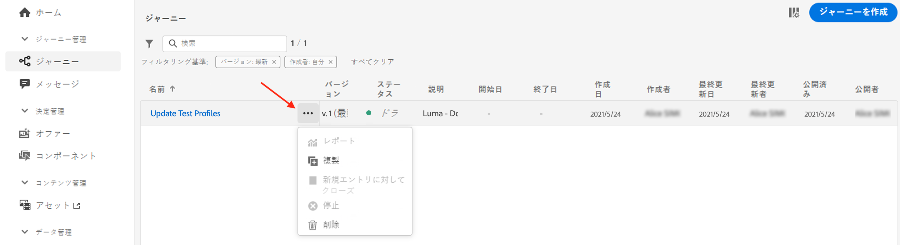

# ユーザーインターフェイス {#cjm-user-interface}

[Adobe Experience Cloud](http://experience.adobe.com?lang=ja) に接続して、[!DNL Journey Optimizer] を参照します。

ユーザーインターフェイスを閲覧する際の主要な概念は、Adobe Experience Platform と共通です。詳しくは、[Adobe Experience Platform のドキュメント](https://experienceleague.adobe.com/docs/experience-platform/landing/platform-ui/ui-guide.html?lang=ja#adobe-experience-platform-ui-guide){target=&quot;_blank&quot;}を参照してください。

このユーザーインターフェイスで使用できるコンポーネントと機能は、付与されている[権限](administration/permissions.md)と、使用している[ライセンスパッケージ](https://helpx.adobe.com/jp/legal/product-descriptions/adobe-journey-optimizer.html){target=&quot;_blank&quot;}によって異なります 。ご不明な点については、アドビカスタマーサクセスマネージャーまでお問い合わせください。

>[!NOTE]
>
>このドキュメントは、製品のユーザーインターフェイスの最新の変更を反映して、頻繁に更新されます。ただし、一部のスクリーンショットは、ユーザーインターフェイスと少し異なる場合があります。

## 左ナビゲーション

左側のリンクを使用して、機能を参照します。

>[!NOTE]
>
>使用できる機能は、ユーザーの権限と使用許諾契約によって異なる可能性があります。

左側のナビゲーションで利用できるサービスと機能の一覧と、関連ドキュメントへのリンクを以下に示します。

**ホーム**

[!DNL Journey Optimizer] ホームページには、開始するための主要なリンクとリソースが含まれています。**[!UICONTROL 最近]**&#x200B;のリストには、最近作成または更新したメッセージ、イベントおよびジャーニーへのショートカットが表示されます。このリストには、作成日と変更日およびステータスが表示されます。

**[!UICONTROL ジャーニー管理]**

* **[!UICONTROL ジャーニー]** ：お客様のジャーニーを作成、設定および調整します。[詳細情報](building-journeys/journey-gs.md#jo-build)

* **[!UICONTROL メッセージ]**：メールメッセージとプッシュメッセージを作成、デザイン、テストおよび公開します。[詳細情報](create-message.md)

**[!UICONTROL 決定管理]**

* **[!UICONTROL オファー]**：このメニューから最新のソースおよびデータセットにアクセスします。このセクションを使用して、新しいオファーを作成します。[詳細情報](offers/offer-library/creating-personalized-offers.md)

* **[!UICONTROL コンポーネント]**：プレースメント、ルールおよびタグを作成します。[詳細情報](offers/offer-library/key-steps.md)

**[!UICONTROL コンテンツ管理]**

* **[!UICONTROL アセット]**：[!DNL Adobe Experience Manager Assets Essentials] は、メッセージへの入力に使用できるアセットの一元的リポジトリーです。[詳細情報](assets-essentials.md)

**[!UICONTROL データ管理]**

* **[!UICONTROL スキーマ]**：Adobe Experience Platform を使用すると、スキーマエディターと呼ばれるインタラクティブなビジュアルキャンバスで Experience Data Model（XDM）スキーマを作成および管理できます。[詳細情報](get-started-schemas.md)

* **[!UICONTROL データセット]**：Adobe Experience Platform に取り込まれたすべてのデータは、データレイク内にデータセットとして保持されます。データセットは、スキーマ（列）とフィールド（行）を含んだデータコレクション（通常はテーブル）のストレージおよび管理用の構成体です。[詳細情報](get-started-datasets.md)

* **[!UICONTROL クエリ]**：Adobe Experience Platform クエリサービスを使用すると、クエリの作成と実行、実行済みのクエリの表示、組織内のユーザーが保存したクエリへのアクセスなどを行えます。 [詳細情報](get-started-queries.md)

* **[!UICONTROL 監視]**：このメニューを使用すると、Adobe Experience Platform ユーザーインターフェイス内でデータの取り込みを監視できます。 [詳細情報](https://experienceleague.adobe.com/docs/experience-platform/ingestion/quality/monitor-data-ingestion.html?lang=ja){target=&quot;_blank&quot;}

**[!UICONTROL 接続]**

* **[!UICONTROL ソース]**：このメニューを使用すると、Adobe アプリケーション、クラウドベースのストレージ、データベースなど、様々なソースからデータを取り込み、受信データの構造化、ラベル付けおよび拡充を行えます。[詳細情報](get-started-sources.md)

**[!UICONTROL 顧客]**

* **[!UICONTROL セグメント]** - Experience Platform セグメントの定義を作成および管理し、それらをジャーニーで活用します。[詳細情報](segment/about-segments.md)

* **[!UICONTROL プロファイル]**：リアルタイム顧客プロファイルは、オンライン、オフライン、CRM、サードパーティデータなど複数のチャネルからのデータを組み合わせて、個々の顧客の全体像を作成します。[詳細情報](get-started-profiles.md)

* **[!UICONTROL ID]**：Adobe Experience Platform ID サービスは、クロスデバイス、クロスチャネル、ほぼリアルタイムの顧客識別を Adobe Experience Platform 内のいわゆる ID グラフで管理します。[詳細情報](get-started-identity.md)

**[!UICONTROL 管理]**

* **[!UICONTROL ジャーニー管理]** - このメニューを使用して、ジャーニーで使用する [イベント](event/about-events.md)、[データソース](datasource/about-data-sources.md)、[アクション](action/action.md) を設定します。

* **[!UICONTROL サンドボックス]** - Adobe Experience Platform が提供するサンドボックスを使用すると、単一のインスタンスを別々の仮想環境に分割して、デジタルエクスペリエンスアプリケーションの開発と発展に役立てることができます。[詳細情報](administration/sandboxes.md)

<!--
* **[!UICONTROL Alerts]** - The user interface allows you to view a history of received alerts based on metrics revealed by Adobe Experience Platform Observability Insights. The UI also allows you to view, enable, and disable available alert rules. [Learn more](https://experienceleague.adobe.com/docs/experience-platform/observability/alerts/overview.html){target="_blank"}
-->

## 製品内の使用例

ホームページの [!DNL Adobe Journey Optimizer] のユースケースを活用し、カスタマージャーニーを作成するための簡単な入力をいくつか提供します。

利用可能なユースケースは次のとおりです。

* **テストプロファイルを作成する**：CSV テンプレートを使用してテストプロファイルを作成し、パーソナライズされたメッセージとジャーニーをテストします。このユースケースの実装方法については、[このページ](building-journeys/creating-test-profiles.md#use-case-1)を参照してください。
* **顧客に誕生日のメッセージを送信する**：顧客の誕生日を祝うメールを自動的に送信します。（近日公開）
* **新規顧客をオンボーディングするためのメールを送信する**：新規登録した顧客を歓迎するために最大 2 通のメールを簡単に送信します。（近日公開）
* **読み込んだ顧客リストにプッシュメッセージを送信する**：CSV ファイルからインポートされた顧客リストにプッシュ通知をすばやく送信します。（近日公開）

各ユースケースの詳細を確認するには、「**[!UICONTROL 詳細を表示]**」をクリックします。

「**[!UICONTROL 開始]**」ボタンをクリックして、ユースケースを開始します。

「**[!UICONTROL ユースケースライブラリを表示]**」ボタンから、実行済みの使用例にアクセスできます。

## アクセシビリティ{#accessibility}

[!DNL Adobe Journey Optimizer] のアクセシビリティ機能は、Adobe Experience Platform から継承したものです。

* キーボードアクセシビリティ
* カラーコントラスト
* 必須フィールドの検証

詳しくは、[Adobe Experience Platform ドキュメント](https://experienceleague.adobe.com/docs/experience-platform/accessibility/features.html?lang=ja){target=&quot;_blank&quot;}を参照してください。

[!DNL Journey Optimizer]では、次の一般的なキーボードショートカットを使用できます。

| アクション | ショートカット |
| --- | --- |
| ユーザインターフェイス要素、セクションおよびメニューグループ間を移動する | Tab |
| ユーザインターフェイス要素、セクションおよびメニューグループ間を後方に移動する | Shift + Tab |
| セクション内を移動して個々の要素にフォーカスを設定する | 矢印 |
| フォーカスされている要素を選択またはクリアする | Enter またはスペースバー |
| 選択をキャンセル、パネルを折りたたむまたはダイアログボックスを閉じる | Esc |

詳しくは、[Adobe Experience Platform ドキュメント](https://experienceleague.adobe.com/docs/experience-platform/accessibility/custom.html?lang=ja){target=&quot;_blank&quot;}を参照してください。

次のショートカットは、Journey Optimizer の特定の部分で使用できます。

<table>
  <thead>
    <tr>
      <th>インターフェイス要素</th>
      <th>アクション</th>
      <th>ショートカット</th>
    </tr>
  </thead>
  <tr>
    <td>ジャーニー、アクション、データソース、イベントのリスト</td>
    <td>ジャーニー、アクション、データソースまたはイベントを作成する</td>
    <td>C</td>
  </tr>
  <tr>
    <td rowspan="3">ドラフトステータスのジャーニーキャンバス</td>
    <td>左側のパレットから、使用可能な最初の位置に上から下に向かってアクティビティを追加する</td>
    <td>アクティビティをダブルクリック</td>
  </tr>
  <tr>
    <td>すべてのアクティビティを選択する</td>
    <td>Ctrl + A（Windows） Command + A（Mac）</td>
  </tr>
  <tr>
    <td>選択されたアクティビティを削除する</td>
    <td>Delete キーまたは Backspace キーを押したあと Enter キーを押して削除を確認</td>
  </tr>
  <tr>
  <td rowspan="3">

次の要素の設定ペイン：

<ul>
  <li>ジャーニーのアクティビティ</li>
  <li>イベント</li>
  <li>データソース</li>
  <li>アクション</li>
</ul>

</td>
    <td>設定する次のフィールドに移動する</td>
    <td>タブ</td>
  </tr>
  <tr>
    <td>変更内容を保存し設定ペインを閉じる</td>
    <td>Enter</td>
  </tr>
  <tr>
    <td>変更内容を破棄して設定ペインを閉じる</td>
    <td>Esc</td>
  </tr>
  <tr>
    <td rowspan="4">テストモードのジャーニー</td>
    <td>テストモードを有効または無効にする</td>
    <td>T</td>
  </tr>
  <tr>
    <td>イベントベースのジャーニーでイベントをトリガーする</td>
    <td>E</td>
  </tr>
  <tr>
    <td>

「**[!UICONTROL 一度に 1 つのプロファイル]**」オプションがオンになっているセグメントベースのジャーニーでイベントをトリガーする

</td>
    <td>P</td>
  </tr>
  <tr>
    <td>テストログを表示する</td>
    <td>L</td>
  </tr>
<!-- //Ajouter ce raccourci quand il marchera (actuellement, le raccourci Ctrl/Cmd+F du navigateur a priorité sur celui de AJO).//
  <tr>
    <td>Page with a search bar</td>
    <td>Select the search bar</td>
    <td>Ctrl/Command + F</td>
  </tr>
-->
  <tr>
    <td>テキストフィールド</td>
    <td>選択されたフィールド内のすべてのテキストを選択する</td>
    <td>Ctrl + A（Windows） Command + A（Mac）</td>
  </tr>
  <tr>
    <td rowspan="2">ポップアップウィンドウ</td>
    <td>変更内容を保存するかアクションを確認する</td>
    <td>入力</td>
  </tr>
  <tr>
    <td>ウィンドウを閉じる</td>
    <td>Esc</td>
  </tr>
  <tr>
    <td>シンプルな式エディター</td>
    <td>フィールドを選択し追加する</td>
    <td>フィールドをダブルクリック</td>
  </tr>
  <tr>
    <td>XDM フィールドのブライジング</td>
    <td>ノードのすべてのフィールドを選択する</td>
    <td>親ノードを選択</td>
  </tr>
  <tr>
    <td>ペイロードのプレビュー</td>
    <td>ペイロードを選択する</td>
    <td>Ctrl + A（Windows） Command + A（Mac）</td>
  </tr>
</table>

## ヘルプとサポートを検索

Adobe Journey Optimizer の主要なヘルプページには、ホームページの下部のセクションからアクセスできます。

**ヘルプ**&#x200B;アイコンを使用して、ヘルプページにアクセスしたり、サポートに問い合わせたり、フィードバックを共有したりします。検索フィールドからヘルプ記事やビデオを検索できます。

## サポートされているブラウザー

Adobe [!DNL Journey Optimizer] のインターフェイスは、最新バージョンの Google Chrome で最適に動作するようにデザインされています。古いバージョンや他のブラウザーでは、特定の機能を使用すると問題が発生する場合があります。

## 言語の環境設定

現在、ユーザーインターフェイスは次の言語で利用できます。

* 英語
* フランス語
* ドイツ語

デフォルトのインターフェイス言語は、ユーザープロファイルで指定されている優先言語によって決まります。

言語を変更するには：

* 右上のアバターから「**環境設定**」をクリックします。
   
* 次に、メールアドレスの下に表示される言語をクリックします
* 希望する言語を選択し、「**保存**」をクリックします。使用しているコンポーネントが第一希望の言語にローカライズされていない場合に備えて、第二の言語を選択できます。
   

## 検索{#unified-search}

Adobe Journey Optimizer インターフェイスのどこからでも、上部バーの中央にある Adobe Experience Cloud 統合検索機能を使用して、サンドボックスをまたいでアセット、ジャーニー、データセット、メッセージなどを検索できます。

コンテンツの入力を開始すると、上位の結果が表示されます。入力したキーワードに関するヘルプ記事も結果に表示されます。

**Enter** キーを押すと、すべての結果にアクセスでき、ビジネスオブジェクトでフィルタリングできます。

## フィルターリスト{#section_lgm_hpz_pgb}

ほとんどのリストでは、検索バーを使用すると、特定の項目を検索してフィルター条件を選択できます。

フィルターにアクセスするには、リストの左上にあるフィルターアイコンをクリックします。フィルターメニューを使用すると、表示される要素をさまざまな条件で絞り込むことができます。表示する要素を、特定のタイプまたはステータスの要素、自分で作成した要素、過去 30 日間に変更された要素などに限るように選択することができます。オプションはコンテキストによって異なります。

ジャーニーのリストの「**[!UICONTROL ステータスとバージョンフィルター]**」で、ステータス、タイプおよびバージョンに従ってジャーニーをフィルタリングできます。タイプは、**[!UICONTROL 単一イベント]**、**[!UICONTROL セグメントの選定]**、**[!UICONTROL セグメントを読み取り]**、**[!UICONTROL ビジネスイベント]**、**[!UICONTROL バースト]**&#x200B;のいずれかになります。**[!UICONTROL アクティビティフィルター]**&#x200B;と&#x200B;**[!UICONTROL データフィルター]**&#x200B;で、特定のイベント、フィールドグループ、アクションなどを使用するジャーニーのみを表示するように選択できます。**[!UICONTROL 公開フィルター]**&#x200B;を使用すると、公開日またはユーザーを選択できます。例えば、昨日公開されたライブなジャーニーの最新バージョンのみを表示するように選択できます。[詳細情報](building-journeys/using-the-journey-designer.md)。

>[!NOTE]
>
>表示される列は、リストの右上にある設定ボタンを使用してパーソナライズできます。パーソナライズ設定は、各ユーザーに対して個別に保存されます。

**[!UICONTROL 最終更新日]**&#x200B;列と&#x200B;**[!UICONTROL 最終更新者]**&#x200B;の列を使用すると、最新のジャーニーを更新した日時とユーザーを確認できます。

イベント、データソース、アクションの設定ウィンドウの「**[!UICONTROL 使用されている場所]**」フィールドには、特定のイベント、フィールドグループ、アクションを使用するジャーニーの数が表示されます。「**[!UICONTROL ジャーニーを表示]**」ボタンをクリックすると、対応するジャーニーのリストを表示できます。

様々なリストで、各要素に対して基本的な操作を実行できます。例えば、項目の複製や削除が可能です。

