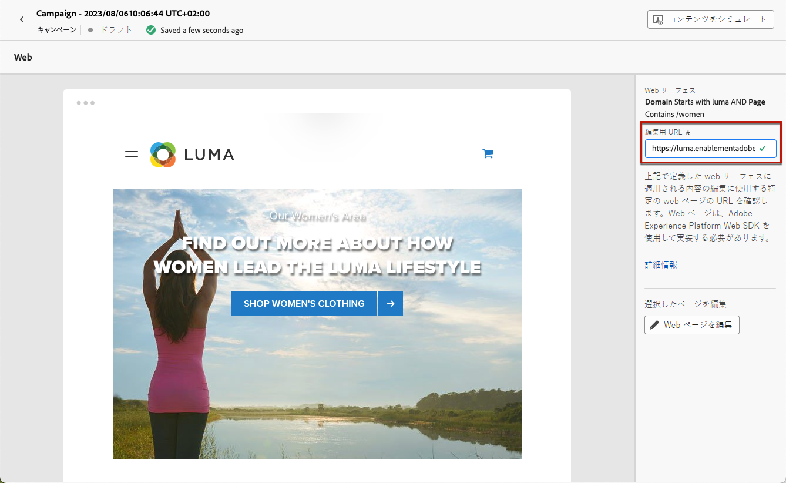
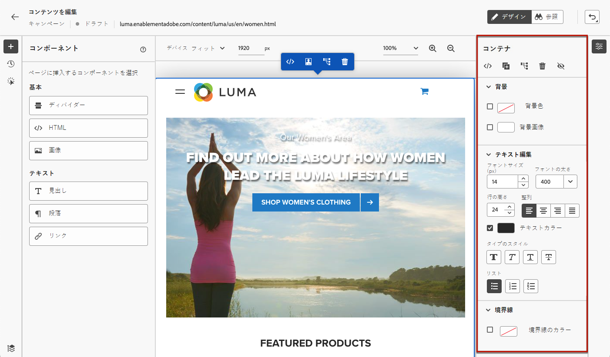
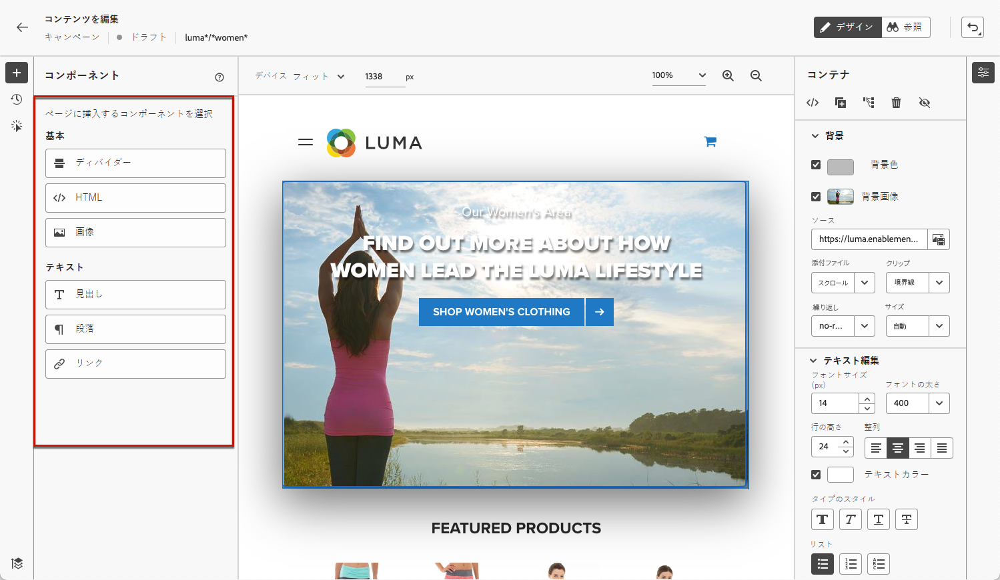
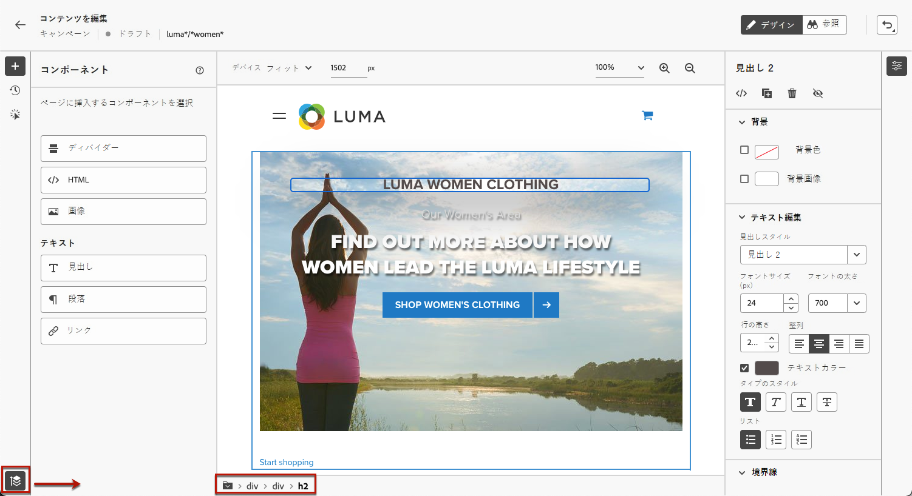
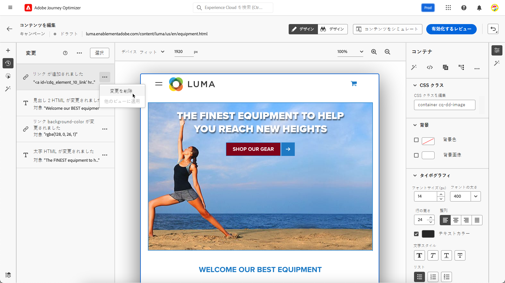

# Web ページの作成 {#author-web}

>[!AVAILABILITY]
>
>現在、web チャネル機能は、一部のユーザーのみが利用できるベータ版として使用できます。

[!DNL Journey Optimizer] の web オーサリングは、Adobe Experience Cloud Visual Helper Chrome ブラウザー拡張機能によって動作します。 [詳細情報](visual-editing-helper.md)

[!DNL Journey Optimizer] ユーザーインターフェイスで web ページにアクセスして作成できるようにするには、[この節](create-web.md#prerequesites)に記載されている前提条件に従ってください。

## Web ページコンテンツの編集 {#edit-web-content}

>[!CONTEXTUALHELP]
>id="ajo_web_url_to_edit_surface"
>title="編集する URL を入力"
>abstract="上で定義した Web サーフェスに適用されるコンテンツの編集に使用する特定の Web ページの URL を入力します。 Web ページは、Adobe Experience Platform Web SDK を使用して実装する必要があります。"
>additional-url="https://experienceleague.adobe.com/docs/platform-learn/implement-web-sdk/overview.html" text="詳細情報"

>[!CONTEXTUALHELP]
>id="ajo_web_url_to_edit_rule"
>title="編集する URL を入力"
>abstract="ルールに一致するすべてのページに適用されるコンテンツの編集に使用する特定の Web ページの URL を入力します。 Web ページは、Adobe Experience Platform Web SDK を使用して実装する必要があります。"
>additional-url="https://experienceleague.adobe.com/docs/platform-learn/implement-web-sdk/overview.html" text="詳細情報"

<!--Confirm the URL to use for authoring content on the surface. Typically the Authoring URL will be the surface URL itself, but you may include extra parameters if required. The page must include the Adobe Experience Platform Web SDK.-->

キャンペーンから web アクションを作成したら、web デザイナーを使用してコンテンツを編集できます。 これを行うには、以下の手順に従います。

>[!CAUTION]
>
>アクセス先 [!DNL Journey Optimizer]を使用する場合、Web ページは [Adobe Experience Platform Web SDK](https://experienceleague.adobe.com/docs/platform-learn/implement-web-sdk/overview.html?lang=ja){target=&quot;_blank&quot;}。

1. キャンペーンの「**[!UICONTROL アクション]**」タブから、「**[!UICONTROL コンテンツを編集]**」を選択して web キャンペーンの作成を開始します。

1. ルールに一致するページを作成した場合は、このルールに一致する URL を入力する必要があります。 ルールに一致するすべてのページにこの変更が適用されます。

   >[!NOTE]
   >
   >Web サーフェスに 1 つの URL を入力した場合、パーソナライズする URL は既に入力されています。

   

1. ページのコンテンツが表示されます。

   >[!CAUTION]
   >
   >Web ページには、 [Adobe Experience Platform Web SDK](https://experienceleague.adobe.com/docs/platform-learn/implement-web-sdk/overview.html){target=&quot;_blank&quot;}。

1. 「**[!UICONTROL Web デザイナーを開く]**」をクリックして編集します。[詳細情報](author-web.md)

   

1. Web デザイナーが表示されます。

   

1. キャンバスから要素（画像、ボタン、段落、テキスト、コンテナ、見出し、リンクなど）を選択します。以下を使用します。

   * コンテンツ、レイアウト、リンクの挿入、パーソナライゼーションなどを編集するためのコンテキストメニュー。

      

   * 各要素を編集、複製、削除または非表示にするための、右側パネルの上部にあるアイコン。

      

   * 選択した要素に応じて動的に変化する右側のパネル。 例えば、要素の背景、テキスト編集、境界線、サイズ、位置、間隔、エフェクトまたはインラインスタイルを編集できます。

      

## コンテンツコンポーネントの使用 {#content-components}

>[!CONTEXTUALHELP]
>id="ajo_web_designer_components"
>title="Web ページへのコンテンツコンポーネントの追加"
>abstract="Web ページに様々なコンポーネントを追加し、必要に応じて編集できます。"

1. 左側の&#x200B;**[!UICONTROL コンポーネント]**&#x200B;パネルでは、次のコンポーネントを web ページに追加し、必要に応じて編集できます。

   * [ディバイダー](../design/content-components.md#divider)
   * [HTML](../design/content-components.md#HTML)
   * [画像](../design/content-components.md#image)
   * 見出し - このコンポーネントを使用することは、電子メールデザイナーで&#x200B;**[!UICONTROL テキスト]**&#x200B;コンポーネントを使用することに似ています。 [詳細情報](../design/content-components.md#text)
   * 段落 - このコンポーネントを使用することは、電子メールデザイナーで&#x200B;**[!UICONTROL テキスト]**&#x200B;コンポーネントを使用することに似ています。[詳細情報](../design/content-components.md#text)
   * リンク - [この節](../design/styling-links.md)でリンクスタイルを定義する方法を説明します
   * [オファーの決定](../design/deliver-personalized-offers.md)

   

1. ページにポインタを置いて、「**[!UICONTROL 前に挿入]**」または「**[!UICONTROL 後ろに挿入]**」ボタンをクリックして、コンポーネントをページ上の既存の要素に追加します。

   

1. このコンポーネントに表示されるコンテナから、必要に応じてコンポーネントのコンテンツを編集します。

   

1. 右側の&#x200B;**[!UICONTROL コンテナ]**&#x200B;パネルから表示されるスタイル（背景、テキストカラー、境界線、サイズ、位置など）を調整します。選択したコンポーネントによって異なります。

   

## Web デザイナー内での移動

### パンくずリストの使用

1. キャンバスから任意の要素を選択します。

1. 画面の左下に表示される「**[!UICONTROL パンくずリストを展開／折りたたむ]**」ボタンをクリックすると、選択した要素に関する情報をすばやく表示します。

   

1. パンくずリストにポインタを合わせると、エディターで対応する要素がハイライト表示されます。

1. これを使用すると、ビジュアルエディター内で任意の親要素、兄弟要素または子要素に簡単に移動できます。

### 参照モードにスワップ {#browse-mode}

>[!CONTEXTUALHELP]
>id="ajo_web_designer_browse"
>title="参照モードの使用"
>abstract="このモードから、パーソナライズする選択したサーフェスから正確なページに移動できます。"

専用ボタンを使用して、デフォルトの&#x200B;**[!UICONTROL デザイン]**&#x200B;モードから&#x200B;**[!UICONTROL 参照]**&#x200B;モードにスワップします。

**[!UICONTROL 参照]**&#x200B;モードでは、パーソナライズする選択したサーフェスから該当するページに移動できます。

これは、認証の後のページや、特定の URL で最初から使用できないページを処理する場合に特に便利です。例えば、認証を行い、アカウントページや買い物かごページに移動して、**[!UICONTROL デザイン]**&#x200B;モードに戻り、目的のページで変更を実行できます。

### デバイスサイズの変更

デバイスのサイズは、事前定義済みのサイズ（「**[!UICONTROL タブレット]**」または「**[!UICONTROL モバイル (横置き)]**」など）に変更するか、カスタムサイズを定義できます。目的のピクセルの数値を入力して、カスタムサイズを定義します。

また、ズームフォーカスを 25％から 400％に変更することもできます。

## 変更の管理 {#manage-modifications}

>[!CONTEXTUALHELP]
>id="ajo_web_designer_modifications"
>title="すべての変更を容易に管理"
>abstract="このウィンドウを使用すると、Web ページに追加したすべての調整とスタイルをナビゲートおよび管理できます。"

Web ページに追加したすべてのコンポーネント、調整およびスタイルを簡単に管理できます。

1. 「**[!UICONTROL 変更]**」ボタンを選択して、対応するパネルを左側に表示します。

   

1. ページに加えた各変更を確認できます。

1. 不要な変更を選択し、削除アイコンをクリックして削除します。

   

   >[!CAUTION]
   >
   >アクションを削除する場合は後続のアクションに影響する可能性があるので、慎重に作業を進めてください。

1. 画面の右上にある&#x200B;**[!UICONTROL 取り消し／やり直し]**&#x200B;ボタンを使用して、アクションをキャンセルおよびやり直すこともできます。

   

   「**[!UICONTROL 取り消し]**」オプションと「**[!UICONTROL やり直し]**」オプションを切り替えるには、ボタンをクリックしたままにします。次に、ボタン自体をクリックして、目的のアクションを適用します。

## パーソナライゼーションとオファーの追加

パーソナライゼーションを追加するには、コンテナを選択し、表示されるコンテキストメニューバーからパーソナライゼーションアイコンを選択します。 式エディターを使用して、変更を追加します。[詳細情報](../personalization/personalization-build-expressions.md)

**[!UICONTROL オファーの決定]**&#x200B;コンポーネントを使用し、web ページに[オファー](../offers/get-started/starting-offer-decisioning.md)を挿入します。プロセスは、[メールへのオファーの追加](../design/deliver-personalized-offers.md)の場合と同じです。意思決定管理を活用して、顧客に提供する最適なオファーを選択します。

## Web キャンペーンのテスト {#test-web-campaign}

>[!CONTEXTUALHELP]
>id="ajo_web_designer_preview"
>title="Web エクスペリエンスをプレビュー"
>abstract="Web エクスペリエンスがどのように表示されるかをシミュレーションで確認します。"

変更した web エクスペリエンスのプレビューを表示するには、次の手順に従います。

>[!CAUTION]
>
>どのオファーが配信されるかをシミュレートするには、使用可能なテストプロファイルがある必要があります。[テストプロファイルを作成](../segment/creating-test-profiles.md)する方法について説明します。

1. **[!UICONTROL コンテンツを編集]**&#x200B;画面または web デザイナーから、「**[!UICONTROL コンテンツをシミュレート]**」を選択します。

   

1. 「**[!UICONTROL テストプロファイルを管理]**」をクリックして、1 つ以上のテストプロファイルを選択します。
1. 変更した web ページのプレビューが表示されます。

   

1. テスト URL をコピーして任意のブラウザーに貼り付けたり、デフォルトのブラウザーで開いたりすることもできます。
