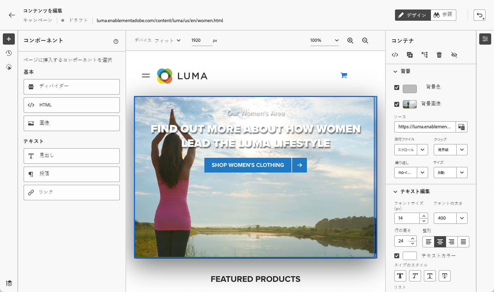
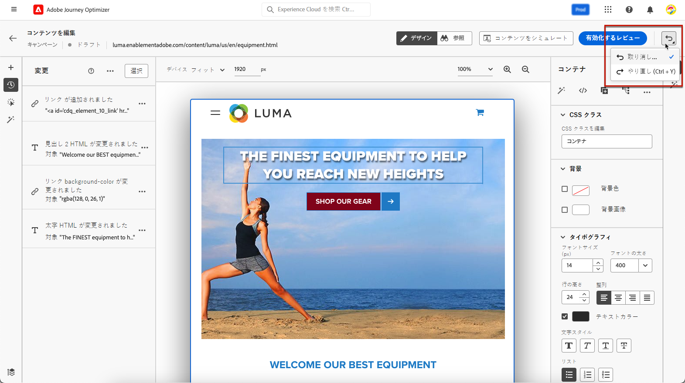
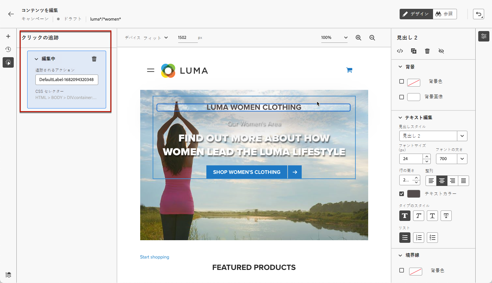
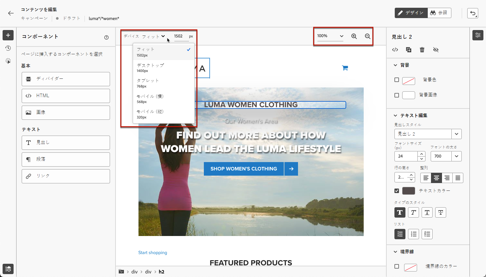
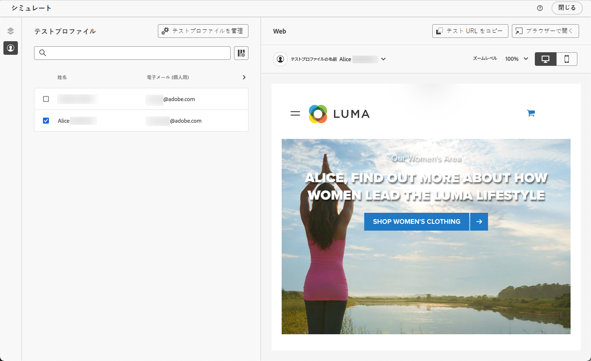

# Web ページの作成 {#author-web}

キャンペーンに [web アクションを追加](create-web.md#create-web-campaign)すると、Web デザイナーでサイトのコンテンツを編集できるようになります。

[!DNL Journey Optimizer] の web オーサリングには、**Adobe Experience Cloud Visual Helper** の Chrome ブラウザー拡張機能が利用されています。[詳細情報](web-prerequisites.md#visual-authoring-prerequisites)

>[!CAUTION]
>
>[!DNL Journey Optimizer] ユーザーインターフェイスで web ページへのアクセスや web ページを作成するには、[こちらのセクション](web-prerequisites.md)に記載されている前提条件を必ず満たすようにしてください。

[こちらのビデオで web キャンペーンの作成方法について学ぶ](#video)

## Web ページコンテンツの編集 {#edit-web-content}

>[!CONTEXTUALHELP]
>id="ajo_web_url_to_edit_surface"
>title="編集する URL の確認"
>abstract="上記で定義した web サーフェスに適用される内容の編集に使用する特定の web ページの URL を確認します。Web ページは、Adobe Experience Platform Web SDK を使用して実装する必要があります。"
>additional-url="https://experienceleague.adobe.com/docs/platform-learn/implement-web-sdk/overview.html?lang=ja" text="詳細情報"

>[!CONTEXTUALHELP]
>id="ajo_web_url_to_edit_rule"
>title="編集する URL の入力"
>abstract="ルールに一致するすべてのページに適用されるコンテンツの編集に使用する特定の web ページの URL を入力します。 Web ページは、Adobe Experience Platform Web SDK を使用して実装する必要があります。"
>additional-url="https://experienceleague.adobe.com/docs/platform-learn/implement-web-sdk/overview.html?lang=ja" text="詳細情報"

Web キャンペーンのオーサリングを開始するには、次の手順に従います。

1. [キャンペーン](create-web.md#create-web-campaign)の「**[!UICONTROL アクション]**」タブで「**[!UICONTROL コンテンツを編集]**」を選択します。<!--change screen with rule-->

   

1. ルールに一致するページを作成した場合は、このルールに一致する URL を入力する必要があります。変更は、ルールに一致するすべてのページに適用されます。ページのコンテンツが表示されます。

   >[!NOTE]
   >
   >Web サーフェスに 1 つの URL を入力した場合、パーソナライズする URL は既に入力されています。

   

   >[!CAUTION]
   >
   >Web ページには、[Adobe Experience Platform Web SDK](https://experienceleague.adobe.com/docs/platform-learn/implement-web-sdk/overview.html?lang=ja){target="_blank"} を含める必要があります。[詳細情報](web-prerequisites.md#implementation-prerequisites)

1. 「**[!UICONTROL Web ページを編集]**」をクリックしてオーサリングを開始します。Web デザイナーが表示されます。

   

   >[!NOTE]
   >
   >読み込みに失敗した web サイトを読み込もうとすると、[Visual Editing Helper のブラウザー拡張機能](#install-visual-editing-helper)のインストールを勧めるメッセージが表示されます。トラブルシューティングのヒントについては、[こちらのセクション](web-prerequisites.md#troubleshooting)をご覧ください。

1. キャンバスから要素（画像、ボタン、段落、テキスト、コンテナ、見出し、リンクなど）を選択します。[詳細情報](#content-components)

1. 用途：

   * コンテンツ、レイアウト、リンクの挿入、パーソナライゼーションなどを編集するためのコンテキストメニュー。

     

   * 各要素を編集、複製、削除または非表示にするための、右側パネルの上部にあるアイコン。

     

   * 選択した要素に応じて動的に変化する右側のパネル。 例えば、要素の背景、テキスト編集、境界線、サイズ、位置、間隔、エフェクトまたはインラインスタイルを編集できます。

     

>[!NOTE]
>
>Web のコンテンツデザイナーは、メールデザイナーと非常に似ています。詳細は[ [!DNL Journey Optimizer]](../email/get-started-email-design.md) でのコンテンツのデザインを参照してください。

## コンポーネントの使用 {#content-components}

>[!CONTEXTUALHELP]
>id="ajo_web_designer_components"
>title="Web ページへのコンポーネントの追加"
>abstract="Web ページに多数のコンポーネントを追加し、必要に応じて編集できます。"

1. 左側の&#x200B;**[!UICONTROL コンポーネント]**&#x200B;パネルで、項目を選択します。Web ページに以下のコンポーネントを追加し、必要に応じて編集できます。

   * [ディバイダー](../email/content-components.md#divider)
   * [HTML](../email/content-components.md#HTML)
   * [画像](../email/content-components.md#image)
   * 見出し - このコンポーネントを使用することは、電子メールデザイナーで&#x200B;**[!UICONTROL テキスト]**&#x200B;コンポーネントを使用することに似ています。 [詳細情報](../email/content-components.md#text)
   * 段落 - このコンポーネントを使用することは、電子メールデザイナーで&#x200B;**[!UICONTROL テキスト]**&#x200B;コンポーネントを使用することに似ています。[詳細情報](../email/content-components.md#text)
   * リンク
   * [オファーの決定](../email/add-offers-email.md)

   

1. ページにポインタを置いて、「**[!UICONTROL 前に挿入]**」または「**[!UICONTROL 後ろに挿入]**」ボタンをクリックして、コンポーネントをページ上の既存の要素に追加します。

   

   >[!NOTE]
   >
   >コンポーネントの選択を解除するには、キャンバス上部の青いコンテキストバナーにある **[!UICONTROL ESC]** ボタンをクリックします。

1. 必要に応じて、ページのコンテンツでコンポーネントを直接編集できます。

   

1. 右側のコンテキストパネルに表示されるスタイル（背景、テキストカラー、境界線、サイズ、位置など）を調整します。- 選択したコンポーネントによって異なります。

   

## パーソナライゼーションとオファーの追加

パーソナライゼーションを追加するには、コンテナを選択し、表示されるコンテキストメニューバーからパーソナライゼーションアイコンを選択します。 式エディターを使用して、変更を追加します。[詳細情報](../personalization/personalization-build-expressions.md)

**[!UICONTROL オファーの決定]**&#x200B;コンポーネントを使用し、web ページに[オファー](../offers/get-started/starting-offer-decisioning.md)を挿入します。プロセスは、[メールへのオファーの追加](../email/add-offers-email.md)の場合と同じです。意思決定管理を活用して、顧客に提供する最適なオファーを選択します。

## 変更の管理 {#manage-modifications}

>[!CONTEXTUALHELP]
>id="ajo_web_designer_modifications"
>title="すべての変更を簡単に管理"
>abstract="このパネルを使用すると、web ページに追加したすべての調整とスタイルを移動して管理できます。"

Web ページに追加したすべてのコンポーネント、調整およびスタイルを簡単に管理できます。

1. **[!UICONTROL 変更]**&#x200B;アイコンを選択して、対応するパネルを左側に表示します。

   

1. ページに加えた各変更を確認できます。

1. 不要な変更を選択し、削除アイコンをクリックして削除します。

   

   >[!CAUTION]
   >
   >アクションを削除する場合は後続のアクションに影響する可能性があるので、慎重に作業を進めてください。

1. **[!UICONTROL 変更]**&#x200B;パネルの上部にある&#x200B;**[!UICONTROL その他のアクション]** ボタンから、すべての変更を一度に削除できます。

   

1. **[!UICONTROL その他のアクション]**&#x200B;メニューで、無効な変更（他の変更によって上書きされた変更）のみを削除することもできます。例えば、テキストのカラーを変更してそのテキストを削除すると、テキストが存在しなくなったためにカラーの変更が無効になります。

1. 画面の右上にある&#x200B;**[!UICONTROL 取り消し／やり直し]**&#x200B;ボタンを使用して、アクションをキャンセルおよびやり直すこともできます。

   

   「**[!UICONTROL 取り消し]**」オプションと「**[!UICONTROL やり直し]**」オプションを切り替えるには、ボタンをクリックしたままにします。次に、ボタン自体をクリックして、目的のアクションを適用します。

## クリックの追跡を使用 {#use-click-tracing}

Web デザイナーのこの機能を使用すると、web サイトの任意の要素を選択し、その要素に対するクリック数を追跡できます。

キャンペーンがライブになったら、キャンペーン web レポートで各要素のクリック数を確認できます。この情報は、web サイトのユーザーエクスペリエンスを向上させるのに役立ちます。例えば、実際にはクリックできない要素を多くのユーザーがクリックしたことが [web レポート](../reports/campaign-global-report.md#web-tab)でわかる場合は、その要素にリンクを追加したほうが良い可能性があります。

1. ページの要素を選択し、コンテキストメニューの「**[!UICONTROL クリック追跡の要素]**」を選択します。

   

   >[!NOTE]
   >
   >任意の項目（クリック可能またはクリック不可）を選択できます。

1. 対応する追跡対象のアクションが、左側の&#x200B;**[!UICONTROL クリック追跡]**&#x200B;パネルに表示されます。

   

1. 追跡されたすべての要素を管理し、レポートで簡単に見つけるためのわかりやすいラベルを追加します。**[!UICONTROL CSS セレクター]**&#x200B;フィールドに、選択した要素を見つけるための情報が表示されます。

1. 上記の手順を繰り返し、クリックの追跡に必要な数の他の要素を選択します。対応するすべてのアクションが左側のウィンドウに表示されます。

   

1. 要素でのクリックの追跡を削除するには、対応する削除アイコンを選択します。

キャンペーンがアクティブになると、キャンペーンレポートの「**[!UICONTROL Web]**」タブでインプレッション数、クリック率およびクリック数を要素別に比較できます。[詳細情報](../reports/campaign-global-report.md#web-tab)

## Web デザイナー内での移動 {#navigate-web-designer}

### パンくずリストの使用 {#breadcrumbs}

1. キャンバスから任意の要素を選択します。

1. 画面の左下に表示される「**[!UICONTROL パンくずリストを展開／折りたたむ]**」ボタンをクリックすると、選択した要素に関する情報をすばやく表示します。

   

1. パンくずリストにポインタを合わせると、エディターで対応する要素がハイライト表示されます。

1. これを使用すると、ビジュアルエディター内で任意の親要素、兄弟要素または子要素に簡単に移動できます。

### 参照モードにスワップ {#browse-mode}

>[!CONTEXTUALHELP]
>id="ajo_web_designer_browse"
>title="参照モードの使用"
>abstract="このモードでは、パーソナライズする選択したサーフェスから該当するページに移動できます。"

専用ボタンを使用して、デフォルトの&#x200B;**[!UICONTROL デザイン]**&#x200B;モードから&#x200B;**[!UICONTROL 参照]**&#x200B;モードにスワップします。

**[!UICONTROL 参照]**&#x200B;モードでは、パーソナライズする選択したサーフェスから該当するページに移動できます。

これは、認証の後のページや、特定の URL で最初から使用できないページを処理する場合に特に便利です。例えば、認証を行い、アカウントページや買い物かごページに移動して、**[!UICONTROL デザイン]**&#x200B;モードに戻り、目的のページで変更を実行できます。

### デバイスサイズの変更 {#change-device-size}

Web デザイナーのディスプレイのデバイスサイズは、**[!UICONTROL タブレット]**&#x200B;または&#x200B;**[!UICONTROL モバイル横置き]**&#x200B;などの事前定義済みのサイズに変更したり、必要なピクセル数を入力してカスタムのサイズを定義したりできます。

また、ズームフォーカスを 25％から 400％に変更することもできます。

デバイスサイズを変更する機能は、様々なデバイス、ウィンドウ、画面のサイズに適切にレンダリングされるレスポンシブサイト用に設計されています。レスポンシブサイトは、デスクトップ、ノートパソコン、タブレット、携帯電話を含む、あらゆる画面サイズに自動的に調整および適応します。

>[!CAUTION]
>
>特定のデバイスサイズで web エクスペリエンスを編集できます。ただし、セレクターが同じである限り、これらの変更は作業中のデバイスサイズだけでなく、すべてのサイズとデバイスに適用されます。同様に、通常のデスクトップビューでのエクスペリエンスの編集は、そのデスクトップビューだけでなく、すべての画面サイズに適用されます。
>
>現在、[!DNL Journey Optimizer] は、デバイスサイズに固有のページの変更をサポートしていません。例えば、個別のサイト構造を持つ別のモバイル web サイトがある場合は、別のキャンペーンでそのモバイルサイトに固有の変更を行う必要があります。

## Web キャンペーンのテスト {#test-web-campaign}

>[!CONTEXTUALHELP]
>id="ajo_web_designer_preview"
>title="Web エクスペリエンスのプレビュー"
>abstract="Web エクスペリエンスがどのように表示されるかをシミュレーションで確認します。"

変更した web エクスペリエンスのプレビューを表示するには、次の手順に従います。

>[!CAUTION]
>
>どのオファーが配信されるかをシミュレートするには、使用可能なテストプロファイルがある必要があります。詳細は、[テストプロファイルを作成](../audience/creating-test-profiles.md)する方法を参照してください。

1. Web キャンペーンのコンテンツ編集画面で、**[!UICONTROL コンテンツをシミュレート]**&#x200B;を選択します。

   <!---->

   

1. 「**[!UICONTROL テストプロファイルを管理]**」をクリックして、1 つ以上のテストプロファイルを選択します。
1. 変更した web ページのプレビューが表示されます。

   

1. また、デフォルトのブラウザーで開くことも、テスト URL をコピーして任意のブラウザーに貼り付けることもできます。これにより、キャンペーンの実施前に任意のブラウザーで新しい web エクスペリエンスをプレビューできるチームや関係者とリンクを共有できます。

   >[!NOTE]
   >
   >テスト URL をコピーする際に表示されるコンテンツは、コンテンツのシミュレーションが [!DNL Journey Optimizer] で生成されるときにテストプロファイル用にパーソナライズされます。

## チュートリアルビデオ{#video}

次のビデオでは、[!DNL Journey Optimizer] キャンペーンで Web デザイナーを使用して web エクスペリエンスを作成する方法を確認できます。

>[!VIDEO](https://video.tv.adobe.com/v/3418803/?quality=12&learn=on)
