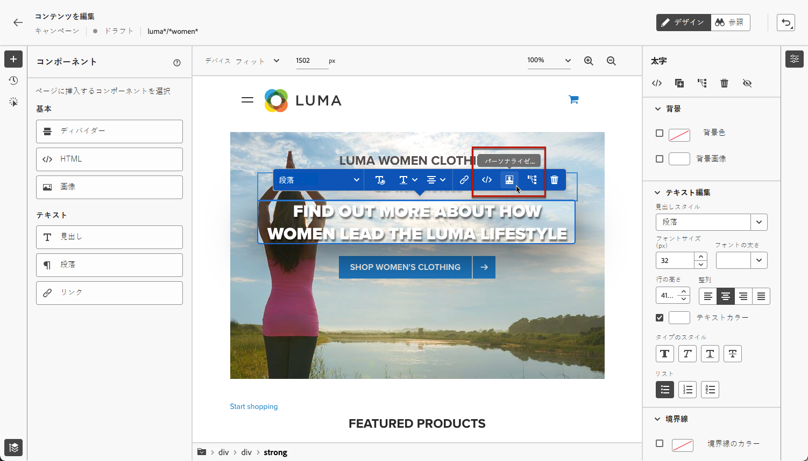

# Web ページの作成 {#author-web}

>[!AVAILABILITY]
>
>現在、Web チャネル機能は、一部のユーザーのみが利用できるベータ版として使用できます。

In [!DNL Journey Optimizer] web オーサリングは、Adobe Experience Cloud Visual Helper chrome ブラウザー拡張機能によって動作します。 [詳細情報](visual-editing-helper.md)

Web ページにアクセスして [!DNL Journey Optimizer] ユーザーインターフェイスで、「 [この節](create-web.md#prerequesites).

## Web ページコンテンツを編集 {#edit-web-content}

キャンペーンから Web アクションを作成したら、Web デザイナーを使用してコンテンツを編集できます。 これを行うには、以下の手順に従います。

1. 次の **[!UICONTROL アクション]** キャンペーンの「 」タブで、「 」を選択します。 **[!UICONTROL コンテンツを編集]** web キャンペーンのオーサリングを開始します。 [詳細情報](create-web.md#configure-web-campaign)

1. ルールに一致するページを作成した場合は、このルールに一致する URL を入力する必要があります。 変更は、ルールに一致するすべてのページに適用されます。

   >[!NOTE]
   >
   >Web サーフェスに単一の URL を入力した場合、パーソナライズする URL は既に入力されています。

   

1. ページのコンテンツが表示されます。

   >[!CAUTION]
   >
   >Web ページにアクセスするには、 [Adobe Experience Platform Web SDK](https://experienceleague.adobe.com/docs/platform-learn/implement-web-sdk/overview.html?lang=ja){target=&quot;_blank&quot;}。

1. クリック **[!UICONTROL Web デザイナーを開く]** をクリックして編集します。 [詳細情報](author-web.md)

   

1. Web デザイナーが表示されます。

   

1. キャンバスから要素（画像、ボタン、段落、テキスト、コンテナ、見出し、リンクなど）を選択します。 およびを使用します。

   * コンテンツの編集、レイアウト、リンクの挿入、パーソナライゼーションなどをおこなうためのコンテキストメニュー。

      

   * 各要素を編集、複製、削除または非表示にするための、右側のパネルの上部のアイコン。

      

   * 選択した要素に応じて動的に変化する右側のパネル。 例えば、要素の背景、タイポグラフィ、境界線、サイズ、位置、間隔、効果またはインラインスタイルを編集できます。

      

## コンテンツコンポーネントの使用 {#content-components}

1. 次の **[!UICONTROL コンポーネント]** 左側のパネルでは、次のコンポーネントを web ページに追加し、必要に応じて編集できます。

   * [ディバイダー](../design/content-components.md#divider)
   * [HTML](../design/content-components.md#HTML)
   * [画像](../design/content-components.md#image)
   * 見出し — このコンポーネントの使用は、 **[!UICONTROL テキスト]** コンポーネントを選択します。 [詳細情報](../design/content-components.md#text)
   * 段落 — このコンポーネントの使用は、 **[!UICONTROL テキスト]** コンポーネントを選択します。 [詳細情報](../design/content-components.md#text)
   * リンク — でリンクスタイルを定義する方法を説明します。 [この節](../design/styling-links.md)
   * [オファーの決定](../design/deliver-personalized-offers.md)

   

1. ページにマウスポインターを置いて、 **[!UICONTROL 前に挿入]** または **[!UICONTROL 後ろに挿入]** ボタンをクリックして、ページ上の既存の要素にコンポーネントを追加します。

   

1. このコンポーネント用に表示されるコンテナから、必要に応じてコンポーネントのコンテンツを編集します。

   

1. 表示するスタイルを **[!UICONTROL コンテナ]** 右側のウィンドウ（背景、テキストの色、境界線、サイズ、位置など） 選択したコンポーネントに応じて。

   

## Web デザイナー内を移動する

### パンくずリストを使用

1. キャンバスから任意の要素を選択します。

1. 次をクリック： **[!UICONTROL パンくずリストを展開/折りたたむ]** ボタンを使用して、選択した要素に関する情報をすばやく表示できます。

   

1. パンくずリストにマウスポインターを置くと、対応する要素がエディターでハイライト表示されます。

1. これを使用すると、Visual Editor 内で任意の親要素、兄弟要素、子要素に簡単に移動できます。

### 参照モードにスワップ {#browse-mode}

デフォルトの **[!UICONTROL デザイン]** モードを **[!UICONTROL 参照]** モード（専用ボタンを使用）

次の **[!UICONTROL 参照]** モードでは、パーソナライズする選択したサーフェスから正確なページに移動できます。

これは、認証の背後にあるページや、特定の URL で最初から使用できないページを処理する場合に特に便利です。 例えば、認証を受け、アカウントページや買い物かごページに移動して、再度 **[!UICONTROL デザイン]** モードを使用して、目的のページで変更を実行します。

### デバイスサイズの変更

デバイスのサイズは、次のような事前定義済みのサイズに変更できます。 **[!UICONTROL タブレット]** または **[!UICONTROL モバイル横]**&#x200B;またはカスタムサイズを定義します。 カスタムサイズを定義する必要なピクセル数を入力します。

また、ズームフォーカスを 25%から 400%に変更することもできます。

## 変更の管理 {#manage-modifications}

Web ページに追加したすべてのコンポーネント、調整およびスタイルを簡単に管理できます。

1. を選択します。 **[!UICONTROL 変更]** ボタンをクリックして、対応するペインを左側に表示します。

   

1. ページに加えた各変更を確認できます。

1. 不要な変更を選択し、削除アイコンをクリックして削除します。

   

   >[!CAUTION]
   >
   >アクションを削除する場合は後続のアクションに影響する可能性があるので、慎重に作業を進めます。

1. また、 **[!UICONTROL 取り消し/やり直し]** ボタンを使用して、画面の右上に表示されます。

   

   ボタンをクリックしたまま押すと、 **[!UICONTROL 取り消し]** および **[!UICONTROL やり直し]** オプション。 次に、ボタン自体をクリックして、目的のアクションを適用します。

## パーソナライゼーションとオファーを追加

パーソナライゼーションを追加するには、コンテナを選択し、表示されるコンテキストメニューバーからパーソナライゼーションアイコンを選択します。 式エディターを使用して変更を追加します。 [詳細情報](../personalization/personalization-build-expressions.md)

以下を使用： **[!UICONTROL オファーの決定]** 挿入するコンポーネント [オファー](../offers/get-started/starting-offer-decisioning.md) を web ページに追加します。 プロセスは、 [E メールへのオファーの追加](../design/deliver-personalized-offers.md). 決定管理を活用して、顧客に提供する最適なオファーを選択します。

## Web キャンペーンのテスト {#test-web-campaign}

変更した Web エクスペリエンスのプレビューを表示するには、次の手順に従います。

>[!CAUTION]
>
>どのオファーが配信されるかをシミュレートするには、使用可能なテストプロファイルがある必要があります。[テストプロファイルを作成](../segment/creating-test-profiles.md)する方法について説明します。

1. 次のいずれかから： **[!UICONTROL コンテンツを編集]** 画面または Web デザイナーで、「 **[!UICONTROL コンテンツをシミュレート]**.

   

1. クリック **[!UICONTROL テストプロファイルの管理]** をクリックして、1 つ以上のテストプロファイルを選択します。
1. 変更した Web ページのプレビューが表示されます。

   

1. また、テスト URL をコピーして任意のブラウザーに貼り付けたり、デフォルトのブラウザーで開くこともできます。
