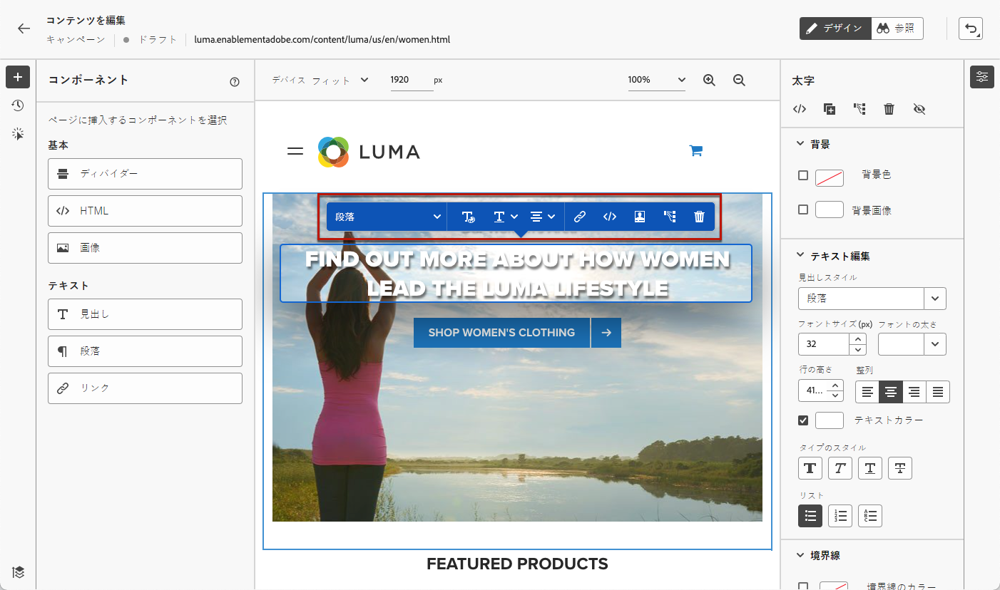
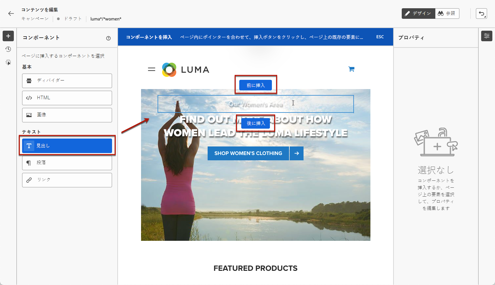

# Web ページの作成 {#author-web}

>[!AVAILABILITY]
>
>Web チャンネル機能は、現在のところユーザーのみを選択するためのベータ版として提供されています。

Web オーサリングで [!DNL Journey Optimizer] は、Adobe エクスペリエンスクラウドの視覚的な chrome ブラウザー拡張機能が提供されます。 [詳細情報](visual-editing-helper.md)

ユーザーインターフェイスを使用して web ページ [!DNL Journey Optimizer] にアクセスして作成できるようにするには、この節で [ 説明 ](create-web.md#prerequesites) している前提条件に従います。

## Web ページコンテンツの編集 {#edit-web-content}

>[!CONTEXTUALHELP]
>id="ajo_web_url_to_edit_surface"
>title="編集する URL を入力します。"
>abstract="上で定義した web サーフェイス上にある、適用されるコンテンツの編集に使用する特定の web ページの URL を入力します。 この web ページは、Adobe エクスペリエンス Platform Web SDK を使用して実装されている必要があります。"
>additional-url="https://experienceleague.adobe.com/docs/platform-learn/implement-web-sdk/overview.html" text="詳細情報"

>[!CONTEXTUALHELP]
>id="ajo_web_url_to_edit_rule"
>title="編集する URL を入力します。"
>abstract="ルールに一致するすべてのページに適用されるコンテンツの編集に使用する web ページの URL を入力します。 この web ページは、Adobe エクスペリエンス Platform Web SDK を使用して実装する必要があります。"
>additional-url="https://experienceleague.adobe.com/docs/platform-learn/implement-web-sdk/overview.html" text="詳細情報"

<!--Confirm the URL to use for authoring content on the surface. Typically the Authoring URL will be the surface URL itself, but you may include extra parameters if required. The page must include the Adobe Experience Platform Web SDK.-->

キャンペーンから web アクションを作成すると、web デザイナーを使用してコンテンツを編集できます。 そのためには、次の手順を実行します。

>[!CAUTION]
>
>で [!DNL Journey Optimizer] アクセスするには、web ページを Adobe エクスペリエンス Platform WEB SDK ](https://experienceleague.adobe.com/docs/platform-learn/implement-web-sdk/overview.html) {target = &quot;_blank&quot;} を使用して [ 実装する必要があります。

1. **[!UICONTROL Action]**&#x200B;キャンペーンのタブから、web キャンペーンのオーサリングを開始するときに選択し **[!UICONTROL Edit content]** ます。

1. ページ一致ルールを作成した場合は、このルールに一致するすべての URL を入力する必要があります。 変更は、ルールに一致するすべてのページに適用されます。

   >[!NOTE]
   >
   >Web サーフェスとして1つの URL を入力した場合は、個人用に設定された URL に既に値が入力されています。

   

1. ページのコンテンツが表示されます。

   >[!CAUTION]
   >
   >この web ページには、 [ Adobe 体験プラットフォーム WEB SDK ](https://experienceleague.adobe.com/docs/platform-learn/implement-web-sdk/overview.html) {target = &quot;_blank&quot;} が含まれている必要があります。

1. クリック **[!UICONTROL Open web designer]** して編集します。 [詳細情報](author-web.md)

   

1. Web デザイナーが表示されます。

   

1. イメージ、ボタン、段落、テキスト、コンテナ、見出し、リンクなど、カンバスからエレメントを選択します。 および使用:

   * コンテキストメニューでは、コンテンツの編集、レイアウト、リンクやカスタマイズの挿入などを行うことができます。

      

   * 各エレメントを編集、複製、削除、または非表示にするには、右側のパネルの上にアイコンが表示されます。

      

   * 選択されているエレメントに従って、右側のパネルが動的に変化します。 例えば、エレメントの背景、タイポグラフィ、ボーダー、サイズ、位置、スペーシング、エフェクト、インラインスタイルを編集できます。

      

## コンテンツコンポーネントの使用 {#content-components}

>[!CONTEXTUALHELP]
>id="ajo_web_designer_components"
>title="コンテンツコンポーネントの web ページへの追加"
>abstract="いくつかのコンポーネントを web ページに追加し、必要に応じて編集できます。"

1. **[!UICONTROL Components]**&#x200B;左側のペインで、次のコンポーネントを必要に応じて web ページに追加し、編集することができます。

   * [境界](../email/content-components.md#divider)
   * [.HTML](../email/content-components.md#HTML)
   * [絵](../email/content-components.md#image)
   * 見出し-このコンポーネントは、電子メールデザイナーでのコンポーネントの **[!UICONTROL Text]** 使用と似ています。 [詳細情報](../email/content-components.md#text)
   * 段落-このコンポーネントは、電子メールデザイナーでのコンポーネントの **[!UICONTROL Text]** 使用と似ています。 [詳細情報](../email/content-components.md#text)
   * Link-このセクションの [ リンクスタイルを定義する方法を説明します。](../email/styling-links.md)
   * [特典の決定](../email/add-offers-email.md)

   

1. ページ上でマウスポインターを移動し、または **[!UICONTROL Insert after]** ボタンをクリック **[!UICONTROL Insert before]** して、コンポーネントをページ上の既存のエレメントに追加します。

   

1. このコンポーネントに表示されるコンテナから、必要に応じてコンポーネントのコンテンツを編集します。

   

1. 表示される右側のペインに表示 **[!UICONTROL Container]** されるスタイル (背景、テキストカラー、ボーダー、サイズ、配置など) を調整します。 選択されているコンポーネントによって異なります。

   

## Web デザイナーの操作

### ブレッドクラムの使用

1. カンバスからエレメントを選択します。

1. **[!UICONTROL Expand/Collapse Breadcrumbs]**&#x200B;画面の左下にあるボタンをクリックすると、選択したエレメントについての情報が素早く表示されます。

   

1. ブレッドクラムの上にマウスポインターを置くと、対応するエレメントがエディター内でハイライト表示されます。

1. このファイルを使用すると、ビジュアルエディター内の任意の親、兄弟、子エレメントに簡単に移動できます。

### ブラウズモードに切り替え {#browse-mode}

>[!CONTEXTUALHELP]
>id="ajo_web_designer_browse"
>title="ブラウズモードの使用"
>abstract="このモードでは、選択したサーフェスのうち、個人用に設定したいページに移動することができます。"

専用ボタンを使用して、初期設定 **[!UICONTROL Design]** モードからモードに **[!UICONTROL Browse]** 切り替えることができます。

**[!UICONTROL Browse]**&#x200B;このモードでは、選択したサーフェスのうち、個人用に設定したいページに移動することができます。

これは特に、認証の背後にあるページ、または特定の URL から開始されていないページを処理する場合に便利です。 例えば、認証を行ったり、アカウントページまたはカートページに移動してから、目的のページに変更を加えるためにモードに **[!UICONTROL Design]** 戻ることができます。

### デバイスサイズの変更

デバイスのサイズは、や **[!UICONTROL Mobile landscape]** などの事前定義されたサイズ **[!UICONTROL Tablet]** に変更するか、またはカスタムサイズを定義することができます。目的のサイズを定義するために必要なピクセル数を入力します。

ズームの影響を25% から400% に変更することもできます。

## 変更の管理 {#manage-modifications}

>[!CONTEXTUALHELP]
>id="ajo_web_designer_modifications"
>title="すべての変更を簡単に管理できます。"
>abstract="このウィンドウを使用して、web ページに追加したすべての調整とスタイルをナビゲートして管理することができます。"

Web ページに追加したすべてのコンポーネント、調整、およびスタイルを簡単に管理することができます。

1. **[!UICONTROL Modifications]**&#x200B;ボタンを選択すると、対応するペインが左側に表示されます。

   

1. ページに加えた各変更を確認することができます。

1. 不要な修正を選択し、削除アイコンをクリックして削除します。

   

   >[!CAUTION]
   >
   >後続のアクションに影響する可能性があるので、操作を削除するときは注意してください。

1. 画面の右上にあるボタンを使用して **[!UICONTROL Undo/Redo]** 、操作を取り消したりやり直したりすることもできます。

   

   ボタンをクリックしたままにして、 **[!UICONTROL Undo]** オプションと **[!UICONTROL Redo]** オプションを切り替えます。 目的のアクションを適用するには、ボタン自体をクリックします。

## 個人用設定とキャンペーンの追加

パーソナル化を追加するには、コンテナを選択し、表示されるコンテキストメニューバーから「パーソナル化」アイコンを選択します。 式エディターを使用して、変更を追加します。 [詳細情報](../personalization/personalization-build-expressions.md)

コンポーネントを使用して、 **[!UICONTROL Offer decision]** web ページにオファー ](../offers/get-started/starting-offer-decisioning.md) を挿入 [ します。この処理は、電子メール ](../email/add-offers-email.md) にオファーを追加する場合 [ と同じです。意思決定管理を活用して、お客様に提供する最適なオファーを選択します。

## Web キャンペーンのテスト {#test-web-campaign}

>[!CONTEXTUALHELP]
>id="ajo_web_designer_preview"
>title="Web 体験版のプレビュー"
>abstract="Web の操作について、シミュレーションを行います。"

変更した web 体験のプレビューを表示するには、次の手順を実行します。

>[!CAUTION]
>
>これらのサービスに配信されるサービスをシミュレートするには、使用可能なテストプロファイルが必要になります。 テストプロファイル ](../segment/creating-test-profiles.md) の作成方法に [ ついて説明します。

1. **[!UICONTROL Edit content]**&#x200B;画面または web デザイナーから、を選択 **[!UICONTROL Simulate content]** します。

   

1. 1つまたは複数のテストプロファイルをクリック **[!UICONTROL Manage test profiles]** して選択します。
1. 変更した web ページのプレビューが表示されます。

   

1. テスト URL をコピーして任意のブラウザーにペーストしたり、初期設定のブラウザーで開いたりすることもできます。
